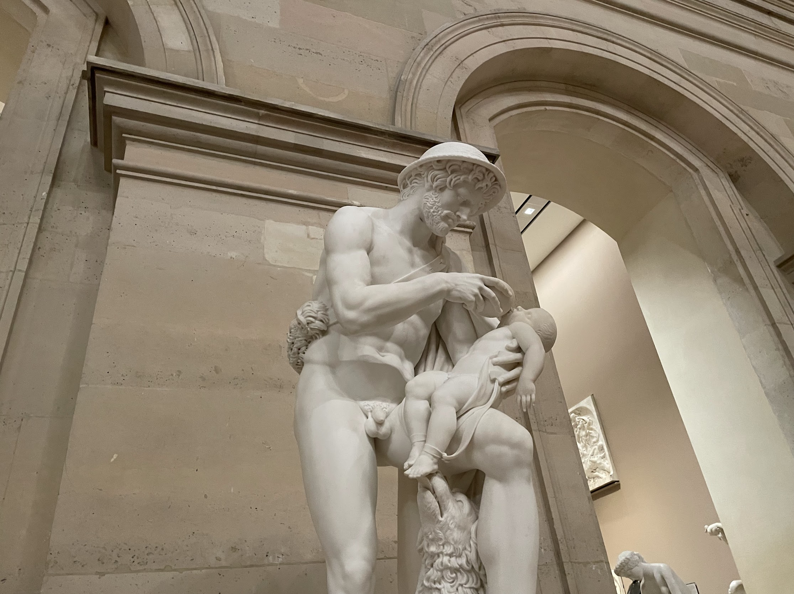

我が子は、手のかからない子です。泣くことは少ないですし、寝かしつけをしなくてもすんなり寝てくれます。育児にはもちろん細かな大変さが色々ありますが、全体としてはだいぶ助けられている方です。

そんな中で、私が珍しく苦労したのが「哺乳瓶拒否」でした。妻が完全母乳に近い形で育てていたため、私がメインで育児を担当するようになった頃、子供はまだ哺乳瓶にあまり慣れていませんでした。そのうち慣れるだろうと軽く考えていたのですが、実際には予想以上に手強かったです。

この記事では、そのときに試したことやうまく行ったことを記録としてまとめておきます。赤ちゃんによって個性があるので一般化できる内容ではないと思いますが、今まさに同じことで困っている方の気休めくらいにはなるかもしれません。

<small>ルーヴル美術館で出会ったパパ友（Antoine Denis Chaudet『オイディプス幼児、羊飼いポルバスに救われる』）</small>

## 当時の状況

最初の状況をもう少し詳しく説明すると、全く飲まないわけではないが、激しく抵抗しながら少量ずつ飲む、というものでした。とにかく時間がかかって疲れるので大変でした。

母親が朝に仕事へ出かけた後、だいたい10時や11時くらいから1時間おきにチャレンジするのですが、毎回10mlから20mlほどしか飲んでくれません。昼過ぎの15時や16時くらいになると、さすがに諦めるのか100mlくらい飲んでくれることもありましたが、1日の合計は100-200mlくらいでした。さながら、母親がいないことに対してハンガーストライキをしているようでした。

## 最初に試したこと

まずは、本やインターネットに書いてある典型的な対策を一通り試しました。

- 姿勢を変える
- ミルクの温度を変える
- 乳首を温める
- 暗い部屋であげる

しかし、いずれも明確な効果は見えませんでした。

1週間が経ってもあまり改善が見られず、哺乳瓶を見るとパニック気味に泣き出すこともあったので、2週目に入ってからは、「本人が飲みたいときだけ飲ませる」という方針に変えてみました。

母親の寝巻きを使うという小技も試しました。母親の匂いがついた寝巻きを触れさせると、赤ちゃんがそれを舐め始めるので、隙をついて口に哺乳瓶を差し込むというものです。哺乳瓶に慣れるのに役立ったように思います。

2週目で機嫌は目に見えて改善しました。哺乳瓶を見るたびに大騒ぎ、という感じではなくなりましたが、肝心の飲む量はやや減ってしまいました。

## 助産師へのオンライン相談と哺乳瓶の追加購入

ここまでやっても根本的解決が見られず、2週間後には保育園デビューが迫っていたことから焦りを感じ、[オンライン](https://minato-josan.jp/online.html)で助産師さんに相談しました。すると、飲ませる姿勢や乳首の選び方といった具体的なアドバイスをもらえただけでなく、次のような教えをいただけました。

> 日中に100mlから200mlくらい飲んでいれば、とりあえず大きな問題はない。母親が帰ってからしっかりおっぱいを飲めていれば大丈夫。

当時は、量が足りていないのではないか、あげ方がおかしいのではないかと不安になっていたので、この言葉でだいぶ気持ちが楽になりました。

助産師さんのアドバイスに従って、日本から両親が来るタイミングで、いくつか別の乳首や授乳カップを持ってきてもらいました。3週目からは、それまで使っていたPhillipsのAventに加えて、ピジョンの「[母乳実感](https://amzn.to/3O5nPJ3)」やChuchuなどを試しました。また、イタリアで売られている、[乳首の向きが少し傾いている哺乳瓶](https://amzn.to/4caVw51)も試しました。色々試した結果、特に赤ちゃんの反応が良かったのは「母乳実感」でした。

また、哺乳瓶の乳首部分を取り外して赤ちゃんに触らせることで哺乳瓶に慣れさせるという小技も試しました。これも効果があったように思います。

3週目の後半から、改善の兆しが見え始めました。それまでは、本格的に飲み始めるのが15時や16時くらいだったのが、14時になり、12時になり、と徐々に前倒しになっていきました。1日の合計量も200mlを超えるようになりました。相変わらず、最初の一口には若干の抵抗感がありましたが、「哺乳瓶を見た瞬間に絶叫」という感じではなくなりました。こちらの負担も軽くなり、日中の育児がずいぶん楽になりました。

最終的には、哺乳瓶そのものに慣れてくれたのか、母乳実感以外の哺乳瓶でも普通にミルクを飲めるようになりました。この頃から、おもちゃを口に入れて遊ぶことが増えてきたので、もしかするとそれが関係しているのかもしれません。

結果として、5週目から始まった慣らし保育までには、なんとか哺乳瓶に適応することができました。

## Dov'è la mamma?（ママはどこ？）

一つ、ローマで印象に残っている出来事があります。母親抜きで子供と2人で外出していたとき、赤ちゃんがお腹をすかせ始めました。授乳するためのベンチを探したのですが、近くにちょうど良い場所が見当たらず、10分ほど歩くことになってしまいました。その間に赤ちゃんは完全にパニックになり、泣き止まなくなってしまいました。

こちらも焦りながら、ようやく見つけたベンチでミルクをあげようとしていたところ、通りがかった人たちが次々と話しかけてきました。

「Dov'è la mamma?（ママはどこ？）」 
「Così.（こうやって抱いてみて）」 
「Tranquillo, tranquillo.（大丈夫、大丈夫）」

といった具合に、色々と世話を焼いてくれました。正直、東京出身の私は感謝しつつも「放っておいてくれ」と思ってしまったのですが、それでも赤ちゃんに優しい街なのだなと感じました。

ローマでは、赤ちゃんを連れていると本当によく話しかけられます。「piccolo（小さい子）」「bellissima（なんてかわいいの）」など、外出すると必ず声をかけられます。一度、ベンチでミルクをあげていたら、物珍しかったのか「写真を撮ってもいいか」と聞いてくる人までいました。「Dov'è la mamma?」しかり、うっすらとジェンダーバイアスを感じる瞬間でもありました。

## 反省点

一番の反省点は、哺乳瓶に慣れさせるのをもっと早く始めるべきだった、ということです。

後から調べると、赤ちゃんが哺乳瓶からスムーズにミルクを飲めるようになるまでには、平均で3週間程度かかるそうです。私はこの感覚を持っていなかったので、メインの育児担当に切り替わった後で赤ちゃんがなかなかミルクを飲まず、驚いてしまいました。もしそれまでの母乳中心の時期にも、少しずつ哺乳瓶を混ぜていたら、切り替えはもっとスムーズだったはずですし、保育園入園までに焦らずに済んだのではないかと思います。
