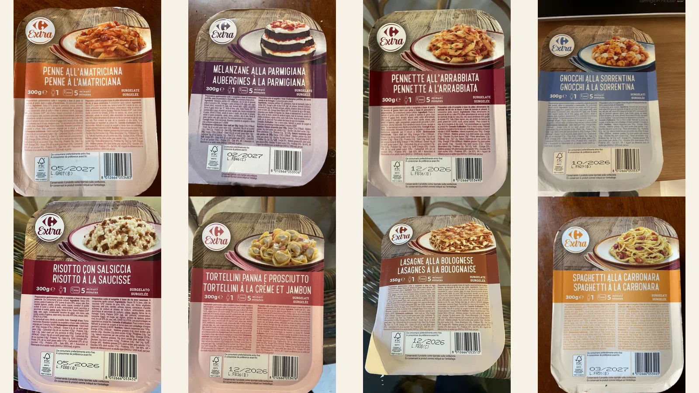
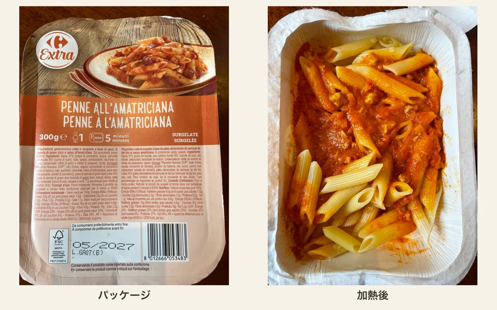
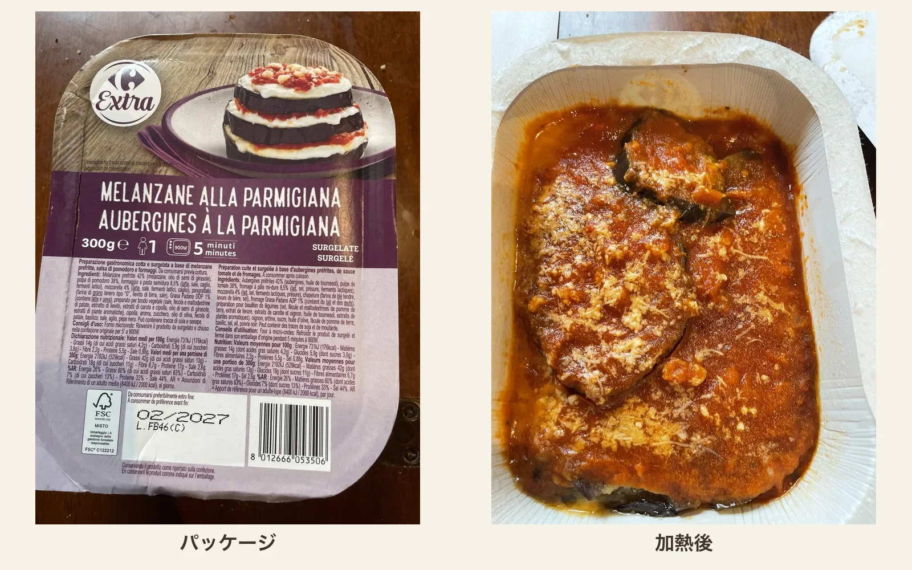
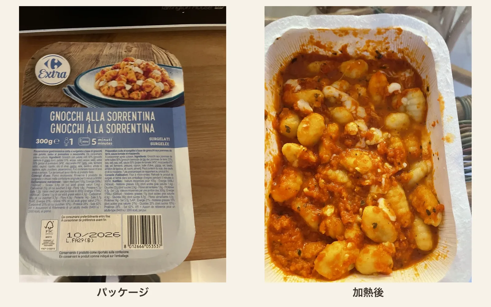
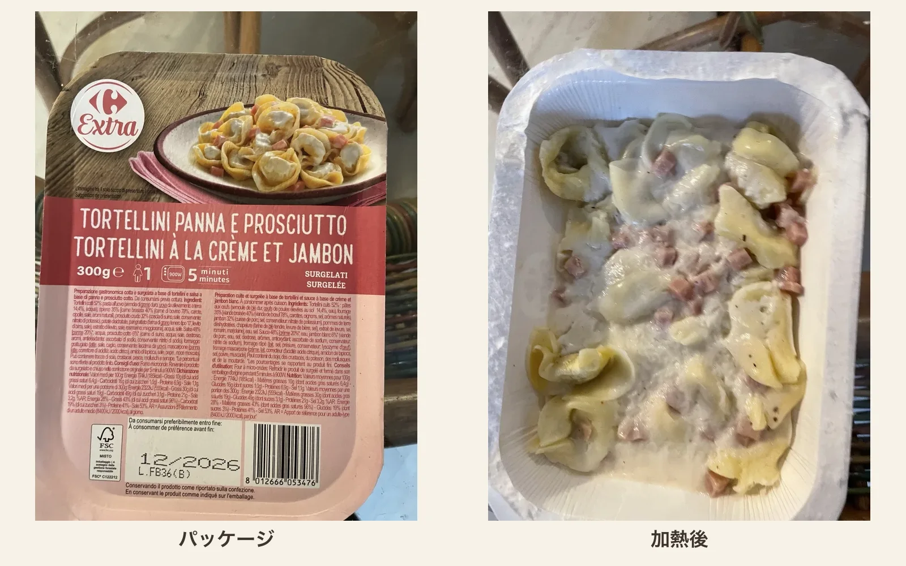
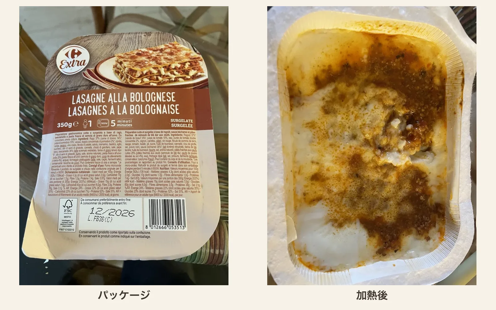

ローマに引っ越してから、半年ほどが経ちました。カルボナーラやアマトリチャーナといったローマ料理を実際に食べる機会も増え、「この料理は何を大事にしているのか」がわかるようになってきました。

そこで今回は、近所のCarrefourで売られている冷凍イタリア料理を食べ比べてみます。突然のことに驚かれる読者もいらっしゃるかもしれません。しかし、最近私は在宅勤務で昼食を一人で取ることが多いので、こういったプロジェクトをやりたいと思いました。以前にも在宅勤務が続いた時期に[「油そばを作るのに最適な袋麺はどれか」](https://hippocampus-garden.com/noodle/)という記事を書きました。夏休みの自由研究のような気分にも少し戻りたかったのです。料理研究家のリュウジ氏のように、手軽な食べ物を手軽であることを理由に見下さず、真摯にレビューする記事を書きたいと思いました。

冷凍食品なので、もちろん店で食べる料理と同じにはなりません。それでもイタリアで、イタリアの消費者に向けて売られている商品です。伝統と電子レンジの間で、メーカーがどう折り合いを付けるのかというのは、興味深いテーマだと思います。

## 評価方法

今回は、Carrefourのプライベートブランド「Extra」の冷凍イタリア料理8種類を食べ、次の三つの観点から五つ星で評価しました。

- 原材料と料理の構成が、一般的なイタリアのレシピにどれだけ近いか
- 加熱後にも、その料理らしい食感や見た目が残っているか
- 最後は理屈を抜きにして、おいしく食べられたか

いずれも一人前で、多くは300gです。パッケージのまま900Wの電子レンジで5分加熱します。値段は商品によって2〜4ユーロほどでした。

評価の一覧を以下の表にまとめます：

| 料理                             | 評価 |
| -------------------------------- | :--: |
| ペンネ・アマトリチャーナ         | 4.5  |
| ナスのパルミジャーナ             | 4.5  |
| ペンネ・アラビアータ             | 4.5  |
| ソレント風ニョッキ               |  4   |
| サルシッチャのリゾット           | 3.5  |
| 生ハムとクリームのトルテッリーニ | 3.5  |
| ラザニア・ボロネーゼ             |  2   |
| スパゲッティ・カルボナーラ       |  1   |

それでは、各商品の感想を見ていきましょう。

## ペンネ・アマトリチャーナ（Penne all'Amatriciana）：4.5 / 5

今回もっともよかった商品の一つが、アマトリチャーナです。

この商品はguancialeの代わりに燻製パンチェッタ（pancetta）を使っています。ここは明確な違いです。一方、ニンニクやハーブを足すようなことはしておらず、ペコリーノ・ロマーノDOP（Pecorino Romano DOP）をしっかり使っている点は正しいです。

## ナスのパルミジャーナ（Melanzane alla Parmigiana）：4.5 / 5

ナスのParmigianaも非常によくできていました。主な材料は揚げたナス、トマト、チーズ、バジルです。商品の原材料も、ナスとトマトで全体の大部分を占め、モッツァレラ、Grana Padano、バジルが続きます。

アラビアータは、トマト、ニンニク、唐辛子、オリーブオイルという簡潔な料理です。この商品にもその主要要素がすべて入り、余計なものはほとんど入っていません。

特に、しっかり辛いのがよかったです。Arrabbiataは「怒った」という意味で、辛さが料理の名前そのものです。万人受けを気にしてマイルドにしないところはイタリア流なのかなと思いました。アマトリチャーナと同様、どうしてもパスタが柔らかくなってしまうので5点満点にはできませんでした。

## ペンネ・アラビアータ（Pennette all'Arrabbiata）：4.5 / 5

アラビアータは、トマト、ニンニク、唐辛子、オリーブオイルという簡潔な料理です。この商品にも主要な材料がすべて入り、料理の方向を変えるような余計なものはほとんど入っていません。

Gnocchi alla Sorrentinaは、ジャガイモのニョッキをトマトソース、モッツァレラ、Parmigiano、バジルと合わせて焼く料理です。この商品も、ニョッキ、トマト、モッツァレラ、バジルという中心部分を押さえています。

冷凍パスタに比べて、ニョッキは多少柔らかくなっても違和感が出にくいのが良かったです。一方、バジルの風味とオーブンで焼いたチーズの香ばしさが足りないと感じました。食べる時に生のバジルを散らすとさらに美味しく食べられると思います。

ソースは多めで、パスタはやはり柔らかくなっています。それでもトマト、ニンニク、唐辛子という料理の中心は明快です。アマトリチャーナと同様、パスタの食感だけが満点を阻んでいます。

## ソレント風ニョッキ（Gnocchi alla Sorrentina）：4 / 5

ソレント風ニョッキは、ジャガイモのニョッキをトマトソース、モッツァレラ、パルミジャーノ（Parmigiano）、バジルと合わせて焼く料理です。この商品も、ニョッキ、トマト、モッツァレラ、バジルという中心部分を押さえています。

冷凍パスタと比べると、ニョッキは多少柔らかくなっても違和感が出にくいのがよいところです。加熱後も形が残り、モッツァレラの白い部分も確認できました。

一方、オーブンで焼いたチーズの香ばしさと、バジルの爽やかな香りは足りません。食べるときに生のバジルなどを刻んで散らすと、重くなりがちなトマトソースとチーズに香りが加わり、かなり印象がよくなります。この商品には、追いチーズより追いバジルが効きます。

## サルシッチャのリゾット（Risotto con Salsiccia）：3.5 / 5

原材料を読んだ段階で、もっとも不安だったのがこのリゾットです。

サルシッチャ、玉ねぎ、赤ワイン、バター、Grana Padanoまではいいのですが、そこにクリーム、米粉、タピオカ澱粉も入ってきます。リゾットは、米から出る澱粉とブロードを調理中に一体化させる料理です。クリームと他の澱粉で米を繋ぐというのは正しいリゾットの作り方とは違いますが、実際に食べるとそれほど違和感がありませんでした。レシピの工業化に成功したと言っても良さそうです。

サルシッチャ、玉ねぎ、赤ワイン、バター、グラナ・パダーノまでは自然ですが、そこにクリーム、米粉、タピオカ澱粉も入ります。リゾットは、米から出る澱粉とブロードを調理中に一体化させる料理です。クリームと別の澱粉で米をつなぐのは、伝統的なリゾットの作り方とは異なります。

加熱後の見た目もかなり白く、クリームの存在感が強めです。ところが実際に食べると、食感にはそれほど違和感がありませんでした。米粒は完全につぶれておらず、全体としておいしく食べられます。

肉を詰めたTortelliniにクリームとハムを合わせた料理です。ソースにはprosciutto cotto、チーズ、Mascarpone、胡椒、ナツメグが入ります。そもそもこれは、イタリアの伝統料理ではないようなので純粋においしさで評価します。

加熱後もTortelliniの形は残り、ハムも目で確認できました。ただしソースはやや緩く、パスタにまとわりつくより容器の底にたまっています。味もやや重めでした。

肉を詰めたトルテッリーニにクリームとハムを合わせた料理です。ソースにはプロシュット・コット（prosciutto cotto）、チーズ、マスカルポーネ（Mascarpone）、胡椒、ナツメグが入っています。

原材料上は、ラグー、ベシャメル、卵入りパスタ、チーズという正しい構造です。ラグーにも牛肉、トマト、玉ねぎ、人参、セロリ、赤ワインが使われています。

しかし、ソースに水分が多く、本来の魅力であるパスタ、ラグー、ベシャメルが重なった層がぐちゃぐちゃになってしまっていました。また、こちらもオーブン焼きの香ばしさがないのが物足りなかったです。

## ラザニア・ボロネーゼ（Lasagne alla Bolognese）：2 / 5

原材料上は、ラグー、ベシャメル、卵入りパスタ、チーズという正しい構成です。ラグーにも牛肉、トマト、玉ねぎ、人参、セロリ、赤ワインが使われています。

しかし加熱後はソースの水分が多く、ラザニアの魅力であるパスタ、ラグー、ベシャメルが重なった層がほとんどわからなくなっていました。肉の量も少なく、ラグーの凝縮感は弱めです。

さらに、オーブンで焼いた表面の香ばしさもありません。構成要素は揃っているのに、それぞれがまだ一つの料理としてまとまっていない印象でした。味が極端に悪いわけではありませんが、パッケージ写真との落差も含めて2点としました。

もし容器ごとオーブンに入れられる商品なら、最後に焼き目をつけることで評価は少し変わりそうです。

## スパゲッティ・カルボナーラ（Spaghetti alla Carbonara）：1 / 5

最後はカルボナーラです。ローマに住んでいる以上、いちばん厳しく見てしまう料理でもあります。

Accademia Italiana della Cucinaが紹介する[レシピ](https://www.accademiaitalianadellacucina.it/en/regionistati/lazio)では、中心になるのはguanciale、卵、Pecorino、黒胡椒です。生クリームを使わず、卵、チーズ、豚の脂でパスタの水分をなめらかにまとめます。

この商品には卵黄、Pecorino Romano DOP、黒胡椒、豚肉が入っており、カルボナーラの骨格は意識されています。しかし豚肉は燻製pancettaで、ソースには牛乳、生クリーム、バター、タピオカ澱粉も使われています。冷凍と再加熱を経てもソースを安定させるための設計でしょう。

それでも、指定どおり電子レンジで温めると卵が細かい炒り卵のようになってしまいました。カルボナーラの魅力である、卵とPecorinoが麺をなめらかに覆う感じは弱いです。黒胡椒もかなり控えめで、乳製品の味に押されて全体がぼやけていました。

挽きたての黒胡椒を多めにかけると、かなり改善しました。Pecorinoを足すのもよいと思います。それでも、炒り卵をソースには戻せません。カルボナーラを冷凍食品として成立させるのはかなり難しいのだとわかりました。この商品はシリーズの他の商品と比べて高めなのと、カルボナーラは材料さえあれば家庭でも比較的簡単に作れるので、正直買う理由が見出せません。

挽きたての黒胡椒を多めにかけると、味はかなり改善します。ペコリーノを足すのもよいと思います。ただし、追い胡椒で料理の輪郭は戻せても、固まった卵をソースに戻すことはできません。

しかも、この商品はシリーズの中ではやや高価でした。カルボナーラは材料さえあれば家庭でも比較的短時間で作れるので、あえてこれを選ぶ理由は見つけられませんでした。

## まとめ

イタリアで冷凍食品を購入する場合は、できれば以下を避けるといいと思います。

- 卵ソース
- オーブン料理
- パスタ（アルデンテにならない）
