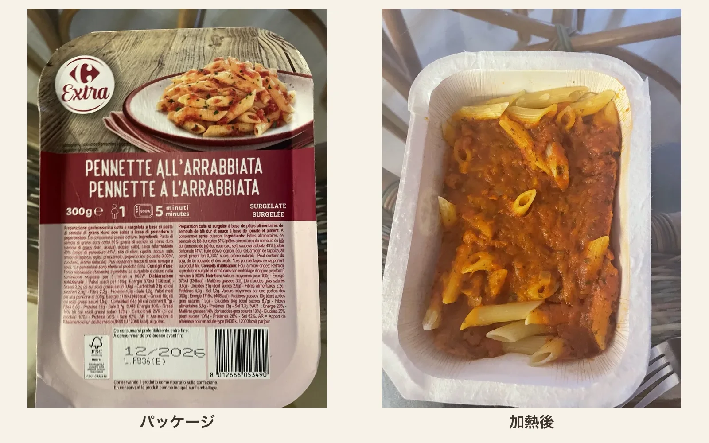
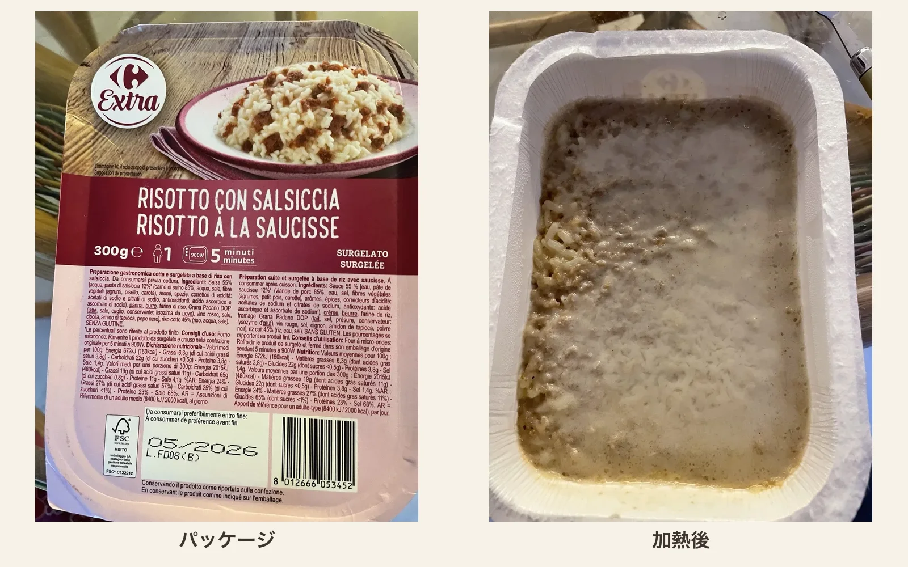
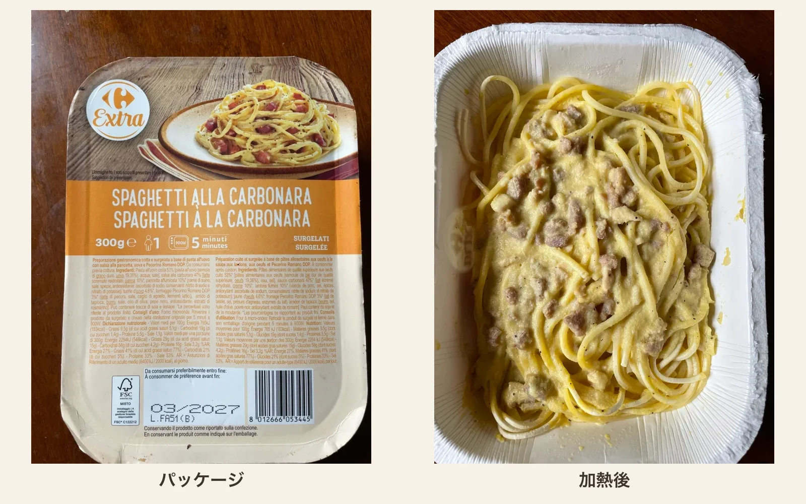

ローマに引っ越してから、半年ほどが経ちました。カルボナーラやアマトリチャーナといったローマ料理を実際に食べたり作ったりする機会も増え、「この料理は何を大事にしているのか」がわかるようになってきました。

そうなると、近所のCarrefourに並んでいる冷凍イタリア料理も気になってきます。本場のスーパーで、本場の消費者に向けて売られている冷凍食品は、どこまで元の料理らしさを残しているのでしょうか。

この企画を思いついた直接の理由は、最近、在宅勤務で昼食を一人で取ることが多いからです。以前にも同じような時期に、[「油そばを作るのに最適な袋麺はどれか」](https://hippocampus-garden.com/noodle/)を検証したことがありました。今回も、昼食を兼ねた夏休みの自由研究です。料理研究家のリュウジ氏にならって、手軽な食べ物を見下さず、真面目に食べ比べてみます。

もちろん、冷凍食品を店の料理と同じ基準だけで評価しても仕方ありません。むしろ気になるのは、伝統的なレシピと、冷凍・電子レンジ調理という制約の間で、メーカーがどんな折り合いをつけているかです。そこで、Carrefourのプライベートブランド「Extra」から、冷凍のイタリア料理8品を選びました。

## 評価方法

今回は、次の三つの観点を踏まえて、各商品を5点満点で総合評価しました。

- **正統性**：原材料と構成が、一般的なイタリアのレシピから大きく外れていないか
- **電子レンジとの相性**：加熱後にも、その料理らしい食感や見た目が残るか
- **おいしさ**：伝統に忠実かどうかとは別に、昼食としてまた食べたいと思えるか

商品はいずれも一人前で、多くは300g。価格は2〜4ユーロほどでした。

結果は次のとおりです。

| 料理                           | 評価 |
| ------------------------------ | :--: |
| ペンネ・アマトリチャーナ       | 4.5  |
| ナスのパルミジャーナ           | 4.5  |
| ペンネ・アラビアータ           | 4.5  |
| ソレント風ニョッキ             |  4   |
| サルシッチャのリゾット         | 3.5  |
| ハムとクリームのトルテッリーニ | 3.5  |
| ラザニア・ボロネーゼ           |  2   |
| スパゲッティ・カルボナーラ     |  1   |

それでは、各商品の感想を見ていきましょう。

## Penne all'Amatriciana：4.5 / 5

今回もっともよかった商品の一つが、アマトリチャーナです。

この商品では、グアンチャーレ（豚の頬肉の塩漬け）の代わりに燻製パンチェッタを使っています。ここは伝統的なレシピとの明確な違いです。一方で、ニンニクやハーブを足すようなアレンジはせず、ペコリーノ・ロマーノ（Pecorino Romano DOP）をしっかり使っています。冷凍食品向けの変更はありながらも、アマトリチャーナの軸は外していません。

## Melanzane alla Parmigiana：4.5 / 5

ナスのパルミジャーナもよくできていました。この料理の中心は、揚げナス、トマト、チーズ、バジルです。商品の原材料もナスとトマトが大部分を占め、モッツァレラ、Grana Padano、バジルが続きます。

ナスの揚げ油がヒマワリ油であることや、中心となるチーズが種類の曖昧なセミハードチーズであることには量産品らしさがありますが、正統性はかなり維持できていると思います。

## Pennette all'Arrabbiata：4.5 / 5

アラビアータは、トマト、ニンニク、唐辛子、オリーブオイルで作るシンプルな料理です。この商品にも主要な要素がすべて入り、余計なものはほとんど加えられていません。

特によかったのは、きちんと辛いことです。Arrabbiataは「怒った」という意味で、辛さが料理の名前そのものです。万人受けを狙ってマイルドにしないところは、イタリアらしいのかもしれません。ただし、アマトリチャーナと同じくパスタはどうしても柔らかくなってしまうので、5点満点にはしませんでした。

## Gnocchi alla Sorrentina：4 / 5

ソレント風ニョッキは、ジャガイモのニョッキをトマトソース、モッツァレラ、パルミジャーノ、バジルと合わせて焼く料理です。この商品も、ニョッキ、トマト、モッツァレラ、バジルという中心部分を押さえています。

冷凍パスタに比べると、ニョッキは多少柔らかくなっても違和感が出にくく、電子レンジとの相性はよさそうです。一方で、バジルの風味と、オーブンで焼いたチーズの香ばしさは足りません。食べるときに生のバジルを散らすと、さらにおいしくなると思います。

## Risotto con Salsiccia：3.5 / 5

原材料を読んだ段階で、もっとも不安だったのがこのリゾットです。サルシッチャ、玉ねぎ、赤ワイン、バター、Grana Padanoまではいいのですが、そこにクリーム、米粉、タピオカ澱粉も入っています。リゾットは本来、米から出る澱粉とブロードを調理中に一体化させる料理です。クリームや別の澱粉で米をつなぐのは伝統的な作り方と異なります。

ところが、実際に食べるとそれほど違和感がありませんでした。レシピの工業化にうまく成功した例と言えそうです。

## Tortellini panna e prosciutto：3.5 / 5

肉を詰めたTortelliniに、クリームとハムを合わせた料理です。ソースにはprosciutto cotto（加熱ハム）、チーズ、マスカルポーネ、胡椒、ナツメグが入っています。そもそもこれはイタリアの伝統料理ではないようなので、純粋においしさで評価します。

加熱後もTortelliniの形は残り、ハムも目で確認できました。ただしソースはやや緩く、パスタにまとわりつくというより、容器の底にたまっています。味も少し重く感じました。

## Lasagne alla Bolognese：2 / 5

原材料上は、ラグー、ベシャメル、卵入りパスタ、チーズという正しい構造です。ラグーにも牛肉、トマト、玉ねぎ、人参、セロリ、赤ワインが使われています。

しかし、ソースの水分が多く、ラザニアの魅力であるパスタ、ラグー、ベシャメルの層が崩れてしまっていました。オーブン料理なのに、焼き目の香ばしさがないのも物足りません。

味が極端に悪いわけではありませんが、パッケージ写真との落差も含めて2点としました。容器ごとオーブンに入れられ、最後に焼き目をつけられる商品なら、評価は少し変わりそうです。

## Spaghetti alla Carbonara：1 / 5

最後はカルボナーラです。ローマに住んでいる以上、いちばん厳しく見てしまう料理でもあります。

Accademia Italiana della Cucinaが紹介する[レシピ](https://www.accademiaitalianadellacucina.it/en/regionistati/lazio)では、中心になるのはguanciale、卵、Pecorino、黒胡椒です。生クリームは使わず、卵、チーズ、豚の脂とパスタのゆで汁をなめらかに一体化させます。

この商品には卵黄、Pecorino Romano DOP、黒胡椒、豚肉が入っており、カルボナーラの骨格は意識されています。しかし豚肉は燻製pancettaで、ソースには牛乳、生クリーム、バター、タピオカ澱粉も使われています。冷凍と再加熱を経てもソースを安定させるための設計でしょう。

それでも、指定どおり電子レンジで温めると、卵が細かい炒り卵のようになってしまいました。カルボナーラの魅力である、卵とペコリーノが麺をなめらかに覆う感じはほとんどありません。また、ソースの水分が少ないため、加熱後に麺が一部パサパサしてしまいました。黒胡椒もかなり控えめで、乳製品の味に押され、全体がぼやけていました。

挽きたての黒胡椒を多めにかけると、味はかなり改善しました。Pecorinoを足すのもよいと思います。それでも、炒り卵になった卵をソースには戻せません。カルボナーラを冷凍食品として成立させる難しさが、そのまま出てしまった商品でした。

シリーズのほかの商品より値段が高めなことに加えて、カルボナーラ自体は材料さえあれば家庭でも比較的作りやすい料理です。正直なところ、これを選ぶ理由は見出せませんでした。

## まとめ

8品を食べ比べてみると、元の料理に忠実かどうか以上に、電子レンジで崩れにくい構造かどうかが評価を分けていました。

アラビアータやアマトリチャーナのように、トマトソースは冷凍後も持ち味が残ります。ニョッキも、多少柔らかくなっても違和感が出にくいため、冷凍食品向きでした。リゾットのように、伝統的な作り方から離れていても、食品加工の工夫でうまく着地する例もあります。

反対に難しいのは、卵のなめらかな乳化が要になるカルボナーラや、層と焼き目が魅力のラザニアです。普通のパスタもアルデンテにはならないので、食感を重視するなら期待しすぎない方がよいでしょう。
