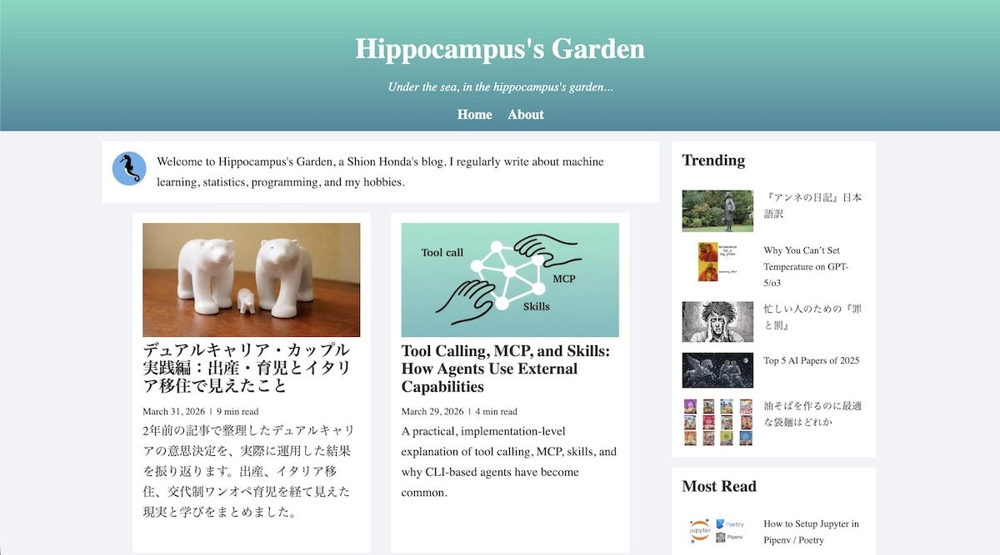
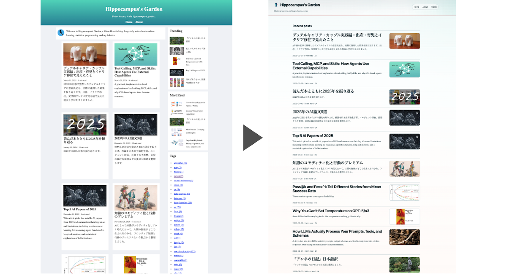

This blog started as a student project around 2020.[^1] At the time, I wanted to learn more than just JavaScript syntax. I wanted to understand how a real website was put together: **static site generation** (**SSG**), deployment, **Open Graph Protocol** (**OGP**) images, **Lighthouse**, and a bit of **GraphQL**. [Gatsby](https://www.gatsbyjs.com/) was a natural choice because it had momentum, a rich plugin ecosystem, and a reputation for being a modern way to build blogs.

That first version did its job. I learned a lot from building it, and I used it for years. However, as I gained more experience as an engineer, I also became less satisfied with the design and information architecture of my own site. Recently, I finally took the time to rebuild it. I migrated the blog from Gatsby to [Astro](https://astro.build/), but the more important change was that I redesigned the UI from the ground up.

## What Had Started to Feel Wrong

The old blog was not broken, but it had accumulated several design decisions that no longer felt right.

The first issue was the card-heavy layout. The home page followed an older blog pattern in which almost everything had similar visual weight, and the right column stacked modules such as trending posts, most-read posts, and tags. That made the page dense without providing much guidance about where the eye should go first. Instead of leading readers toward the newest writing, the interface encouraged scanning without a clear sense of priority.

The second issue was the tag list. As the number of posts grew, the list of tags became longer and visually louder. Tags are useful as an index, but they should not dominate the page. In the old design, they gradually turned from navigation into noise.

The third issue was the layout system itself. Article pages relied heavily on the right column for the table of contents, related posts, popular posts, and tags. On wide screens, that already felt dated. On narrow screens, it was fragile. The CSS also depended on many fixed widths such as `300px`, `350px`, and `70%`, which gave the whole site an "old responsive design" feel rather than a flexible layout. Overall, it was not a design that helped readers focus on the article itself.

## What I Changed in the Redesign

To fix those issues, I started not from components but from information hierarchy. The home page now treats **Recent posts** as the main destination instead of one block among many. If a visitor lands on the site for the first time, it should be obvious where to start reading.

That change affected several other decisions. Tags and ranking modules still exist, but they now play a supporting role. They are discovery aids rather than the visual center of gravity. I also reduced the amount of decorative emphasis in each section so that the page feels calmer overall.

I kept the blog's long-running "coral reef" concept, but I translated it more consistently this time. In the old site, the theme mostly meant "use ocean-like colors." In the new one, I tried to let it influence spacing, typography, contrast, and layout density as well. The result I wanted was not a flashy ocean-themed site, but a quieter and more coherent reading experience.

To make those decisions explicit, I started with a design brief and then iteratively developed design tokens while working with Codex. That process turned vague preferences into concrete rules. Once I decided that recent writing should dominate the home page and that coral colors should remain accents rather than become the main background, many implementation choices became easier.

## Why Astro Was a Better Fit Than Gatsby

Although this post is mainly about the redesign, the framework migration mattered too.

Gatsby was a good framework for learning. It exposed me to **GraphQL** and taught me how data can be transformed into a static site through a structured pipeline. However, over time, I realized that I was not really using GraphQL in a way that justified its complexity for this particular blog. The site is mostly a collection of Markdown posts and a handful of supporting pages. For that kind of content-driven website, Gatsby had started to feel heavier than necessary.

Astro felt more direct. Its positioning as a framework for fast, content-driven websites matched this blog much better. Content collections are easy to understand, page generation is straightforward, and the overall mental model is closer to what this site actually is. I no longer needed to maintain a GraphQL layer that I was not taking full advantage of. In practice, this made the rebuild easier to reason about.

Build performance improved dramatically as well, which was one of the motivations for the migration. The first deployed Astro version did not immediately outperform the old Gatsby site in **Lighthouse**, and the main regression came from a worse **First Contentful Paint** (**FCP**). Once I spotted the issue, Codex fixed it in a few seconds, and the Astro site ended up with better performance scores than the Gatsby version.

|                | Gatsby | Astro |
| -------------- | ------ | ----- |
| Performance    | 81     | 98    |
| Accessibility  | 100    | 100   |
| Best practices | 96     | 100   |
| SEO            | 83     | 92    |

I completed most of this rebuild with AI and wrote very little code myself. Without AI, I probably would not have made time to do it at all. It is a good time to be building. Happy coding!

P.S. (April 9, 2026) After publishing this post, I found one important bug: the old Gatsby service worker was still registered in some browsers and kept serving stale cached assets.[^2] That meant some visitors continued seeing the old Gatsby site even after the Astro version had been deployed. The fix was to ship a temporary cleanup worker at `/sw.js`, force the legacy worker to update, delete its caches, unregister it, and reload the page once so the new Astro site could take over cleanly.

[^1]: My very first article on this blog was [Top Navbar for Gatsby Blog](https://hippocampus-garden.com/navbar/).

[^2]: For a more detailed explanation of this behavior, the `web.dev` articles [The service worker lifecycle](https://web.dev/articles/service-worker-lifecycle) and [Update](https://web.dev/learn/pwa/update) are helpful. In particular, they explain that old service workers can keep controlling existing clients until they are fully replaced, and that deleting or renaming the worker file does not automatically remove an existing registration or its caches.
