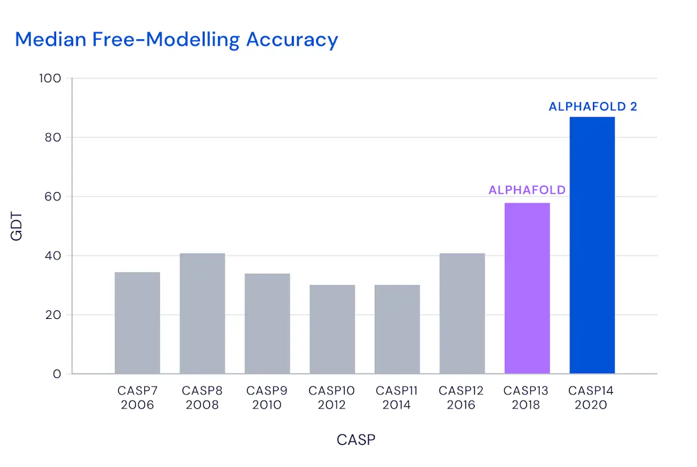

This post is a continuation of [the previous one](https://hippocampus-garden.com/research_2021/). In this post, we'll look back at the updates in deep learning in 2021, with the focus on application projects. For research papers, please read [the previous post](https://hippocampus-garden.com/research_2021/).

## Application Projects
Here are the four deep learning applications I selected:

1. AlphaFold2
2. GitHub Copilot
3. Airfriend
4. (Background Effect of) Google Meet

### AlphaFold2
The function of a protein is dependent on its structure, so the protein structure is the one of keys to understanding what is going on inside an organism. However, it takes huge time and cost to analyze the protein structure through experiments, and it has been impossible to accurately predict from the protein's amino acid sequence (**protein folding problem**)—until the advent of **AlphaFold(2)** [1].

I'm not going to discuss the details of AlphaFold2 here because I'm not really familiar with structural biology, but the following figure from DeepMind's official blog "[AlphaFold: a solution to a 50-year-old grand challenge in biology](https://deepmind.com/blog/article/alphafold-a-solution-to-a-50-year-old-grand-challenge-in-biology)" convinces us that this is an actual breakthrough.

The full version of AlphaFold2 requires huge computational resources with a 3 TB disk and a GPU (details [here](https://github.com/deepmind/alphafold#running-alphafold)). But fortunately, you can try its light version at [Google Colab](https://colab.research.google.com/github/sokrypton/ColabFold/blob/main/AlphaFold2.ipynb).

There is already a [database of "predicted" protein structure](https://alphafold.ebi.ac.uk/). I can't wait to see how AlphaFold will accelerate life sciences and drug discovery.

### GitHub Copilot
**[GitHub Copilot](https://copilot.github.com/)** is a super-smart code autocompleter. Based on the context including comments, GitHub Copilot suggests the best code snippets to complete your current code. The core machine learning model of Copilot is **OpenAI Codex**, a large language model trained on publicly available source code from GitHub [2].

As shown in the video below, if you want to write a function, all you have to do is write an appropriate comment and press the tab key. Copilot will complete the function for you.

<iframe width="560" height="315" src="https://www.youtube.com/embed/St2CMvK4hK0?start=69" title="YouTube video player" frameborder="0" allow="accelerometer; autoplay; clipboard-write; encrypted-media; gyroscope; picture-in-picture" allowfullscreen></iframe>

Since Copilot is not yet a perfect programmer, you always have to write a test code to verify that the autocompleted code is correct (Copilot can help it, too!). Either way, it generally reduces your total coding time especially if you are not familiar with the language/framework.

It should be noted that Copilot is also provoking controversy. As the paper "[Extracting Training Data from Large Language Models](https://arxiv.org/abs/2012.07805)" (introduced in [the previous post](https://hippocampus-garden.com/research_2021/)) points out, Codex is highly likely to memorize its training data. Therefore, it is possible to extract personal information (e.g., API keys uploaded by mistake) or to abuse codes from a repository that is protected by its license. Also, it might help spread wrong, malicious, or inefficient code that exists somewhere in the public repositories. 

### Airfriend
**[Airfriend](https://airfriend.ai/)** is a chatbot that you can *nurture* to be what you like. You can finetune the chatbot with your ideal responses in an online fashion, and you can also share your chatbot with your (physical) friends.

Currently, Airfriend only supports Japanese, but it has already gained a large number of users due to its natural conversation and customizability. 

<blockquote class="twitter-tweet">
AIで架空の友達を育てて共有したり、みんなが育てたAIと話せる無料アプリ「エアフレンド」を個人開発しました。推しが言いそうなセリフをAIに教えると、推しの人格を学習したAIと会話できます エアフレンド→ <a href="https://t.co/NhvnUd7CAo">https://t.co/NhvnUd7CAo</a> <a href="https://t.co/wcK6BzgbcN">pic.twitter.com/wcK6BzgbcN</a>
&mdash; Ryobot (エアフレンド開発者) (@_Ryobot) <a href="https://twitter.com/_Ryobot/status/1437714740529319939?ref_src=twsrc%5Etfw">September 14, 2021</a></blockquote> 

Another great thing about Airfriend is that it is developed by an individual ([@_Ryobot](https://twitter.com/_Ryobot)). [The chatbot model is a Transformer with one billion parameters](https://twitter.com/_Ryobot/status/1437762555578134530), so I imagine it is very hard to keep the service running for thousands of users. Other languages will be supported "in the near future".

### Background Effect of Google Meet
The background effect of **[Google Meet](https://meet.google.com/)** is perhaps the most familiar example of machine learning on web browsers (**WebML**). As you may know, Google Meet can blur or replace the background. Other meeting apps such as Zoom and Microsoft Teams also support this feature, but one thing is different. Google Meet works *on the browser*.

This background effect needs deep learning based segmentation which, if naively implemented, is too heavy for real-time processing. The magic of Google Meet is disclosed in the [Google AI Blog](https://ai.googleblog.com/2020/10/background-features-in-google-meet.html). To be brief, it defines the entire pipeline from segmentation to rendering in **[MediaPipe](https://google.github.io/mediapipe/)**, a machine learning framework optimized for live and streaming data, and converts it to **WebAssembly** (**Wasm**). At runtime, the browser converts the Wasm code into native machine code so that it is executed faster than JavaScript code.

<small>Figure taken from <a href="https://ai.googleblog.com/2020/10/background-features-in-google-meet.html">Google AI Blog: Background Features in Google Meet, Powered by Web ML</a>.</small>

For the segmentation model, Google Meet adopts MobileNetV3-small [3] exported to [**TFLite**](https://www.tensorflow.org/lite) and accelerated by [**XNNPACK**](https://github.com/google/XNNPACK). The MobileNet outputs a low-resolution segmentation mask, which is to be refined in the subsequent module.

## Concluding Remarks
Thank you for reading! I'm happy if you find this annual post useful. I hope 2022 will be a great year!

## References
[1] John Jumper, Richard Evans, Alexander Pritzel, Tim Green, Michael Figurnov, Olaf Ronneberger, Kathryn Tunyasuvunakool, Russ Bates, Augustin Žídek, Anna Potapenko, Alex Bridgland, Clemens Meyer, Simon A. A. Kohl, Andrew J. Ballard, Andrew Cowie, Bernardino Romera-Paredes, Stanislav Nikolov, Rishub Jain, Jonas Adler, Trevor Back, Stig Petersen, David Reiman, Ellen Clancy, Michal Zielinski, Martin Steinegger, Michalina Pacholska, Tamas Berghammer, Sebastian Bodenstein, David Silver, Oriol Vinyals, Andrew W. Senior, Koray Kavukcuoglu, Pushmeet Kohli, Demis Hassabis. "[Highly accurate protein structure prediction with AlphaFold](https://www.nature.com/articles/s41586-021-03819-2)". *Nature*. 2021.  
[2] Mark Chen, Jerry Tworek, Heewoo Jun, Qiming Yuan, Henrique Ponde de Oliveira Pinto, Jared Kaplan, Harri Edwards, Yuri Burda, Nicholas Joseph, Greg Brockman, Alex Ray, Raul Puri, Gretchen Krueger, Michael Petrov, Heidy Khlaaf, Girish Sastry, Pamela Mishkin, Brooke Chan, Scott Gray, Nick Ryder, Mikhail Pavlov, Alethea Power, Lukasz Kaiser, Mohammad Bavarian, Clemens Winter, Philippe Tillet, Felipe Petroski Such, Dave Cummings, Matthias Plappert, Fotios Chantzis, Elizabeth Barnes, Ariel Herbert-Voss, William Hebgen Guss, Alex Nichol, Alex Paino, Nikolas Tezak, Jie Tang, Igor Babuschkin, Suchir Balaji, Shantanu Jain, William Saunders, Christopher Hesse, Andrew N. Carr, Jan Leike, Josh Achiam, Vedant Misra, Evan Morikawa, Alec Radford, Matthew Knight, Miles Brundage, Mira Murati, Katie Mayer, Peter Welinder, Bob McGrew, Dario Amodei, Sam McCandlish, Ilya Sutskever, Wojciech Zaremba. "[Evaluating Large Language Models Trained on Code](https://arxiv.org/abs/2107.03374)". 2021.  
[3] Andrew Howard, Mark Sandler, Grace Chu, Liang-Chieh Chen, Bo Chen, Mingxing Tan, Weijun Wang, Yukun Zhu, Ruoming Pang, Vijay Vasudevan, Quoc V. Le, Hartwig Adam. "[Searching for MobileNetV3](https://arxiv.org/abs/1905.02244)". *ICCV*. 2019.