Happy New Year!🎉🎉

In 2020, the Machine Learning community has seen a lot of new achievements. I believe winter vacation is a good time to look back on the year, so this post will cover 10 representative papers that I found interesting and worth reading.

## Best Papers
Here are the 10 best ML papers of 2020 that I chose (in chronological order).

1. Rigging the Lottery: Making All Tickets Winners
2. PIFuHD: Multi-Level Pixel-Aligned Implicit Function for High-Resolution 3D Human Digitization
3. Jukebox: A Generative Model for Music
4. Language Models are Few-Shot Learners
5. Bootstrap Your Own Latent A New Approach to Self-Supervised Learning
6. Implicit Neural Representations with Periodic Activation Functions
7. Graph Structure of Neural Networks
8. Towards Faster and Stabilized GAN Training for High-fidelity Few-shot Image Synthesis
9. An Image is Worth 16x16 Words: Transformers for Image Recognition at Scale
10. Pre-training without Natural Images

### Rigging the Lottery: Making All Tickets Winners
- Authors: Utku Evci, Trevor Gale, Jacob Menick, Pablo Samuel Castro, Erich Elsen
- Link: https://arxiv.org/abs/1911.11134
- Released in: November 2019
- Accepted to: ICML 2020

The **lottery ticket hypothesis** [1,2] argues that training neural networks is like a lottery. According to [1], network pruning is feasible because:
> Dense, randomly-initialized, feed-forward networks contain subnetworks ("winning tickets") that - when trained in isolation - reach test accuracy comparable to the original network in a similar number of iterations.

So, should we always start with a large network, aiming to draw a winning ticket and drop losing tickets (unnecessary subnetworks) after the winner announcement (training & validation)? This paper answers no. The authors introduce a method to train sparse neural networks by iteratively dropping and growing connections with the model size fixed throughout the training. The proposed training strategy is named **RigL**, as it "rigs the lottery ticket hypothesis." The algorithm of RigL is summarized as below:

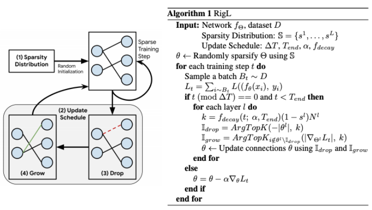

RigL achieves higher test accuracy with fewer training FLOPs and parameter counts than pruning on various networks and datasets (e.g., ResNet-50/MobileNet on ImageNet and GRU on WikiText-103).

### PIFuHD: Multi-Level Pixel-Aligned Implicit Function for High-Resolution 3D Human Digitization
- Authors: Shunsuke Saito, Tomas Simon, Jason Saragih, Hanbyul Joo
- Link: https://arxiv.org/abs/2004.00452
- Released in: April 2020
- Accepted to: CVPR 2020

**PIFuHD** is an updated version of **PIFu** (**Pixel-aligned Implicit Function**) [4], a deep learning method for reconstructing a 3D human shape from a single image. I chose this paper because  it's fun! Not only are the result remarkable (see the image below), but the authors provide a [Colab demo](https://colab.research.google.com/drive/11z58bl3meSzo6kFqkahMa35G5jmh2Wgt) that you can try out with your own images instantly.

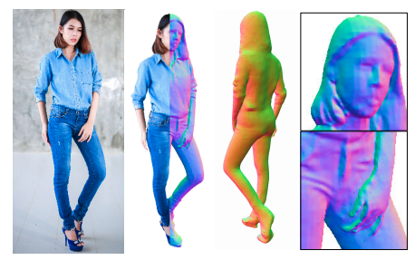

Many people have tried this demo and uploaded their results to [#pifuhd](https://twitter.com/search?q=%23pifuhd). One of my favorites is the video of G7 leaders dancing to a song by Sakanaction.

<blockquote class="twitter-tweet">
もしG7の方々に 新宝島 を踊らせたら <a href="https://twitter.com/hashtag/%E3%82%B5%E3%82%AB%E3%83%8A%E3%82%AF%E3%82%B7%E3%83%A7%E3%83%B3?src=hash&amp;ref_src=twsrc%5Etfw">#サカナクション</a> <a href="https://twitter.com/hashtag/%E6%96%B0%E5%AE%9D%E5%B3%B6?src=hash&amp;ref_src=twsrc%5Etfw">#新宝島</a> <a href="https://twitter.com/hashtag/pifuhd?src=hash&amp;ref_src=twsrc%5Etfw">#pifuhd</a> <a href="https://t.co/TTn75rwlqw">pic.twitter.com/TTn75rwlqw</a>
&mdash; もうせ (@motulo) <a href="https://twitter.com/motulo/status/1277914023116320770?ref_src=twsrc%5Etfw">June 30, 2020</a></blockquote> 

For technical details, I'd like to recommend the excellent presentation video by the authors.

<iframe width="560" height="315" src="https://www.youtube.com/embed/uEDqCxvF5yc" frameborder="0" allow="accelerometer; autoplay; clipboard-write; encrypted-media; gyroscope; picture-in-picture" allowfullscreen></iframe>

 

### Jukebox: A Generative Model for Music
- Authors: Prafulla Dhariwal, Heewoo Jun, Christine Payne, Jong Wook Kim, Alec Radford, Ilya Sutskever
- Link: https://arxiv.org/abs/2005.00341
- Released in: May 2020

Generating realistic images is no longer surprising, but generating realistic music remains a hard challenge due to its extremely long-range dependency. Specifically, a 4-minute song at CD quality (44 kHz) has more than 10 million timestamps with high-level semantics (c.f., intro, verse, chorus). OpenAI boldly tackled the generation of raw audio in a variety of genres, and their **Jukebox** succeeded in producing pretty impressive music! 

[Here](https://jukebox.openai.com) are the non cherry-picked 7,131 samples. They are conditioned on specific genres and artists, some of which are also conditioned on lyrics. For example, [this sample](https://jukebox.openai.com/?song=787730629) is a continuation of *I Just Call To Say I Love You* by Stevie Wonder. It sounds like a new song after 10 seconds, while reasonably maintaining the style of the singer and the song.

What is inside this magic? Inspired by **VQ-VAE-2** [5], the authors use hierarchical VQ-VAE to handle long-range dependency. As for the prior (or, the generator), they use **Sparse Transformer** [6], an efficient Transformer that succeeded in generating 64x64 sized images and raw audio waveforms, as already mentioned in [my earlier post](https://hippocampus-garden.com/xformers/#sparse-transformer-child-2019). 

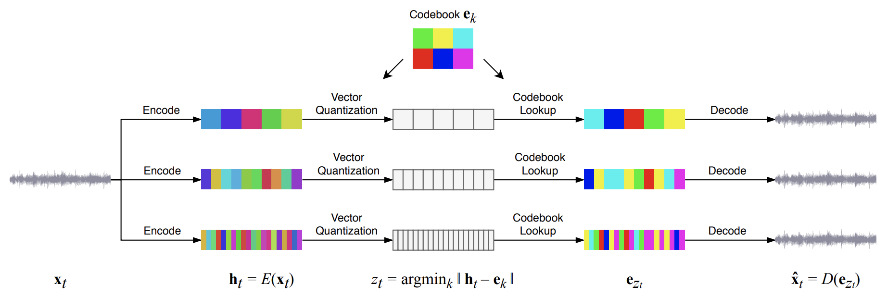

<small>The details are explained with informative GIFs in
<a href="https://openai.com/blog/jukebox/">
the official blog post</a>.</small>

The appendix of the paper is also worth reading. The figure below is a t-SNE plot of (artist, genre) embeddings learned by Jukebox. I agree that ELO is similar to The Beatles😉

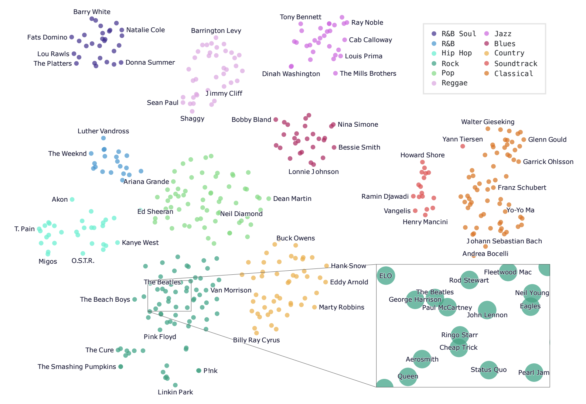

 

### Language Models are Few-Shot Learners
- Authors: Tom B. Brown, Benjamin Mann, Nick Ryder, Melanie Subbiah, Jared Kaplan, Prafulla Dhariwal, Arvind Neelakantan, Pranav Shyam, Girish Sastry, Amanda Askell, Sandhini Agarwal, Ariel Herbert-Voss, Gretchen Krueger, Tom Henighan, Rewon Child, Aditya Ramesh, Daniel M. Ziegler, Jeffrey Wu, Clemens Winter, Christopher Hesse, Mark Chen, Eric Sigler, Mateusz Litwin, Scott Gray, Benjamin Chess, Jack Clark, Christopher Berner, Sam McCandlish, Alec Radford, Ilya Sutskever, Dario Amodei
- Link: https://arxiv.org/abs/2005.14165
- Released in: May 2020
- Accepted to: NeurIPS 2020

**GPT-3**, the latest version of **GPT** [6,7], is a pre-trained language model that has as many as 175B parameters (10 times larger than [Turing-NLG]((https://www.microsoft.com/en-us/research/blog/turing-nlg-a-17-billion-parameter-language-model-by-microsoft/))!) and is trained with 300B tokens. The authors found that scaling up the model significantly improves the performance of few-shot learning without fine-tuning, which they call **in-context learning**. The following figure compares in-context learning with traditional fine-tuning.

In short, in their *in-context* few-shot learning, the model sees the input containing task description, a few examples, and prompt only at inference time and predicts the answer. There is no training or fine-tuning. 
GPT-3 can deal with a variety of tasks such as translation, text generation, summarization, question answering, and even arithmetic. Sometimes it outperforms fine-tuned models.

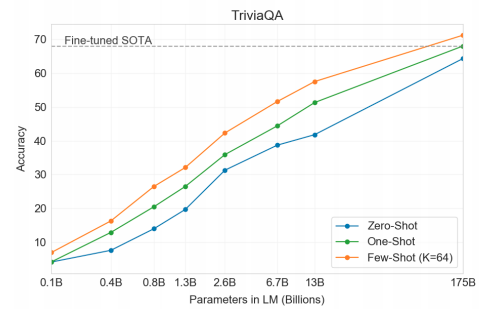

More surprisingly, it is reported that GPT-3 can translate English into JSX code. Indeed, quantitative changes transform to qualitative changes.

<blockquote class="twitter-tweet">
This is mind blowing.  With GPT-3, I built a layout generator where you just describe any layout you want, and it generates the JSX code for you.  W H A T <a href="https://t.co/w8JkrZO4lk">pic.twitter.com/w8JkrZO4lk</a>
&mdash; Sharif Shameem (@sharifshameem) <a href="https://twitter.com/sharifshameem/status/1282676454690451457?ref_src=twsrc%5Etfw">July 13, 2020</a></blockquote> 
 

OpenAI releases the GPT-3 model as an API instead of pre-trained weights. If you wish to use it, join the [waitlist](https://beta.openai.com/) for the beta version.

### Bootstrap Your Own Latent A New Approach to Self-Supervised Learning
- Authors: Jean-Bastien Grill, Florian Strub, Florent Altché, Corentin Tallec, Pierre H. Richemond, Elena Buchatskaya, Carl Doersch, Bernardo Avila Pires, Zhaohan Daniel Guo, Mohammad Gheshlaghi Azar, Bilal Piot, Koray Kavukcuoglu, Rémi Munos, Michal Valko
- Link: https://arxiv.org/abs/2006.07733
- Released in: June 2020
- Accepted to: NeurIPS 2020

**Contrastive learning**, a variant of self-supervised learning algorithm that leverages information from negative samples, was probably one of the hottest research topics in 2020. Many methods such as **MoCo**, **SimCLR**, and **InfoMin**, competed for the higher accuracy on ImageNet classification [8-10]. They are based on the assumption that the distance between representations of different augmented views of the same image should be small while the distance between different images should be large.

As opposed to them, the proposed **Bootstrap Your Own Latent** (**BYOL**) does not use negative pairs at all and outperformed all the contrastive learning methods, closing the gap between self-supervised and supervised learning.

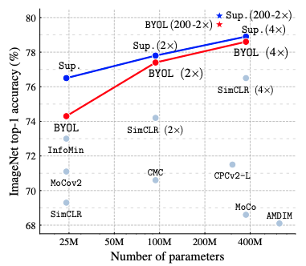

As shown in the figure below, BYOL uses two networks: *online* ($\theta$) and *target* ($\xi$), where the target network is simply the exponential (slow-)moving average of the online network.

An input image $x$ is transformed into two views $v$ and $v'$ with different augmentations ($t$ and $t'$), which are then fed into the online and the target network respectively. BYOL is trained to minimize the L2 distance between the prediction by the online network ($q_{\theta}(z_{\theta})$) and the projected representation by the target network ($\mathrm{sg}(z'_{\xi})$), where $\mathrm{sg}$ means the stop-gradient operator. This is how BYOL bootstraps its latent.

An additional benefit of BYOL is the robustness to the choice of batch size and the set of image augmentations compared to the contrastive baselines. Also, there is a discussion on how to avoid collapsed solutions in the paper. Please check it out if you are interested.

### Implicit Neural Representations with Periodic Activation Functions
- Authors: Vincent Sitzmann, Julien N. P. Martel, Alexander W. Bergman, David B. Lindell, Gordon Wetzstein
- Link: https://arxiv.org/abs/2006.09661
- Released in: June 2020
- Accepted to: NeurIPS 2020

Many scientific problems fall into the learning of **implicit neural representations**. For instance, implicit neural representations can model images, audio signals, and 3D shapes and can solve boundary value problems. However, the popular ReLU-MLP networks fail to represent fine details in the signals and their derivatives well, partly because the second derivative of ReLU is zero everywhere. Other nonlinearities such as tanh or softplus can represent higher-order derivatives, but they also fail to represent fine details.

To address this issue, the authors present neural networks that leverage periodic, $n$-times differentiable $\sin(\cdot)$ activation, which is named **sinusoidal representation networks** (**SIREN**). The benefits of sinusoidal activation are best illustrated in the figure below, which compares different implicit networks fitted to the ground truth image. Unlike other activations, SIREN is able to learn by itself the Gaussian and Laplacian well. 

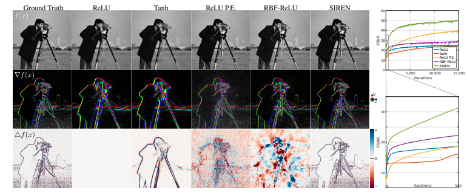

This property of SIREN seems particularly beneficial when modeling 3D shapes.

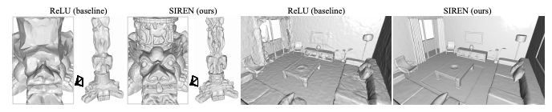

One may wonder "why no one has ever come up with this simple solution?" Well, periodic activation functions have been studied for more than 10 years, but I guess there two factors that make this work still new in 2020. First, it hasn't been explored very much how to apply periodic activations to implicit neural representations. Second, SIREN requires a special initialization scheme. To preserve the distribution of activations through the network, the initial weights of SIREN have to be drawn from a carefully designed uniform distribution.

More samples including audio and differential equations and their presentation video can be found on [the project page](https://vsitzmann.github.io/siren/).
  
### Graph Structure of Neural Networks
- Authors: Jiaxuan You, Jure Leskovec, Kaiming He, Saining Xie
- Link: https://arxiv.org/abs/2007.06559
- Released in: July 2020
- Accepted to: ICML 2020

This exciting work was done by a collaboration between graph and computer vision researchers. 

What do neural networks with good predictive performance have in common? To answer this question, this paper analyzes neural networks from the point of view of graph theory. First, the authors define a novel graph-based representation of neural networks called **relational graph** (a,b). Then, they design a graph generator that systematically explores the design space of relational graphs. The idea of relational graphs enables neural networks to be characterized by two graph statistics: **average path length** and c**lustering coefficient** (c). Finally, they conducted an extensive study on the relationship between the predictive performance of generated neural networks and the graph statistics of the corresponding relational graphs (d).

Their observations include:

- there is a sweet spot in the design space that leads to significantly better predictive performance
- predictive performance of neural networks can be approximated by a smooth function of the clustering coefficient and average path length of its relational graph
- the graph statistics of top-performing neural networks are similar to those of macaque's. 

### Towards Faster and Stabilized GAN Training for High-fidelity Few-shot Image Synthesis
- Authors: Bingchen Liu, Yizhe Zhu, Kunpeng Song, Ahmed Elgammal
- Link: https://arxiv.org/abs/2101.04775
- Released in: September 2020
- Accepted to: ICLR 2021

There is no doubt that StyleGAN2 is great and successful [11], but it still has a problem of requiring a huge amount of data and computation. In fact, for learning to generate 1024x1024 sized FFHQ face images, StyleGAN2 used 8 Tesla V100 GPUs and 70,000 images, and it took 9 days for the entire training process. This is almost impossible for small laboratories and companies who want to reproduce the results. Also, that huge demand limits the potential applications of GANs in production.

This limitation was quite obvious, and 6 months after the publication of StyleGAN2, the authors released **StyleGAN2-ADA** (**StyleGAN2 with adaptive discriminator augmentation**) [12]. They introduced a new technique in data augmentation for the discriminator, allowing StyleGAN2 to generate as fine images as the original model with *a few thousand* training images.

The authors of this paper made a step even further. This paper proposes the so-called **Lightweight GAN**, which adopts skip-layer excitation modules and an autoencoder-like discriminator to generate FFHQ images by training for a few hours with *a few hundred* images on a single RTX-2080 GPU!

And fortunately, [Phil Wang](https://github.com/lucidrains) released [a beautiful and easy-to-use implementation of Lightweight GAN](https://github.com/lucidrains/lightweight-gan) at GitHub. Now, using Colaboratory or any GPU at your disposal, it's possible to generate almost any image you like. They indeed democratized GANs! 

I tried it out to train Lightweight GAN with just 200 sushi images. After training, it generated fairly realistic sushi images as shown below. The generated images are also displayed at "[This Sushi Does Not Exist](https://thispersondoesnotexist.com/)". So, what GANs do you want to create?

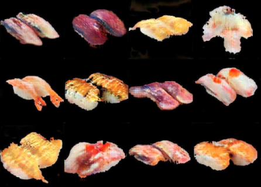

For more details, please refer to the original paper and [my previous post](https://hippocampus-garden.com/sushigan/).

### An Image is Worth 16x16 Words: Transformers for Image Recognition at Scale
- Authors: Alexey Dosovitskiy, Lucas Beyer, Alexander Kolesnikov, Dirk Weissenborn, Xiaohua Zhai, Thomas Unterthiner, Mostafa Dehghani, Matthias Minderer, Georg Heigold, Sylvain Gelly, Jakob Uszkoreit, Neil Houlsby
- Link: https://arxiv.org/abs/2010.11929
- Released in: October 2020
- Accepted to: ICLR 2021

This year has seen a lot of attempts to apply Transformers to computer vision tasks. Cordonnier et al. investigated the equivalence of self-attention and convolutional layers [13]. Chen et al. used GPT to generate images in an autoregressive way [14]. Carion et al. applied Transformers to object detection [15]. With such studies in mind, it's not unnatural to create a Transformer-based pre-trained model for image classification. 

Motivated by this, a team from Google Research trained **Vision Transformer** (**ViT**), achieving the new state-of-the-art over CNN baselines such as **Big Transfer** (**BiT**) and **Noisy Student**. Let's get an overview of ViT from the figure below, because "a picture is worth a thousand words".

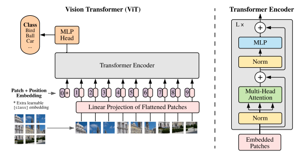

As the title implies, images are split into small patches (16x16) and fed into the projection layer with position embeddings, in the same way that the tokens are embedded and fed into the encoder in the vanilla Transformer. The entire model is trained to minimize the classification loss (so, it is supervised learning). 

The authors report that ViT does not generalize well when trained with "mid-sized" ImageNet dataset due to its smaller inductive bias, but it outperforms CNN baselines when trained with 300 times larger JFT-300M dataset. Nevertheless, ViT uses up significantly fewer computational resources than BiT and Noisy Student.

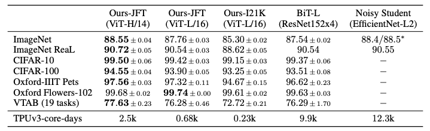

Now that it is found that supervised pre-training works for image classification with a huge Transformer model, I guess a seld-supervised version will appear this year.

### Pre-training without Natural Images
- Authors: Hirokatsu Kataoka, Kazushige Okayasu, Asato Matsumoto, Eisuke Yamagata, Ryosuke Yamada, Nakamasa Inoue, Akio Nakamura, Yutaka Satoh
- Link: https://openaccess.thecvf.com/content/ACCV2020/html/Kataoka_Pre-training_without_Natural_Images_ACCV_2020_paper.html
- Released in: November 2020
- Accepted to: ACCV 2020

Pre-training with large datasets proved to be the key better accuracy. However, such datasets often involve issues such as mistaken labels, copyright violation, privacy violation, and unethical biases. To address these, this paper shows that artificial images can be used for pre-training.

Specifically, the authors prepared **Fractal Database** (**FractalDB**) by a certain algorithm and pre-trained ResNet-50 with it.

The model pre-trained with FractalDB does not outperform the ones pre-trained with ImageNet-1k, but the result is promising. Considering the issues listed above, FractalDB can be a good option.

## Concluding Remarks
There are other interesting papers that I could not include here. If you have any recommendations, please feel free to comment.

Thanks for reading this long post. Hope you have a good one!

## References
[1] Jonathan Frankle, Michael Carbin. "[The Lottery Ticket Hypothesis: Finding Sparse, Trainable Neural Networks](https://arxiv.org/abs/1803.03635)". *ICLR*. 2019.  
[2] Madison May. "[Comparing Rewinding and Fine-tuning in Neural Network Pruning](https://arxiv.org/abs/2003.02389)". *ICLR*. 2020.   
[3] Shunsuke Saito, Zeng Huang, Ryota Natsume, Shigeo Morishima, Angjoo Kanazawa, Hao Li. "[PIFu: Pixel-Aligned Implicit Function for High-Resolution Clothed Human Digitization](https://arxiv.org/abs/1905.05172)". *ICCV*. 2019.  
[4] Ali Razavi, Aaron van den Oord, Oriol Vinyals. "[Generating Diverse High-Fidelity Images with VQ-VAE-2](https://arxiv.org/abs/1906.00446)". *NeurIPS*. 2019.  
[5] Rewon Child, Scott Gray, Alec Radford, Ilya Sutskever. "[Generating Long Sequences with Sparse Transformers](https://arxiv.org/abs/1904.10509)". 2019.  
[6] Alec Radford, Karthik Narasimhan, Tim Salimans, Ilya Sutskever. "[Improving Language Understanding by Generative Pre-Training](https://www.cs.ubc.ca/~amuham01/LING530/papers/radford2018improving.pdf)". 2018.  
[7] Alec Radford, Jeffrey Wu, Rewon Child, David Luan, Dario Amodei, Ilya Sutskever. "[Language Models are Unsupervised Multitask Learners](http://www.persagen.com/files/misc/radford2019language.pdf)". 2019.  
[8] Kaiming He, Haoqi Fan, Yuxin Wu, Saining Xie, Ross Girshick. "[Momentum Contrast for Unsupervised Visual Representation Learning](https://arxiv.org/abs/1911.05722)". *CVPR*. 2020.  
[9] Ting Chen, Simon Kornblith, Mohammad Norouzi, Geoffrey Hinton. "[A Simple Framework for Contrastive Learning of Visual Representations](https://arxiv.org/abs/2002.05709)". *ICML*. 2020.  
[10] Yonglong Tian, Chen Sun, Ben Poole, Dilip Krishnan, Cordelia Schmid, Phillip Isola. "[What Makes for Good Views for Contrastive Learning?](https://arxiv.org/abs/2005.10243)". *NeurIPS*. 2020.  
[11] Tero Karras, Samuli Laine, Miika Aittala, Janne Hellsten, Jaakko Lehtinen, Timo Aila. "[Analyzing and Improving the Image Quality of StyleGAN](https://arxiv.org/abs/1912.04958)". *CVPR*. 2020.  
[12] Tero Karras, Miika Aittala, Janne Hellsten, Samuli Laine, Jaakko Lehtinen, Timo Aila. "[Training Generative Adversarial Networks with Limited Data](https://arxiv.org/abs/2006.06676)". *NeurIPS*. 2020.  
[13] Jean-Baptiste Cordonnier, Andreas Loukas, Martin Jaggi. "[On the Relationship between Self-Attention and Convolutional Layers](https://arxiv.org/abs/1911.03584)". *ICLR*. 2020.  
[14] Mark Chen, Alec Radford, Rewon Child, Jeff Wu, Heewoo Jun, Prafulla Dhariwal, David Luan,
Ilya Sutskever. "[Generative Pretraining from Pixels](https://openai.com/blog/image-gpt/)". *ICML* 2020.  
[15] Alexander Kolesnikov, Lucas Beyer, Xiaohua Zhai, Joan Puigcerver, Jessica Yung, Sylvain Gelly, Neil Houlsby. "[Big Transfer (BiT): General Visual Representation Learning](https://arxiv.org/abs/1912.11370)". *ECCV*. 2020.  
[16] Qizhe Xie, Minh-Thang Luong, Eduard Hovy, Quoc V. Le. "[Self-training with Noisy Student improves ImageNet classification](https://arxiv.org/abs/1911.04252)". *CVPR*. 2020.  
[17] Nicolas Carion, Francisco Massa, Gabriel Synnaeve, Nicolas Usunier, Alexander Kirillov, Sergey Zagoruyko. "[End-to-End Object Detection with Transformers](https://arxiv.org/abs/2005.12872)".  *ECCV*. 2020.