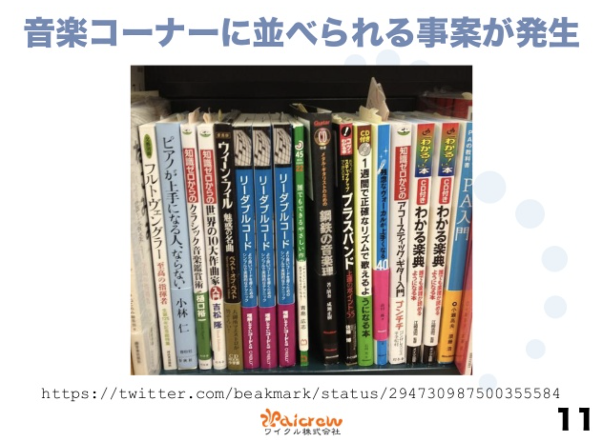

## はじめに
『リーダブルコード ―より良いコードを書くためのシンプルで実践的なテクニック』（Dustin Boswell，Trevor Foucher 著，角征典 訳，オライリージャパン，2012年）を読んだので，まとめと感想を書きます．あまりにも有名な書籍のため普通の書評を書いても百番煎じくらいになりそうですが，備忘録も兼ねて書きます．

<iframe style="width:120px;height:240px;" marginwidth="0" marginheight="0" scrolling="no" frameborder="0" src="//rcm-fe.amazon-adsystem.com/e/cm?lt1=_blank&bc1=000000&IS2=1&bg1=FFFFFF&fc1=000000&lc1=0000FF&t=hippocampus09-22&language=ja_JP&o=9&p=8&l=as4&m=amazon&f=ifr&ref=as_ss_li_til&asins=4873115655&linkId=b0ffe0bddcdadb86e8332509e7caaa60"></iframe>

本書は，サブタイトルにある通り「読みやすいコードを書くために心がけるべきこと」を説いた本です．出版が2012年と技術書にしては古めですが，「新人エンジニアが読むべき技術書」として必ずと言っていいほど挙げられる「殿堂入りの技術書」でもあります．

本書を読んで，読みやすいコードを書くのはそのコードを読む「他の誰か」だけではなく，後でそのコードを読み返す「自分」やバグのないコードを書きたい「自分」にとっても極めて重要だと改めて感じました．

「リーダブルコード」というタイトルらしく読みやすい言葉で必要十分な内容を扱っているため，数時間から数日で読めると思います．気になっているけどまだ読んでいないという方は，これを機にサクッと読んでみてはいかがでしょうか．

## まとめ+α
本書は全15章からなりますが，各パートごとに私が重要だと思ったことを適宜列挙する形でまとめます．

### 第I部 表面上の改善
第I部は主に変数・関数の命名とコメントにおいて気をつけるべきことを書いています．
- 名前に情報を詰め込む
  - 例えば二分木の`Size()`メソッドなら，`Height()`，`NumNodes()`，`MemoryBytes()`などの名前のほうが明確である
  - サーバがポートをリッスンできるか確認するメソッドなら，`ServerCanStart()`よりも`CanListenOnPort()`の方が明確である
  - ある程度のスコープを持つ変数には，`tmp`のような汎用的な名前ではなく`sum_squares`のように意味のある名前をつける
  - スコープが小さい場合や慣習的な理由がある場合には短い名前を付けても良い
  - 例えば`filter()`という関数は，条件に当てはまるものを「除外する」のか「選択する」のかが曖昧である．`exclude()`や`select()`といった名前のほうが誤解を生みづらい
  - リストの要素数を返す`size()`という名前のメソッドは計算量が$\mathcal{O}(1)$であることを期待させる．もし計算量が$\mathcal{O}(n)$なら`countSize()`のような名前にすべきである
- 正確かつ簡潔なコメントを書く
  - コードからすぐに分かることをコメントに書くべきではない．例えば，`Node* FindNodeInSubtrree(Node* subtree, string name, int depth)`という関数に`与えられたsubtreeに含まれるnameとdepthに合致したNodeを見つける`というコメントを書くのは無駄である．コメントを書くなら，`もしdepth <= 0ならば，'subtree'だけを調べる`のような詳しい挙動を説明するべきである．もしコードから関数の概要がわからないなら，名前の方を再考したほうが良い
  - `ハッシュテーブルよりもバイナリツリーのほうが速かった`のような試行錯誤の結果や，`TODO: アルゴリズムの高速化`のような欠陥に対するコメントを書くのも良い
  - コードを書いた意図をコメントするのも良い．例えば，`listを逆順にイテレートする`ではなく`値段の高い順に表示する`のような高レベルのコメントには価値がある

### 第II部 ループとロジックの単純化
第II部は，コードのより内部に注目して，制御フローや変数のスコープといった観点から気をつけるべきことを扱います．
- if文の条件には否定形よりも肯定形を使う
- 関数からなるべく早く返す
- ネストを浅くする
- 長い式の一部を直感的な名前を付けた中間変数で置き換える
- 変数のスコープを縮める
- 変数の変更箇所を少なくする
  
### 第III部 コードの再構成
コードを書く作業が一段落したら，一歩引いて見直して，長い関数の一部を新しい関数に切り出したりする「再構成」をするでしょう．第III部はこの再構成について議論します．  
第III部の最も重要なメッセージは「関数の目的と無関係の下位問題を抽出して別の関数に切り出す」です．例えば，与えられた地点から最も近い場所を見つけるための関数において，「2点間の距離を計算する」作業は「無関係の下位問題」といえます．コードの再構成では，このような下位問題を積極的に見つけて，別の関数として定義すべきです．こうして得られる関数は汎用的であるため再利用しやすく，独立しているため単体テストが書きやすいというメリットもあります．このあたりは関数型プログラミングで特に重視される思想のひとつなのかなと思っています．
  
### 第IV部 選抜テーマ
第IV部は，「テストと読みやすさ」と「実践的な問題を通した全体の復習」という2つのテーマを扱っています．  
テストに関する重要なメッセージは，「テストコードも本体コードと同様に読みやすいものにしなければならない」というものです．テストコードが読みづらいと本体コードの動作を理解しにくくなり，また，テストコードが追加・修正されなくなるという問題があります．  
「実践的な問題」の章では「分／時間カウンタ」の設計と実装を試行錯誤しながら，本書の内容を実際の現場でどう応用するか説明しています．

## おまけ
[翻訳を担当した角氏の編集後記的なスライド](https://www.slideshare.net/kdmsnr/20140213-readablecode)によると，書店で楽典と一緒に並べられてしまうことがしばしばあるそうです．確かに，表紙だけを見ると楽譜っぽいですよね．

