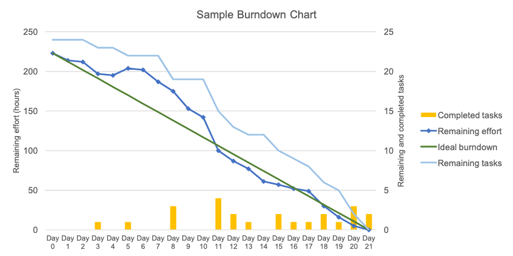

## はじめに
『アジャイルサムライ――達人開発者への道』（Jonathan Rasmusson 著，西村直人, 角谷信太郎 監訳，オーム社，2011年）を読んだので，まとめと感想を書きます．

<iframe style="width:120px;height:240px;" marginwidth="0" marginheight="0" scrolling="no" frameborder="0" src="//rcm-fe.amazon-adsystem.com/e/cm?lt1=_blank&bc1=000000&IS2=1&bg1=FFFFFF&fc1=000000&lc1=0000FF&t=hippocampus09-22&language=ja_JP&o=9&p=8&l=as4&m=amazon&f=ifr&ref=as_ss_li_til&asins=4274068560&linkId=3640b975813edef0e9fa7b9c8440b538"></iframe>

本書は，[**アジャイル開発**](https://ja.wikipedia.org/wiki/%E3%82%A2%E3%82%B8%E3%83%A3%E3%82%A4%E3%83%AB%E3%82%BD%E3%83%95%E3%83%88%E3%82%A6%E3%82%A7%E3%82%A2%E9%96%8B%E7%99%BA)の心構えや実践するための方法を解説した本です．
出版が2011年と技術書にしては古めですが，以前このブログでも紹介した『[リーダブルコード](https://hippocampus-garden.com/book_review_boswell/)』と同様に，「新人エンジニアが読むべき技術書」によく数えられる「殿堂入りの技術書」です．したがって，本記事もこれまでの書評と同じく，ほとんど自分の復習用に書いています．本記事よりも詳しくまとめている記事を貼っておきますので，興味のある方はこちらもどうぞ．

- [【アジャイルサムライ】まとめと目次｜−達人開発者への道− | アジャイルニンジャ](https://agile-ninja.net/agile-samurai-next/)
- [【図解サマリ】アジャイルサムライを読んだので紙芝居にまとめました | by Masahiro Osanai | Medium](https://medium.com/@koyamauchi/%E5%9B%B3%E8%A7%A3%E3%82%B5%E3%83%9E%E3%83%AA-%E3%82%A2%E3%82%B8%E3%83%A3%E3%82%A4%E3%83%AB%E3%82%B5%E3%83%A0%E3%83%A9%E3%82%A4%E3%82%92%E8%AA%AD%E3%82%93%E3%81%A0%E3%81%AE%E3%81%A7%E7%B4%99%E8%8A%9D%E5%B1%85%E3%81%AB%E3%81%BE%E3%81%A8%E3%82%81%E3%81%BE%E3%81%97%E3%81%9F-867ac94e10d6)

実務での開発経験が少ないと「アジャイル開発」と言われてもピンとこないと思う（1年前の私がそうでした）ので，簡単に触れておきます．そもそも「agile」とは「素早い」「機敏」などの意味を持つ単語で，「アジャイル開発」とは，開発したいソフトウェアを細かい機能に分解し，短いサイクルで開発とテストを繰返すという特徴を持った開発手法のことです．

アジャイル開発について，[アジャイルソフトウェア宣言](https://agilemanifesto.org/iso/ja/manifesto.html)というものが定められているので，引用します．

>私たちは，ソフトウェア開発の実践あるいは実践を手助けをする活動を通じて，よりよい開発方法を見つけだそうとしている．この活動を通して，私たちは以下の価値に至った．  
プロセスやツールよりも個人と対話を，包括的なドキュメントよりも動くソフトウェアを，契約交渉よりも顧客との協調を，計画に従うことよりも変化への対応を，価値とする．  
すなわち，左記のことがらに価値があることを
認めながらも，私たちは右記のことがらにより価値をおく．

抽象的で少しわかりづらいですね．[その背後にある原則](https://agilemanifesto.org/iso/ja/principles.html)というものもあり，こちらのほうが具体化されていてわかりやすそうです．やや長いので一部だけ引用します．

>顧客満足を最優先し，価値のあるソフトウェアを早く継続的に提供します．  
要求の変更はたとえ開発の後期であっても歓迎します．変化を味方につけることによって，お客様の競争力を引き上げます．  
動くソフトウェアを，2-3週間から2-3ヶ月というできるだけ短い時間間隔でリリースします．

[**ウォーターフォール開発**](https://ja.wikipedia.org/wiki/%E3%82%A6%E3%82%A9%E3%83%BC%E3%82%BF%E3%83%BC%E3%83%95%E3%82%A9%E3%83%BC%E3%83%AB%E3%83%BB%E3%83%A2%E3%83%87%E3%83%AB)と呼ばれる開発工程と対比してみるとわかりやすいかもしれません．

## まとめ+α
原題は『The Agile Samurai: How Agile Masters Deliver Great Software』で，アジャイル開発を全5部，全15章で解説しています．「マスター・センセイ」という謎のキャラクターが登場したりと，挿絵や言葉遣いなどが独特で気楽に読むことができます．シンプルで実践的なアイディアを解説するのに，小難しい言葉遣いは必要ないということを思い知らされました．

<small><a href="https://www.oreilly.com/library/view/the-agile-samurai/9781680500066/f_0083.html">Watch Those Bugs - The Agile Samurai [Book]</a>より</small>

 

また，原著を読んでいたら理解できなかったであろう固有名詞やミームを訳注で解説してくれているのも良かったです．

以下，パートごとに私が重要だと思ったことをかいつまんでまとめます．

### 第I部 「アジャイル」入門
第I部は，「アジャイルソフトウェア宣言」で述べられているようなことを具体的に説明しています．

- 価値ある成果を毎週届けることに重点を置く
- 要求や設計は必ず途中で変わるので，その前提で小さなPDCAサイクルを回しながら調整する
- やるべきことは無数にあるので優先順位をつけてやる
- 進捗を顧客に対して詳らかにして，期待値調整をしながらすすめる
- アジャイル開発を実践する究極の方法はない．実際，以下のようにいくつかの方法論がある
  - **スクラム**
  - **エクストリーム・プログラミング**
  - **リーン**
- 開発チームは，当事者意識を持った職能横断型のメンバーで構成される

### 第II部 アジャイルな方向づけ
第II部では，プロジェクトチーム全体で同じ目標を持って作業するために重要な[**インセプションデッキ**](https://takaking22.com/2019/5minutes-inception-deck/)を紹介します．インセプションデッキとは，開発に着手する前に共通認識を持っておくべき10個の「てごわい質問」です．

- 我々はなぜここにいるのか？
- **エレベーターピッチ**をつくる
- パッケージデザインを作る
- やらないことリストをつくる
- 「ご近所さん」を探せ
- 解決案を描く
- 夜も眠れなくなるような問題とは？
- 期間を見極める
- 譲れないもの・諦めてもいいものを明確にする
- 何がどれだけ必要か

ところで，プロジェクトの期間中に，時間・予算・品質・スコープの4つのうちいずれか（最悪の場合はそのすべて）が変動することがしばしばあります．しかし，これらはトレードオフの関係にあり，すべてを同時に立てることはできません．アジャイル開発では時間・予算・品質の変化を受容して，代わりにスコープを調節弁とします．

### 第III部 アジャイルな計画づくり
インセプションデッキができたら，開発計画を立てます．アジャイル開発では，開発したい機能を仕様書ではなく**ユーザーストーリー**という小さなカードの集合によって管理します．このカードには，「ユーザアカウントを作る」のように，実装したい機能を端的な形で記述します．**INVEST**（Independent, Negotiable, Valuable, Estimatable, Small, Testableの頭文字）なユーザーストーリーを書くように心がけましょう．文書化にこだわるよりも，ユーザーストーリーにまとめたほうが意思疎通がしやすく，また適度に分割されているため，テストしやすい，工数が見積もりやすいといったメリットがあります．各ユーザーストーリーは1日から5日程度で完了できる規模にすることが望ましく，それ以上の大規模な開発は**エピック**としてまとめることが推奨されています．

プロジェクトの工数見積りは難しい問題です．未来は常に不確実なので，初期段階で見積もった工数は，基本的には当てになりません．そこで，アジャイルでは各ストーリーを**ストーリーポイント**と呼ばれる相対的な単位で見積もり，チームのポイント消化速度から全体の進捗を管理します．見積もりの粒度は1, 2, 3, 5のようにすることが多いそうです．

相対的なストーリーの大きさが見積もれると，チームの開発速度や期日に間に合うかが可視化できます．**バーンダウンチャート**や**バーンアップチャート**がよく使われます．

### 第IV部 アジャイルなプロジェクト運営
第IV部は，実際に「価値ある成果を毎週届ける」ための日々の運用について説明します．アジャイル開発では，通常1-2週間の**イテレーション**と呼ばれる単位で，分析・設計，開発，テストからなる開発サイクルを回していきます．各イテレーションにはいくつかの定例ミーティングがあり，ここでは以下の5つが紹介されています．

- **ストーリー計画**：取り組むストーリーの準備が整っていることを確かめる
- **ショーケース**：イテレーションで実装したストーリーのデモをして顧客からフィードバックを得る
- **イテレーション計画**：次回のイテレーションで取り組むストーリーを決める
- **ミニ振り返り**：イテレーションの振り返り
- **デイリースタンドアップ**：重要な情報をチーム内ですばやく同期する

チームがストーリーを一覧できる掲示板である**ストーリーボード**も紹介されています．本書では物理的なものが想定されていますが，[ZenHub](https://www.zenhub.com/)のようなWebサービスを使ってもいいでしょう．

### 第V部 アジャイルなプログラミング
第V部は，アジャイルとは独立した内容のような気もしますが，ソフトウェア開発の重要な4つの習慣について述べています．

- **ユニットテスト**
  - 危なっかしいところはすべてテストする
- **リファクタリング**：技術的負債の返済
  - こまめにしたほうが作業効率を高められる
- **テスト駆動開発** (**TDD**; **test driven development**)
- **継続的インテグレーション** (**CI**; **continuous integration**)
  - リファクタリングと同様に，こまめにした方がよい
  - チェックインされるたびにビルドできるようビルドを自動化しておく

## 豆知識と関連書籍
ちなみに，ソフトウェア開発を飛び出して経営の正解でも注目されている「スクラム」は『スクラム　仕事が４倍速くなる“世界標準”のチーム戦術』の著者であるJeff Sutherland氏が生みの親だそうですが，彼は『失敗の本質』などで知られる野中郁次郎らの『[The New New Product Development Game](https://hbr.org/1986/01/the-new-new-product-development-game)』という1986年の論文に影響を受けたそうです．確かに，論文には次のような図があります．論文中でType Aはリレー方式，Type Bは「刺し身方式」，Type Cはスクラム方式と呼ばれています．

<iframe style="width:120px;height:240px;" marginwidth="0" marginheight="0" scrolling="no" frameborder="0" src="//rcm-fe.amazon-adsystem.com/e/cm?lt1=_blank&bc1=000000&IS2=1&bg1=FFFFFF&fc1=000000&lc1=0000FF&t=hippocampus09-22&language=ja_JP&o=9&p=8&l=as4&m=amazon&f=ifr&ref=as_ss_li_til&asins=4152095423&linkId=7c823f261d519205cbb21ec5a092d9ae"></iframe>

<iframe style="width:120px;height:240px;" marginwidth="0" marginheight="0" scrolling="no" frameborder="0" src="//rcm-fe.amazon-adsystem.com/e/cm?lt1=_blank&bc1=000000&IS2=1&bg1=FFFFFF&fc1=000000&lc1=0000FF&t=hippocampus09-22&language=ja_JP&o=9&p=8&l=as4&m=amazon&f=ifr&ref=as_ss_li_til&asins=B00BN16XX8&linkId=6e64765129367f019aadd24115160e42"></iframe>