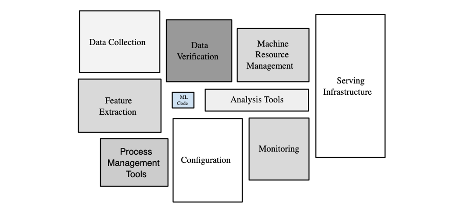

ここ最近はKaggleに熱を上げていることもあって完全に機を逸してしまったのですが、後で自分で振り返るためにも、自分にとってキャリア最初の1年である2020年度に読んだ仕事関係の本をまとめておこうと思い、筆を執りました。本記事は普段以上に個人的内容が強く、読者の役に立つ可能性が低いことを予めおことわりしておきます。

読んだ本のリストに入る前に、ごく簡単に1年間を総括します。いわゆる機械学習エンジニア的な業務を中心に行っていたのですが、実務的な知識が欠けた状態で入社したこともあって、機械学習システムのこの有名な図の意味するところを身をもって知る日々でした。

<small><a href="https://developers.google.com/machine-learning/crash-course/production-ml-systems">Production ML Systems  |  Machine Learning Crash Course</a>より</small>

 

「予測モデルを作ることと、データ施策を本番環境で運用してビジネス価値を出し続けることの間には様々な大きいギャップがある」ということを痛感しました。月並みな感想になってしまいますが、この学びをキャリアの早い段階で得られたのは良かったと思っています。2年目はこのギャップを埋めて大きなビジネス価値に繋げられるよう、引き続き邁進していく所存です。

そういうわけで、読んだ本を改めて振り返ると、エンジニアリングや問題解決の考え方など、自分がこれまでおろそかにしてきた部分を補完するための書籍が多いのが見て取れます（概ね読んだ順です）。

- GCPの教科書
- 統計のための行列代数
- 効果検証入門
- 測りすぎ
- リーダブルコード
- 問題解決
- 統計学入門
- Kaggleで勝つデータ分析の技術
- 新しいLinuxの教科書
- アジャイルサムライ
- イシューからはじめよ
- マスタリングTCP/IP

他にも、一部だけ読んだ本やWeb上のリソースなどが多数ありますが、挙げ始めるときりがないのでここではちゃんと読んだ本だけを紹介します（これらの多くはすでに本ブログで取り上げているので、以降の部分に関しては情報量が特に少ない可能性があります）。

## GCPの教科書
『GCPの教科書』（吉積礼敏、リックテレコム、2019年）はその名の通り、様々な種類のクラウドコンピューティングサービスであるGoogle Cloud Platformの各種サービスを解説した本です。入社直後の研修（[参考](https://recruit-tech.co.jp/blog/2020/08/21/rtech_bootcamp_2020/)）で使用したのですが、当時の私といえば、BigQueryとAWSのSageMakerを少し触ったことがあるくらいの経験しかなかったので、本書は広範なサービスを包含するGCPについて概観するのに役立ちました。[Google Cloudのドキュメント](https://cloud.google.com/docs)は充実していますし、日本語もサポートされていますが、こういった手引があると大海を彷徨わなくて済むので、未経験者としてはありがたかったです。

とはいえ、この手の本はやはり、チュートリアルなどをやって手を動かしてみないとピンと来ないところも多いかもしれません。サービスのアップデートも頻繁にあるので、ある程度概要を掴んだ後はドキュメントを頼りにするのがいいのだと思います。

<iframe style="width:120px;height:240px;" marginwidth="0" marginheight="0" scrolling="no" frameborder="0" src="//rcm-fe.amazon-adsystem.com/e/cm?lt1=_blank&bc1=000000&IS2=1&bg1=FFFFFF&fc1=000000&lc1=0000FF&t=hippocampus09-22&language=ja_JP&o=9&p=8&l=as4&m=amazon&f=ifr&ref=as_ss_li_til&asins=4865941959&linkId=771558102233791f2e85ccaa641ca8f0"></iframe>

## 統計のための行列代数
『統計のための行列代数』（D. A. Harville 著，伊理正夫 監訳，丸善出版，2012年）は、「統計学への応用」を主眼においた線形代数の教科書です。線形代数は重要かつ範囲がとても広く，大学の教養課程で学ぶ内容がその後の研究や実務において使う内容と必ずしも一致しないので、応用目線で学び直したくなることがあると思います。本書はそのような目的に非常に適していると思いました．詳しくは[以前の記事](https://hippocampus-garden.com/book_review_harville/)をご参照ください。

<iframe style="width:120px;height:240px;" marginwidth="0" marginheight="0" scrolling="no" frameborder="0" src="//rcm-fe.amazon-adsystem.com/e/cm?lt1=_blank&bc1=000000&IS2=1&bg1=FFFFFF&fc1=000000&lc1=0000FF&t=hippocampus09-22&language=ja_JP&o=9&p=8&l=as4&m=amazon&f=ifr&ref=as_ss_li_til&asins=4621061453&linkId=0b657b7c2b505f31c46440ab682ea53f"></iframe>

<iframe style="width:120px;height:240px;" marginwidth="0" marginheight="0" scrolling="no" frameborder="0" src="//rcm-fe.amazon-adsystem.com/e/cm?lt1=_blank&bc1=000000&IS2=1&bg1=FFFFFF&fc1=000000&lc1=0000FF&t=hippocampus09-22&language=ja_JP&o=9&p=8&l=as4&m=amazon&f=ifr&ref=as_ss_li_til&asins=4621061526&linkId=38a049db990343699b81058e34d821f9"></iframe>

## 効果検証入門
『効果検証入門 正しい比較のための因果推論／計量経済学の基礎』（安井翔太 著 株式会社ホクソエム 監修， 技術評論社，2020年）は、因果推論と計量経済学の分析手法のうち実際の現場でよく使われるものを、実務に即した形で平易に解説した本です。次のような範囲を扱っています：平均因果効果，ランダム化比較試験，傾向スコア，差分の差分法，回帰不連続デザインなど。他書で学ぼうと思うと専門的すぎたり英語だったりと敷居が高めだったので、ありがたく拝読しました。詳しくは[以前の記事](https://hippocampus-garden.com/book_review_yasui/)をご参照ください。

<iframe style="width:120px;height:240px;" marginwidth="0" marginheight="0" scrolling="no" frameborder="0" src="//rcm-fe.amazon-adsystem.com/e/cm?lt1=_blank&bc1=000000&IS2=1&bg1=FFFFFF&fc1=000000&lc1=0000FF&t=hippocampus09-22&language=ja_JP&o=9&p=8&l=as4&m=amazon&f=ifr&ref=as_ss_li_til&asins=B0834JN23Y&linkId=35022c21b344c6be11cad5d4c6a15cc4"></iframe>

## 測りすぎ
『測りすぎ――なぜパフォーマンス評価は失敗するのか？』（Jerry Z. Muller 著，松本裕 訳、みすず書房，2019年）は一般書なのですが、前述の『効果検証入門』と合わせて読むとおもしろかったです。「測定できないものは改善できない」とはよく言いますが、測定は注意深くやらないと、コストを増大させるだけの結果になったり、組織に歪んだインセンティブを与えてしまったりしてしまいます。この本は様々な業界での失敗例を通して、パフォーマンス計測を成功させる方法を論じています。こちらも、詳しくは[以前の記事](https://hippocampus-garden.com/book_review_yasui/)をご参照ください。

<iframe style="width:120px;height:240px;" marginwidth="0" marginheight="0" scrolling="no" frameborder="0" src="//rcm-fe.amazon-adsystem.com/e/cm?lt1=_blank&bc1=000000&IS2=1&bg1=FFFFFF&fc1=000000&lc1=0000FF&t=hippocampus09-22&language=ja_JP&o=9&p=8&l=as4&m=amazon&f=ifr&ref=as_ss_li_til&asins=4622087936&linkId=bf0bd2b99ec95dd1235912a91d294eaa"></iframe>

## リーダブルコード
『リーダブルコード ―より良いコードを書くためのシンプルで実践的なテクニック』（Dustin Boswell，Trevor Foucher 著，角征典 訳，オライリージャパン，2012年）は、「読みやすいコードを書くために心がけるべきこと」を説く本で、「新人エンジニアが読むべき技術書」の定番中の定番です。読んで反省するところが多かったので、もっと早いうちに読むべきでした。詳しくは[以前の記事](https://hippocampus-garden.com/book_review_boswell/)をご参照ください。

<iframe style="width:120px;height:240px;" marginwidth="0" marginheight="0" scrolling="no" frameborder="0" src="//rcm-fe.amazon-adsystem.com/e/cm?lt1=_blank&bc1=000000&IS2=1&bg1=FFFFFF&fc1=000000&lc1=0000FF&t=hippocampus09-22&language=ja_JP&o=9&p=8&l=as4&m=amazon&f=ifr&ref=as_ss_li_til&asins=4873115655&linkId=b0ffe0bddcdadb86e8332509e7caaa60"></iframe>

## 問題解決
『問題解決――あらゆる課題を突破する ビジネスパーソン必須の仕事術』（高田貴久, 岩澤智之 著、英治出版、2014年）は、いわゆる問題解決やロジカルシンキングの方法論をストーリー仕立てで解説した本です。この手の本は敬遠してしまうことが多いのですが、研修のために読んでみたところ、データサイエンティストとしての普段の業務でも意識すると良さそうなことがいくつかあって勉強になりました。また、本書で紹介される問題解決の手順は、組織として共通認識を持って仕事を進めるため、あるいは他者を説得するための「共通言語」として重要なのだと理解しました。このジャンルの本を読んだことがない方は、一読して損はないと思います。

<iframe style="width:120px;height:240px;" marginwidth="0" marginheight="0" scrolling="no" frameborder="0" src="//rcm-fe.amazon-adsystem.com/e/cm?lt1=_blank&bc1=000000&IS2=1&bg1=FFFFFF&fc1=000000&lc1=0000FF&t=hippocampus09-22&language=ja_JP&o=9&p=8&l=as4&m=amazon&f=ifr&ref=as_ss_li_til&asins=4862761240&linkId=8cc92f686635a61cf058fd28b5f345dd"></iframe>

## 統計学入門
『統計学入門(基礎統計学Ⅰ)』（東京大学教養学部統計学教室 編、東京大学出版会、1991年）は、「統計学の教科書」といえばまっさきに挙げられるであろう定番書です。統計学に興味を持った妻が大学時代の教科書を使って再学習するというので、それに付き添う形で私も復習のために読みました。

いま調べたところ、この本はAmazonの「統計法・人口統計・資源統計」の売れ筋ランキングでなんと1位でした。30年も読まれ続けているだけあって、内容も過不足なく、信頼の置ける教科書だと思います。

しかし、ここではあえて、本書の問題点を2つ指摘したいと思います。まず第一に、「本当の初学者」向きではないことです。一応は高校レベルの数学ができていれば読めるようになっていますが、構成があまり親切でないので難解だと思います。例えば、第1章で「統計学とは」を説明するのにいたずらに複雑な数式を登場させたり、第6章で「主な離散確率分布」を紹介するのに最初の例が捕獲再捕獲法の超幾何分布だったり、といった具合です。読み飛ばしても問題ない項目や発展的な内容には積極的に目印をつけて、独学する読者でも挫折せずに全体像を把握できるようにするのが親切な構成だと思います。

第二に、コンピュータを用いた分析への手引きが皆無だということです。出版当時はコンピュータへのアクセスが限られていたのかもしれませんが、今や統計分析にコンピュータは必要不可欠な存在ですし、理論的に導いた結果をコンピュータ上で再現するのは理解を深めるのに非常に有用なので、統計学の勉強においてコンピュータを活用しない手はないと思います。これから統計学を勉強されるという方は、ExcelでもRでもPythonでもなんでもいいので、プログラムを書いて結果を確認しながら勉強することをお勧めします。ちなみに、これまでにいくつか投稿した["Stats with Python"シリーズ](https://hippocampus-garden.com/stats_unbiased_variance/)は、そのような活動の一環です。

<iframe style="width:120px;height:240px;" marginwidth="0" marginheight="0" scrolling="no" frameborder="0" src="//rcm-fe.amazon-adsystem.com/e/cm?lt1=_blank&bc1=000000&IS2=1&bg1=FFFFFF&fc1=000000&lc1=0000FF&t=hippocampus09-22&language=ja_JP&o=9&p=8&l=as4&m=amazon&f=ifr&ref=as_ss_li_til&asins=4130420658&linkId=e4f8cc2a5ae142f60bbb17602a54093b"></iframe>

このような問題意識を反映してのことか、私が東大に入学した2014年には教科書として『入門統計解析』（倉田博史, 星野崇宏 著、新世社、2009年）が使用されていました。データがWebサイトで配布されていたり、Excelを使った分析例が掲載されていたりと、よりモダンな構成となっています。なお、データサイエンスブームと言われるようになって久しいので他にも良い教科書はたくさんあるのだと思いますが、このあたりの動向はあまり追えていません。

<iframe style="width:120px;height:240px;" marginwidth="0" marginheight="0" scrolling="no" frameborder="0" src="//rcm-fe.amazon-adsystem.com/e/cm?lt1=_blank&bc1=000000&IS2=1&bg1=FFFFFF&fc1=000000&lc1=0000FF&t=hippocampus09-22&language=ja_JP&o=9&p=8&l=as4&m=amazon&f=ifr&ref=as_ss_li_til&asins=4883841405&linkId=59e6be085d3c209110ebf71e75ed0f7f"></iframe>

## Kaggleで勝つデータ分析の技術
『Kaggleで勝つデータ分析の技術』（門脇大輔, 阪田隆司, 保坂桂, 平松雄司 著，技術評論社，2019年）は，Kaggleを始めとするデータ分析コンペで必要な知識やテクニックを解説した本です。分析コンペのテクニックといえば、従来はKaggleのNotebookや個人ブログに知見が散在していたので、書籍の形でまとめられているのはありがたかったです。

なお、本書はテーブルデータのみを対象としており、画像・自然言語・音声などの非構造化データは扱っていません。続編に期待したいですね。

<iframe style="width:120px;height:240px;" marginwidth="0" marginheight="0" scrolling="no" frameborder="0" src="//rcm-fe.amazon-adsystem.com/e/cm?lt1=_blank&bc1=000000&IS2=1&bg1=FFFFFF&fc1=000000&lc1=0000FF&t=hippocampus09-22&language=ja_JP&o=9&p=8&l=as4&m=amazon&f=ifr&ref=as_ss_li_til&asins=4297108437&linkId=a500fd0052d8fc805e1d9a3c6dfcc65b"></iframe>

## 新しいLinuxの教科書
『新しいLinuxの教科書』（三宅英明, 大角祐介 著，SBクリエイティブ，2015年）は，CLI (command line interface)からLinuxを使いこなせるようになるためのLinuxの入門書です．「今まで自己流でLinuxを学んできたが，一度体系的に基礎を学びなおしたい」という方にはぴったりの一冊だと思います。私ももっと早く（＝プログラミングを学び始めた頃）読むべきでした。詳しくは[以前の記事](https://hippocampus-garden.com/book_review_miyake/)をご参照ください。

<iframe style="width:120px;height:240px;" marginwidth="0" marginheight="0" scrolling="no" frameborder="0" src="//rcm-fe.amazon-adsystem.com/e/cm?lt1=_blank&bc1=000000&IS2=1&bg1=FFFFFF&fc1=000000&lc1=0000FF&t=hippocampus09-22&language=ja_JP&o=9&p=8&l=as4&m=amazon&f=ifr&ref=as_ss_li_til&asins=4797380942&linkId=b43374c2559ceadce4135773553e90e4"></iframe>

## アジャイルサムライ
## イシューからはじめよ
## マスタリングTCP/IP