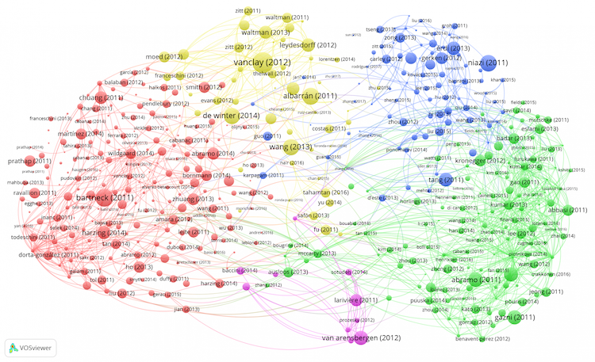
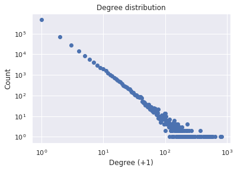
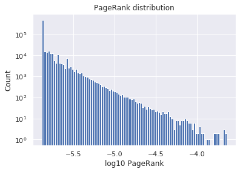

In this post, I apply Google's PageRank to evaluating academic papers from the citation network. It discovers that PageRank reflects the prestige of the paper while the citation count reflects its popularity.

## Why PageRank?
The number of citations is widely used as an index for objectively evaluating academic papers. Although the number of citations has the advantage of being easy to understand and easy to calculate, it is easily distorted by self-citation. Citation  can also be featurized by directed networks (c.f. [visualization](https://www.cwts.nl/blog?article=n-r2r294)). Could this information be used to make a more sophisticated assessment?

This problem also exists in the search engines for web sites that handle much more data (and more spam!) than papers. If the search engine's ranking solely depended on the number of directed links to the page, one can easily hack it by self-linking to his/her page from other pages. The problem has been actively studied since the World Wide Web was born and spread in the 1990s. 

In 1998, Sergey Brin and Larry Page, the founders of Google, proposed an algorithm that calculates the probability of staying on each page from a transition matrix of the directed network of web links [1]. This algorithm called PageRank made an important contribution to increasing the number of Google users at that time. In this post, I apply PageRank to evaluating academic papers objectively.

## Basic Analysis of the Citation Network
I use the citation network built from the 2010 version of the data provided by AMiner [2]. This is a dataset of computer science papers including citations. Newer and larger versions are available, but I choose the smallest version due to the limited machine resources. The basic information is as follows.

| # Nodes | # Edges | Mean citation counts (mean degree) |
| :-----: | :-----: | :--------------------------------: |
| 629,814 | 632,751 |               1.005                |

First, the distribution of the in-degree (number of citations) is shown below. It is almost linear on the log-log scale, which confirms the scale-free nature of the network.

Next, the distribution of PageRank is shown below. Similarly, it is almost linear on the log-log scale.

## The Relationship between PageRank and Citation Count
Here is a scatter plot to see the relationship between the two measures. A strong correlation with $R = 0.903$ can be seen on the log graph.

While the citation count and PageRank show a strong correlation, many points stick out to the lower right on the graph, indicating that there are many papers with many citations but low PageRank.

Here, I introduce an interesting related study on the relationship between the two measures. Bollen et al. did a similar study on journals rather than papers [3]. In their study, the impact factor (**IF**), which is the average, was used instead of the number of citations, and the Journal Weighted PageRank (**JPR**), which normalizes the edge weight for each journal, was used instead of PageRank to examine the correlation between them. The authors argued that the IF represents the journal's popularity and that the JPR reflects the journal's prestige. In fact, many review journals were included in those with high IF and low JPR.

## PageRank Reflects Prestige of the Paper
In the last part, based on the results of Bollen *et al.*, I consider *papers with many citations and low PageRank*. Here are the 10 most cited papers with a PageRank less than 3e-6:

1.  Online Learning and Teaching in Higher Education, 1 edition
2.  Distance Sensor Data Integration and Prediction
3.  On saying "Enough already!" in SQL
4.  Some basic properties of the MLE's for a multivariate normal distribution with monotone missing data
5.  Efficient decision making algorithms for adaptive applications
6.  Historical trends in computer and information technology
7.  Guest Editors' 2019 Foreword
8.  Gamma, chromatic typing and vegetation
9.  A Verification-Based Localization Method for Unstable Radio Sensor Networks in Smart Home Environments
10. Report of Working Group on Reengineering Operations

Those numbered 1 and 6 are (parts of) textbooks, which are considered close to review papers.

On the other hand, looking at the 10 papers with the fewest citations with a PageRank higher than 3e-5, many of them are relatively new papers published after 2006. It is probable that these had already been cited in important papers, but the number of citations themselves had not increased enough due to the insufficient time.

In conclusion, when PageRank is applied as an objective index of papers, the result strongly correlates with the number of citations. However, there is also a difference corresponding to the trend in the journal that *IF indicates the popularity and JPR reflects the prestige*.

The analysis was done with NetworkX. The code is [here](https://github.com/shionhonda/dblp/blob/master/main.ipynb)

## References
[1] Brin, Sergey, and Lawrence Page. "[The anatomy of a large-scale hypertextual web search engine](https://www.sciencedirect.com/science/article/abs/pii/S1389128612003611)." *Computer networks* 56.18 (2012): 3825-3833.  
[2] Tang, Jie, et al. "[Arnetminer: extraction and mining of academic social networks](https://dl.acm.org/doi/abs/10.1145/1401890.1402008)." *Proceedings of the 14th ACM SIGKDD international conference on Knowledge discovery and data mining*. 2008.  
[3] Bollen, Johan, Marko A. Rodriquez, and Herbert Van de Sompel. "[Journal status](https://link.springer.com/article/10.1007/s11192-006-0176-z)." *Scientometrics* 69.3 (2006): 669-687.