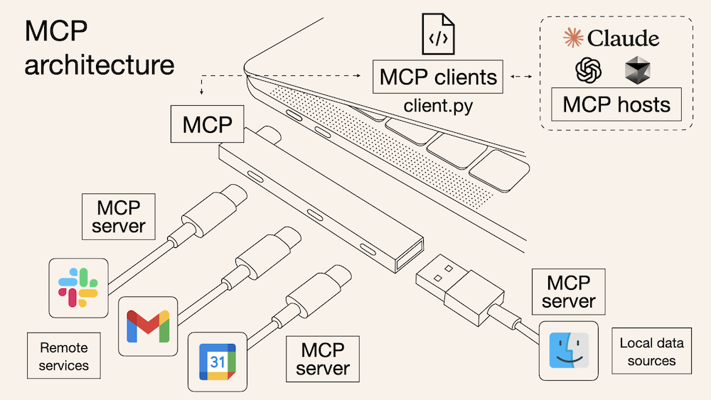

If you follow the latest news in the AI space, you've probably heard of the new acronym in town: [**MCP** (**model context protocol**)](https://modelcontextprotocol.io/introduction). This protocol allows you to extend AI assistants capabilities by connecting them to external tools and data sources.

Writing an MCP server and using it in an AI client is easy. I've recently created [mcp-gsheet](https://github.com/shionhonda/mcp-gsheet), an MCP server that allows to interact with Google Sheets, and used it in Claude Desktop.

<iframe width="560" height="315" src="https://www.youtube.com/embed/7RsRC2xTTKQ?si=a-ectcvwgaCKntnm" title="YouTube video player" frameborder="0" allow="accelerometer; autoplay; clipboard-write; encrypted-media; gyroscope; picture-in-picture; web-share" referrerpolicy="strict-origin-when-cross-origin" allowfullscreen></iframe>

In this post, I'll show you how to build your own MCP server to supercharge Claude with custom capabilities.

## What is MCP? Why Does It Matter?

I like this explanation [by Norah Sakal](https://norahsakal.com/blog/mcp-vs-api-model-context-protocol-explained/):

> Think of MCP like a USB-C port but for AI agents: it offers a uniform method for connecting AI systems to various tools and data sources.



Without MCP, you need to manually write integration code for each tool with traditional APIs and function calling. You need to write the code in your system and you can't reuse it for other systems. With MCP, you can create a server that can be reused for any AI client.

The community is growing fast, and there are already many (official and unofficial) MCP servers available. You can find examples [here](https://modelcontextprotocol.io/examples).

## How to Develop an MCP Server and Use it in Claude Desktop

Thanks to the MCP SDKs (TypeScript, Python, Java, Kotlin, and C#), creating your own MCP server is not difficult. You can find a step-by-step guide in the [MCP documentation](https://modelcontextprotocol.io/quickstart/server).

To help your AI client understand your tools, each tool should:

- Have a clear name and purpose
- Accept well-defined input parameters
- Return consistent output structures

Here's a simplified example of how I defined one of the tools in my Google Sheets server:

```python
@server.tool("read_cells")
async def read_cells(spreadsheet_id: str, range_name: str) -> list[list[str]]:
    """Reads data from the given range (e.g., 'Sheet1!A1:B5')."""
    return await gsheet_service.read_cells(spreadsheet_id, range_name)
```

Before connecting to Claude, test your server with the [MCP Inspector tool](https://modelcontextprotocol.io/docs/tools/inspector):

```bash
mcp dev server.py
```

This opens a local interface where you can test each of your tools and verify they're working correctly.

Once your server is working, you can connect it to Claude Desktop by editing the Claude Desktop configuration file:

```json
{
  "mcpServers": {
    "gsheet": {
      "command": "/path/to/python",
      "env": {
        "GOOGLE_APPLICATION_CREDENTIALS": "/path/to/your/service-account-key.json"
      },
      "args": ["--directory", "/path/to/mcp-gsheet", "run", "server.py"]
    }
  }
}
```

This tells Claude Desktop to launch your MCP server whenever it starts up.

## Conclusion

Building an MCP server allows you to dramatically expand what Claude can do for you. Whether you're connecting to cloud services, databases, or specialized tools, MCP transforms your AI client to a powerful assistant that can work directly with your digital ecosystem.

We're still in the early stages of discovering what's possible. I'm excited to see how it evolves in the future.
