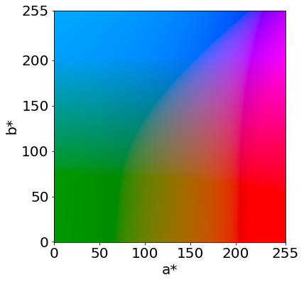

Color histograms are useful to get a sense of what a given image looks like. If you work on deep learning with PyTorch, you might sometimes want to calculate color histograms of image tensors. In this article, I will show you two ways to do it: OpenCV-based and PyTorch-based. As of August 2022, he PyTorch solution does not work on GPU.

## Setups
First of all, I summarize the setups.

In the following part, all the code was run on [Colaboratory](https://colab.research.google.com/drive/13fUfZZ2zNrvUssT_3MRlnauDY4x2v2nn?usp=sharing) with a Tesla T4 GPU.

To calculate color historgram, you should be aware of which color space you are using. It can be RGB, HSV, Lab, or anything else, but here I chose [Lab color space](https://en.wikipedia.org/wiki/CIELAB_color_space) because it was designed to be perceptually uniform. The image below visualizes the Lab color space when the perceptual lightness *L** is 127 (out of 255).



As a sample image, I used the following [image generated by DALL-E](https://labs.openai.com/s/9UwzQ3TXMxiiZEcrbnHET72I) (query I meant: "An oil painting by Mattise of cockatoos chatting over tea in Morocco").


We can create an image tensor represented in Lab color space with the following snippet:

```python
import cv2
import torch
from torchvision import transforms
from PIL import Image

from matplotlib import pyplot as plt

img = cv2.imread('sample.png')
img = cv2.cvtColor(img, cv2.COLOR_BGR2Lab)
X = torch.Tensor(img)
```

Once given a histogram algorithm, we can plot the result on the *a**-*b** plane like below:

```python
###
# Calculate color histogram here
# histr = my_histogram(X)
###

fig, ax = plt.subplots(1,1)
im = ax.imshow(histr, extent=[0, 255, 0, 255])
ax.set_xlabel("b*")
ax.set_ylabel("a*")
fig.colorbar(im)
fig.show()
```


That's it for the setups. Let's move on to the calculating color histograms!

## OpenCV
OpenCV supports the very solution. With the function `calcHist`, calculating color histogram is straightforward.

```python
histr = cv2.calcHist([X.numpy()], channels=[1, 2], mask=None, histSize=[32, 32], ranges=[0,256, 0, 256])
histr /= histr.sum() # normalize sum to 1
```

The above snippet was executed in **5.25 ms**. You can also pass a mask to the function.

## PyTorch
PyTorch supports a function for calculating multi-dimensional histogram, which has the same interface as [NumPy](https://numpy.org/doc/stable/reference/generated/numpy.histogramdd.html). You can pass an image tensor to the function `histogramdd` after flattening the spatial dimensions.

```python
histr, _ = torch.histogramdd(X[:,:,1:].view(-1, 2), bins=[32,32], range=[0,256, 0, 256])
histr /= histr.sum() # normalize sum to 1
```

The above snippet was executed in **23.1 ms**. OpenCV is superior in terms of speed, simplicity, and usefulness.

## PyTorch on GPU
Can we expect a significant speed-up for the PyTorch solution on GPU? Unfortunately, it does not work at the time of this writing because the function `torch.histogramdd` for the CUDA backend is not supported by PyTorch v1.12 (the latest). If you call the function on a GPU, it will throw a `NotImplementedError`:
<details><summary>Click to expand</summary>
NotImplementedError: Could not run 'aten::_histogramdd_bin_edges' with arguments from the 'CUDA' backend. This could be because the operator doesn't exist for this backend, or was omitted during the selective/custom build process (if using custom build). If you are a Facebook employee using PyTorch on mobile, please visit https://fburl.com/ptmfixes for possible resolutions. 'aten::_histogramdd_bin_edges' is only available for these backends: [Dense, UNKNOWN_TENSOR_TYPE_ID, QuantizedXPU, UNKNOWN_TENSOR_TYPE_ID, UNKNOWN_TENSOR_TYPE_ID, UNKNOWN_TENSOR_TYPE_ID, UNKNOWN_TENSOR_TYPE_ID, UNKNOWN_TENSOR_TYPE_ID, SparseCPU, SparseCUDA, SparseHIP, UNKNOWN_TENSOR_TYPE_ID, UNKNOWN_TENSOR_TYPE_ID, UNKNOWN_TENSOR_TYPE_ID, SparseXPU, UNKNOWN_TENSOR_TYPE_ID, SparseVE, UNKNOWN_TENSOR_TYPE_ID, UNKNOWN_TENSOR_TYPE_ID, UNKNOWN_TENSOR_TYPE_ID, UNKNOWN_TENSOR_TYPE_ID, UNKNOWN_TENSOR_TYPE_ID, NestedTensorCUDA, UNKNOWN_TENSOR_TYPE_ID, UNKNOWN_TENSOR_TYPE_ID, UNKNOWN_TENSOR_TYPE_ID, UNKNOWN_TENSOR_TYPE_ID, UNKNOWN_TENSOR_TYPE_ID, UNKNOWN_TENSOR_TYPE_ID].
</details><br/>

There are already some feature requests to implement this function for the CUDA backend ([here](https://github.com/pytorch/pytorch/issues/29209) and [here](https://github.com/pytorch/pytorch/issues/69519)). I don't know how to write CUDA codes, but if it can be extended from the GPU version of `torch.histc` function, it might not be too hard.

## References
[1] [torch.histogramdd — PyTorch 1.12 documentation](https://pytorch.org/docs/stable/generated/torch.histogramdd.html)  
[2] [torch.histc — PyTorch 1.12 documentation](https://pytorch.org/docs/stable/generated/torch.histc.html)  
[3] [ヒストグラム その1: 計算して，プロットして，解析する !!! — OpenCV-Python Tutorials 1 documentation](http://labs.eecs.tottori-u.ac.jp/sd/Member/oyamada/OpenCV/html/py_tutorials/py_imgproc/py_histograms/py_histogram_begins/py_histogram_begins.html)  
[4] [L*a*b* 色空間 | OpenCV を用いて L*a*b* 色空間を取り扱う方法](https://axa.biopapyrus.jp/ia/color-space/open-lab.html)