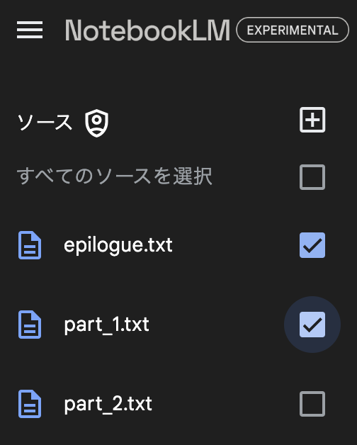

## はじめに

最近、『[罪と罰](https://amzn.to/47hptMu)』（Фёдор Михайлович Достоевский（フョードル・ミハイロヴィチ・ドストエフスキー） 著、亀山郁夫 訳、光文社、2008年）を読みました。私は普段、読書をするときは後で思い出しやすいようにメモを作っているのですが、本作のように登場人物が多く長い小説だとメモを作るのも一苦労です。そこで、今回は[米川正夫訳の青空文庫版](https://www.aozora.gr.jp/cards/000363/files/56656_74440.html)とGoogleの新サービス[NotebookLM](https://notebooklm.google.com/)を使ってあらすじをまとめてみました。

結果はなかなかの出来で、[Wikipediaの日本語版](https://ja.wikipedia.org/wiki/%E7%BD%AA%E3%81%A8%E7%BD%B0#%E3%81%82%E3%82%89%E3%81%99%E3%81%98)よりも情報量の多いあらすじを手軽に作ることができました。本記事では、その内容を作成手順とともに紹介します。

## あらすじの作成手順

本全体を一度で要約させると結果が薄くなってしまう傾向があったので、本を篇ごとに7つのテキストファイルに分けて、篇ごとに要約を生成させました。NotebookLMでは、下図のように利用するソースを選択することができます。

生成結果には下図のように参照元が表示してあり、カーソルを合わせると原文を確認することができます。

結果が気に入ったら、それを「メモ」として保存することができます。

上記手順を7つの篇に対して行えばほぼ完成ですが、このままだといくつかの問題がありました。

- あらすじを篇ごとに書かせたので、篇の間での整合性が取れていない（同じ人物を何度も紹介するなど）
- 同じ理由で、篇ごとに要約の詳しさが異なる
- トークナイザ由来の間違い（英単語や記号の挿入）

これらの点を修正するために、GPT-4にあらすじの推敲をさせました。NotebookLM上でここまで完結できると良かったのですが、軽く試した範囲ではうまくできませんでした。

ちなみに、NotebookLMが出力する言語はなぜかGoogleアカウントの言語設定を引き継いでいるようです。私が普段使っているアカウント（英語）では言語設定をどういじっても日本語にできなかったので、このあらすじを作るために日本語用アカウントを新たに作りました。

## 『罪と罰』のあらすじ

以下に出力結果をそのまま示します。当然ながらネタバレ注意です。また、間違いが含まれている点にも注意してください（本記事末尾に気付いた点を挙げました）。

### 第一篇

7月初め、サンクトペテルブルグ。主人公ロジオン・ロマノヴィッチ・ラスコーリニコフは、貧困に喘ぐ元大学生として登場します。彼は、屋根裏部屋の「戸棚」のような狭い部屋に住み、家主の老婆アリョーナ・イヴァーノヴナに借金をしていました。ラスコーリニコフは、極度の貧困と社会への怒り、未来への絶望から、一種の狂気に囚われていきます。街で偶然出会った元官吏マルメラードフとその家族の悲惨な状況を目の当たりにし、社会の不条理を痛感します。

さらに、母親からの手紙がラスコーリニコフを苦しめます。手紙には、妹のドゥーニャが裕福だが評判の悪い地主スヴィドリガイロフに言い寄られ、苦しい立場に追い込まれていること、そして家族の窮状を救うためにルージンという男との結婚を決めたことが書かれていました。ラスコーリニコフは、妹が自分と母親を養うために幸福でない結婚を犠牲にしようとしていることに苦悩し、激しい怒りと罪悪感に苛まれます。ルージンを「凡庸で計算高い男」と見なし、妹が不幸になると確信します。

こうした中、ラスコーリニコフは、「選ばれた人間」は社会の規範を超えて行動する権利を持つという考えに取り憑かれます。そして、質屋を営む老婆を殺害し、金品を奪う計画を思いつきます。彼は、偶然耳にした老婆とその妹リザヴェータの会話から、老婆が翌日の夕方には一人でいることを知ります。ラスコーリニコフは迷いながらも計画を実行に移す決意を固め、質草と偽って凶器を作るなど、周到な準備を始めます。

犯行当日、ラスコーリニコフは極度の緊張と不安に襲われますが、手紙の内容やマルメラードフ一家の窮状を思い出し、決意を固めます。そして、老婆の家を訪れ、準備した凶器で老婆を殺害します。しかし、計画は思わぬ方向に展開します。金品を探している最中に偶然帰宅したリザヴェータと鉢合わせになり、彼女も殺害してしまいます。

二人を殺害した後、ラスコーリニコフは激しい動揺と罪悪感、そして恐怖に襲われます。盗んだ金品を部屋に隠しますが、罪の意識から逃れることはできず、犯行後も混乱した精神状態で現実と妄想の狭間をさまようようになります。

### 第二篇

質屋殺害の後、ラスコーリニコフは高熱にうなされ、妄想と現実の境目が曖昧な状態に陥ります。そんな中、家主の召使いナスターシャから警察署への召喚状を受け取ります。彼はそれが殺人の件に関するものだと恐れつつ、実際は借用証書に関する告訴で呼び出されたことを知ります。警察署での冷たい扱いに屈辱を感じつつ、解放された彼は、盗んだ金品を裏庭の石の下に隠すことで証拠隠滅を図りますが、心の重荷は消えません。

再び高熱に襲われたラスコーリニコフは、現実と悪夢の間で罪の意識と恐怖に苛まれます。意識を取り戻したとき、友人のラズーミヒンが彼を看病しており、借金の問題を解決してくれていました。ラズーミヒンは、ラスコーリニコフに新しい服や靴を用意し、彼の母と妹がペテルブルグに到着したことを知らせます。

ラスコーリニコフは、ラズーミヒンの勧めで外出し、街をさまよいます。そこで、馬車に轢かれたマルメラードフを発見し、彼を家まで運びます。マルメラードフは家族に見守られながら息を引き取り、ラスコーリニコフは彼の娘ソーニャと再会します。

その後、ラスコーリニコフはラズーミヒンの部屋を訪れ、母と妹と三年ぶりに再会します。しかし、彼は再会の喜びを感じる間もなく、体調を崩して倒れ込んでしまいます。

### 第三篇

ラスコーリニコフの母プリヘーリヤと妹ドゥーニャがペテルブルグに到着し、三年ぶりに再会します。しかし、ラスコーリニコフはドゥーニャが経済的理由でルージンと結婚することを決めたと知り、激しく反対します。彼はルージンを「卑劣漢」と呼び、結婚を認めればドゥーニャとの縁を切るとまで言い放ちます。この激しい口論の末、母と妹はラズーミヒンの計らいで彼の部屋に移ることになります。ラズーミヒンはドゥーニャに魅了され、プリヘーリヤも彼の親切さに感謝します。

一方で、ラスコーリニコフは罪の意識と周囲の疑惑の目に追い詰められ、心身共に疲弊しています。ラズーミヒンはゾシーモフ医師と共に、プリヘーリヤとドゥーニャにラスコーリニコフの様子を報告します。プリヘーリヤはルージンからの手紙に困惑し、ラズーミヒンに意見を求めます。ルージンの手紙には、ラスコーリニコフが「いかがわしき生業を営む娘」に金を渡したと非難が書かれており、面会を拒否するという内容でした。

プリヘーリヤとドゥーニャはラズーミヒンと共にラスコーリニコフの下宿を訪れます。そこに、ルージンが手紙で非難したソーニャが現れ、皮肉な巡り合わせにラスコーリニコフは動揺を隠せません。その後、ラスコーリニコフはラズーミヒンに頼み、事件を担当する予審判事ポルフィーリイに会いに行きます。ポルフィーリイはラスコーリニコフが質入れした品物の詳細を語り、彼が事件に関与しているかを探ろうとします。「非凡な人間」は時に法律を犯す権利を持つという持論を展開し、ラスコーリニコフを挑発します。

ポルフィーリイとの面会後、ラスコーリニコフは彼の言動から自分への疑念を感じ取り、不安に駆られます。下宿に戻る途中、見知らぬ男に「人殺し」と呼ばれ、その言葉に恐怖と罪の意識に苛まれます。部屋で高熱にうなされる中、突然スヴィドリガイロフと名乗る男が現れます。

### 第四篇

ラスコーリニコフは、以前ドゥーニャに言い寄り、彼の家族に困難をもたらしたスヴィドリガイロフと再会します。スヴィドリガイロフは、妻マルファが急死したことを告げ、彼女が自分の借金を肩代わりしてくれたことや、彼女への複雑な感情を語ります。彼はまた、ドゥーニャがルージンと結婚すれば不幸になるとして、結婚を破談にするために1万ルーブルを提供すると申し出ます。ラスコーリニコフはこの申し出を拒否しますが、スヴィドリガイロフの後悔と償いの意図を聞かされます。

その後、ラスコーリニコフは母プリヘーリヤ、妹ドゥーニャ、友人ラズーミヒンと共にルージンとの顔合わせに臨みます。ルージンは、ラスコーリニコフの手紙に腹を立て、彼を家族から引き離そうとしますが、ドゥーニャは彼の思惑を見抜き、申し出を断ります。ルージンは激怒して去ります。

ルージンとの決裂後、ラスコーリニコフは家族に冷酷な言葉を浴びせ、彼らとの距離を置こうとします。そして、ソーニャの下宿を訪ね、彼女に「ラザロの復活」の章を読ませ、彼女の信仰心を試します。彼はソーニャに、もはや家族との関係を断ったことを告げ、共に呪われた存在として歩むことを提案します。ソーニャは彼の絶望を理解しようと努めます。

一方、スヴィドリガイロフは二人の会話を盗み聞きし、特にラスコーリニコフの言葉に何かを感じ取った様子です。

翌日、ラスコーリニコフはポルフィーリイに呼び出され、再び尋問を受けます。ポルフィーリイはラスコーリニコフを心理的に追い詰めようとし、時間稼ぎを試みます。ラスコーリニコフはポルフィーリイの疑念を感じ取りながらも、心理戦に挑みます。しかし、突如として別の男ニコライが現れ、自らが質屋殺害の真犯人だと自供します。ニコライの自供により、ラスコーリニコフに一時的な希望がもたらされます。

### 第五篇

ドゥーニャとの結婚が破談となったルージンは、怒りと屈辱から復讐を企てます。彼は、ラスコーリニコフが葬式の費用をソーニャに渡す場面を目撃し、この情報を利用しようとします。一方、マルメラードフの妻カチェリーナは、夫の法事を盛大に行おうと奮闘しますが、期待していた招待客が現れず、プライドを傷つけられます。出席した貧しい人々に尊大な態度をとったことで、場の雰囲気は悪化していきます。

そんな中、ラスコーリニコフとソーニャが法事に到着します。ソーニャはルージンが参加できないことをカチェリーナに伝え、後日訪問して金銭的援助を申し出ると話します。ルージンの申し出にカチェリーナは有頂天になり将来の夢を語りますが、アマリヤの心ない言葉で再び激昂し、口論に発展します。その時、ルージンが現れ、ソーニャを盗みの罪で告発します。彼はソーニャが隠し持っていた十ルーブリ紙幣を証拠に彼女を追い詰めます。周囲の人々はルージンに惑わされ、ソーニャを疑いますが、ラスコーリニコフだけは冷静に状況を見極めようとします。

しかし、思いがけないことにカチェリーナがルージンが落としたはずの百ルーブリ紙幣を発見し、ルージンの策略は失敗に終わり、ソーニャは濡れ衣を晴らします。この一件でカチェリーナは精神的に追い詰められ、発作を起こしてしまいます。

ラスコーリニコフはソーニャを彼女の住まいまで送り届け、自らの犯した罪を告白します。ソーニャは衝撃を受けますが、彼を見捨てずに自首を勧めますが、ラスコーリニコフは拒否します。

その後、カチェリーナが子供たちを連れて街で大道芸をさせようとする騒動が起き、ラスコーリニコフとソーニャは再び彼女のもとへ駆けつけます。しかし、カチェリーナは騒動の最中に倒れ、そのまま亡くなってしまいます。カチェリーナの死にソーニャは深い悲しみに暮れます。そんな中、ラスコーリニコフはスヴィドリガイロフから声をかけられます。「ロジオン・ロマーヌイチ、あなたに一言申し上げなけりゃならんことがあるのですが」と。

### 第六篇

カチェリーナの葬儀の後、ラスコーリニコフは精神的に不安定になり、現実と妄想の区別がつかなくなります。彼を最も苦しめているのはスヴィドリガイロフの存在です。スヴィドリガイロフはカチェリーナの葬儀費用を負担したり、子供たちの世話を引き受けたりして親切な一面を見せる一方、「重大な用件があります」とラスコーリニコフに意味深な言葉をかけ、不安を煽ります。

ラスコーリニコフは孤独から逃れられず、街をさまよう中で、ラズーミヒンが母親が病気で寝込んでいること、ドゥーニャが心配していることを伝えに訪れます。ラズーミヒンはラスコーリニコフの挙動から、彼が発狂したのではないかと疑い始めます。この会話を通じて、ラスコーリニコフは自分が殺人の嫌疑をかけられていることを確信し、一刻も早くスヴィドリガイロフに会わなければならないと感じます。

ラスコーリニコフはポルフィーリイと再び対峙します。ポルフィーリイは彼を観察し、ラスコーリニコフの性格や思想を分析した上で、ニコライではなく彼が犯人であると確信していることを伝えます。ポルフィーリイの言葉に衝撃を受けたラスコーリニコフは、自首を勧められますが、これを拒否します。

その後、ラスコーリニコフはスヴィドリガイロフを探します。彼はスヴィドリガイロフがドゥーニャに危害を加えるのではないかと疑いを強め、彼を尾行します。スヴィドリガイロフはラスコーリニコフを料理屋に招き、自分の過去やドゥーニャに対する思いを語りますが、ラスコーリニコフの疑念は深まります。二人は料理屋を出て別々の道を進みますが、ラスコーリニコフは妹の安全を優先し、尾行を断念します。

一方、ドゥーニャはスヴィドリガイロフから呼び出され、二人きりで会います。スヴィドリガイロフはドゥーニャに、ラスコーリニコフの罪を握っていると告げ、彼女を脅迫しようとしますが、彼女は拒否します。ドゥーニャは彼を拳銃で脅しますが、スヴィドリガイロフは彼女の決意を認め、解放します。

その夜、スヴィドリガイロフは街をさまよった後、宿屋に泊まり、自分の過去を振り返ります。翌朝、自殺を決意します。

ラスコーリニコフは、母親とドゥーニャに自らの罪を告白するべきか苦悩しますが、最終的にソーニャの前で全てを告白します。ソーニャは彼に自首を勧め、ラスコーリニコフは最終的に警察に出頭することを決意します。警察署に向かう途中、ソーニャを見つけ、彼女が支えてくれることを確信し、警察署でイリヤー・ペトローヴィッチに自分の罪を告白します。

### エピローグ

シベリアの刑務所で8年目の刑期を送るラスコーリニコフ。彼は、自らが犯した殺人の罪に対する後悔と、自分自身への疑問に苛まれ続けています。獄中では「旦那」と呼ばれ、他の囚人たちは彼を嘲笑しますが、ソーニャに対しては敬意を払います。

ソーニャはラスコーリニコフを追ってシベリアに移り住み、彼のために日々を捧げています。彼女はラスコーリニコフに寄り添いながら、彼の赦免のために働き、慎ましく生活を送っています。ラスコーリニコフは、ソーニャの献身的な愛に気づきつつも、罪の重さに押しつぶされそうになり、彼女を遠ざけようとします。

ある日、ラスコーリニコフは夢の中で伝染病が蔓延し、人類が滅亡する悪夢を見ます。この夢は、彼の罪と、それに伴う内面的な葛藤を象徴しているかのようです。しかし、病から回復した後、彼はソーニャの変わらぬ愛に気づき、ついに心を開きます。ソーニャの膝に泣き崩れ、彼女への愛を確信します。

ラスコーリニコフはまだ7年の刑期を残していますが、ソーニャの愛に支えられ、更生し、新しい人生の始まりを迎える決意を固めます。彼の心には、ソーニャと共に歩む未来の希望が芽生えています。

## 改善点

以上の通り、NotebookLMとGPT-4の組み合わせでかなり質の高いあらすじを作ることができました。ただし、いくつかの間違いや改善点も見受けられました。

- ラスコーリニコフとルージンの口論は第二篇でも起きていますが、あらすじから省かれています。
- 第五篇でラスコーリニコフがソーニャに罪を告白する場面は物語の中でも最も重要なうちの一つですが、かなり省かれてしまいました。特に、ラスコーリニコフの「シラミを潰しただけ」やソーニャの「あなたが汚した大地にキスをし、世界中に向かって『私は人殺しです』と言いなさい」は、後でも振り返られる重要なセリフです。
- 第六篇には2つの間違いがあります。1つ目は、ラスコーリニコフがスヴィドリガイロフの尾行を断念したのは、「深い嫌悪の情」によるものである点。2つ目は、第六篇でラスコーリニコフが罪を告白したのはソーニャではなく妹のドゥーニャであるという点です。
- エピローグに「8年目の刑期を送るラスコーリニコフ」とありますが、この時はまだ刑期8年のうちの2年目です。

このうち、2点目は篇ごとに生成させるという私の判断から来ていると思われるので、よりうまくやる方法があればお聞きしたいところです。
