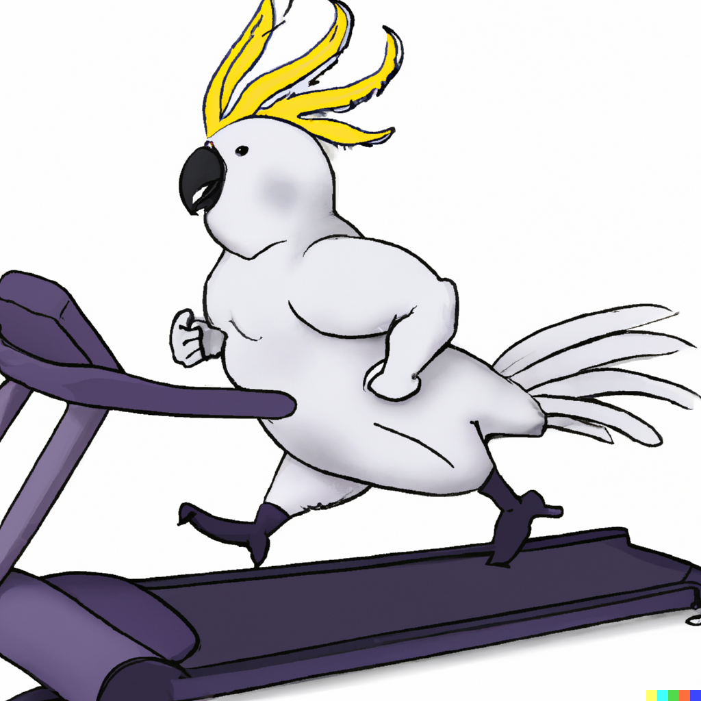
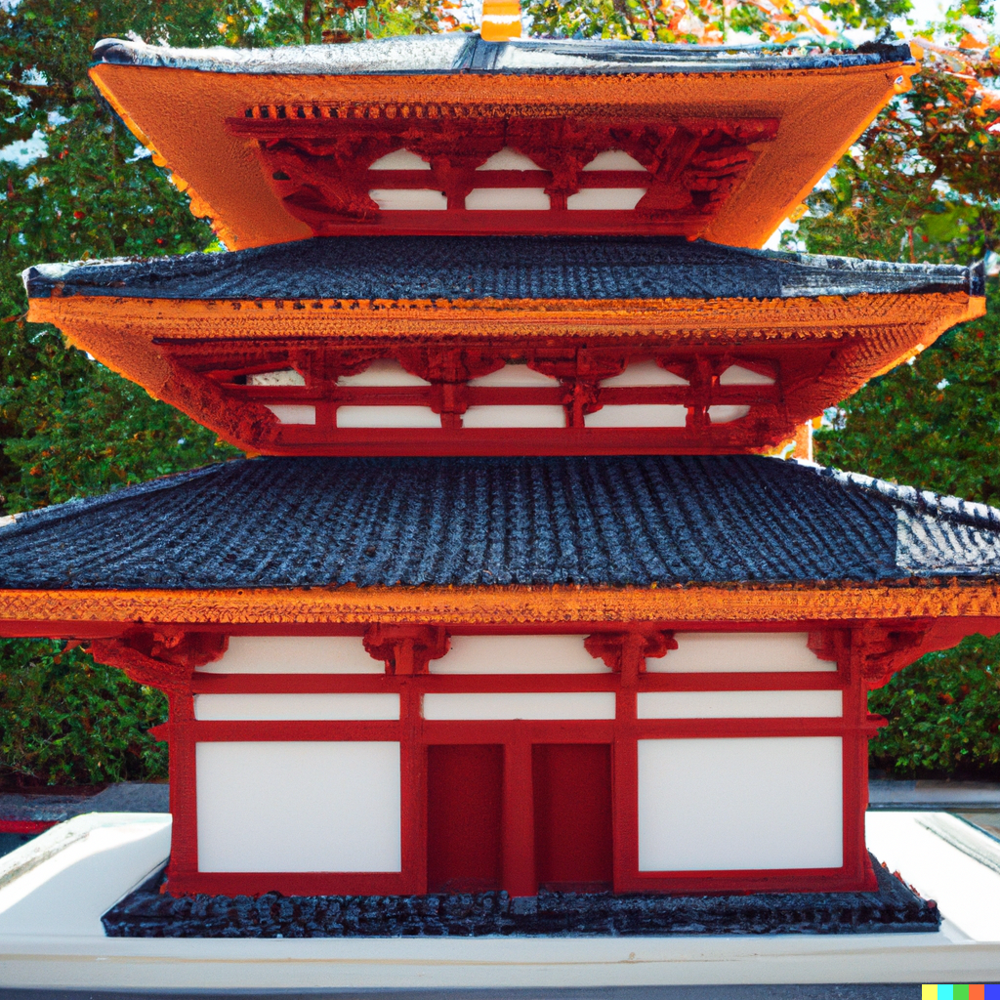
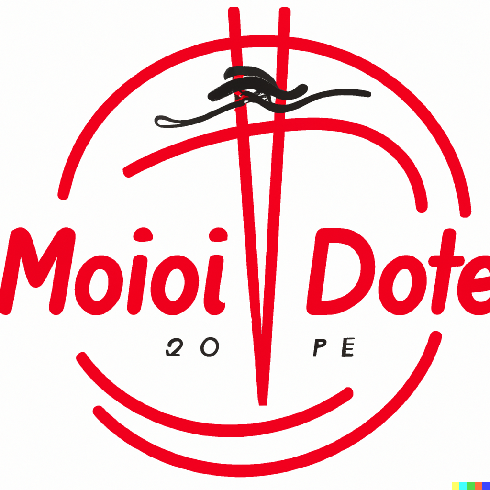

Finally I've got an invitation to [DALL･E 2](https://labs.openai.com/). Here are some of my favorite generated images.

## Macro 35mm film photography of an iguana made out of pineapples

<a href="https://labs.openai.com/s/URxpn6BeHA1jjYotS87Wkr2H">Link to labs.openai.com</a>

 

## A 3D render of an optical camouflage spacecraft landing on a desert in the style of a sci-fi film

<a href="https://labs.openai.com/s/f3b20VloHt8ZEj0o49PcYzZR">Link to labs.openai.com</a>

I thought "optical camouflage" would be a difficult word, but it was perfectly done.

## A sushi rollercoaster in the outer space, in the style of synthwave

<a href="https://labs.openai.com/s/KDLjE12SoEZY9JeEXqtYYcH9">Link to labs.openai.com</a>

 

## A close-up shot of rainbow-colored seahorse, digital art

<a href="https://labs.openai.com/s/NpHXiHh7i2J01r633frBfoDV">Link to labs.openai.com</a>

I definitely want to print this out and put it on a wall in my room.

## A persimmon fruit psychotherapist in a counseling room, 3D art

<a href="https://labs.openai.com/s/69468tGPxzBWcNaXgoJ0R10n">Link to labs.openai.com</a>

Yes, there must be an interior plant!

## A boxer dog standing and wearing traditional aikido dougi suit in a tatami dojo

<a href="https://labs.openai.com/s/IoU6l0c6oMJGzYk9AE7djyo6">Link to labs.openai.com</a>

 

## Close-up shot of a cockatiel with a red baseball cap

<a href="https://labs.openai.com/s/HXwIMz9AuMIVcSS2mG6GhPFS">CLink to labs.openai.com</a>

 

## Early drawings of R2D2 by Leonardo Da Vinci

<a href="https://labs.openai.com/s/fsrdIg7xz9PFEe2SQodNutW6">Link to labs.openai.com</a>

 

## A band of penguins in suits performing in a rose garden, album cover art

<a href="https://labs.openai.com/s/5Z1tnLlS5j0lExuf86KhNgAg">Link to labs.openai.com</a>

When I threw this query, I was thinking about [Penguin Cafe Orchestra](https://en.wikipedia.org/wiki/Penguin_Cafe_Orchestra).

## An illustration of a fat cockatoo jogging on a treadmill and sweating

<a href="https://labs.openai.com/s/tpitzpAiEUwp3hlssraE4iZa">Link to labs.openai.com</a>

 

## An Andy Warhol style painting of a dragonfly

<a href="https://labs.openai.com/s/NyWt6cFnB4jhghM0ZWMCERB3">Link to labs.openai.com</a>

 

## A kingdom of octopi under the sea, digital art

<a href="https://labs.openai.com/s/z9k6KgbopQnRkuQbXSDJEYb4">Link to labs.openai.com</a>

 

## Ziggy Stardust origami

<a href="https://labs.openai.com/s/SQCIjumCusvI0CLqtq2cOS0L">Link to labs.openai.com</a>

Can you make this?

## A marble statue of Supreme Leader octopus

<a href="https://labs.openai.com/s/vqOVh3HKlD2eYgWa7hSnTc0Q">Link to labs.openai.com</a>

 

## The Joker as a chef at a Japanese sushi restaurant

<a href="https://labs.openai.com/s/z6z8eHrPXJPGrQZglyaUL5Vl">Link to labs.openai.com</a>

 

## A vaporwave illustration of a futuristic goldfish swimming at ultra-high speed along a neon highway, a time lapse shot

<a href="https://labs.openai.com/s/xY67iLnJR0ans7z01Pt7vc39">Link to labs.openai.com</a>

I like this image, but it doesn't look like "ultra-high speed".

## A flying dragon in medieval Europe, watercolor painting. It is carrying a mid-age woman

<a href="https://labs.openai.com/s/0N2mwevXouIgrPQy2BCyl1gS">Link to labs.openai.com</a>

In most of the images generated by this query, the wings grew from the woman. Is it that difficult?

## An album cover art of a band of different insects in the style of 1970s psychedelic rock

<a href="https://labs.openai.com/s/TwmNvqQ383YwO5nnF3NQz0KI">Link to labs.openai.com</a>

 

## Gengar as a muppet character on Sesame Street

<a href="https://labs.openai.com/s/sG2Bay8NUWfzsDrGzNSRpggP">Link to labs.openai.com</a>

 

## A vending machine selling jewelry in a residential area of Japan

<a href="https://labs.openai.com/s/RJL5gHiYhk0gN0A8k0UksvRw">Link to labs.openai.com</a>

 

## A photograph of a temple in Kyoto built with LEGO blocks

<a href="https://labs.openai.com/s/VUr2zoNHE7Dsj8EXgF1VUCF4">Link to labs.openai.com</a>

 

## A logo for the most popular pho noodle chain in the world. The chain was established in Ho Chi Minh City, Vietnam in 2010

<a href="https://labs.openai.com/s/yzLSgTJizCHJjM3wNoJ1MONv">Link to labs.openai.com</a>

 

## A promotional shoot of a band of sloths

<a href="https://labs.openai.com/s/XZbzvD4U3VI3zCbyelKuV3ja">Link to labs.openai.com</a>

 

## Uber Eats delivery driver riding a camel in a desert

<a href="https://labs.openai.com/s/mcgV3HCPgUyF81TVP57JfOOJ">Link to labs.openai.com</a>

 

