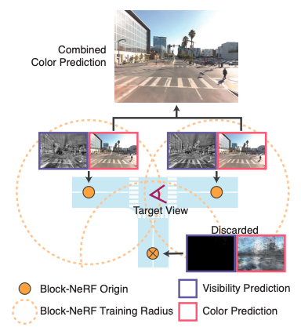
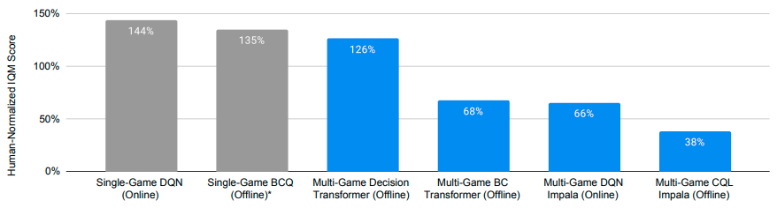
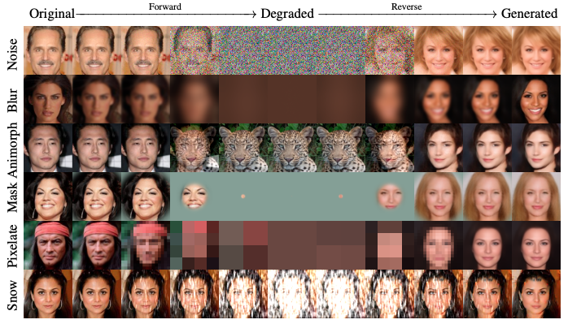

## Research Papers

### Block-NeRF: Scalable Large Scene Neural View Synthesis
- Authors: Matthew Tancik, Vincent Casser, Xinchen Yan, Sabeek Pradhan, Ben Mildenhall, Pratul P. Srinivasan, Jonathan T. Barron, Henrik Kretzschmar
- Paper: https://arxiv.org/abs/2202.05263
- Project page: https://waymo.com/research/block-nerf/
- Venue: CVPR 2022

Since **NeRF** (**neural radiance field**) was introduced in 2020, many derivative studies have been done to extend its capacity. In CVPR 2022, we saw more than 50 NeRF papers (here is [a curated list](https://dellaert.github.io/NeRF22/)).

**Block-NeRF** is a prominent one among such works. While typical NeRF variants are trained to render a single object, this method is able to render city-scale scenes. In the demo presented below, it renders the Alamo Square neighborhood of San Francisco.

<iframe width="560" height="315" src="https://www.youtube.com/embed/6lGMCAzBzOQ" title="YouTube video player" frameborder="0" allow="accelerometer; autoplay; clipboard-write; encrypted-media; gyroscope; picture-in-picture; web-share" allowfullscreen></iframe>

Rendering large scenes is a challenging task due to the varying conditions under which input photos are taken, such as different lighting, weather, and moving objects. Block-NeRF divides and conquers this problem. It splits the entire scene to multiple sub-scenes, each of which are assigned a separate Block-NeRF model. To render a scene, the models are filtered by the visibility from the viewpoint and then the model outputs are combined based on the distance from the viewpoint. This approach is preferred because it is easy to expand the scene and update a particular sub-scene.

### Multi-Game Decision Transformers
- Authors: Kuang-Huei Lee, Ofir Nachum, Mengjiao Yang, Lisa Lee, Daniel Freeman, Winnie Xu, Sergio Guadarrama, Ian Fischer, Eric Jang, Henryk Michalewski, Igor Mordatch
- Paper: https://arxiv.org/abs/2205.15241
- Project page: https://sites.google.com/view/multi-game-transformers
- Code: https://github.com/google-research/google-research/tree/master/multi_game_dt
- Blog: https://ai.googleblog.com/2022/07/training-generalist-agents-with-multi.html
- Venue: NeurIPS 2022

Last year, **Decision Transformer** (**DT**) emerged as a strong baseline in **offline reinforcement learning** (**offline RL**). Is it possible to create a generalist agent with DT, similar to how pretrained Transformers generalize to a variety of natural language tasks?

To answer this question, researchers trained DT in a multi-game setting, where 41 games out of the Atari suite are used for offline training and 5 other games are held out for evaluating performance on unseen tasks. The offline training data include non-expert experience as well as expert experience. The interface of the DT used in this study is illustrated in the figure below: 

Without finetuning, the pretrained single agent exceeds human-level performance for the 41 games seen during training, though it is still below the specialist agents trained on individual games. However, multi-game DT beats all the other generalist agents. So, *it is possible to create a generalist agent with DT*.

Moreover, the scaling behavior known in the natural language tasks, for the first time, is confirmed to hold in offline RL. In novel games, a conventional method called CQL scales negatively to the model size but DT does positively. This is an important step towards the development of foundation models for reinforcement learning.

### Scaling Laws vs Model Architectures: How does Inductive Bias Influence Scaling?
- Authors: Yi Tay, Mostafa Dehghani, Samira Abnar, Hyung Won Chung, William Fedus, Jinfeng Rao, Sharan Narang, Vinh Q. Tran, Dani Yogatama, Donald Metzler
- Paper: https://arxiv.org/abs/2207.10551

In recent years, the scaling capabilities of Transformer models have caught the attention of many researchers, leading to the development of larger and larger language models. In another line of research, many alternative architectures have been proposed in an attempt to improve the compute efficiency of the Transformer, which was first introduced in 2017.

Now it's natural to ask whether these alternative architectures scale or not. This paper aims to answer this question by comparing different model architectures, including Transformer variants and CNNs, on both upstream (language modeling) and downstream (SuperGLUE) tasks.

The results of the study are well summarized in the above figure, which can be a bit difficult to interpret. The key takeaways from the study include:
- Upstream scores do not correlate well with downstream scores
- The optimal architecture can vary depending on the scale of the model
  - Models such as ALBERT and MLP-Mixer scales even negatively
  - *On average, the vanilla Transformer demonstrates the best scaling behaviour*

### Cold Diffusion: Inverting Arbitrary Image Transforms Without Noise
- Authors: Arpit Bansal, Eitan Borgnia, Hong-Min Chu, Jie S. Li, Hamid Kazemi, Furong Huang, Micah Goldblum, Jonas Geiping, Tom Goldstein
- Paper: https://arxiv.org/abs/2208.09392
- Code: https://github.com/arpitbansal297/Cold-Diffusion-Models

Diffusion models are thought to be grounded to theories such as Langevin dynamics and variational inference, largely due to the mathematical tractability of the Gaussian noise. However, this paper poses a question to this understanding: is Gaussian noise truly necessary for diffusion models?

In experiments, the authors observed that diffusion models actually work with alternative choices of noise, even when the noise is deterministic (e.g., blur, masking etc.). This finding opens the door for the development of new generative models that are not constrained by the traditional requirement of Gaussian noise.

### Robust Speech Recognition via Large-Scale Weak Supervision
- Authors: Alec Radford, Jong Wook Kim, Tao Xu, Greg Brockman, Christine McLeavey, Ilya Sutskever
- Paper: https://arxiv.org/abs/2212.04356
- Code: https://github.com/openai/whisper
- Blog: https://openai.com/blog/whisper/

Vision and languages are not the only modals that enjoy the benefit of large Transformers and web-scale data. **Whisper** (web-scale supervised pretraining for speech recognition) is a large Transformer trained on an unprecedented amount of transcribed audio data for **automatic speeech recognition** (**ASR**). Whisper can transcribe multiple languages more robustly than any other models before and can also translate them to English.

Here, robustness matters. As shown in the figure below, previous ASR models trained on one dataset (LibriSpeech) perform much worse than expected on other datasets (Common Voice etc). Humans do not behave like this. Whisper, however, closed this gap.

How does Whisper make it possible? The first ingredient is the training data. Whisper was trained on a 680,000 hours of transcribed audio data, which was scraped from the internet. This is >10 times larger than the previous supervised models. However, collecting such a large data is not trivial because many transcripts on the internet are generated by the existing ASR systems. To avoid contamination "transcript-ese" to the training data, the researchers developed many heuristics to clean the training data.

The second thing is the pretraining scheme. Whisper was trained in a multi-task fasion. English translation, utterance prediction language identification

## Applications
### Stable Diffusion & DreamStudio
### ChatGPT
This is a third big thing besides DALLE2 and Whisper.
### YOU.com
### GT Sophy
https://www.gran-turismo.com/us/gran-turismo-sophy/

## Concluding Remarks

## References 
