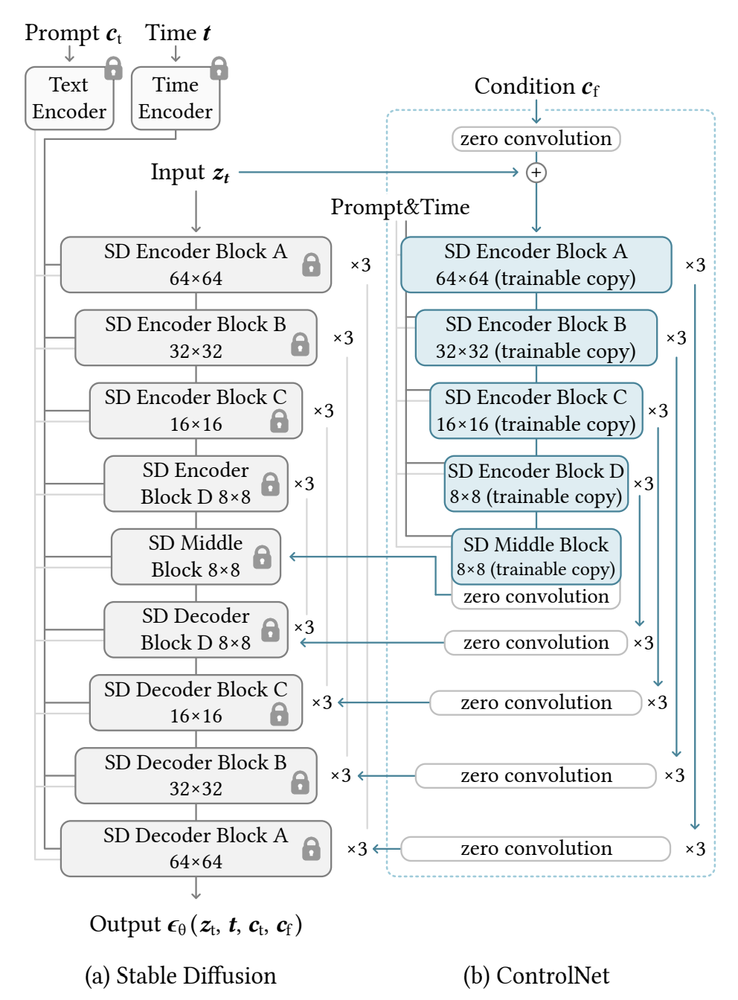
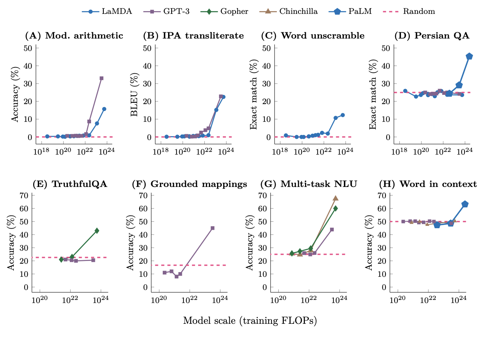
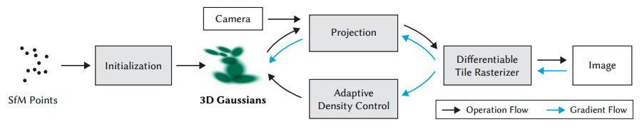
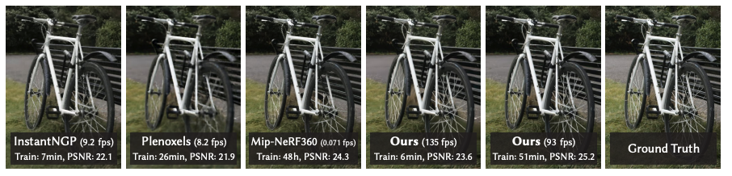
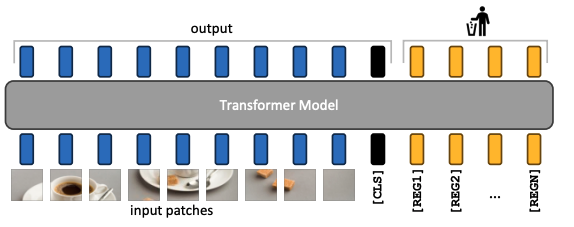
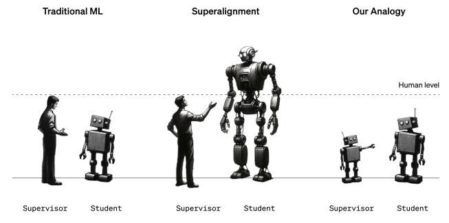

As we step into 2024, let's take a moment to look back at the significant progress made in deep learning throughout the past year. In this year-in-review post, I'll share my 10 favorite papers from 2023. I hope you enjoy it!

*If you're interested in this post, you can also check out [my review of the previous year, 2022](https://hippocampus-garden.com/deep_learning_2022/).*

## Fast Inference from Transformers via Speculative Decoding

- Authors: Yaniv Leviathan, Matan Kalman, Yossi Matias
- Paper: https://arxiv.org/abs/2211.17192
- Venue: ICML 2023

<blockquote class="twitter-tweet">
Fast Inference from Transformers via Speculative Decoding [Leviathan+, 2023, ICML] Speculative decoding allows autoregressive models to run 2-3x faster. A small model samples K tokens fast and a large model decides to accept or reject them.<a href="https://t.co/bcKEWeBxmA">https://t.co/bcKEWeBxmA</a><a href="https://twitter.com/hashtag/NowReading?src=hash&amp;ref_src=twsrc%5Etfw">#NowReading</a> <a href="https://t.co/2QtAXtjNm7">pic.twitter.com/2QtAXtjNm7</a>
&mdash; Shion Honda (@shion_honda) <a href="https://twitter.com/shion_honda/status/1747519345784148071?ref_src=twsrc%5Etfw">January 17, 2024</a></blockquote> 

In LLM-powered applications such as chat bots, it's autoregressive decoding that limits the latency of the application. If you want to generate $N$ tokens, you need to run the inference $N$ times. This is slow. What can we do to make it faster without degrading the output quality?

**Speculative decoding** is a technique that allows autoregressive models to run faster without changing the outputs. The idea is to have a smaller (faster but less performant) language model and that samples chunk of tokens fast and the larger LM examines each of them to accept or reject. In the image below, each line represents one iteration, where the smaller LM samples $\gamma$ tokens (green) and the larger one rejects (red) and makes correction (blue).

This is quite intuitive when you think that the difficulty of language modeling is not always the same. Sometimes it is very easy (what 3 tokens come after "Tokyo is the capital..."?) and sometimes it is very ambiguous (you don't know what comes after "My favorite food is..."?).

Once we have a chunk of $\gamma$ tokens ($x_{i+1}$,...,$x_{i+\gamma}$), we calculate the set of likelihoods $p(x_{i+1} | ...,x_i)$,..., $p(x_{i+\gamma} | ...,x_{i+\gamma-1})$ with ther larger LM *in parallel* (no more sequential inference from the large model!). Then we check the likelihood one by one to reject unlikely tokens. Specifically, for each token, we sample a threadshold $r$ from the uniform distribution $U[0, 1]$ and if the likelihood computed the large model ($p$) is high enough compared to the that by the small model ($q$), that is, $ p / q > r$, we accept the token and look at the next one. Otherwise, we reject the token and the following ones. This way, we can sample tokens up to 3 times faster and still ensure the same output. See the figure below to get a sense of why speculative decoding is fast.

## Adding Conditional Control to Text-to-Image Diffusion Models

- Authors: Lvmin Zhang, Anyi Rao, Maneesh Agrawala
- Paper: https://arxiv.org/abs/2302.05543
- Code: https://github.com/lllyasviel/ControlNet
- Venue: ICCV 2023

<blockquote class="twitter-tweet">
Adding Conditional Control to T2I Diffusion Models [Zhang+, 2023, ICCV] ControlNet enables T2I DMs to follow instructions in images. Freezing the pretrained weights of T2I, it passes the encoded condition to the U-net decoder via &quot;zero-convs&quot;.<a href="https://t.co/BblF7bSxS9">https://t.co/BblF7bSxS9</a><a href="https://twitter.com/hashtag/NowReading?src=hash&amp;ref_src=twsrc%5Etfw">#NowReading</a> <a href="https://t.co/vsEYP4emUh">pic.twitter.com/vsEYP4emUh</a>
&mdash; Shion Honda (@shion_honda) <a href="https://twitter.com/shion_honda/status/1723957944616996881?ref_src=twsrc%5Etfw">November 13, 2023</a></blockquote> 

As I wrote in the [last year's review](https://hippocampus-garden.com/deep_learning_2022/#stable-diffusion--dreamstudio), we saw many cool text-to-image (T2I) models in 2022. But they are not good at providing control over the spatial composition of the image because it is not easy to fully express layouts, poses, and shapes with words. Sometimes we want to pass image instructions to generate our desired outputs. For example, we might want to use edge maps, human pose skeletons, segmentation maps, and depth maps. However, there was no such model that can take any type of those image inputs and generate images based on it.

**ControlNet** enables pre-trained T2I diffusion models such as [Stable Diffusion](https://github.com/Stability-AI/stablediffusion) to follow instructions in images. Look at the figure below to see how ControleNet-powered Stable Diffusion can generate images that are loyal to the input Canny edge and human pose.

You can train ControlNet with relatively small compute. It freezes the pre-trained weight of Stable Diffusion and uses adapters in U-net decoder blocks to add information from the image condition to the generated image. Each adapter consists of trainable copies of U-net encoder blocks and convolution layers with weights initialized to zero (**zero convolution**). See the figure below for more details.

## Sigmoid Loss for Language Image Pre-Training

- Authors: Xiaohua Zhai, Basil Mustafa, Alexander Kolesnikov, Lucas Beyer
- Paper: https://arxiv.org/abs/2303.15343
- Venue: ICCV 2023

<blockquote class="twitter-tweet">
Sigmoid Loss for Language Image Pre-Training [Zhai+, 2023, ICCV] SigLip replaces CLIP&#39;s list-wise softmax loss with the pair-wise sigmoid, reducing memory consumption and improving accuracy when trained on limited batch sizes (&lt;32k).<a href="https://t.co/8FuI5w6ygH">https://t.co/8FuI5w6ygH</a><a href="https://twitter.com/hashtag/NowReading?src=hash&amp;ref_src=twsrc%5Etfw">#NowReading</a> <a href="https://t.co/a79xOUjg3m">pic.twitter.com/a79xOUjg3m</a>
&mdash; Shion Honda (@shion_honda) <a href="https://twitter.com/shion_honda/status/1743697386902270234?ref_src=twsrc%5Etfw">January 6, 2024</a></blockquote> 

[**CLIP**](https://arxiv.org/abs/2103.00020) revolutionized how we train image models by bringing the idea of contrastive learning on massive pairs of images and captions. I wrote how CLIP was innovative in [my Year in Review 2021](https://hippocampus-garden.com/research_2021/#learning-transferable-visual-models-from-natural-language-supervision). But training CLIP is not easy, even fine-tuning. Since CLIP relies on a softmax loss from all the possible pairs between images and captions available in the batch, you need to use as large batch size as possible to succeed in training. For example, [this CLIP](https://huggingface.co/laion/CLIP-ViT-bigG-14-laion2B-39B-b160k) was trained with batch size of 160k 🤯

Good news! **SigLIP** (**sigmoid loss for language-image pre-training**) saves GPU poors. The algorithm of SigLIP is as simple as this:

It basically replaces the softmax loss with a sigmoid loss, removing the need to compute global normalization factors. It introduces a new hyperparamter $b$ to learn faster from the loss dominated by many negatives, but it's not a big change.

SigLIP achieves higher accuracy in downstream tasks than its softmax counterpart when trained with smaller batch sizes. The authors also found that the performance gain diminishes when the batch size grows to ~32k.

## Segment Anything

- Authors: Alexander Kirillov, Eric Mintun, Nikhila Ravi, Hanzi Mao, Chloe Rolland, Laura Gustafson, Tete Xiao, Spencer Whitehead, Alexander C. Berg, Wan-Yen Lo, Piotr Dollár, Ross Girshick
- Paper: https://arxiv.org/abs/2304.02643
- Project page: https://segment-anything.com/
- Code: https://github.com/facebookresearch/segment-anything
- Blog: https://ai.meta.com/blog/segment-anything-foundation-model-image-segmentation/
- Venue: ICCV 2023

<blockquote class="twitter-tweet">
Segment Anything [Kirillov+, ICCV, 2023] Proposes a task to segment any object given prompts as text or region and releases a dataset and model (SAM) for that task. SAM consists of a prompt encoder, image encoder, and segment mask decoder.<a href="https://t.co/8klTPqF5Ea">https://t.co/8klTPqF5Ea</a><a href="https://twitter.com/hashtag/NowReading?src=hash&amp;ref_src=twsrc%5Etfw">#NowReading</a> <a href="https://t.co/dtjmgAlyKD">pic.twitter.com/dtjmgAlyKD</a>
&mdash; Shion Honda (@shion_honda) <a href="https://twitter.com/shion_honda/status/1722882055648714872?ref_src=twsrc%5Etfw">November 10, 2023</a></blockquote> 

[CLIP](https://arxiv.org/abs/2103.00020) was the first single model for any image-wise tasks (e.g., open-ended classification, image retrieval). Then, could there be a single model for any pixel-wise tasks (e.g., semantic segmentation, instance segmentation)? Yes. **Segment Anything Model** (**SAM**) is the first such model. This is a big deal because training pixel-wise model is a time-consuming work, requiring a lot of pixel-wise annotations. With SAM, you can do any pixel-wise task with prompting.

How does SAM work? First, the authors framed the problem as **promptable segmentation**, where the goal is to return a valid segmentation mask given any segmentation prompt. Here, a prompt can be text or an image that shows the region of interest by a bounding box, scribble, or points.

To process an image and a prompt and SAM has two encoders. The image encoder is heavyweight and outputs embeddings. 
The prompt encoders are lightweight and their embeddings are fed into the mask decoder with image embeddings. To tackle the inherent ambiguity in the prompts, the decoder outputs multiple valid masks and associated confidence scores.

For training SAM, the authors created a dataset called **SA-1B**. And for creating this dataset, they created a machine learning-based pipeline that automatically gives high-quality annotations. This is a crucial step because it's not easy to get pixel-wise annotations for 1B images. They relased the dataset SA-1B as well as the model. See the [project page](https://segment-anything.com/) for more details.

## Are Emergent Abilities of Large Language Models a Mirage?

- Authors: Rylan Schaeffer, Brando Miranda, Sanmi Koyejo
- Paper: https://arxiv.org/abs/2304.15004
- Venue: NeurIPS 2023

<blockquote class="twitter-tweet">
Are Emergent Abilities of LLMs a Mirage? [Schaeffer+, 2023] This paper counterargues that the &quot;emergent abilities&quot; of LLMs are results of adopting nonlinear metrics. One can incur or mitigate emergent behaviors by adopting a specific metric. <a href="https://t.co/7EbtApmgGw">https://t.co/7EbtApmgGw</a><a href="https://twitter.com/hashtag/NowReading?src=hash&amp;ref_src=twsrc%5Etfw">#NowReading</a> <a href="https://t.co/NLXjQENWPD">pic.twitter.com/NLXjQENWPD</a>
&mdash; Shion Honda (@shion_honda) <a href="https://twitter.com/shion_honda/status/1715610895458414878?ref_src=twsrc%5Etfw">October 21, 2023</a></blockquote> 

Let me start with a quick question: do you remember the figure below?

<small>Image taken from
<a href="https://arxiv.org/abs/2206.07682">
Emergent Abilities of Large Language Models</a>.</small>

This figure was viral in 2022 and went outside of the research community, often with exaggerating interpretations like "GPT-4 is even bigger than GPT-3. AGI is coming. The world is over".

But we know GPT-4 is not "emergent" like that. So what was wrong with the figure, or the doomssayers? If you have trained a classification model with gradient descent, you probably know how different metrics give different appearances. Your loss function (cross entropy) steadily goes down, while your accuracy stays flat for a while and then suddenly goes up. This is because the accuracy is a discrete function of model's output and to make difference in predicted category, you need to train the model until the output crosses a certain threshold.

The same thing likely happens with the figure above. Look at the vertical axes. They are accuracy, exact match, and BLEU score, all of which are discrete functions (Remember your exams. Nobody likes exact matches). The authors of "Are Emergent Abilities of Large Language Models a Mirage?" validated this hypothesis by switching metrics and showed that we can incur or mitigate "emergent behaviors" by adopting a specific metric.

## Direct Preference Optimization: Your Language Model is Secretly a Reward Model

- Authors: Rafael Rafailov, Archit Sharma, Eric Mitchell, Stefano Ermon, Christopher D. Manning, Chelsea Finn
- Paper: https://arxiv.org/abs/2305.18290
- Venue: NeurIPS 2023

<blockquote class="twitter-tweet">
Direct Preference Optimization [Rafailov+, 2023, NeurIPS] DPO allows LLM to follow instructions without RLHF, replacing the reward model with classification loss. DPO is more stable, lightweight, and effective than RLHF (tested w/ &lt;6B models).<a href="https://t.co/DQWXd1penb">https://t.co/DQWXd1penb</a><a href="https://twitter.com/hashtag/NowReading?src=hash&amp;ref_src=twsrc%5Etfw">#NowReading</a> <a href="https://t.co/BjvIgbc81S">pic.twitter.com/BjvIgbc81S</a>
&mdash; Shion Honda (@shion_honda) <a href="https://twitter.com/shion_honda/status/1738449955881205768?ref_src=twsrc%5Etfw">December 23, 2023</a></blockquote> 

One of the key ingredients of successful LLMs is **reinforcement learning from human feedback** (**RLHF**). It allows LLMs to align with human values by learning from a reward model that simulates human preferences. However, RLHF is complex, unstable, and computationally expensive. This has been a significant barrier to the LLM alignment.

**Direct preference optimization** (**DPO**) is a new fine-tuning method that allows LLMs to align with human preferences without reinforcement learning. The authors derived an optimal policy satisfying human preferences in a closed form, allowing DPO to rely on a simple classification loss instead of the reward model. This makes DPO more stable, lightweight, and computationally efficient than RLHF.

DPO works not only in theory but also in practice. Being tested up to 6B parameter models, it has better trade-off between reward and discrepancy from the original policy (left panel in the figure below. RLHF is labeled as "PPO"). Furthermore, DPO was adopted to train the successful [Mixtral 8x7B](https://arxiv.org/abs/2401.04088) model.

## 3D Gaussian Splatting for Real-Time Radiance Field Rendering

- Authors: Bernhard Kerbl, Georgios Kopanas, Thomas Leimkühler, George Drettakis
- Paper: https://arxiv.org/abs/2308.04079
- Project page: https://repo-sam.inria.fr/fungraph/3d-gaussian-splatting/
- Code: https://github.com/graphdeco-inria/gaussian-splatting
- Venue: SIGGRAPH 2023

<blockquote class="twitter-tweet">
3D Gaussian Splatting [Kerbl+, 2023, SIGGRAPH] This paper proposes to represent a scene with 3D Gaussians and find its parameters by minimizing the error between rasterized images and GT. It allows real-time rendering with less training time.<a href="https://t.co/3KT08nlKBV">https://t.co/3KT08nlKBV</a><a href="https://twitter.com/hashtag/NowReading?src=hash&amp;ref_src=twsrc%5Etfw">#NowReading</a> <a href="https://t.co/OJsQUfNzMv">pic.twitter.com/OJsQUfNzMv</a>
&mdash; Shion Honda (@shion_honda) <a href="https://twitter.com/shion_honda/status/1717063373232202023?ref_src=twsrc%5Etfw">October 25, 2023</a></blockquote> 

When it comes to 3D scene reconstruction and rendering, **neural radiance field** (**NeRF**) methods have been the state-of-the-art. Since its debut in 2020, NeRF has been drawing more and more attention. I chose Block-NeRF as one of the [most exciting papers in 2022](https://hippocampus-garden.com/deep_learning_2022/#block-nerf-scalable-large-scene-neural-view-synthesis).

But in 2023, we saw a new method called **3D Gaussian Splatting**. As its name suggests, it represents a scene with a set of 3D Gaussians. It first initializes Gaussians from the sparse Structure-from-Motion (SfM) point cloud and then iteratively optimizes its parameters (shape and density) by minimizing the error between rasterized images and the ground truth.

3D Gaussian Splatting allows real-time rendering (>30 FPS) with the highest quality while maintaining competitive training times. The figure below tells a sense of its speriority, but you can also check out the [project page](https://repo-sam.inria.fr/fungraph/3d-gaussian-splatting/) for more visualizations.

## Vision Transformers Need Registers

- Authors: Timothée Darcet, Maxime Oquab, Julien Mairal, Piotr Bojanowski
- Paper: https://arxiv.org/abs/2309.16588
- Venue: ICLR 2024

<blockquote class="twitter-tweet">
Vision Transformers Need Registers [Darcez+, 2023] ViTs tend to generate high-norm tokens in the background when exceeding certain size and training steps. Adding [REG] tokens reduces the artifacts and improves accuracy for pixel-level tasks.<a href="https://t.co/nP2WtVvysw">https://t.co/nP2WtVvysw</a><a href="https://twitter.com/hashtag/NowReading?src=hash&amp;ref_src=twsrc%5Etfw">#NowReading</a> <a href="https://t.co/U7bwLVYIQZ">pic.twitter.com/U7bwLVYIQZ</a>
&mdash; Shion Honda (@shion_honda) <a href="https://twitter.com/shion_honda/status/1721424323209027619?ref_src=twsrc%5Etfw">November 6, 2023</a></blockquote> 

Did you know that pretrained Vision Transformers have artifacts in their attention maps? The figure below shows that ViTs trained with different strategies (lable supervision for DeiT, text supervision for CLIP, and self-supervision for DINO) have similar artifacts in the background.

The authors of this paper identified this phenomenon and found that it is caused by the high-norm tokens in the background. They also found that these tokens tend to appear when the model exceeds a certain size and training steps and that they hold global information rather than local information. These observations inspired them to propose a simple solution: adding register tokens [REG] to the input sequence.

This solution indeed works for different ViTs and the repository of [**DINOv2**](https://github.com/facebookresearch/dinov2) already adopted it.

## Open X-Embodiment: Robotic Learning Datasets and RT-X Models

- Authors: Open X-Embodiment Collaboration
- Paper: https://arxiv.org/abs/2310.08864
- Project page: https://robotics-transformer-x.github.io/
- Code: https://github.com/google-deepmind/open_x_embodiment
- Blog: https://www.deepmind.com/blog/scaling-up-learning-across-many-different-robot-types
- Venue: CoRL 2023 Workshop

<blockquote class="twitter-tweet">
Robotic Learning Datasets and RT-X Models[Padalkar+, 2023] Open X-Embodiment is an initiative to train a policy generalizable to different robots. It publishes a dataset collected from 22 robots and trained vision-language-action models. <a href="https://t.co/FggiOTTz9E">https://t.co/FggiOTTz9E</a><a href="https://twitter.com/hashtag/NowReading?src=hash&amp;ref_src=twsrc%5Etfw">#NowReading</a> <a href="https://t.co/2Wwl5YNd5Q">pic.twitter.com/2Wwl5YNd5Q</a>
&mdash; Shion Honda (@shion_honda) <a href="https://twitter.com/shion_honda/status/1726853878690590902?ref_src=twsrc%5Etfw">November 21, 2023</a></blockquote> 

**Foundation models** changed the way we train and use machine learning models in the domains from natural language processing to computer vision. Today, we rarely train models from scratch and instead, we rely on zero-shot prediction by large and powerful models. However, their power is limited in the physical world because we don't have such models in robotics yet.

**Open X-Embodiment** is an initiative to train a foundation model for robotics, which is generalizable to different robots. They assembled a dataset from 22 different robots in standardized format and made it available to the public. They also trained vision-language-action models and released them. This is just the beginning of the long journey, but I'm already impressed by the scale of the collaborative project.

## Weak-to-Strong Generalization: Eliciting Strong Capabilities With Weak Supervision

- Authors: Collin Burns, Pavel Izmailov, Jan Hendrik Kirchner, Bowen Baker, Leo Gao, Leopold Aschenbrenner, Yining Chen, Adrien Ecoffet, Manas Joglekar, Jan Leike, Ilya Sutskever, Jeff Wu
- Paper: https://arxiv.org/abs/2312.09390

<blockquote class="twitter-tweet">
Weak-to-strong Generalization [Burns+, 2023] This paper presents superalignement: a new research direction to align super-human AIs. They studied its analogy, training GPT-4 with labels from smaller models in NLP/chess/reward modeling.<a href="https://t.co/fhtum2Iu1N">https://t.co/fhtum2Iu1N</a><a href="https://twitter.com/hashtag/NowReading?src=hash&amp;ref_src=twsrc%5Etfw">#NowReading</a> <a href="https://t.co/Hqc1sJSkEE">pic.twitter.com/Hqc1sJSkEE</a>
&mdash; Shion Honda (@shion_honda) <a href="https://twitter.com/shion_honda/status/1736334549276078297?ref_src=twsrc%5Etfw">December 17, 2023</a></blockquote> 

OpenAI not only do their research towards super-human intelligence but also already started studying how to align super-human intelligence. This paper from OpenAI presents **superalignment**, a new research direction to align super-human AIs. Since we don't have super-human intelligence yet, they studied its analogy, training GPT-4 with labels from smaller models in tasks such as NLP, chess, and reward modeling.

When naively fine-tuned with labels from weak models, GPT-4 consistently outperforms the weak models. The authors call this phenomenon **weak-to-strong generalization**. However, that naive fine-tuning performs far worse than fine-tuning from ground truth labels. This gap can be mitigated by using an auxiliary confidence loss.

These results have interesting implications for superalignment, but at the same time, they are preliminary and come with limitations. For example, the pretraining data of GPT-4 contains supervision from humans, which makes it unfairly easy to elicit its strong capabilities. Super-human intelligence may not be trained on such data and thus may not be as easy to be aligned as GPT-4.

## Concluding Remarks

As we look back on the advancements in deep learning in 2023, it's clear that the field continues to evolve at a rapid pace. From the exploration of Vision Transformers and their artifacts to the development of superalignment for super-human AIs, the year was filled with groundbreaking research and applications. As we move forward, it's exciting to think about what 2024 will bring. Until next time!