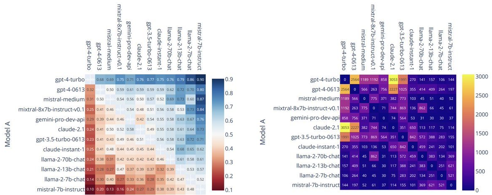
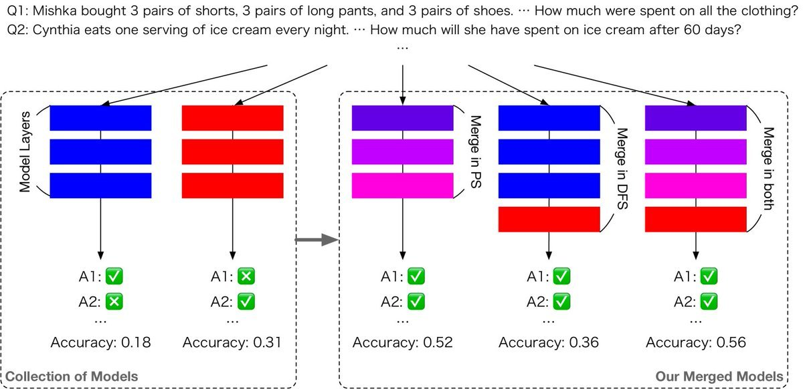
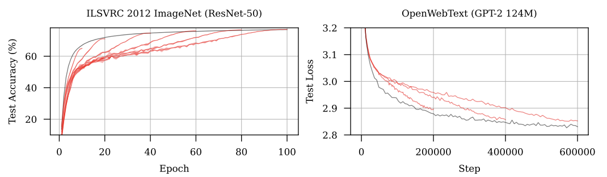
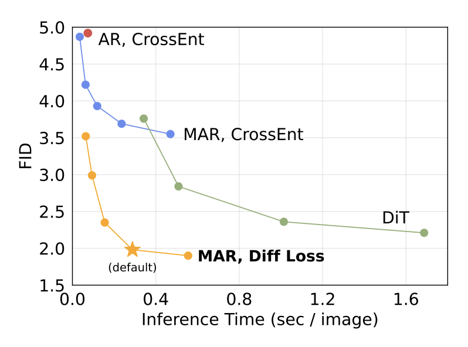
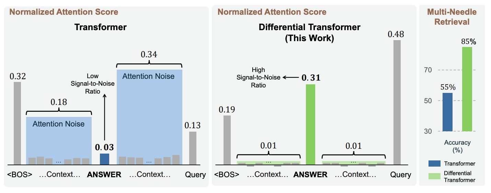

As we move into 2025, it's a good time to look back at the progress made in deep learning during the past year. In 2024, there were many notable advancements. Generative models became more sophisticated, faster, and capable of handling multiple modalities. There were also numerous innovative applications of large language models (LLMs). In fact, this blog post was written using ChatGPT's new Canvas feature.

In this year-in-review, I will share my 10 favorite research papers from 2024, highlighting the innovations and insights that shaped the field. Here is a list of the papers I will cover:

- [Mamba: Linear-Time Sequence Modeling with Selective State Spaces](#mamba-linear-time-sequence-modeling-with-selective-state-spaces)
- [Chatbot Arena: An Open Platform for Evaluating LLMs by Human Preference](#chatbot-arena-an-open-platform-for-evaluating-llms-by-human-preference)
- [Quiet-STaR: Language Models Can Teach Themselves to Think Before Speaking](#quiet-star-language-models-can-teach-themselves-to-think-before-speaking)
- [Evolutionary Optimization of Model Merging Recipes](#evolutionary-optimization-of-model-merging-recipes)
- [The Road Less Scheduled](#the-road-less-scheduled)
- [Autoregressive Image Generation without Vector Quantization](#autoregressive-image-generation-without-vector-quantization)
- [The Llama 3 Herd of Models](#the-llama-3-herd-of-models)
- [The AI Scientist: Towards Fully Automated Open-Ended Scientific Discovery](#the-ai-scientist-towards-fully-automated-open-ended-scientific-discovery)
- [Differential Transformer](#differential-transformer)
- [Large Concept Models: Language Modeling in a Sentence Representation Space](#large-concept-models-language-modeling-in-a-sentence-representation-space)

*If you're interested, you can also check out [my review of the previous year, 2023](https://hippocampus-garden.com/deep_learning_2023/).*

## Mamba: Linear-Time Sequence Modeling with Selective State Spaces

- Authors: Albert Gu, Tri Dao
- Paper: https://openreview.net/forum?id=tEYskw1VY2
- Code: https://github.com/state-spaces/mamba
- Venue: COLM 2024

<blockquote class="twitter-tweet">
Linear-Time Sequence Modeling with Selective State Spaces [Gu+, 2023] Mamba is a selective SSM capable of input-based reasoning. It enjoys fast inference thanks to its parallel algorithm. Mamba-3B matches 7B Transformer LMs in downstream tasks.<a href="https://t.co/te5W4fIWfx">https://t.co/te5W4fIWfx</a><a href="https://twitter.com/hashtag/NowReading?src=hash&amp;ref_src=twsrc%5Etfw">#NowReading</a> <a href="https://t.co/xbfFij9w2s">pic.twitter.com/xbfFij9w2s</a>
&mdash; Shion Honda (@shion_honda) <a href="https://twitter.com/shion_honda/status/1768402361410601056?ref_src=twsrc%5Etfw">March 14, 2024</a></blockquote> 

Transformers dominate most state-of-the-art LLMs but struggle with the quadratic complexity of attention layers. Despite efforts to replace them, no alternative had succeeded—until **Mamba**. This model, based on **state space models** (**SSMs**), operates without attention mechanisms, enabling efficient handling of long-context inputs with linear-time inference.

Traditional SSMs, however, cannot perform dynamic in-context learning. To address this limitation, Mamba introduces a key innovation by modifying the conventional SSM architecture, allowing certain parameters to adapt dynamically based on the input. Specifically, matrices governing how new inputs influence the hidden state and how the hidden state generates outputs are made context-sensitive. This is called **selective SSM**. This design enables Mamba to selectively propagate or forget information, focusing on the most relevant data at each step and filtering out extraneous details.

Further enhancing its capabilities, Mamba incorporates a hardware-aware algorithm co-authored by Tri Dao, one of the minds behind [FlashAttention](https://arxiv.org/abs/2205.14135). This algorithm exploits GPU capabilities through parallel scanning, enabling fast training. Impressively, Mamba-3B rivals 7B Transformer models in downstream task performance. I’m curious to see the capabilities of larger Mamba models!

For readers interested in exploring Mamba and SSMs, [a follow-up paper from the same authors](https://arxiv.org/abs/2405.21060) was published at ICML 2024. Additionally, [this introductory reading](https://jackcook.com/2024/02/23/mamba.html) provides an excellent primer on the subject.

By the way, [COLM](https://colmweb.org/) (conference on language modeling) is a new international conference in this field. Sounds like an exciting conference!

## Chatbot Arena: An Open Platform for Evaluating LLMs by Human Preference

- Authors: Wei-Lin Chiang, Lianmin Zheng, Ying Sheng, Anastasios Nikolas Angelopoulos, Tianle Li, Dacheng Li, Hao Zhang, Banghua Zhu, Michael Jordan, Joseph E. Gonzalez, Ion Stoica
- Paper: https://arxiv.org/abs/2403.04132
- Code: https://github.com/lm-sys/FastChat
- Project page: https://lmarena.ai/
- Blog post: https://lmsys.org/blog/2023-05-03-arena/

<blockquote class="twitter-tweet">
Open Platform for Evaluating LLMs by Human Preference [Chiang+, 2024] Chatbot Arena is an open platform for evaluating LLMs in a pair-wise manner. This paper discusses the comparison against static benchmarks and expert evaluations.<a href="https://t.co/XICyBrlqW1">https://t.co/XICyBrlqW1</a><a href="https://twitter.com/hashtag/NowReading?src=hash&amp;ref_src=twsrc%5Etfw">#NowReading</a> <a href="https://t.co/pMlkVquuSL">pic.twitter.com/pMlkVquuSL</a>
&mdash; Shion Honda (@shion_honda) <a href="https://twitter.com/shion_honda/status/1766779036485705788?ref_src=twsrc%5Etfw">March 10, 2024</a></blockquote> 

**Chatbot Arena** is a public platform for comparing LLMs, gaining trust from the community. In Chatbot Arena, the outputs of various LLMs are evaluated in a pairwise manner and ranked by a scalar signal. From the perspective of an LLM, this platform acts as an arena where models compete in their ability to converse, with humans serving as judges. LMSYS, the maintainers, uses the voting results to calculate pseudo[^1] "Elo ratings," a comparative ranking system, and maintains a leaderboard to display the results.

The paper discusses how Chatbot Arena compares with static benchmarks and aligns with expert assessments. It’s a must-read for those interested in benchmarking LLMs.

For more insights, check out [my article](https://medium.com/alan/benchmarking-large-language-models-1e1ab5b809ac) comparing different LLM benchmarks, including Chatbot Arena.

## Quiet-STaR: Language Models Can Teach Themselves to Think Before Speaking

- Authors: Eric Zelikman, Georges Harik, Yijia Shao, Varuna Jayasiri, Nick Haber, Noah D. Goodman
- Paper: https://openreview.net/forum?id=oRXPiSOGH9
- Venue: COLM 2024

<blockquote class="twitter-tweet">
LMs Can Teach Themselves to Think Before Speaking [Zelikman+, 2024] Quiet-STaR, a generalization of STaR, samples rationales at each token generation in parallel and reinforces ones that contributed to the correct next token prediction.<a href="https://t.co/oJ1WiMsGry">https://t.co/oJ1WiMsGry</a><a href="https://twitter.com/hashtag/NowReading?src=hash&amp;ref_src=twsrc%5Etfw">#NowReading</a> <a href="https://t.co/c1GUQGVld6">pic.twitter.com/c1GUQGVld6</a>
&mdash; Shion Honda (@shion_honda) <a href="https://twitter.com/shion_honda/status/1837852790531539194?ref_src=twsrc%5Etfw">September 22, 2024</a></blockquote> 

Conventional LLMs primarily predict the next word based on patterns, which can hardly be considered genuine "thinking." Prompting techniques like **chain-of-thoughts** (**CoT**) attempt to address this shortcoming by embedding reasoning into those patterns, but they do not provide a fundamental solution. This has led to research focused on equipping LLMs with reasoning capabilities.

**Self-Taught Reasoner** (**STaR**) framework is one of those efforts. STaR creates large-scale datasets of CoT samples using limited input-output data and a small number of CoT examples. It strengthens reasoning capabilities by fine-tuning the LLM using only the CoTs that lead to correct answers, iteratively improving the model's reasoning ability.

Building upon the STaR framework, **Quiet-STaR** enhances the reasoning capability by sampling internal thoughts in parallel at each token and rewarding those contributing to correct answers through reinforcement learning. This continuous internal reasoning mechanism  improves the model’s ability to navigate complex or unpredictable text segments.

The technical details of OpenAI's o1 remain undisclosed, but Quiet-STaR is said to be one of the foundational technologies behind it. Additionally, papers such as [Marco-o1](https://arxiv.org/abs/2411.14405) have emerged attempting to replicate o1. However, there are opinions suggesting that o1 is a simple autoregressive model that does not rely on MCTS, leaving it unclear how closely Marco-o1's methodology aligns with o1. [DeepSeek's r1 model](https://api-docs.deepseek.com/news/news1120) also showcases impressive benchmark results.

## Evolutionary Optimization of Model Merging Recipes

- Authors: Takuya Akiba, Makoto Shing, Yujin Tang, Qi Sun, David Ha
- Paper: https://arxiv.org/abs/2403.13187v1
- Project page: https://github.com/SakanaAI/evolutionary-model-merge
- Blog post: https://sakana.ai/evolutionary-model-merge/

<blockquote class="twitter-tweet">
Evolutionary Optimization of Model Merging Recipes [Akiba+, 2024] Evolutionary Model Merge searches for the optimal combination for merging NNs at the level of weights and layers with EA. It can enhance performance by merging specialized LLMs.<a href="https://t.co/mOQZMoaVbs">https://t.co/mOQZMoaVbs</a><a href="https://twitter.com/hashtag/NowReading?src=hash&amp;ref_src=twsrc%5Etfw">#NowReading</a> <a href="https://t.co/3fgm0bLhk4">pic.twitter.com/3fgm0bLhk4</a>
&mdash; Shion Honda (@shion_honda) <a href="https://twitter.com/shion_honda/status/1771078974690451676?ref_src=twsrc%5Etfw">March 22, 2024</a></blockquote> 

Have you heard of **model merging**? Model merging is a technique that creates a new model combining features of multiple source models by extracting and recombining layers or taking weighted averages of their parameters. While this might sound like black magic, the operation of averaging weights has long been recognized as a form of **ensembling**. Combining layers is less common, but discarding some layers is a known operation called **layer skipping**.

Since many image generation models and LLMs have become widely available on platforms like Hugging Face, a trend has emerged among researchers and hobbiests to use model merging to create customized models. This approach has led to the birth of numerous derivative models. The advantage of model merging is that it requires minimal resources, making it accessible to individuals without GPU clusters. However, the downside is the lack of established principles for success. It’s often done by trial and error due to a lack of clear principles.

To address this challenge, the paper proposes **evolutionary model merge**, a method that explores the space of model merging using evolutionary algorithms. This approach has successfully merged an English VLM (LLaVa-1.6-Mistral-7B) with a Japanese LLM (Shisa Gamma 7B v1) to create a Japanese VLM.

This is the first paper from [Sakana AI](https://sakana.ai/), an AI startup which describes itself as a "GPU-poor company." It's impressive how they distinguish themselves from GPU-rich companies and achieve significant scientific advancements.

## The Road Less Scheduled

- Authors: Aaron Defazio, Xingyu Alice Yang, Harsh Mehta, Konstantin Mishchenko, Ahmed Khaled, Ashok Cutkosky
- Paper: https://openreview.net/forum?id=0XeNkkENuI
- Code: https://github.com/facebookresearch/schedule_free
- Venue: NeurIPS 2024

<blockquote class="twitter-tweet">
The Road Less Scheduled [Defazio+, 2024, NeurIPS] Schedule-Free achieves Pareto-optimal loss curves without any LR scheduling. The theory behind it unifies iterate averaging and scheduling, taking the best of both worlds (theory vs practice).<a href="https://t.co/YHHme56ZQ5">https://t.co/YHHme56ZQ5</a><a href="https://twitter.com/hashtag/NowReading?src=hash&amp;ref_src=twsrc%5Etfw">#NowReading</a> <a href="https://t.co/5cocZbjxlo">pic.twitter.com/5cocZbjxlo</a>
&mdash; Shion Honda (@shion_honda) <a href="https://twitter.com/shion_honda/status/1870930682274615420?ref_src=twsrc%5Etfw">December 22, 2024</a></blockquote> 

Adam (or AdamW) with a **cosine learning rate schedule** is considered the industry-standard optimizer, but the inclusion of learning rate schedules introduces additional hyperparameters, such as maximum steps. 

**Iterative averaging** on a sequence of parameters doesn't require such hyperparameters. Theoretically, **Polyak-Ruppert** (**PR**) **averaging** guarantees good convergence rates, yet it often fails in practical machine learning applications. This led the authors to ask: "Are there iterate averaging methods that can match the empirical performance of learning rate schedules without compromising theoretical guarantees?"

To bridge the gap between theory and practice, the authors proposed an optimizer approach called **Schedule-Free**, which unifies iterate averaging with learning rate scheduling. This approach achieves the same worst-case convergence rate as PR averaging while also demonstrating strong empirical performance. Examples of this optimizer include Schedule-Free Adam and Schedule-Free SGD. Through extensive experiments, the Schedule-Free method achieved Pareto-optimal loss curves without the need for learning rate scheduling.

<small>Left: Schedule-Free SGD; Right: Schedule-Free AdamW</small>

The theory behind Schedule-Free successfully combines the strengths of iterate averaging (which has strong theoretical guarantees) and learning rate scheduling (which has empirical effectiveness), taking the best of both worlds. While optimizer research often struggles to find practical applications outside academic papers (explaining why Adam, developed in 2014, remains widely used), this paper offers significant promise for real-world adoption.

## Autoregressive Image Generation without Vector Quantization

- Authors: Tianhong Li, Yonglong Tian, He Li, Mingyang Deng, Kaiming He
- Paper: https://arxiv.org/abs/2406.11838v1
- Code: https://github.com/LTH14/mar

<blockquote class="twitter-tweet">
Autoregressive Image Generation without Vector Quantization [Li+, 2024] This paper proposes an AR model that generates a latent and transforms it into a continuous image token using diffusion, eliminating VQ and improving speed and quality.<a href="https://t.co/0qIezz2uRL">https://t.co/0qIezz2uRL</a><a href="https://twitter.com/hashtag/NowReading?src=hash&amp;ref_src=twsrc%5Etfw">#NowReading</a> <a href="https://t.co/lGmo2dMDNj">pic.twitter.com/lGmo2dMDNj</a>
&mdash; Shion Honda (@shion_honda) <a href="https://twitter.com/shion_honda/status/1815628625716130077?ref_src=twsrc%5Etfw">July 23, 2024</a></blockquote> 

**Autoregressive image generation models** typically use **vector quantization** (**VQ**) to represent images as discrete token sequences. This paper poses a question to this premise and introduces a novel approach to autoregressive image generation that eliminates the need for VQ.

The alternative  model proposed in this paper generates latent representations, which are converted into continuous image tokens using a **diffusion model**. This method introduces flexibility in attention directions, generation order, and token count. This allows the model to determin easy tokens first, resulting in improved speed and quality.

Extensive experiments demonstrate that this method achieves lower FID scores than conventional autoregressive models, showing robustness against errors in discrete representations. Additionally, the generation process is faster in its early stages compared to diffusion models that process all tokens at once.

## The Llama 3 Herd of Models

- Authors: Llama Team
- Paper: https://arxiv.org/abs/2407.21783
- Project page: https://www.llama.com/

<blockquote class="twitter-tweet">
Llama 3 [Llama Team, 2024] Llama 3 405B is the largest open LLM that was trained on 15T tokens (50x FLOPs than Llama 2) and matches the performance of GPT-4. It can handle other modalities (vision &amp; audio) by extending the model with adapters.<a href="https://t.co/DOBYp0zVoX">https://t.co/DOBYp0zVoX</a><a href="https://twitter.com/hashtag/NowReading?src=hash&amp;ref_src=twsrc%5Etfw">#NowReading</a> <a href="https://t.co/8LYmDrYOQ9">pic.twitter.com/8LYmDrYOQ9</a>
&mdash; Shion Honda (@shion_honda) <a href="https://twitter.com/shion_honda/status/1822570646678724716?ref_src=twsrc%5Etfw">August 11, 2024</a></blockquote> 

In July 2024, Meta released the largest open LLM to date, **Llama 3** with 405 billion parameters. Trained on 15 trillion tokens—requiring 50 times the FLOPs of Llama 2—it matches GPT-4 in performance, significantly narrowing the gap between open and closed models. Meta has since updated the model to Llama 3.3, with major updates such as Llama 3.2 introducing adapters for handling multimodal inputs such as vision and audio.

A standout feature of this project is its openness. While Meta did not disclose the data sources or training code, they shared the training recipe and published the model weights, which is quite rare in today's large-scale AI research. The disclosed details encompass data curation, the iterative training process, infrastructure setup, evaluation design, and even team organization. This contribution to the research community is enormous. These insights are invaluable, even for practitioners who do not train LLMs from scratch. For more information, you can refer to [my detailed article](https://medium.com/alan/llama-3-takeaways-for-llm-practitioners-209c50e3892f).

Today, the closed models are one step ahead again with the release of o1, a model with reinforced reasoning capability. I believe Meta will catch up with them in 2025 and democratize AI again.

## The AI Scientist: Towards Fully Automated Open-Ended Scientific Discovery

- Autors: Chris Lu, Cong Lu, Robert Tjarko Lange, Jakob Foerster, Jeff Clune, David Ha
- Paper: https://arxiv.org/abs/2408.06292
- Code: https://github.com/SakanaAI/AI-Scientist
- Blog post: https://sakana.ai/ai-scientist/

<blockquote class="twitter-tweet">
The AI Scientist [Lu+, 2024]  This paper shows that an LLM, provided with a topic, baseline code, Sem. Scholar, and GPUs, can autonomously generate novel papers (&quot;weak accept&quot; at best) through idea exploration, experiments, writing &amp; revision.<a href="https://t.co/nWruuaj2qh">https://t.co/nWruuaj2qh</a><a href="https://twitter.com/hashtag/NowReading?src=hash&amp;ref_src=twsrc%5Etfw">#NowReading</a> <a href="https://t.co/sLwxbEeyDJ">pic.twitter.com/sLwxbEeyDJ</a>
&mdash; Shion Honda (@shion_honda) <a href="https://twitter.com/shion_honda/status/1824011777908101280?ref_src=twsrc%5Etfw">August 15, 2024</a></blockquote> 

The concept of a [technological singularity](https://en.wikipedia.org/wiki/Technological_singularity) refers to the critical point at which AI can amplify its own intelligence autonomously. While AI has made significant advancements, it remains challenging for current systems to produce groundbreaking scientific discoveries without human assistance. For example, [AlphaTensor](https://deepmind.google/discover/blog/discovering-novel-algorithms-with-alphatensor/), which discovered an algorithm for speeding up matrix multiplication, was still a human-designed AI system tailored for solving that specific problem and cannot be said to have independently achieved scientific discovery. This research explores the capabilities of autonomous AI agents in conducting scientific discovery.

The AI agent in this study is equipped with specific research topics (restricted to machine learning topics like generative models or reinforcement learning that allow for quick experimentation), baseline code, a literature search tool (Semantic Scholar), and an execution environment with GPUs. The agent is tasked with idea exploration, iterative experimentation, and drafting and revising research papers.

Papers generated by this agent were reviewed by another LLM against the standards of top-tier international conferences. The best result achieved was a "weak accept." Upon examining the generated papers, they adhered to academic standards but largely implemented incremental ideas using small-scale datasets due to computational constraints. While these papers might not be groundbreaking, the ability to produce a paper meeting high standards for just $15 is undeniably disruptive. They used Claude Sonnet 3.5 as the LLM, so replacing it with cutting-edge models like o1 could already yield more impressive results.

The code, including prompts, [is publicly available](https://github.com/SakanaAI/AI-Scientist), which could be a valuable resource for those interested in building their own LLM-based agents.

## Differential Transformer

- Authors: Tianzhu Ye, Li Dong, Yuqing Xia, Yutao Sun, Yi Zhu, Gao Huang, Furu Wei
- Paper: https://arxiv.org/abs/2410.05258
- Code: https://github.com/microsoft/unilm/tree/master/Diff-Transformer

<blockquote class="twitter-tweet">
Differential Transformer [Ye+, 2024] The differential attention mechanism enhances the S/N ratio by calculating the difference b/w 2 attention maps. Diff Transformer is more efficient, better at longer contexts, and less likely to hallucinate.<a href="https://t.co/dJyQbRTWuE">https://t.co/dJyQbRTWuE</a><a href="https://twitter.com/hashtag/NowReading?src=hash&amp;ref_src=twsrc%5Etfw">#NowReading</a> <a href="https://t.co/XzrNbFbkv8">pic.twitter.com/XzrNbFbkv8</a>
&mdash; Shion Honda (@shion_honda) <a href="https://twitter.com/shion_honda/status/1853008640409514146?ref_src=twsrc%5Etfw">November 3, 2024</a></blockquote> 

Transformers often allocate excessive attention to irrelevant context, which hampers their ability to retrieve accurate information from lengthy inputs. To address this, the authors introduced the differential attention mechanism. This simple yet effective approach enhances the signal-to-noise ratio by calculating the difference between two attention maps.

The resulting **Differential Transformer**, equipped with this mechanism, demonstrates several advantages over the vanilla Transformer. It is more efficient during training, requiring fewer parameters and tokens. Additionally, it performs better with longer contexts, is more robust against position bias, and is less prone to generating hallucinated outputs.

## Large Concept Models: Language Modeling in a Sentence Representation Space

- Authors: Loïc Barrault, Paul-Ambroise Duquenne, Maha Elbayad, Artyom Kozhevnikov, Belen Alastruey, Pierre Andrews, Mariano Coria, Guillaume Couairon, Marta R. Costa-jussà, David Dale, Hady Elsahar, Kevin Heffernan, João Maria Janeiro, Tuan Tran, Christophe Ropers, Eduardo Sánchez, Robin San Roman, Alexandre Mourachko, Safiyyah Saleem, Holger Schwenk
- Paper: https://arxiv.org/abs/2412.08821
- Code: https://github.com/facebookresearch/large_concept_model

<blockquote class="twitter-tweet">
Language Modeling in a Sentence Representation Space [Barrault+, 2024] Large Concept Models predict sentence embeddings instead of tokens. They inherently generalize to languages that their embedding model (SONAR) can. Good at summarization.<a href="https://t.co/OCOOmIcpAK">https://t.co/OCOOmIcpAK</a><a href="https://twitter.com/hashtag/NowReading?src=hash&amp;ref_src=twsrc%5Etfw">#NowReading</a> <a href="https://t.co/mMMB5q3Zgo">pic.twitter.com/mMMB5q3Zgo</a>
&mdash; Shion Honda (@shion_honda) <a href="https://twitter.com/shion_honda/status/1872396409833763048?ref_src=twsrc%5Etfw">December 26, 2024</a></blockquote> 

LLMs process input and generate output at the token level, whereas humans operate at the level of "concepts." Concepts are abstract representations that transcend languages (e.g., English and Japanese) and modalities (e.g., text and images). This inspired the development of "**large concept models**" (**LCMs**), which function at the conceptual level rather than the token level.

In this study, a concept corresponds to a sentence and is implemented as an embedding derived from the [**SONAR**](https://arxiv.org/abs/2308.11466) model, which supports both text and speech in 200 languages. By design, LCMs can generalize across the languages that their embedding model supports. Unlike traditional LLMs, LCMs predict sentence embeddings instead of tokens. To achieve this, concept encoders and decoders are trained separately and remain frozen during the training of the LCM itself. 

Predicting continuous embeddings posed a significant challenge, and the authors explored various methods, including a naive approach, diffusion models, and vector quantization. They ultimately selected diffusion models after finding them superior in reconstruction loss and other metrics.

The summarization tasks demonstrated that LCMs excel at handling long contexts due to their inherent abstraction capabilities, serving as a proof of concept for this innovative approach. However, this abstraction comes at a cost: LCMs struggle with tasks requiring high precision, such as numerical calculations or code-related tasks. This limitation represents an area for future improvement.

## Concluding Remarks

Following the trend from 2023, top private labs like OpenAI and Google didn’t publish their cutting-edge findings in 2024. Nonetheless, I firmly believe that scientific papers remain essential for sharing novel ideas. The papers I shared in this post are clear examples.

The field of deep learning is increasingly becoming industrial and commercial, which is a positive development. However, we should not overlook the vital contributions of the academic world. I am eager to see what 2025 will bring. Until next time!

*The images in this post are taken from the papers unless the original source is specified.*

[^1]: These are not actually Elo ratings. They are calculated by a statistical model called Bradely-Terry because it is more sample-efficient. If you are interested in the difference between the two methods, here is [my blog post](https://hippocampus-garden.com/elo_vs_bt/) on this topic!

