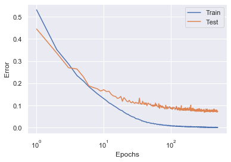
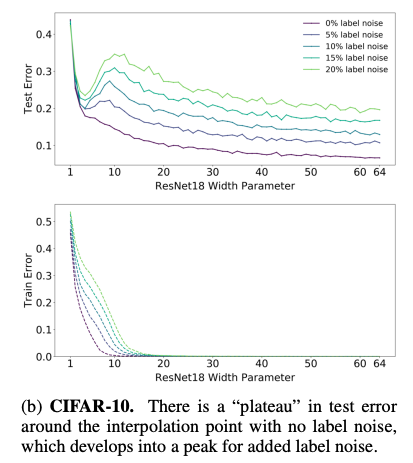
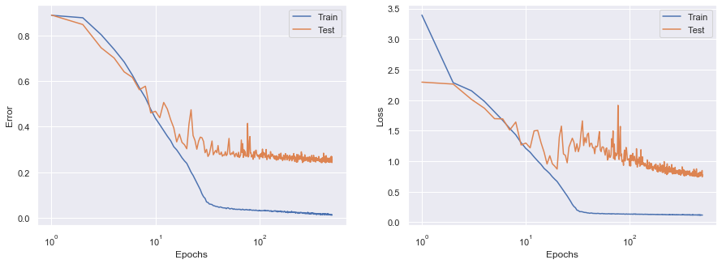
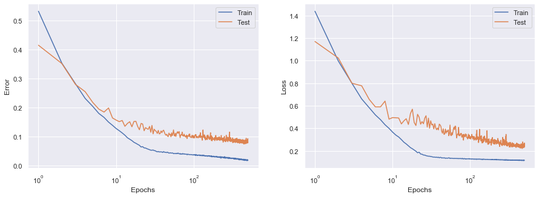

If you are a reader of this blog, you've probably heard of **bias-variance trade-off**, a well-known concept of machine learning, typically represented by the following curves.


<div style="text-align: center;"><small>Figure taken from [1]</small></div>

The bias-variance trade-off is often compared to **Occam's razor**, a problem-solving principle like "the simplest solution is most likely the right one". But, do you know that there is a continuation of the U-shaped test risk curve? Surprisingly, once the model capacity exceeds a threshold where it achieves zero training risk (**over-parameterized**), *the test risk drops again!*


<div style="text-align: center;"><small>Figure taken from [1]</small></div>

Belkin *et al*. empirically demonstrated that this double-U-shaped risk curve is universal to the choice of models and datasets and reconciled the recently observed success of over-parameterized models and the classical bias-variance trade-off [1]. They also claimed that behind the "modern" interpolating regime are:
- The models have some **inductive bias** that leads to the generalized solution.
- Larger models are *easy* to optimize by local methods such as stochastic gradient descent (SGD)

Following their research, Nakkiran *et al.* further showed that double descent occurs not only as a function of model size but also as a function of the number of training epochs [2]. Take a look at the left panel of the figure below. It indicates the test error of CIFAR-10 by color as a function of the width of ResNet-18 (horizontal axis) and training epochs (vertical axis).


<div style="text-align: center;"><small>Figure taken from [2]</small></div>

If you look at it from left to right, you'll see the **model-wise double descent**: the error decreases in the range $x \lesssim 5$ and again in the range $15 \lesssim x$. If you look at it from bottom to top, you'll see the **epoch-wise double descent**: the error decreases in the range $y \lesssim 20$ and again in the range $100 \lesssim y$.

Can you believe this is real? I couldn't when I first read the paper. Well, it has been a little long introduction, but in this post, I try to reproduce this mysterious phenomenon focusing on this color map. Also, I share some findings from the experiments and introduce some related works.

I hope this post in some way helps people who are not convinced just by reading the papers (just like me). 

## Reproducing Deep Double Descent
### Settings
I carefully read the original paper [2] and copy the settings of the ResNet-18 / CIFAR-10 experiment as closely as possible. Due to the limitations of computing resources, I didn't try every width from 1 to 64, and I trained for 500 epochs instead of 4,000. Other configurations are unchanged from the original paper [2]. These settings are feasible for Colaboratory GPU instances (you'll need P100 or T4 for $k \leq 32$).

|      Config       |         Value          |
| :---------------: | :--------------------: |
|      Dataset      |        CIFAR-10        |
|       Model       |       ResNet-18        |
|       Loss        | Softmax cross entropy  |
|    Width ($k$)    | 1, 2, 4, 8, 16, 32, 64 |
|      Epochs       |          500           |
|    Label noise    |          20%           |
| Data augmentation | Crop, Horizontal flip  |
|     Optimizer     |     Adam (lr=1e-4)     |
|    Batch size     |          128           |

20% label noise re-labels 20% of the training samples to different labels that are randomly chosen.

[The repository](https://gitlab.com/harvard-machine-learning/double-descent/-/tree/master) provided by the authors includes codes for the model and plotting, but they don't publish the code for training somehow. [Here](https://colab.research.google.com/drive/1lT2dUqal90NbLVQIGvseyAdKzH19MH2T?usp=sharing) I share the code I used to reproduce the result.

### How to Plot
Plotting was a little bit tricky. I *interpolated the model sizes linearly* to draw a smooth color map.

```python
import matplotlib.pyplot as plt
import pandas as pd
import seaborn as sns
sns.set()

dfs = [
    pd.read_csv("log_01.txt"), 
    pd.read_csv("log_02.txt"),
    pd.read_csv("log_04.txt"),
    pd.read_csv("log_08.txt"),
    pd.read_csv("log_16.txt"),
    pd.read_csv("log_32.txt"),
    pd.read_csv("log_64.txt"),
]

def make_array(key):
    ddd = np.zeros((500, 64))
    for i in range(1,65):
        a = int(np.log2(i)//1)
        if a == 6:
            ddd[:,i-1] = dfs[a][key].values
        else:
            b = a + 1
            ddd[:,i-1] = ((2**b-i)*dfs[a][key].values + (i-2**a)*dfs[b][key].values) / (2**b-2**a)
    return ddd

ddd_train_error = make_array("Train Error")
ddd_test_error = make_array("Test Error")

fig = plt.figure(figsize=(15,5))

ax1 = fig.add_subplot(1, 2, 1)
im1 = ax1.imshow(np.flipud(ddd_test_error[y_idx, :]), cmap='plasma', aspect=0.25)
ax1.set_xlabel("Model width")
ax1.set_ylabel("Epochs")
ax1.set_xticks([0, 14, 29, 44, 59])
ax1.set_xticklabels([1, 15, 30, 45, 60,])
ax1.set_yticks([0, 74, 148, 199])
ax1.set_yticklabels([500, 100, 10, 1,])
ax1.set_title("Test Error")
ax1.grid(False)
fig.colorbar(im1, ax=ax1)

ax2 = fig.add_subplot(1, 2, 2)
im2 = ax2.imshow(np.flipud(ddd_train_error[y_idx, :]), cmap='plasma', aspect=0.25)
ax2.set_xlabel("Model width")
ax2.set_ylabel("Epochs")
ax2.set_xticks([0, 14, 29, 44, 59])
ax2.set_xticklabels([1, 15, 30, 45, 60,])
ax2.set_yticks([0, 74, 148, 199])
ax2.set_yticklabels([500, 100, 10, 1,])
ax2.set_title("Train Error")
ax2.grid(False)
fig.colorbar(im2, ax=ax2)

plt.show()
```
<br/>

### Results
The experiment was successful! Here is the original deep double descent figure:


And here is the reproduced one:


Even though I stopped training at the 500th epoch, I see the same pattern both in train errors and test errors. In the right panels, the wider model and the longer training result in lower train errors. In the left panels, however, there is no such monotonic trend. Instead, there is a "loss valley" lying from top left to bottom right, followed by an uphill and downhill slope to the top right. To see the deep double descent more clearly, I plotted the test errors against the model size and the training epochs separately, which corresponds to the two white dashed arrows in the original figure.


Now the double-U-shaped curves are clearly shown. Double descent is real! 

\* Please note that the model-wise curve on the left panel is not really sure because the training was not fully converged at the 500th epoch.

### Findings & Questions
Here I share some findings from this experiment.

**Label smoothing is critical to double descent but hurts the model.** When I removed label noising for the model ($k=64$), the epoch-wise double descent did not occur.



This result is consistent with the model-wise double descent with varied label noise shown in the original paper [2].



<div style="text-align: center;"><small>Figure taken from [2]</small></div>

OK, label noise seems to play a critical role in the double descent phenomenon. But what about the minimum test error achieved with and without label noise? Both in terms of epoch-wise and model-wise, *the minimum test error achieved without label noise is far better than that with label noise (double descent).* Then, what is the benefit of double descent after all? 🤔🤔

**Test loss is not likely to converge.** I plotted the similar figures for the loss, instead of the error. 


This time, the test loss keeps increasing after the interpolation threshold! I understand that the loss decreases *after* the error does (i.e. memorization), but this steady increase is very confusing. Unfortunately, the original paper [2] doesn't tell anything about the loss curves.

## Flooding: A New Regularization Technique
On top of the deep double descent experiment, I further reproduced another related work by Ishida *et al.* [3]. They proposed a new regulaization technique called "**flooding**". The concept of flooding is remarkably simple. To prevent the model from reaching zero training loss, they proposed to add a small constant to the original loss function, which worked surprisingly well. They report that flooding induced an epoch-wise double descent faster and lead to better generalization.


<div style="text-align: center;"><small>Figure taken from [3]</small></div>

Let $J$ be the original loss function of the model parameterized by $\boldsymbol{\theta}$, and $b$ be the constant flooding level. The new loss function with flooding is defined as follows:

$$
\tilde{J}(\boldsymbol{\theta}) = | J(\boldsymbol{\theta}) - b | + b.
$$

### Reproducing the Results
The authors also evaluate flooding by ResNet-18 / CIFAR-10 experiments. Here I simply reproduced one of the main results in the following settings. Since the settings are basically the same as above, I highlight configurations that are different. Note that flooding is replacing label noise.

|        Config        |            Value            |
| :------------------: | :-------------------------: |
|     Width ($k$)      |             64              |
|     Label noise      |             0%              |
| Flooding level ($b$) |             0.1             |
|  Data augmentation   |            None             |
|      Optimizer       | SGD (lr=1e-1, momentum=0.9) |

Again, I got similar results to the one shown in the paper (e.g., Figure 2(c) of [3]). This time, *epoch-wise double descent is observed for the test loss*, and the test error decreases almost monotonically. This is different from the double descent shown in [2].



### Flooding v.s. Label Noise
Is flooding really the factor that made the difference? What is the relationship between flooding and label noise (they both look like trying to keep the training loss above zero)? I conducted a further experiment to answer these questions. In this experiment, flooding simply replaces label noise, keeping the other configurations unchanged from the ones in [2].

|        Config        |         Value         |
| :------------------: | :-------------------: |
|     Width ($k$)      |          64           |
|     Label noise      |          0%           |
| Flooding level ($b$) |          0.1          |
|  Data augmentation   | Crop, Horizontal flip |
|      Optimizer       |    Adam (lr=1e-4)     |

Here is the result. Ther is no double descent, and the test error and loss are lower than the ones with double descent. Questions remain.



## Concluding Remarks
In this post, I reproduced the main results of the deep double descent paper [2] and shared some findings and questions. I conducted additional experiments with flooding, a new regularization technique that is said to induce the double descent phenomenon.

Though I successfully reproduced major results, some open questions arouse. Is double descent so sensitive to some configurations? Does double descent really lead to better generalization (lower test error)? I appreciate your comments and feedbacks!

## References
[1] Mikhail Belkin, Daniel Hsu, Siyuan Ma, Soumik Mandal. [Reconciling modern machine learning practice and the bias-variance trade-off](https://arxiv.org/abs/1812.11118). *PNAS*. 2019.  
[2] Preetum Nakkiran, Gal Kaplun, Yamini Bansal, Tristan Yang, Boaz Barak, Ilya Sutskever. [Deep Double Descent: Where Bigger Models and More Data Hurt](https://arxiv.org/abs/1912.02292). In *ICLR*. 2020.  
[3] Takashi Ishida, Ikko Yamane, Tomoya Sakai, Gang Niu, Masashi Sugiyama. [Do We Need Zero Training Loss After Achieving Zero Training Error?](https://arxiv.org/abs/2002.08709). In *ICML*. 2020.  
[4] Lilian Weng. [Are Deep Neural Networks Dramatically Overfitted?](http://lilianweng.github.io/lil-log/2019/03/14/are-deep-neural-networks-dramatically-overfitted.html). 2019.