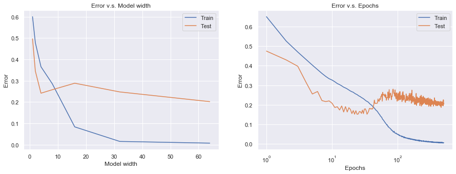
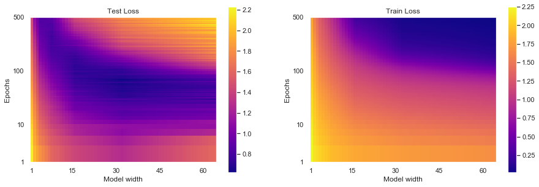
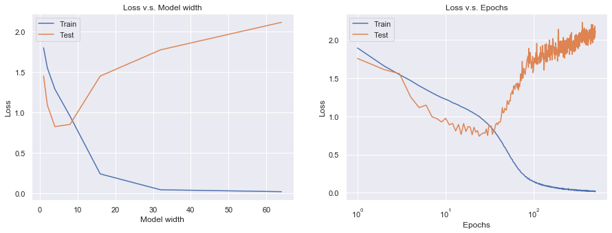

If you are reading this post, you've probably heard of **bias-variance trade-off**, a basic concept of machine learning typically represented by the following curves.

<small>Figure taken from [1]</small>

But, do you know that there is a continuation of the U-shaped test risk curve? Surprisingly, once the model capacity exceeds a threshold where it achieves zero training risk (**over-parameterized**), *the test risk drops again!*

<small>Figure taken from [1]</small>

Belkin *et al*. [1]

## Deep Double Descent

<small>Figure taken from [2]</small>

## Reproducing the Results

## Key Findings
## Flooding: A New Regularization Technique
## Discussion

## Concluding Remarks

## References
[1] Mikhail Belkin, Daniel Hsu, Siyuan Ma, Soumik Mandal. [Reconciling modern machine learning practice and the bias-variance trade-off](https://arxiv.org/abs/1812.11118). *PNAS*. 2019.  
[2] Preetum Nakkiran, Gal Kaplun, Yamini Bansal, Tristan Yang, Boaz Barak, Ilya Sutskever. [Deep Double Descent: Where Bigger Models and More Data Hurt](https://arxiv.org/abs/1912.02292). In *ICLR*. 2020.  
[3] Lilian Weng. [Are Deep Neural Networks Dramatically Overfitted?](http://lilianweng.github.io/lil-log/2019/03/14/are-deep-neural-networks-dramatically-overfitted.html). 2019.