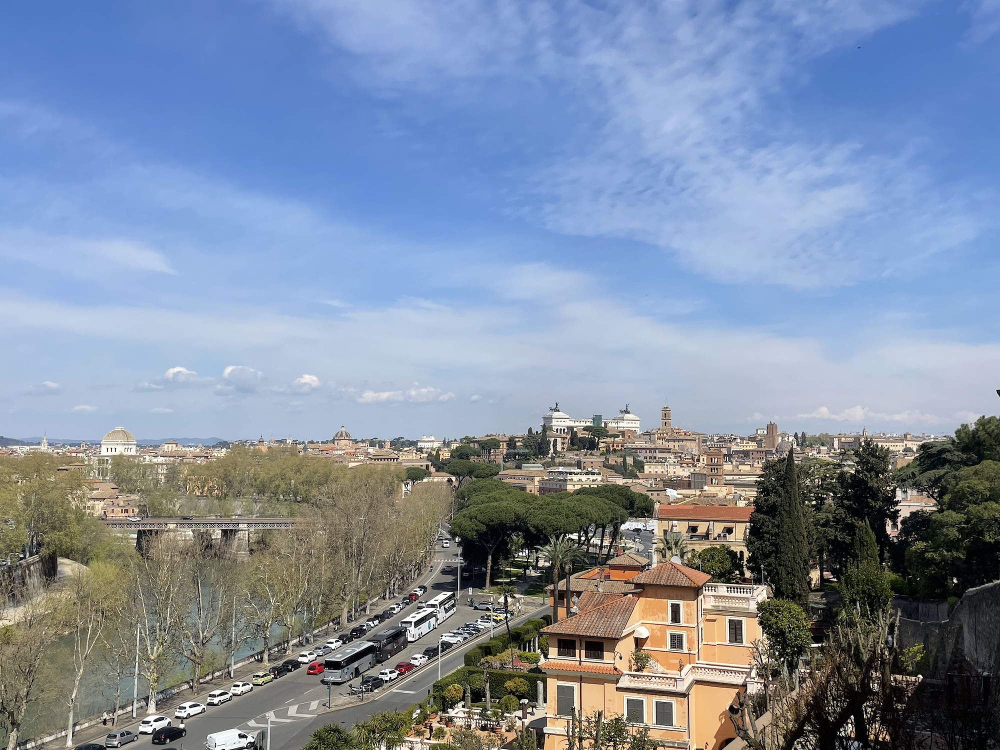

## はじめに

2年前に、「[『デュアルキャリア・カップル』を読んで夫婦で話したこと](https://hippocampus-garden.com/dual_career_couples/)」という記事を書きました。そこでは、本の内容を手がかりにしながら、共働き夫婦がフランス移住という転換期をどう乗り越えるか、特に価値観・限界・不安について対話したことをまとめました。手探りで書いた記事でしたが、同じ悩みを抱える人たちから反響をいただくことができました。

その後、私たちは「デュアルキャリア」を実践する中で、妊娠、出産、妻の国連就職、イタリア移住、初めての育児といったライフイベントを一気に経験しました。生活が激しく変化する中で、当時の意思決定や『デュアルキャリア・カップル』の説くフレームワークがどこまで機能したのか、どこで摩擦が生じたのかについて書いてみたいと思います。

なお、妊娠と出産（それも異国の地で）も非常に大きな出来事でしたが、このトピックをここで詳しく扱うと主題がぶれてしまうので、詳しくは妻が書いた記事をご覧ください。妊娠については[こちら](https://note.com/kopfkino/n/n83e22556efed)、出産については[こちら](https://note.com/kopfkino/n/nac5a36386af9)です。

## 2年間の実践で起きたこと

前提として書いておくと、妊娠前までは、私たちのデュアルキャリアはかなり安定していました。私は仕事に集中し、妻は学業に集中しつつ、家事をやや多めに担うという分担です。もちろん細かな調整はありましたが、少なくとも「次のステージをどうするか」という切迫した議論はありませんでした。

状況が変わったのは、妻の仕事探しと妊娠が重なってからです。国際機関を志望する妻の就職活動は一筋縄では行きません。応募する機関はすべて異なる都市にあります。例えば、OECDだったらパリ、ILOだったらジュネーブ、世界銀行だったらワシントンD.C.といった具合です。どこに行くにしても、パートナーである私の仕事をどうするかについて考えなければなりません。したがって、妻が働きたい機関がある都市と、私が仕事を見つけられる都市の間で共通集合をとって、その中から最も働きたい機関に優先順位をつけて応募していくといった流れになります。そこに妊娠が重なったので、さらにその場所で子育てができるかどうかといった、また別のファクターも加わってしまいました。

妻がローマの国際機関から内定をもらった後は、4ヶ月くらいの間に下記のイベントが連続しました。

1. パリで出産、妻が育児を担当[^1]
2. 私がローマからリモートで現職を続けられるように手配
3. ローマへ引っ越し、妻が勤務開始
4. 私が育休を取って、育児の主担当を交代
5. 子供が保育園に入園
6. 今後は私が職場復帰し、リモートで働く予定である

振り返ってみると、事前に整理していた考え方が機能した場面もあれば、誤算もありました。以下、両者についてそれぞれ述べます。

## うまくいったこと

最初に、うまく機能したことから書きます。

**キャリアをゼロサムで捉えなかったこと。** 妻のローマでの仕事は、キャリア上かなり大きな機会でした。妻が毎日忙しいながらも仕事にワクワクしている様子を見ると、「大変だったけどローマに来てよかったな」としみじみ感じます。一方で、ローマという場所はソフトウェアエンジニアにとって最高の都市ではありません。パリと比べると、求人の数も給与水準も圧倒的に劣ります。そういうわけで両者のキャリア機会には明確なトレードオフが存在していましたが、諦めずに私がリモートワークで現職を続けられるオプションを模索することで、両者とも納得できる結論に至ることができました。この議論に際しては、前回の記事で書いた「価値観・限界・不安」のフレームワークやポジティブサムの思考が役に立ちました。あの時『デュアルキャリア・カップル』を輪読しておいたのは英断でした。

**出産というイベントを二人で経験したこと。** 日本には里帰り出産という文化があるため、「日本に帰って出産しないの？」と聞かれることがしばしばありました。しかし、里帰り出産は私たちにとって2つの理由で難しい選択肢でした。第一に、妊娠後期にパリから東京まで移動するのはリスクを伴う行動です。第二に、私が出産とその後の育児に立ち会えないと、子育てに関する知識とスキルのギャップが決定的に開いてしまいます。これらを避けたかったのと、フランスの医療制度に対する信頼感がすでにあったため、パリで一緒に出産を経験するのが私たちにとって自然な選択でした。[妻の出産体験記](https://note.com/kopfkino/n/nac5a36386af9)に詳しく書かれている通り、妊娠・出産・子育てについては、その場で一緒に経験しないと解像度の高い理解が難しいことが多いです。この重要なライフイベントを二人で経験できたことで、二人の間の信頼関係もより深まったと感じています。日本では産後入院にパートナーが同伴するケースは珍しいようですが、個人的にはかなりおすすめできます。

**育児の主担当を途中で交代したこと。** 出産と育児の初期に役割が非対称になること自体は避けにくく、実際に妻側の負担はかなり大きくなりました。その状態を固定せず、後で私が育休をとって役割を交代したことは非常に良い選択でした。実際に家庭側へ回ってみて一番印象的だったのは、夫婦の間の認識のズレがかなり縮まったことです。育児の何がしんどいのか、どういうタイミングで支援があると助かるのかは、頭で理解するのと一人称で経験するのとでは解像度がまるで違いました。また、ワンオペに近い状態では片方にしか見えていない現実がどうしても増えますが、一度両方の立場を経験すると情報格差が減り、その後の会話の質もかなり変わりました。例えば、私が仕事から帰ってきてから、妻が「今日赤ちゃんがこんなに可愛かったんだよ」と写真を見せてきた時がありました。私は忙しかったので、つい生返事をしてしまいましたが、逆の立場を経験してみると、これがいかに悲しい反応であったかということがよくわかりました。こういった経験を通じて、私たちにとってのフェアネスは完全な分業でも常に半々であることでもなく、「長い時間軸で見て役割を交代可能にしておくこと」なのだと感じるようになりました。[^2]

<small>慣らし保育が始まってから、少し観光をする余裕が出てきました。これから街のことを知っていくにつれ、この景色もより味わい深いものになっていくことでしょう。</small>

## 学び

一方で、実際にやってみて初めてわかったことも多くありました。

**子どもが生まれると、デュアルキャリアは二人の問題ではなくなること。** 前回の記事を書いた時点では、基本的には二人の利害調整の問題として考えていました。しかし、子どもが生まれると、そこに第三の主体として子どもの都合が入ってきます。世話にかかる時間的制約だけでなく、保育園探し、病院へのアクセス、年齢が上がれば学校探しといった条件も無視できません。大人二人だけなら気合いで乗り切れていたことが、同じようにはできなくなります。数年後にはまた妻の仕事で他の国に移り住む可能性が高いですが、次回の引っ越しはさらにハードになるでしょう。

**育児の負担を過小評価していたこと。** 上述の交代制ワンオペは、妻が出産後なるべく早く仕事に復帰できるようにするために考えた策でした。大変になること自体は事前にわかっていましたが、実際の苦労は想像以上でした。妻のターンは子供のパスポート取得、ビザ申請や保育園探しと重なっていました。子供を抱えながら片手で昼食を取らなければならないような忙しさの中で、子供のパスポート取得をはじめとする複雑なマルチタスクをやり遂げた妻には、頭が上がりません。私のターンでは、慣れない育児とローマでの家探しや引っ越しなど（しかもイタリア語は全くわからない）を一手に引き受けることになり、肉体的にも精神的にもかなりこたえました。[^3] 誰か一人が体調を崩せば計画が破綻するような、ぎりぎりの状態が数週間続いてしまいました。

こうした問題は、結局のところ「余裕を持つ」以外の解決策を見つけにくいのがつらいところです。一つ言えるのは、海外で共働きをしながら子育てもするという、一見すると華やかに見える生活であっても、実際には泥臭い努力の積み重ねの上に成り立っているということです。

## 実践を踏まえた、私たちなりの理解

今回の経験を経て、私たちの中でデュアルキャリアに対する解像度がかなり上がりました。前回の記事を書いた2年前は、オープンな対話を通じて両者が納得できるキャリア設計をするという理念を頭で理解していたに過ぎませんでした。

今は、もっと運用に近いものとして見ています。最初に方針を決めたら終わりではなく、二人の価値観や関係性、そしてそれを取り巻く環境が変わるたびに調整し続けるものだという感覚です。具体的な例を挙げると、二人ともが同時にキャリアを前進させようとするのは、必ずしも現実的でないという考えに至りました。実際には、大きな機会が来るタイミングも、家庭側に重心を置く必要がある時期もずれることが多いです。したがって、そのずれの発生は前提として、「今はどちらかのキャリアを優先するけれど、後でまた組み替える」という運用の方が今の私たちにはしっくりきています。

## おわりに

子どもが生まれたこと、そして妻が国連という不安定なキャリアを選んだことによって、パズルの難易度はまた一段上がりました。今後は数年ごとに住む国が変わり、そのたびに仕事をどうするかを考えるような、動的な調整を余儀なくされるはずです。もちろん、これは大変なことです。しかし、キャリアに関して現状維持バイアスを捨てて定期的に意識的な意思決定ができるという、ポジティブな側面もあります。また、こういった予測不可能な要素がある方が、人生は面白いとも思います。今は大変でも、数年後にはきっと「あの時はこんなことで悩んでいたよね」と笑い合えるようになっていると信じています。

また、妻の職場には実際にこうしたキャリアを歩んできた人がいて、デュアルキャリアのロールモデルとして参考になるのは心強く感じています。私たちも、そうした先人たちを見ながら、体当たりでやっていくしかないのだと思います。

本記事を読んで共感された方、あるいは似たような経験をされた方がいれば、ぜひコメントなどで教えてください。こういう話は身近では意外と聞けないので、私も他の方の経験を知りたいと思っています。

[^1]: 平日の日中は妻がワンオペ、それ以外は二人で分担（私は主におむつ替え）といった具合です。
[^2]: もっとも、生後すぐの3ヶ月弱を担当した妻と、その後の2ヶ月弱（慣らし保育含む）を担当した私とでは、負荷にはかなり差がありました。私のターンの頃には授乳やおむつ替えの頻度が減り、あやすと笑ってくれるようにもなっていたので、やりがいを感じやすかったのも事実です。私の担当期間で特に大変だったのは哺乳瓶拒否でしたが、これについてはまた別の記事で書こうと思います。
[^3]: ChatGPTには、メッセージの翻訳など小さなことから、引っ越し業者選定など大きなことまで、本当にあらゆることでお世話になりました。一通りの困難を乗り越えたことで、やる気とお金とAIさえあればどんなことでもできるというある種の万能感を得ました。逆にいうと、AI以前の人はどうやって海外移住をしていたのか、全く想像がつきません…
