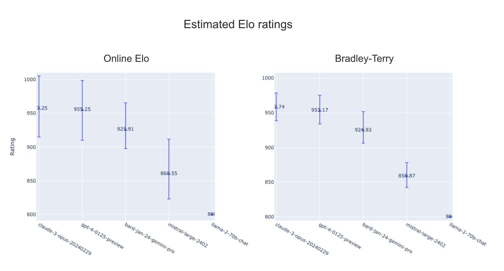

Chatbot Arena is an open platform for evaluating and comparing conversational AI models. Recently, LMSYS Org updated it's ranking algorithm from the online Elo rating to the Bradley-Terry model.

https://lmsys.org/blog/2023-12-07-leaderboard/#transition-from-online-elo-rating-system-to-bradley-terry-model

This is a great opportunity to learn about the differences between the two models and to experiment with them.

## Elo rating

[**Elo rating**](https://en.wikipedia.org/wiki/Elo_rating_system) is a method for calculating the relative skill levels of players in two-player games such as chess. Denoting the rating of player $i$ as $R_i~(\geq0)$, the probability of player $i$ winning against player $j$ is given by:

$$
P(i>j) = \frac{1}{1+10^{(R_j - R_i)/400}}
$$

where 10 and 400 are arbitrary scaling factors. This method is an online algorithm and $R_i$ is updated after each game by **stochastic gradient descent**:

$$
R_i \leftarrow R_i + K(S_i - P(i>j))
$$

where $S_i$ is the result of the game (1 if player $i$ wins, 0 if player $j$ wins, 0.5 if it's a draw) and $K$ is a constant that determines the speed of the update.

The Elo rating system has two notable features:

- It can be computed without access to the entire history of the games played in the group. When updating the ratings, we only need the result of the game and the current ratings of the two players
- It considers the possibility that the performance of the players changes over time

These features are desirable for games such as chess because we don't usually know the entire history of all games and the performance of the players can change over time.

However, it has a drawback. As it weighs the recent games more heavily than the older games, the ratings depend on the order of the games and are not very stable.

In the context of Chatbot Arena, we don't benefit from the above features of the Elo rating system. First, we have access to the entire history of all games. Second, most models are static so their performance is not expected to change. We want to discard these features and instead seek a more stable rating system.

## Bradley-Terry model

This is where [**Bradley-Terry model**](https://en.wikipedia.org/wiki/Bradley%E2%80%93Terry_model) comes in. It models the probability of player $i$ winning against player $j$ as:

$$
P(i>j) = \frac{R_i}{R_i + R_j}
$$

We can estimate the ratings $R_i$ by maximizing the likelihood of the observed results of the games.

As opposed to the Elo rating system, Bradley-Terry model assumes that the performance of the players does not change. This makes the ratings less dependent on the game order and hence more stable.

https://lmsys.org/blog/2023-12-07-leaderboard/#transition-from-online-elo-rating-system-to-bradley-terry-model

## Experiment

https://colab.research.google.com/drive/1KdwokPjirkTmpO_P1WByFNFiqxWQquwH