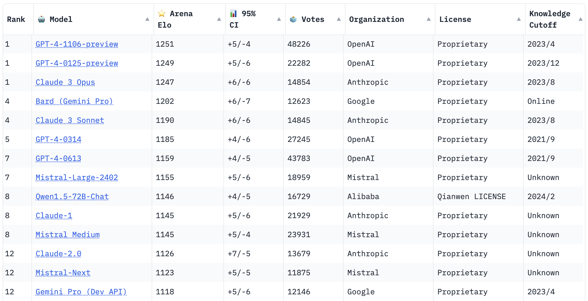

If you are a fan of LLMs, you might have heard of [**Chatbot Arena**](https://chat.lmsys.org/), a crowdsourced open platform for evaluating and comparing conversational LLMs, hosted by LMSYS Org. They provide a trusted leaderboard that ranks the chat models based on the human preference votes.

Recently, LMSYS Org updated its ranking algorithm from the online Elo rating to the Bradley-Terry model. But what does this mean? They explain the reason for the transition [in this great blog post](https://lmsys.org/blog/2023-12-07-leaderboard/#transition-from-online-elo-rating-system-to-bradley-terry-model). In short, the Bradley-Terry model provides more stable ratings than the Elo rating system because it doesn't weigh the recent games more heavily than the older games.

It's a very interesting topic to dig into, so I decided to write a blog post about it. In this post, I will explain the definitions of the two methods and compare their stability using the data from Chatbot Arena.

## Elo rating

[**Elo rating**](https://en.wikipedia.org/wiki/Elo_rating_system) is a method for calculating the relative skill levels of players in two-player games such as chess. Denoting the rating of player $i$ as $R_i~(\geq0)$, the probability of player $i$ winning against player $j$ is given by:

$$
P(i>j) = \frac{1}{1+10^{(R_j - R_i)/400}}
$$

where 10 and 400 are arbitrary scaling factors. This method is an online algorithm and $R_i$ is updated after each game by **stochastic gradient descent**:

$$
R_i \leftarrow R_i + K(S_i - P(i>j))
$$

where $S_i$ is the result of the game (1 if player $i$ wins, 0 if player $j$ wins, 0.5 if it's a draw) and $K$ is a constant that determines the speed of the update.

The Elo rating system has two notable features:

- It can be computed without access to the entire history of the games played in the group. When updating the ratings, we only need the result of the game and the current ratings of the two players
- It considers the possibility that the performance of the players changes over time

These features are desirable for games such as chess because we don't usually know the entire history of all games and the performance of the players can change over time.

However, it has a drawback. As it weighs the recent games more heavily than the older games, the ratings depend on the order of the games and are not very stable.

In the context of Chatbot Arena, we don't benefit from the above features of the Elo rating system. First, we have access to the entire history of all games. Second, most models are static so their performance is not expected to change. We want to discard these features and instead seek a more stable rating system.

## Bradley-Terry model

This is where [**Bradley-Terry model**](https://en.wikipedia.org/wiki/Bradley%E2%80%93Terry_model) comes in. It models the probability of player $i$ winning against player $j$ as:

$$
P(i>j) = \frac{R_i}{R_i + R_j}
$$

We can estimate the ratings $R_i$ by maximizing the likelihood of the observed results of the games. For example, you can use logistic regression without intercept to predict the result of $N$ games between $M$ players as:

$$
P(i>j) = \frac{1}{1 + e^{-\mathbf{\beta}^\top\mathbf{x}}}
$$

The players vector $\mathbf{x}$ is a vector of length $M$ where the $i$-th element is 1, the $j$-th element (opponent of player $i$) is -1, and the rest are 0. $\mathbf{\beta}$ is a coefficient vector of length $M$. This model can be simplified to:

$$
P(i>j) = \frac{1}{1 + e^{-(\beta_i - \beta_j)}} = \frac{e^{\beta_i}}{e^{\beta_i} + e^{\beta_j}}
$$

The ratings are then given by the exponentials of the coefficients:

$$
R_i = e^{\beta_i}
$$

As opposed to the Elo rating system, Bradley-Terry model assumes that the performance of the players does not change. This makes the ratings less dependent on the game order and hence more stable.

## Experiment

Is Bradley-Terry model really more stable than Elo rating? Let's compare the two models using the data from Chatbot Arena. 

LMSYS Org provides [an insightful notebook that demonstrates how to estimate the ratings of all the 45 chat models using the two methods](https://colab.research.google.com/drive/1KdwokPjirkTmpO_P1WByFNFiqxWQquwH). If you are interested in how to implement them in Python, I encourage you to check it out. Here, I only show the results of the experiment.

The following figure shows the ratings of the 5 popular chat models. The ratings are estimated by the two methods with 95% confidence intervals calculated by bootstrapping 100 times. The ratings estimated by the Bradley-Terry model are adjusted so that you can compare them with the ratings estimated by the Elo rating system. As you can see, Bradley-Terry model gives more stable ratings than Elo rating system.

## Conclusion

In this post, I explained the definitions of the Elo rating system and the Bradley-Terry model and compared their stability using the data from Chatbot Arena. The Bradley-Terry model provides more stable ratings than the Elo rating system because it doesn't weigh the recent games more heavily than the older games. This is desirable for Chatbot Arena because we have access to the entire history of all games and most models are static so their performance is not expected to change.