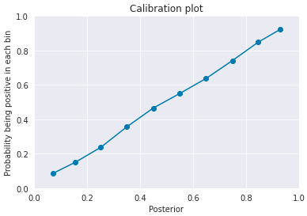
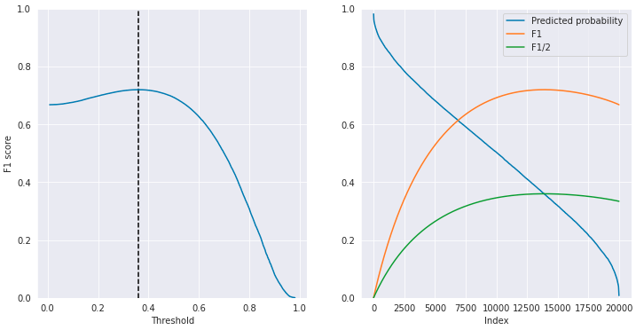

This post attempts to take a deeper look at the F1 score -- a popular metric for classification tasks. Based on a paper written by Lipton et al. in 2014 [1], I introduce some interesting properties of F1 with proofs. For instance, if the classifier outputs calibrated scores, the optimal threshold for maximizing F1 is half the optimal F1 score. After that, I confirm the claimed property through experiments, giving visualizations that may help better understand the original paper.

## Recap: Definitions
Before diving into the main part, let's recap some definitions quickly. A **confusion matrix** represents the counts of **true positives**, **false positives**, **false negatives**, and **true negatives**.

|                    | Actual Positive | Actual Negative |
| :----------------: | :-------------: | :-------------: |
| Predicted Positive |       TP        |       FP        |
| Predicted Negative |       FN        |       TN        |

**Precision** and **recall** are defined as below.

$$
\begin{aligned}
\mathrm{Precision} &= \frac{\mathrm{TP}}{\mathrm{TP} + \mathrm{FP}}\\
\mathrm{Recall} &= \frac{\mathrm{TP}}{\mathrm{TP} + \mathrm{FN}}
\end{aligned}
$$

**F1 score** is the harmonic mean of precision and recall:

$$
\begin{aligned}
\mathrm{F1} &= 2\frac{\mathrm{Precision} \cdot \mathrm{Recall}}{\mathrm{Precision} + \mathrm{Recall}}\\
& = \frac{2 \mathrm{TP}}{2 \mathrm{TP} + \mathrm{FP} + \mathrm{FN}}.
\end{aligned}
$$

If you want to consider recall $\beta$ times more important than precision, you could use a generalized version:

$$
\begin{aligned}
F_{\beta} &= (1+\beta^2)\frac{\mathrm{Precision} \cdot \mathrm{Recall}}{\beta^2 \mathrm{Precision} + \mathrm{Recall}}\\
 &= \frac{(1+\beta^2)\mathrm{TP}}{(1+\beta^2)\mathrm{TP} + \mathrm{FP}+ \beta^2\mathrm{FN}},
\end{aligned}
$$

which we don't discuss in this post.

Just like other metrics such as accuracy, precision, and recall, the F1 score is also sensitive to the choice of the threshold. Tuning threshold could be as important as designing the prediction model. Actually, in [a recent Kaggle competition](https://www.kaggle.com/c/shopee-product-matching/), one of the techniques that made difference was the postprocessing part to choose the optimal threshold.

## Theory: Optimal Threshold for Maximizing F1 Score

Setups are done, so let's move on to the main part. We start by simply combining the above definition with the Bayes' rule.

**Lemma 1**. *By denoting the base rate by $b=p(t=1)$, and hence $1-b=p(t=0)$,  the entries of the confusion matrix are:*
$$
\begin{aligned}
  \mathrm{TP}= b\int_{s:D(s)=1}p(s \mid t=1) \mathrm{d}s,\\
  \mathrm{FN}= b\int_{s:D(s)=0}p(s \mid t=1) \mathrm{d}s,\\
  \mathrm{FP}= (1-b)\int_{s:D(s)=1}p(s \mid t=0) \mathrm{d}s,\\
  \mathrm{TN}= (1-b)\int_{s:D(s)=0}p(s \mid t=0) \mathrm{d}s.
\end{aligned}
$$

*Proof*. $\mathrm{TP}$ is defined as:

$$
\mathrm{TP} = \int_{s:D(s)=1} p(t=1\mid s)p(s) \mathrm{d}s.
$$

From the **Bayes' rule**, we have

$$
\begin{aligned}
p(t=1\mid s) &= \frac{p(s\mid t=1)p(t=1)}{p(s)} \\
  p(t=1\mid s)p(s) &= bp(s\mid t=1).
\end{aligned}
$$

Combining the above two equations, we get

$$
\mathrm{TP}= b\int_{s:D(s)=1}p(s \mid t=1) \mathrm{d}s.
$$

Similar arguments hold for the other three entries. $\blacksquare$

Now we can derive the optimal decision rule that a classifier should follow.

**Theorem 1**.
*To maximize F1, a classifier should predict a sample with score $s$ as positive if and only if:*
$$
\frac{bp(s\mid t=1)}{(1-b)p(s\mid t=0)} \geq J
$$

*where $J\coloneqq\mathrm{TP}/(\mathrm{TP} + \mathrm{FP} + \mathrm{FN})$ is the Jaccard index of the optimal classifier.*

*Proof*. Suppose that the decision rule $D(\cdot)$ has been fixed for all the region but a paticular region $\Delta$ around a point $s$. We want to identify $D(\Delta)$ so that we can decide whether a sample with score $s$ is positive or negative. For brevity, let's write:

$$
\begin{aligned}
  P_1(\Delta) &= \int_{\Delta}p(s\mid t=1) \mathrm{d}s,\\
  P_0(\Delta) &= \int_{\Delta}p(s\mid t=0) \mathrm{d}s.
\end{aligned}
$$ 

Let's say our current decision rule $D: [ 0,1 ]\backslash\Delta \rightarrow \{0,1\}$ achieves the F1 score:

$$
F = \frac{2 \mathrm{TP}}{2 \mathrm{TP} + \mathrm{FP} + \mathrm{FN}}.
$$

If we predict the region $\Delta$ as positive, that is $D(\Delta)=1$, our new F1 score is:

$$
F' = \frac{2 \mathrm{TP} + 2bP_1(\Delta)}{2 \mathrm{TP}+bP_1(\Delta) + \mathrm{FP}+(1-b)P_0(\Delta) + \mathrm{FN}}.
$$

On the other hand, if we predict the region $\Delta$ as negative, that is $D(\Delta)=0$, our new F1 score is:

$$
F'' = \frac{2 \mathrm{TP}}{2 \mathrm{TP} + \mathrm{FP} + \mathrm{FN}+bP_0(\Delta)}.
$$

Therefore, we should predict the region $\Delta$ as positive if and only if:

$$
\begin{aligned}
  F' &\geq F''\\
  bP_1(\Delta)\bigr(bP_1(\Delta) + \mathrm{TP} + \mathrm{FP} + \mathrm{FN} \bigl) &\geq \mathrm{TP}(1-b)P_0(\Delta).
\end{aligned}
$$

By approximating $P_1(\Delta)^2 \simeq0$, we have:

$$
\frac{bP_1(\Delta)}{(1-b)P_0(\Delta)} \geq \frac{\mathrm{TP}}{ \mathrm{TP} + \mathrm{FP} + \mathrm{FN}}
$$

Taking the limit $\Delta \rightarrow0$ results in the claimed theorem. $\blacksquare$

In a special case, where the model outputs calibrated probabilities (e.g., logistic regression), that is $p(t=1 \mid s)=s$ and $p(t=0 \mid s)=1-s$, the following corollary holds.

**Corollary 1**.
*To maximize F1, a classifier should predict a sample with predicted probability $s$ as positive if and only if:*
$$
s \geq \frac{F}{2}
$$

*where $F\coloneqq2\mathrm{TP}/(2\mathrm{TP} + \mathrm{FP} + \mathrm{FN})$ is the F1 score of the optimal classifier.*

*Proof*. 
From the Bayes' rule and the definition of calibration, 
$$
\begin{aligned}
  sp(s) = bp(s\mid t=1),\\
  (1-s)p(s) = bp(s\mid t=0).
\end{aligned}
$$

Incorporating the the above two equations in Theorem 1 gives:

$$
\begin{aligned}
  \frac{s}{1-s} &\geq \frac{\mathrm{TP}}{ \mathrm{TP} + \mathrm{FP} + \mathrm{FN}}\\
s&\geq \frac{\mathrm{TP}}{ 2\mathrm{TP} + \mathrm{FP} + \mathrm{FN}} = \frac{F}{2}~\blacksquare
\end{aligned}
$$

This section is heavily based on [1] with some modifications. For more details, please read the original paper. It discusses the F1 score more deeply with intriguing figures like below.


## Experiment
I conducted a simple experiment to confirm the claimed property that *the optimal threshold is half of the maximum F1 score*.

Using the following libraries,

```python
import numpy as np
import matplotlib.pyplot as plt
import pandas as pd
import seaborn as sns
sns.set_style("darkgrid")

from sklearn.calibration import calibration_curve
from tqdm.notebook import tqdm
```

I generated a balanced dataset of 20,000 samples for binary classification:

$$
\{ (X_p, 1) \}^{10000} \cup \{ (X_n, 0) \}^{10000} \\
\mathrm{where}~ X_p \sim \mathcal{N}(0.5, 1),~ X_n \sim \mathcal{N}(-0.5, 1)
$$

```python
n_pos = 10000
n_neg = 10000
df = pd.concat([
                pd.DataFrame({
                    'target': [True]*n_pos,
                    'feature': np.random.normal(loc=0.5, scale=1.0, size=n_pos)
                    }),
                pd.DataFrame({
                    'target': [False]*n_neg,
                    'feature': np.random.normal(loc=-0.5, scale=1.0, size=n_neg)
                    })
], ignore_index=True)

plt.hist(df.query('target').feature, bins=20, alpha=0.5, label='True')
plt.hist(df.query('not target').feature, bins=20, alpha=0.5, label='False')
plt.legend();
```


Since the true distributions are known in this setting, I calculated the posteriors directly like below (that is, not predicting them). If you predict posteriors, you should check if they are properly calibrated so the condition of Corollary 1 is satisfied. As shown in the figure below, the scores are perfectly calibrated in this case.

```python
def likelihood_gaussian(arr, mu, sigma):
    a = - (arr - mu) ** 2 / (2 * sigma ** 2)
    return np.exp(a) / ((2  * np.pi) ** 0.5 * sigma)

def posterior(arr, mu_pos, mu_neg, sigma):
    p_pos = likelihood_gaussian(arr, mu_pos, sigma)
    p_neg = likelihood_gaussian(arr, mu_neg, sigma)
    return (0.5 * p_pos) / (0.5 * p_pos + 0.5 * p_neg)

y_prob = posterior(df.feature.values, 0.5, -0.5, 1)
trues, preds = calibration_curve(df.target, y_prob, n_bins=10)
plt.plot(preds, trues, marker='o')
plt.xlabel("Posterior")
plt.ylabel("Probability being positive in each bin")
plt.xlim(([0, 1]))
plt.ylim(([0, 1]))
plt.title("Calibration plot");
```



Now the optimal threshold. I examined every possible threshold while calculating the expected F1 score base on the posteriors, and chose the optimal threshold that gives the maximum score.

```python
def expect_f1(y_prob, thres):
    idxs = np.where(y_prob >= thres)[0]
    tp = y_prob[idxs].sum()
    fp = len(idxs) - tp
    idxs = np.where(y_prob < thres)[0]
    fn = y_prob[idxs].sum()
    return 2*tp / (2*tp + fp + fn)

def optimal_threshold(y_prob):
    y_prob = np.sort(y_prob)[::-1]
    f1s = [expect_f1(y_prob, p) for p in y_prob]
    thres = y_prob[np.argmax(f1s)]
    return thres, f1s

thres, f1s = optimal_threshold(y_prob)
print(f"Predicted Optimal Threshold is {thres:.5f} with F1 score {expect_f1(y_prob, thres):.5f}")
```

</br>

> **Predicted Optimal Threshold is 0.35991 with F1 score 0.71965**

Yes, the optimal threshold is around half the maximum F1 score!

Finally, I visualized how the expected F1 score changed against different thresholds and how the $\mathrm{F1}/2$ curve crossed the curve of the sorted posteriors at the optimal threshold point.

```python
tmp = np.sort(y_prob)
f1s = np.array(f1s)

fig = plt.figure(figsize=(12, 6))

ax = fig.add_subplot(1, 2, 1)
ax.plot(tmp, f1s[::-1])
ax.vlines(thres, 0, 1, linestyles="--")
ax.set_xlabel('Threshold')
ax.set_ylabel("F1 score")
ax.set_ylim([0, 1]);

ax = fig.add_subplot(1, 2, 2)
ax.plot(tmp[::-1], label="Predicted probability")
ax.plot(f1s, label='F1')
ax.plot(f1s/2, label='F1/2')
ax.set_xlabel('Index')
ax.legend()
ax.set_ylim([0, 1]);
```



## References
[1] Zachary C. Lipton, Charles Elkan, Balakrishnan Naryanaswamy. "[Optimal Thresholding of Classifiers to Maximize F1 Measure](https://link.springer.com/chapter/10.1007/978-3-662-44851-9_15)". In *ECML PKDD*. 2014.