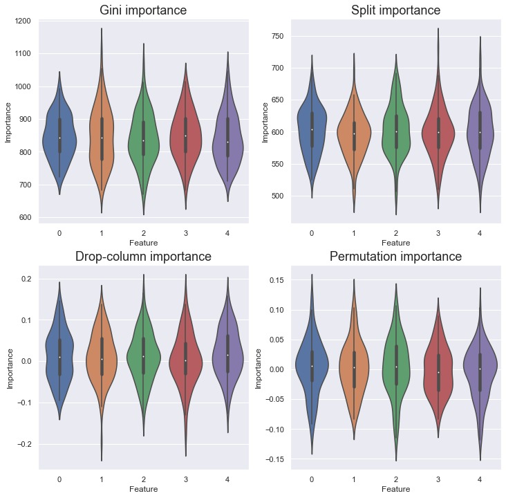
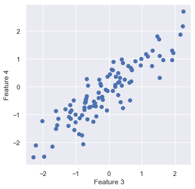
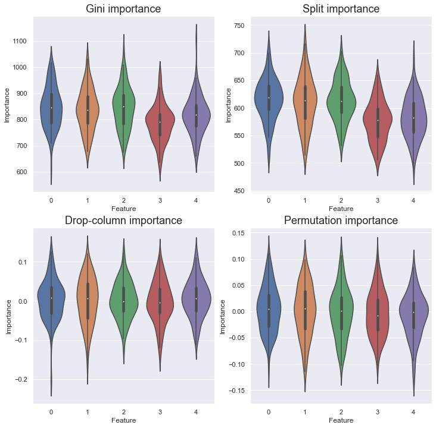
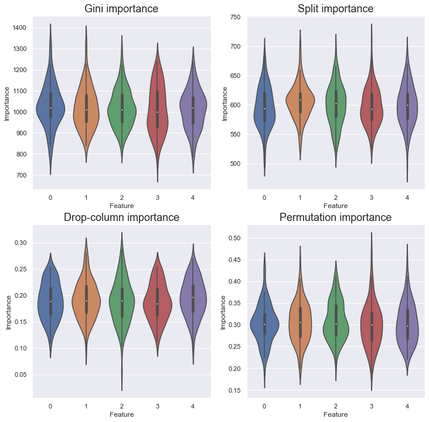
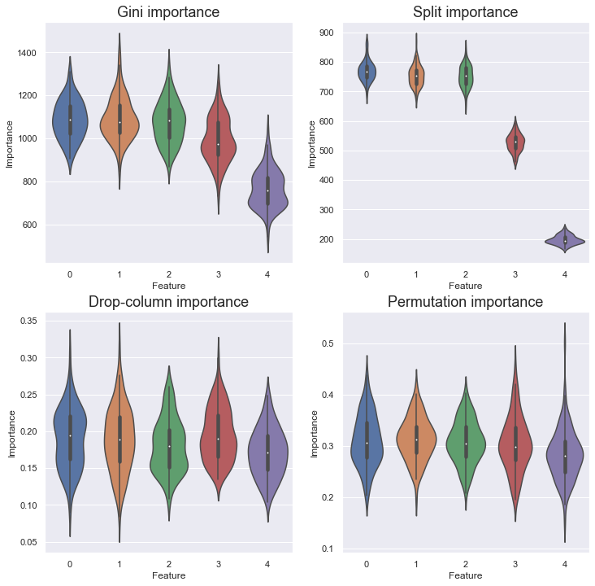
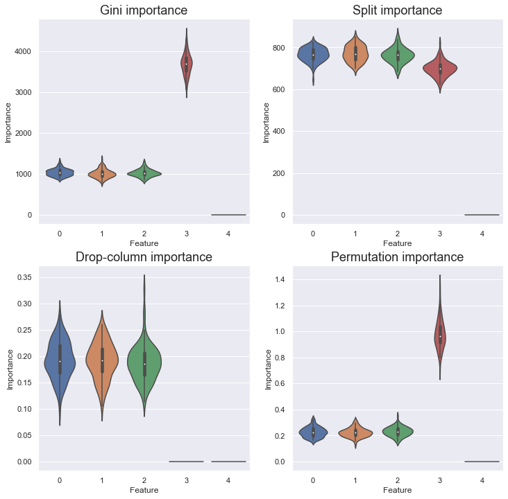
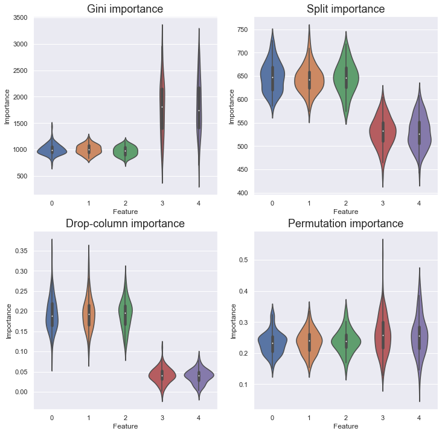

## Popular Measures of Feature Importance
Here I summarize the popular measures of feature importance: **Gini importance**, **split importance**, **drop-column importance**, and **permutation importance**.

| Feature importance | Applicable Models | Needs validation set | Needs re-training |
| :----------------: | :---------------: | :------------------: | :---------------: |
|        Gini        | Tree-based model  |          No          |        No         |
|       Split        | Tree-based model  |          No          |        No         |
|    Drop-column     |     Any model     |         Yes          |        Yes        |
|    Permutation     |     Any model     |         Yes          |        No         |
 

In this section, I'm going to briefly review the definition of these metrics. If you are already familiar with them, please skip to [the experiment section]((https://hippocampus-garden/feature_importance/#random-target)).

### Gini Importance
In tree-based models, each node split the data from its parent node on the feature that gives the greatest improvement in **Gini impurity**. Let's say the node $n$ has the child nodes $n_L$ and $n_R$. Now, the node $n$'s improvement in Gini impurity is:

$$
\Delta \mathrm{Gini}(n) = p(n)I(n) - \{ p(n_L)\mathrm{Gini}(n_L) + p(n_R)\mathrm{Gini}(n_R)\},
$$

where $\mathrm{Gini}(n)$ denotes Gini impurity of the node $n$ and $p(n)$ the ratio of the number of the node $n$'s samples to the total number of samples. Gini importance of feature $f$ is defined as the sum of the impurity improvement of the nodes using the feature. 

$$
I(f) = \sum_{n\in \mathcal{N}_f} \Delta \mathrm{Gini}(n)
$$

Gini importance is used in scikit-learn's tree-based models such as `RandomForestRegressor` and `GradientBoostingClassifier`. You can call it by `model.feature_importances_` or something like that.

### Split Importance
Split importance is also a measure of feature importance for tree-based models. It simply counts how many times the nodes split on the feature. It assumes that the more important the features is, the more times it is split. This sounds naive after introducing Gini importance, but it is actually used in LightGBM by default! You have perhaps used it before without knowing it.

Above two measures are computed when the training is over, so you don't need any out-of-bag validation set or re-training.

### Drop-column Importance
Drop-column importance is a model-agnostic measure stemmig from a simple idea: if a feature is unimportant, the model's performance doesn't drop if it is trained without that feature. Drop-column importance is computed by the following steps:

1. Train a model with all features
2. Measure baseline performance with a validation set
3. Select one feature whose importance is measured
4. Train a model from scratch with all features but the selected 
5. Measure performance with a validation set where the selected feature is *dropped*
6. The importance of the selected feature is the drop of the performance from the baseline
7. Iterate 3 through 6 over all features 

Though the idea behind this algorithm is easy to understand, but its computational cost is higher than other importance measures because it requires re-training as many times as the number of features.

### Permutation Importance
Permutation importance is also model-agnostic and based on the similar idea but doesn't require expensive computation. It is computed by the following steps:

1. Train a model with all features
2. Measure baseline performance with a validation set
3. Select one feature whose importance is measured
4. Measure performance with a validation set where the selected feature is *shuffled*
5. The importance of the selected feature is the drop of the performance from the baseline
6. Iterate 3 through 5 over all features 
   
It is supported by scikit-learn v0.22 or later and can be easily called by `permutation_importance(model, X_val, y_val)` or something like that.

## Random Target
The experiment part consists of two sections. In the first section, the target variable is independent from the explanatory variables; In the other, it isn't. So, in this section, I consider five explanatory variables that are i.i.d. samples from the standard normal distribution and one target variable that is also i.i.d.

$$
Y \sim N(0,1) \perp X_1,X_2,X_3,X_4,X_5
$$

Obviously, the target variable is never explained by the explanatory variables.

I compared the four importance measures in the following four cases:

1. **Control**. I didn't change anything from the above settings.
2. **Different cardinalities**. I rounded $X_2$ to the third decimal place, $X_3$ to the second, and so on.
3. **Duplicated columns**. I copied $X_4$ to $X_5$.
4. **Columns with colinearity**. I re-assigned $(X_4 + Z)/\sqrt{1.25}$ to $X_5$, where $Z\sim N(0,0.5^2)$. $X_5$ is no more independent from $X_4$ but still identically distributed.

For each importance measure, I trained a LightGBM regressor with the default hyperparameters for 100 times and plotted its histogram. The training set contains 1,000 samples and the validation set, if necessary, contains 200 samples.

### Control
As expected, for all the importance measures, each feature contributed equally.

But, ideally, the features should have no contribution. Why the scores are not zero for Gini and split importance? This is because they don't use a validation set and simply reflect the result of training. 

### Cardinality

### Duplication

### Colinearity

## Synthetic Target

$$
\begin{aligned}
Y = \frac{X_1+X_2+X_3+X_4+X_5+ \epsilon }{\sqrt{6}} \sim N(0,1) \\
\mathrm{where}~ \epsilon \sim N(0,1)
\end{aligned}

$$

### Control

### Cardinality

### Duplication

### Colinearity

## Other Measures of Feature Importance
Null importance, SHAP

## Concluding Remarks
In this post, I reproduced the main results of the deep double descent paper [2] and shared some findings and questions. I conducted additional experiments with flooding, a new regularization technique that is said to induce the double descent phenomenon.

Though I successfully reproduced major results, some open questions arouse. Is double descent so sensitive to some configurations? Does double descent really lead to better generalization (lower test error)? I appreciate your comments and feedbacks!

## References
[1] Mikhail Belkin, Daniel Hsu, Siyuan Ma, Soumik Mandal. [Reconciling modern machine learning practice and the bias-variance trade-off](https://arxiv.org/abs/1812.11118). *PNAS*. 2019.  