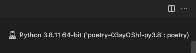

I tend to forget how to setup Jupyter in a newly created Poetry / Pipenv environment, so I leave a note here. It contains four ways to setup Jupyter: [Poetry, Pipenv] x [Native Jupyter, VSCode].

## Poetry
Let's say you're going to use NumPy in your project. With Poetry, you can create a new virtual environment and install dependencies in the following commands:

```console
$ poetry init
$ poetry add numpy # libraries you want to use
$ poetry add -D jupyter # libraries for development use only
```

`poetry add -D jupyter` installs all the packages required to use Jupyter (e.g., `ipykernel`). Now, `pyproject.toml` should look like below.

```toml:title=pyproject.toml
[tool.poetry]
name = "poetry"
version = "0.1.0"
description = ""
authors = [""]

[tool.poetry.dependencies]
python = "^3.8"
numpy = "^1.21.1"

[tool.poetry.dev-dependencies]
jupyter = "^1.0.0"

[build-system]
requires = ["poetry-core>=1.0.0"]
build-backend = "poetry.core.masonry.api"
```

Now you are ready to go 🚀

### Native Jupyter
The following command launches Jupyter server inside the virtual environment you just created.

```console
$ poetry run jupyter notebook
```

If you are using globally installed Jupyter, create a kernel before launching Jupyter:

```console
$ poetry run ipython kernel install --user --name=<KERNEL_NAME>
$ jupyter notebook
```

And then select the created kernel in "Kernel" -> "Change kernel".

### VSCode
Sometimes it's more confortable to open Jupyter notebooks in VSCode than in web browsers. In VSCode, you can select your preferred kernel without any additional commands. 

Click the "Python" button located near the bottom left corner and select the Python interpreter path.


When settings are done, the selected interpreter is displayed in the top right corner.



## Pipenv
With Pipenv, you can do the same thing in the following commands:

```console
$ pipenv install numpy # libraries you want to use
$ pipenv install --dev jupyter # libraries for development use only
```

`pipenv install --dev jupyter` installs all the packages required to use Jupyter (e.g., `ipykernel`). Now, `Pipfile` should look like below.

```toml:title=Pipfile
[[source]]
url = "https://pypi.org/simple"
verify_ssl = true
name = "pypi"

[packages]
numpy = "*"

[dev-packages]
jupyter = "*"

[requires]
python_version = "3.9"
```

Now you are ready to go 🚀

### Native Jupyter
The following command launches Jupyter server inside the virtual environment you just created.

```console
$ pipenv run jupyter notebook
```

If you are using globally installed Jupyter, create a kernel before launching Jupyter:

```console
$ pipenv run ipython kernel install --user --name=<KERNEL_NAME>
$ jupyter notebook
```

And then select the created kernel in "Kernel" -> "Change kernel".

### VSCode
See [the above VSCode section](#vscode). It's all the same.

## References
[1] [Python in Visual Studio Code – August 2021 Release | Python](https://devblogs.microsoft.com/python/python-in-visual-studio-code-august-2021-release/)  
[2] [Introduction | Documentation | Poetry - Python dependency management and packaging made easy](https://python-poetry.org/docs/)  
[3] [Pipenv: Python Dev Workflow for Humans — pipenv 2021.5.29 documentation](https://pipenv.pypa.io/en/latest/)