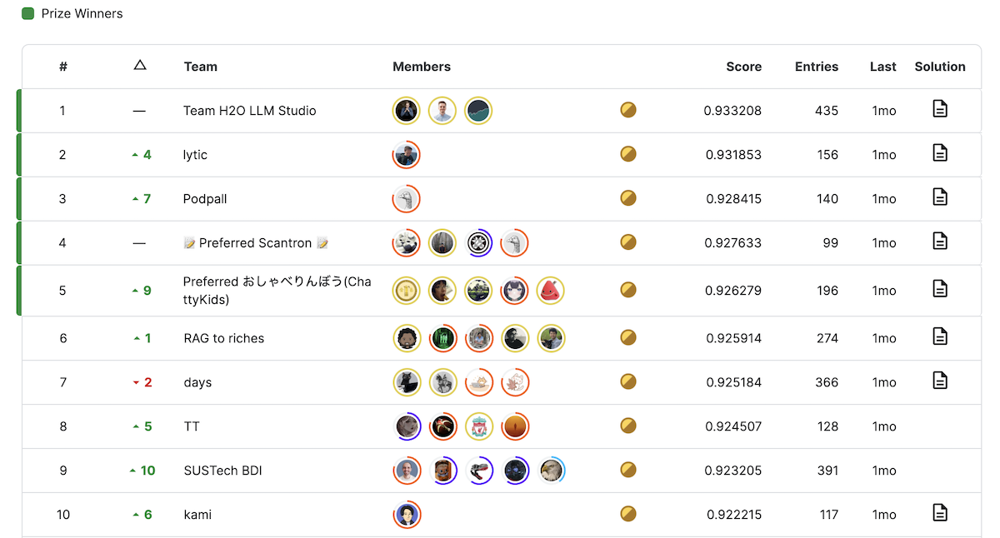
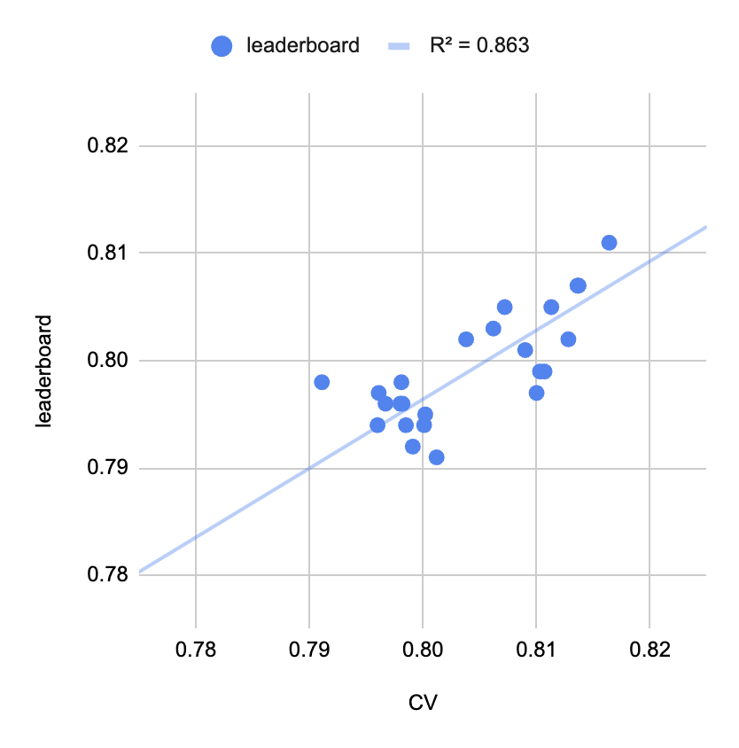

The Kaggle competition "**Learning Agency Lab - Automated Essay Scoring 2.0**" concluded on July 3rd, attracting over 2,700 teams. I participated and finished in 839th place (top 31%). For those who didn't participate, this post outlines the problem setting, summarizes the top solutions, and shares my experience.

## Problem Setting

In this competition, the task was to grade student essays on a scale of 1 to 6, with submissions evaluated based on [**quadratic weighted kappa**](https://datatab.net/tutorial/weighted-cohens-kappa) (**QWK**). QWK is a specific variant of [Cohen's kappa](https://en.wikipedia.org/wiki/Cohen%27s_kappa#Weighted_kappa) with heavier penalties for larger disagreements.

Here are some important details about the dataset. The train set contains 17k essays and their grades. [@mpware identified](https://www.kaggle.com/competitions/learning-agency-lab-automated-essay-scoring-2/discussion/498478) that each essay was written in response to one of seven prompts (e.g., _Do you agree or disagree with legalizing driverless cars?_). It was aslo discovered that the train set derives from two data sources: [Persuade 2.0](https://github.com/scrosseye/persuade_corpus_2.0) (13k essays) and something new (let's call it "Kaggle Only"; 4k essays). As Persuade 2.0 has 26k essays in total, we could expand the train set by including the remaining 13k essays. The competition host didn't disclose any information about the test set, but according to [leaderboard probing by the participants](https://www.kaggle.com/competitions/learning-agency-lab-automated-essay-scoring-2/discussion/499959), the test set had no overlaps with Persuade 2.0, implying there was no data leakage. 😌

## Final Standings

The final standings are depicted in the image below.

As you can see, we had a huge shake up/down. [@samvelkoch](https://www.kaggle.com/competitions/learning-agency-lab-automated-essay-scoring-2/discussion/516579) visualized that in a nice way.

The ranks for the top ~1300 teams fluctuated significantly, partly because QWK's sensitivity to chosen thresholds made participants overfit to the public leaderboard. High-scoring public notebooks, which are represented by the connected dots in the plot, also contributed to this variability. However, the top 5 solutions, summarized here, are genuinely insightful.

## Solutions

Now, let's dive into the top solutions.

### Baseline

First of all, let's have a quick look at [@cdeotte's great starter notebook](https://www.kaggle.com/code/cdeotte/deberta-v3-small-starter-cv-0-820-lb-0-800). It fine-tunes a **DeBERTa V3** Small regressor for 4 epochs with **mean squared error** (**MSE**) as the loss function. At inference time, the outputs are rounded to the nearest integer. The 5-fold training completes in just 11 minutes, achieving a score of 0.801 on the public leaderboard. It has two details worth mentioning:

- It adds two new tokens to the tokenizer: new line (`\n`) and double space.
- It removes all the dropouts as [they don't work well in the regression setting](https://www.kaggle.com/competitions/commonlitreadabilityprize/discussion/260729)

If you are new to this competition, I definitely recommend starting with this notebook. Here is a non-exhaustive list of potential improvements:

- Optimizing the thresholds for rounding the outputs – the outputs are biased towards the popular classes. For example, the predictions for the class 1 are biased towards 2 because the train set has more class 2 essays.
- Exploiting the fact that the test set consists of Kaggle Only essays. For example, we can design a more sophisticated validation strategy and re-label the Persuade 2.0 essays.
- Using a larger model like DeBERTa V3 Large.
- Pre-training DeBERTa on the train set before fine-tuning.
- Adding meta features to the input such as the data source and the predicted prompt name.
- Exploring different loss functions such as QWK loss, focal loss, and ordinal regression loss.
- Exploring different poolers such as attention pooling and mean pooling.
- Incorporating rule-based features such as the number of typos.

### 1st Place

[@ferdinandlimburg](https://www.kaggle.com/competitions/learning-agency-lab-automated-essay-scoring-2/discussion/516791) jumped up the leaderboard from 619th (public) to the top spot (private).

The key to their success was a careful examination of the distribution shift between the train and test sets (i.e., Persuade 2.0 and Kaggle Only). They observed that the two data sources had different grading criteria. This prompted the implementation of a two-staged training process and pseudo labeling.

- Two-staged training (+0.015): Initially pre-training on Persuade 2.0 and subsequently fine-tuning on Kaggle Only
- Pseudo labeling (+0.005): Training a model on the Kaggle Only data and re-labeling the Persuade 2.0 data with the model's predictions

The final submission was a simple average of 4 variations of DeBERTa V3 Large models. Thresholds were optimized model-wise and then averaged to avoid overfitting.

### 2nd Place

[@syhens](https://www.kaggle.com/competitions/learning-agency-lab-automated-essay-scoring-2/discussion/516790) led the leaderboard for most of the competition and finished in second place.

Their final submission was an ensemble of five DeBERTa V3 Large, all of which underwent two-staging training similar to @ferdinandlimburg's solution. @syhens used, however, the entire train set for the first stage. The variations included techniques such as ordinal regression and [contextual positional encoding](https://arxiv.org/abs/2405.18719). The ensemble was hard voting.

### 3rd Place

[@dsohonosom](https://www.kaggle.com/competitions/learning-agency-lab-automated-essay-scoring-2/discussion/517014), another leader of this competition, adopted a similar two-staged training.

1. Train with the entire train set and evaluate on Kaggle Only
2. Train with Kaggle Only and evaluate on Persuade 2.0 to avoid overfitting

The final submission was an ensemble of 7 DeBERTa V3 Base models and 4 Large models with different context lengths and poolers. The ensembling weights were determined by Nelder-Mead optimization.

Interestingly, threshold adjustments didn't work for @dsohonosom. I wonder how the simple rounding could lead to such high scores. 🤔

### 4th Place

[@tascj0](https://www.kaggle.com/competitions/learning-agency-lab-automated-essay-scoring-2/discussion/516639) jumped up the leaderboard from 1277th (public) to the 4th place (private) with a simple training strategy.

Like other winners, @tascj0 noticed the distribution shift. What is unique is that they counteracted it by adding a data source classification head to ensure the models can distinguish data sources. It seems this works as good as two-staged training.

In terms of models, this solution is more diverse than others, including `microsoft/deberta-large`, `microsoft/deberta-v3-large`, and `Qwen/Qwen2-1.5B-Instruct`.

### 5th Place

The team "[GPU From onethingai.com](https://www.kaggle.com/competitions/learning-agency-lab-automated-essay-scoring-2/discussion/516922)" also adopted a two-staged training strategy and trained DeBERTa V3 Small/Base/Large models. Then they blended them with [the best public notebook](https://www.kaggle.com/code/batprem/aes2-tuning-ensemble).

## My Experience

I joined in late May. I spent the first two weeks finding a good validation strategy. Cross validation on Kaggle Only data had a good correlation with the public leaderboard (see the image below). This was especially useful when optimizing thresholds, where I used Nelder-Mead optimization with bootstrapping to prevent overfitting.

After establishing my validation strategy, I tried different loss functions and found that MSE and ordinal log loss are good. I relabeled the training data with out-of-fold predictions. It slightly worked but this is where I could do better. I did this to reduce noisy labels but I should have done this to cancel the distribution shift. My final submission was an ensemble of:

- DeBERTa large regression
- DeBERTa base regression
- DeBERTa base classification

What worked (high impact):

- Validation on Kaggle Only data
- Threshold optimization with bootstrapping
- Ordinal log loss for classification model
- Add new tokens (new line and double space)

What worked (low impact):

- Use of external Persuade 2.0 data
- Pseudo labeling (different from the one in the 1st place solution)
- Ensemble with LightGBM on statistical features

What didn't work for me:

- Poolers other than the default CLS pooling (e.g., attention pooling and mean pooling)
- Context length longer than 1024
- Stacking LightGBM on DeBERTa

What I should have tried

- Pseudo labeling for canceling the distribution shift
- Put more weight on Kaggle Only data

## Conclusion

In this post, I summarized the top solutions of the recent Kaggle competition "Learning Agency Lab - Automated Essay Scoring 2.0". In essence, the key to success was carefully handling the distribution shift between the train and test sets. This was common in the top 5 solutions. On the other hand, many of the best public notebooks without this consideration didn't perform well on the private leaderboard. While I considered the distribution shift in local validation, I should have exploited the Kaggle Only data more during model training, for example, by using two-staged training, an additional classification head, and [oversampling the Kaggle Only data](https://kaggle.com/competitions/learning-agency-lab-automated-essay-scoring-2/discussion/516585).

I hope this post helps you understand the competition and inspires you to participate in future competitions!
