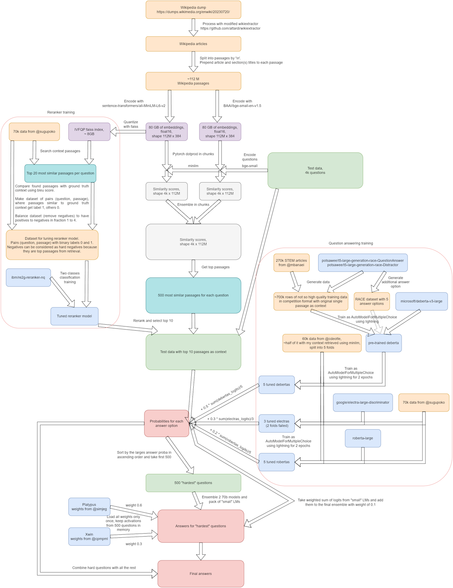

The Kaggle competition "Kaggle - LLM Science Exam" wrapped up on May 15th, attracting over 2,600 teams.

Though I wasn't among the competitors, I'm going to create a retrospective analysis on the winners' solutions, as they offer valuable insights into how we use LLMs for answering questions based on certain contexts.

## Problem Setting

In this competition, the task was to answer science questions written by an LLM, specifically GPT-3.5, on a topic drawn from Wikipedia. Each question presented five possible choices. Participants had to rank the five choices in the descending order of correctness. Then the submissions were evaluated based on **mean average precision** (**MAP**) @5.

This competition is interesting in 3 ways:

- Due to the Kaggle Notebook's constraints, the largest model that can run in a ordinary setting waas around 10B. So, this competition could be seen as a problem of using smaller LLMs to answer questions from larger LLMs
- The simplest approach to this problem was to use large text models for classification. But there was a much more promising approach, **retrieval augmented generation** (**RAG**). This is, as you may know, the hottest topic in the industry nowadays
- The provided train set contained only 400 questions, meaning that crafting high-quality datasets (for training and for retrieval) could be a key to winning

## Final Standings

The final standings are in the image below.

## Solutions

Let's have a look the solutions of the top five teams.

### 1st Place

[Team H2O LLM Studio](https://www.kaggle.com/competitions/kaggle-llm-science-exam/discussion/446422) secured the first place by making the full use of LLMs and RAG.

In the retrieval phase, the team diversified their knowledge sources by using different Wikipedia dumps. An attempt to filter the sources for science articles did not work because the retrieval models were robust enough to ignore irrelevant documents. They incorporated different models from [MTEB leaderboard](https://huggingface.co/spaces/mteb/leaderboard) and embedded the concatenations of title and article chunk. The retrieval was done by a simple, but scalablly implemented PyTorch matrix multiplication.

For training data, they relied on [@radek1's 6.5k samples generated by GPT-3.5](https://www.kaggle.com/datasets/radek1/additional-train-data-for-llm-science-exam). On this dataset, they fine-tuned all the linear layers of LLMs (7B - 13B) with LoRA, using a binary classification approach. Each model took as input a concatenation of retrieved contexts, question, and one of the possible answers, and it predicted the likelihood of the answer being correct. During the inference time, this prediction was repeated for all the five choices and the they were sorted in the order of the predicted score. It is worth noting that during this process, [the context and question was cached as `past_key_values`](https://discuss.huggingface.co/t/past-key-values-why-not-past-key-values-queries/31941).

They created five 7B models and one 13B model with different configurations (data source, embedding model, and the number of retrieved chunks) and ensembled the outputs.

### 2nd Place

Solo competitor [@solokin](https://www.kaggle.com/competitions/kaggle-llm-science-exam/discussion/448256) clinched the runner-up spot by blending traditional and cutting-edge methods.

The retrieval system utilized [graelo/wikipedia/20230601.en](https://huggingface.co/datasets/graelo/wikipedia/viewer/20230601.en) dataset as a single source of knowledge. Documents were segmented into sentences and organized into overlapping chunks, which then were indexed using [Apache Lucene's **BM-25** algorithm](https://lucene.apache.org/core/7_0_1/core/org/apache/lucene/search/similarities/BM25Similarity.html). Retrieved chunks were reordered by a DeBERTa v3 reranker when composing a prompt.

For training, they first curated a larger dataset than [@radek1's](https://www.kaggle.com/datasets/radek1/additional-train-data-for-llm-science-exam). Then they trained models (DeBERTa v3 and Mistral) with a multi-class classification objective.

The outputs of these models were mixed by a custom XGBRanker.

### 3rd Place

[@podpall](https://www.kaggle.com/competitions/kaggle-llm-science-exam/discussion/446358) created a huge pipeline including many small LMs and even two 70B models! I won't go into the details of this, but it's incredible to manage to run this system on a Kaggle's notebook.

### 4th Place

[📝 Preferred Scantron 📝](https://www.kaggle.com/competitions/kaggle-llm-science-exam/discussion/446307) earned fourth place without using billion-parameter models for answering questions.

The team used Elasticsearch for sentence-wise keyword retrieval. They reranked the results via different methods: Elasticsearch score, edit distance score, and semantic search score. This system was tested in a zero-shot manner using a Llama 2 7B model and a subset of [@radek1's questions](https://www.kaggle.com/datasets/radek1/additional-train-data-for-llm-science-exam).

They trained a DeBERTa v3 Large model (~300M parameters) on token lengths up to 1280 tokens. As they increased tokens from 512 to 1280, their public score steadily increased.

The ensemble strategy involved using multiple contexts reranked by different metrics.

### 5th Place

[Preferred おしゃべりんぼう(ChattyKids)](https://www.kaggle.com/competitions/kaggle-llm-science-exam/discussion/446293) took the fifth prize with a 70B model and a 3-stage inference strategy.

For finding the right information, they leaned on [pyserini](https://github.com/castorini/pyserini)'s implementation of BM25. They also implemented dense retrieval by embedding sentences and paragraphs from the Wikipedia dump.

In the modeling phase, they used Mistral 7B and Llama 2 70B, with a focus on non-instruction tuned models. They finetuned models for a multi-class classification objective using QLoRA with 4-bit quantization and [xFormers](https://github.com/facebookresearch/xformers)' `memory_efficient_attention` to manage GPU memory constraints.

Finally, they adopted a unique 3-stage inference pipeline, where smaller models like Mistral 7B answer easy problems and larger models like Llama 2 70B answer difficult problems. This way, they made full use of the limited inference time.

## Conclusion

In this blog post, I summarized top-5 solutions from Kaggle's "LLM Science Exam" competition. Through writing this post, I learned the following takeaways:

- High-quality data was essential for good retrieval
- It was beneficial to have diverse contexts retrieved by different algorithms such as BM-25, Elasticseach, BERT family, and LLM
- Reranking helped to make the diverse contexts more relevant
- Given sufficient contexts, DeBERTa v3 was still competitive to 70B LLMs in multiple choice questions

## References

[1] [kaggle LLM コンペ　上位解法まとめ](https://zenn.dev/yume_neko/articles/7347ba6b081e93)  
[2] [Kaggle コンペ（LLM Science Exam）の振り返りと上位解法まとめ](https://zenn.dev/nishimoto/articles/aff1fba9c75c34)
