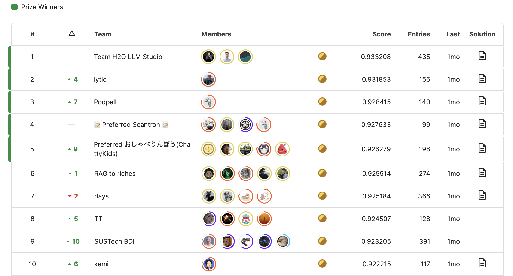

The Kaggle competition "Kaggle - LLM Science Exam" concluded on May 15th, attracting over 1,000 participants.

While I didn't participate in this competition, I'd like to retrospectively create a report discussing the winners' solutions, as they offer valuable insights into multi-modal models and image generation.

## Problem Setting

In this competition, participants were tasked with answering science questions written by an LLM. Specifically, each question is 5-choice question and written by GPT-3.5 on a scientific topic drawn from Wikipedia. Participants submit their answers by sorting the 5 choices in the descending order of likelihood. Then the submissions are evaluated based on **mean average precision** (**MAP**) @5.

This competition is interesting in 3 ways:

- Due to the Kaggle Notebook's constraints, the largest model that can run in a ordinary setting is around 10B. So, this competition can be seen as a problem of using smaller LLMs to answer questions from larger LLMs
- The simplest approach to this problem is to use large text models for classification. But there is a much more promising approach, **retrieval augmented generation** (**RAG**), which is the hottest topic in the industry nowadays
- The provided train set contains only 400 questions, which means that crafting quality datasets (for training and for retrieval) can be a key to success

## Final Standings

The final standings are in the image below.

## Solutions

In this section, I'd like to review the solutions of the top three teams.

### 1st Place

[Team H2O LLM Studio](https://www.kaggle.com/competitions/kaggle-llm-science-exam/discussion/446422) clinched the top position making the full use of LLMs and RAG.

In the retrieval phase, the team diversified their knowledge sources by using different Wikipedia dumps. The attempt to filter the sources for science articles did not work because the retrieval models were good enough not to distracted by irrelevant documents. They incorporated different models from [MTEB leaderboard](https://huggingface.co/spaces/mteb/leaderboard) and embedded the concatenations of title and article chunk. The retrieval was done by a simple but scalablly implemented PyTorch matrix multiplication.

As for training data, they relied on [@radek1's 6.5k samples generated by GPT-3.5](https://www.kaggle.com/datasets/radek1/additional-train-data-for-llm-science-exam). On this dataset, they fine-tuned linear layers of LLMs (7B - 13B) with LoRA, using a binary classification approach. A model takes a concatenation of retrieved context, question, and one choice out of five, and it predicts the probability of the choice being the true answer. At inference, this prediction is done over five candidates and the candidates are sorted in the order of the predicted score. It is worth noting that at this process, [the contexts and questions can be cached as `past_key_values`](https://discuss.huggingface.co/t/past-key-values-why-not-past-key-values-queries/31941).

They created five 7B models and one 13B model with different configurations (data source, embedding model, the number of retrieved chunks) and ensembled the outputs.

### 2nd Place

[@solokin](https://www.kaggle.com/competitions/kaggle-llm-science-exam/discussion/448256) won the solo second prize by BM-25 search and DeBERTA / Mistral multi-class classification.

The retrieval system utilized [graelo/wikipedia/20230601.en](https://huggingface.co/datasets/graelo/wikipedia/viewer/20230601.en) dataset as a single source of knowledge. Documents were segmented into sentences and organized into overlapping chunks, which were indexed using [Lucene's **BM-25** algorithm](https://lucene.apache.org/core/7_0_1/core/org/apache/lucene/search/similarities/BM25Similarity.html). Retrieved chunks were reordered by a DeBERTa v3 reranker model when composing a prompt.

For training, they first curated a larger dataset than @radek1's. Then they trained models (DeBERTa v3 and Mistral) with a multi-class classification objective.

The outputs of these models were mixed through a custom XGBRanker.

### 3rd Place

[@podpall](https://www.kaggle.com/competitions/kaggle-llm-science-exam/discussion/446358)

### 4th Place

[📝 Preferred Scantron 📝](https://www.kaggle.com/competitions/kaggle-llm-science-exam/discussion/446307)

### 5th Place

[Preferred おしゃべりんぼう(ChattyKids)](https://www.kaggle.com/competitions/kaggle-llm-science-exam/discussion/446293)

## References

[1] [kaggle LLMコンペ　上位解法まとめ](https://zenn.dev/yume_neko/articles/7347ba6b081e93)  
[2] [Kaggleコンペ（LLM Science Exam）の振り返りと上位解法まとめ](https://zenn.dev/nishimoto/articles/aff1fba9c75c34)