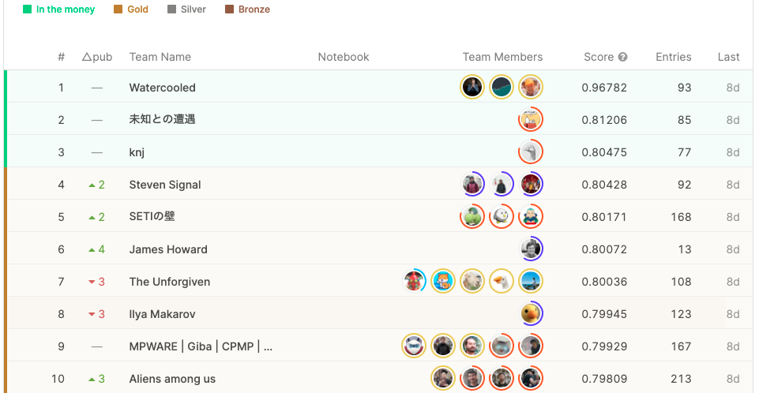
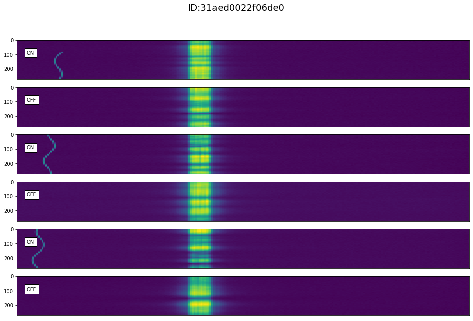
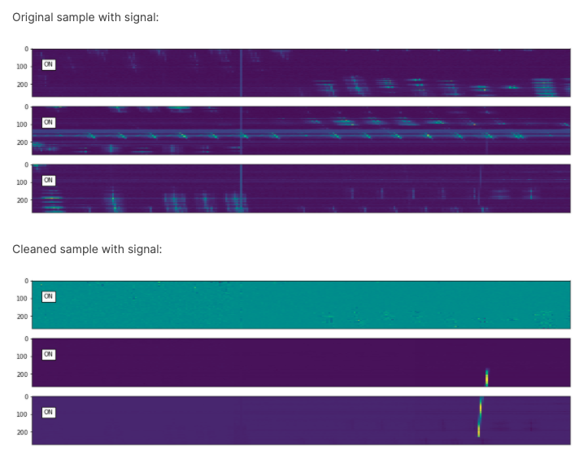
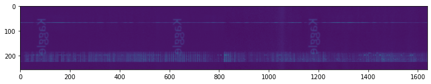
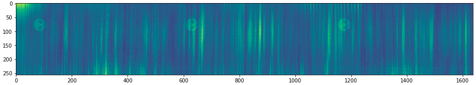
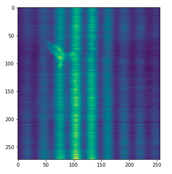

On August 18, the Kaggle SETI competition that I was participating in came to an end. This competition was hosted by Berkeley SETI Research Center, and participants competed on how accurately they can identify anomalous signals from the tremendous amount of data recorded by the Green Bank Telescope. Since we haven't observed any signals from extraterrestrials (officially), the dataset was artificially generated by the host.

<small>The Green Bank Telescope, West Virginia, US.</small>

768 teams joined in the end, and I came in 198th (26%).

In this post, I briefly introduce the task for non-participants, and summarize the top 5 teams' solutions and mine. Finally, I explain why "old leaky data" is included in the dataset and what it is.

## Task
The task was to predict whether the spectrograms contained signals from E.T or not. The evaluation metric was AUC. There were 60,000 training samples and 40,000 test samples, 10% of which were positive. Each sample is a set of 6 spectrograms, or a "cadence". They are continuous in time, but the first, third, and fifth are referred to as "on target" signals that come from the target star, while the rest are "off target" signals from the nearby stars. If there is a pattern in "on target" and no pattern in "off target", then the signal is a candidate signature of extraterrestrial technology (a positive sample)! If the pattern is also seen in "off target", it should be a human-generated artifact (a negative sample). Here is an example of positive cadence.

Does it look easy? Unfortunately, real samples are much harder to distinguish. It's literally like a "needle in a haystack".

For more information, see [Data Information section](https://www.kaggle.com/c/seti-breakthrough-listen/overview/data-information).

## Final Standings
The final standings were quite interesting. The top team "Watercooled" is more than 0.15 ahead of the other teams in AUC. What did they do??

## Solutions
Here is a summary of the top five teams' solutions and mine. They are listed in order of score for consistency, but considering the uniqueness of the 1st place solution, you might want to read the other solutions first and then the 1st place.

### 1st Place
[The team "Watercooled" (@philippsinger, @christofhenkel, and @ilu000)](https://www.kaggle.com/c/seti-breakthrough-listen/discussion/266385) solved the task almost perfectly. The super team examined the CV/LB gap carefully and came up with two "magics" that led them to the victory.

**The magic #1: S-shaped signal in the test set**
- Some models were significantly better than others in LB even though they performed similarly in CV
- Good models were able to detect S-shaped signals that only appear in the test set

- Injected this kind of signals to the train set using [setigen](https://github.com/bbrzycki/setigen)

**The magic #2: Removing the background noise**
- There are common background patterns as discussed [here](https://www.kaggle.com/aristarhbfg/similar-images-in-train-and-test)
- By retrieving similar images and subtracting the pixel intensity, the background noise was successfully removed

**Training details**
- Did NOT use blending or pseudo labeling
- Concatenated 3-channel cadences to 1 channel WITHOUT resizing
- NFNet (eca\_nfnet\_l2) performed better probably because they are sensitive to the distributional differences thanks to its normalizer-free architecture
- Trained the single-fold model for 20 epochs
- Used the new train set and the old train and test set, both cleaned and non-cleaned
- Enlarged the input images by changing the stride of the first convolution layer to (1,2)
- Data augmentation (mixup and vertical flip)
- Test-time augmentation

### 2nd Place
[@hirune924](https://www.kaggle.com/c/seti-breakthrough-listen/discussion/266397) won second place with a surprisingly simple solution. It seems to me that every single component was essential for the high score.

**1st Stage** 
- Concatenated 6-channel cadences to 1 channel and resize them to 512x512
- Trained EfficientNet B5 for 20 epochs (bigger models worked better)
- Data augmentation (mixup, vertical flip, and cutout)
- Test-time augmentation
  
**2nd Stage**
- Further trained the model with the pseudo-labeled test set
- Stronger regularization (stochastic depth and dropout) were applied to avoid overfitting

### 3rd Place
[@knjcode](https://www.kaggle.com/c/seti-breakthrough-listen/discussion/266403) explored the model architecture.

- Concatenated 3-channel cadences to 1 channel and resize them to 768x768
- Adopted EfficientNet B1, B2, B3, and B4 as the backbone
- Appended a [triplet attention module](https://arxiv.org/abs/2010.03045) and a [Generalized-Mean (GeM) pooling](https://arxiv.org/abs/1711.02512) layer to the backbone
- Trained the model for 60 epochs
- Further trained the model for 10 epochs with the 5,000 pseudo-labeled test samples
- Data augmentation (mixup, horizontal/vertical flip, etc)
- Test-time augmentation

### 4th Place
[The team "Steven Signal" (@sherlockkay, @kulyabin, and @bakeryproducts)](https://www.kaggle.com/c/seti-breakthrough-listen/discussion/266396) took almost every possible approach, among which mixed sample data augmentations and focal loss were the keys. The team also tried injecting S-shaped signals and cleaning the background noise but couldn't improve AUC.

- Concatenated 6-channel cadences to 1 channel and resize them to 960x768
- Trained nf-regnetb1 and HRNet18 with focal loss
- Mixed sample data augmentations, such as mixup and cutmix, are effective

### 5th Place
[The team "SETIの壁" (@sinpcw, @kzkt0713, and @sunakuzira)](https://www.kaggle.com/c/seti-breakthrough-listen/discussion/266394) tried many things to tackle the domain shift and reported that [SHOT](https://github.com/tim-learn/SHOT) was useful.

**Solution**
- Concatenated 3-channel cadences to 1 channel and resize them to 512x512
- Trained NFNet (eca\_nfnet\_l2) and EfficientNetV2-medium
- Further trained the models with the pseudo-labeled test samples (all or only reliable ones)
- Unsupervised domain adaptation with SHOT
- Data augmentation (mixup, horizontal/vertical flip, etc)
- Test-time augmentation

**What did not work**
- Using off-target channels
- Focal loss and weighted cross entropy loss
- Pretraining with the old leaky data

### My Solution (198th Place)
I joined this competition in the early phase and did my best on it. I published [a notebook titled "Search for Effective Data Augmentation"](https://www.kaggle.com/shionhonda/rerun-search-for-effective-data-augmentation), and I got to the bronze zone for the first time in my life. But since the leakage was reported, I had been focusing on the [CommonLit Readability Prize competition](https://www.kaggle.com/c/commonlitreadabilityprize). I was back one week before the deadline and found the game to be much more difficult than before the reset.

My solution was heavily based on [the clean and powerful notebook by @tuckerarrants](https://www.kaggle.com/tuckerarrants/seti-learned-image-resizing). It resizes the input images with custom convolution layers before feeding them to the backbone (e.g., EfficientNet) to avoid information loss during the non-parametric interpolation. By replacing EfficientNet B0 with B3 and averaging over 5-fold models, the score increased from 0.745 to 0.768 (I should have tried even bigger models...).

I also tried [adversarial validation](https://www.kaggle.com/shionhonda/seti-train-efficientnetb0-av), but it resulted in poor scores. Given that the AUC of the train/test classification model was 0.999, the two domains overlap too little for adversarial validation to work.

## About Old Leaky Dataset
As I mentioned earlier, two kinds of leakage were discovered in the course of the competition, which caused the entire dataset to be reset.

In the early stage, the number of digits displayed on the leaderboard was only to the second decimal place, and we thought AUC=0.99 could be possible, but when it started to display to the third decimal place and the top team's score was revealed to be 0.999, everyone was convinced that it was leakage. And in fact, there were two kinds of leakage.

### What was the Leakage?
First, [@kazanova reported](https://www.kaggle.com/c/seti-breakthrough-listen/discussion/246772) that it was possible to identify the target variable from the timestamp and ID of the numpy file.

Second, [@nyanpn reported](https://www.kaggle.com/c/seti-breakthrough-listen/discussion/246901) that positives and negatives are easily distinguished just by some simple statistics such as standard deviation.

Fortunately, this competition used simulated data, so the host regenerated a leak-free dataset. The competition was relaunched with an extended deadline.

### "Easter Eggs"
In the old data, there were some hidden patterns in the spectrograms. This used to be one of the hot topics.

["kaggle"](https://www.kaggle.com/c/seti-breakthrough-listen/discussion/239438)

[Alien face](https://www.kaggle.com/c/seti-breakthrough-listen/discussion/241076) (found by me!)

[Rocket](https://www.kaggle.com/c/seti-breakthrough-listen/discussion/241234)

