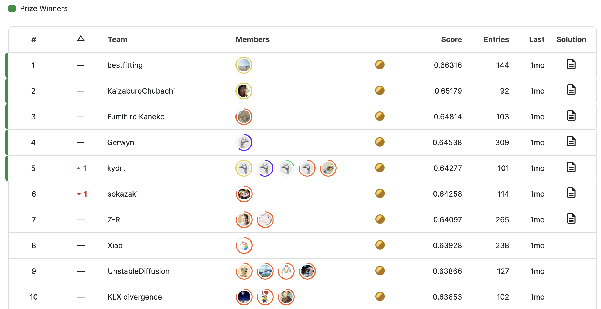

The Kaggle competition "Stable Diffusion - Image to Prompts" concluded on May 15th, attracting over 1,000 participants.

While I couldn't participate in this competition, I'd like to retrospectively create a report discussing the winners' solutions, as they offer valuable insights into multi-modal models and image generation.

## Problem Setting

In this competition, participants were tasked with inverting text-to-image. Specifically, given an image generated by [**Stable Diffusion 2.0**](https://huggingface.co/stabilityai/stable-diffusion-2/blob/main/768-v-ema.ckpt) (**SD2**), the goal was to predict the prompt that was used to generate that image. Rather than submitting predicted prompts, participants were required to submit 384-dimensional embedding vectors. Embedding was done by a [Sentence Transformer model provided by the host](https://www.kaggle.com/datasets/inversion/sentence-transformers-222).

Submissions were evaluated based on the **mean cosine similarity** score between the predicted embedding vectors and the ground truth vectors. While many participants directly predicted the embedding vector, it was also possible to predict the original prompt and then feed it into the Sentence Transformer.

Interestingly, the competition host only provided 7 images for training. As a result, participants had to generate their training data by themselves, as there were no publicly available datasets of images generated by SD2.

<small>An example of the provided images: "ultrasaurus holding a black bean taco in the woods, near an identical cheneosaurus".</small>

## Final Standings

The final standings are in the image below. It is worth noting that this competition was particularly stable, possibly due to the fact that the evaluation dataset was synthesized.

## Solutions

In this section, I'd like to review the solutions of the top three teams.

### 1st Place

[@bestfitting](https://www.kaggle.com/competitions/stable-diffusion-image-to-prompts/discussion/411237) achieved the first prize by utilizing the largest number of training samples among the top teams. They created two sets of prompts:

- PROMPT_HQ consisted of 2M prompts from various sources: DiffusionDB, COCO Captions, Vizwiz, ChatGPT etc. For each prompt, two images were generated using different random seeds. This dataset was used for finetuning the models, specifically by performing regression on the output of the Sentence Transformer.
- PROMPT_LQ comprised 6.6M prompts selected from COYO-700M based on certain criteria. This dataset was used to continue the pretraining process of the models (e.g., contrastive learning of CLIP models).

They generated images from these prompts and trained various models such as:

- **CLIP** (ViT-L)
- CLIP (ConvNeXt-XXL)
- **BLIP-2** (ViT-g + Q-Former; LLM component was removed)

In the finetuning process, they employed **LoRA** (**low-rank adaptation**) for better accuracy and efficiency.

Generating 10 millions of images was not trivial. To accelerate the process, @bestfitting employed several techniques, such as:

- [xFormers](https://github.com/facebookresearch/xformers)
- FP16 computation
- Downsizing output images

These techniques together reduced the generation time per image from 15 secs to 2 secs. Even with these optimizations, generating 10.6 million images still required 245 GPU-days.

### 2nd Place

[@zaburo](https://www.kaggle.com/competitions/stable-diffusion-image-to-prompts/discussion/410606) also relied on a large set of training samples.

The dataset was created in a manner roughly similar to @bestfitting's approach, but @zaburo used a different set of models:

- CLIP (ConvNeXt-XXL)
- BLIP-2 (ViT-g + Q-Former)
- **EVA**02-L
- EVA02-e

On top of that, they

- used different random seeds every time of generation to increase the diversity of images
- employed a technique called "linear probe and then finetune" (**LP-FT**), where they trained the last linear layers before finetuning the entire model [2]
- used a higher resolution for images by interpolating positional encoding during pretraining

### 3rd Place

[@sai11fkaneko](https://www.kaggle.com/competitions/stable-diffusion-image-to-prompts/discussion/410686) won the third place using only 400K images.

The set of prompts consisted of Vizwiz, DiffusionDB, COCO Captions, and Lexica.art. They found that Vizwiz, with its descriptive and diverse captions, played a crucial role in the competition.

During CLIP training, @sai11fkaneko employed LP-FT and layer-wise learning rate decay techniques.

## References

[1] Kazuki Fujikawa. [Stable Diffusion - Image to Prompts - Speaker Deck](https://speakerdeck.com/kfujikawa/stable-diffusion-image-to-prompts). 2023.  
[2] Ananya Kumar, Aditi Raghunathan, Robbie Jones, Tengyu Ma, Percy Liang. "[Fine-Tuning can Distort Pretrained Features and Underperform Out-of-Distribution](https://arxiv.org/abs/2202.10054)". *ICLR*. 2022.
