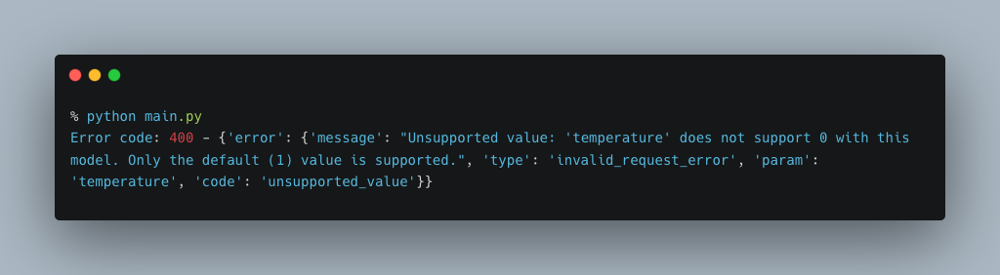
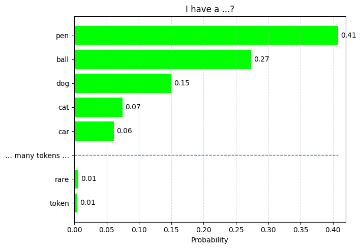
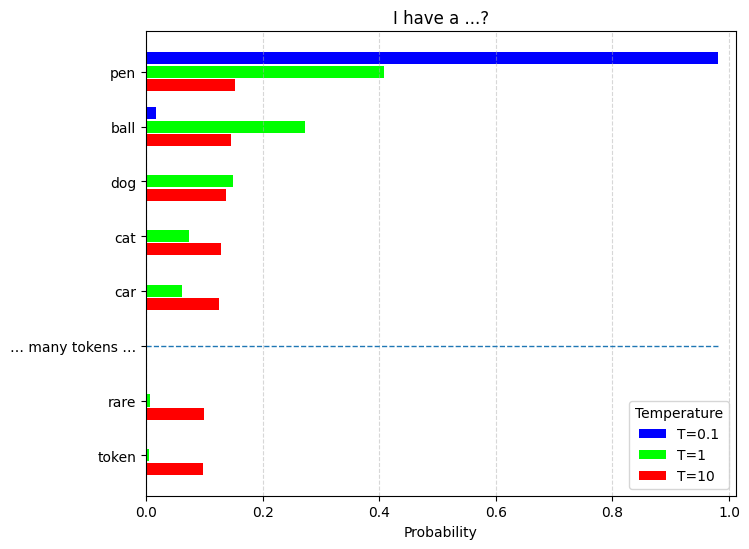
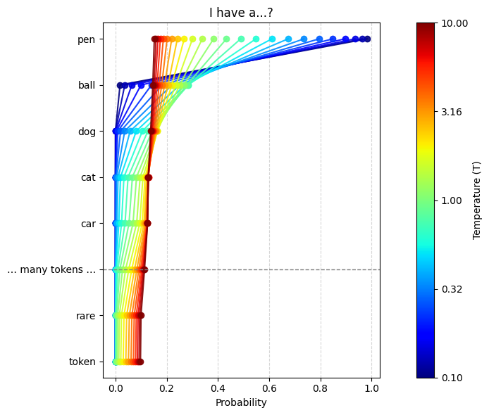
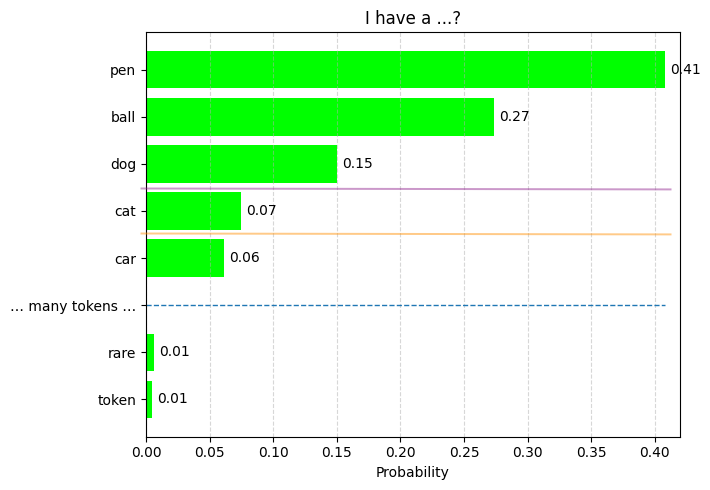
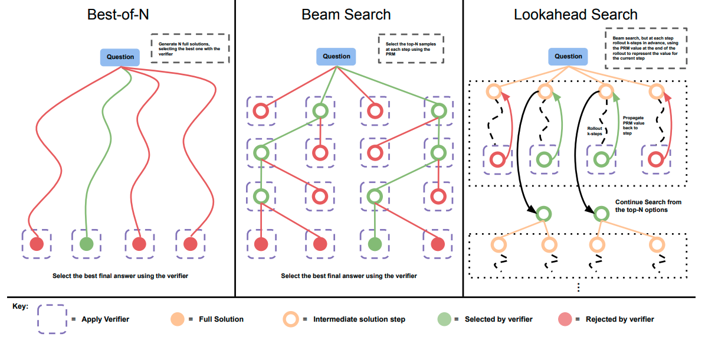

TL;DR: Modern reasoning models like GPT-5, o3, and o4-mini disable sampling parameters such as `temperature` and `top_p` because their internal generation process likely involves multiple rounds of reasoning, verification, and selection. Allowing users to adjust these parameters would disrupt the carefully calibrated process that ensures high-quality and safe outputs.

<small>Unsupported value: 'temperature' does not support 0 with this model. Only the default (1) value is supported.</small>

 

Have you seen this error before? You set a `temperature` (or `top_p`, `logprobs`) for GPT-5, o3, or o4-mini and the API rejects it. Why don’t these models expose those sampling knobs?

To answer this question, let’s quickly review how sampling normally works in language models—and then we’ll sketch a plausible internal pipeline for modern "reasoning" models that explains why those knobs are turned off.

## Temperature and Sampling Basics

Language models output a probability distribution over the **vocabulary** at each inference step. The raw model outputs are **logits** (unnormalized scores) for each token in the vocabulary. To convert logits to probabilities, we use the **softmax function**:

$$
p_i \;=\; \frac{\exp\!\left({z_i}\right)}
                  {\sum_{j=1}^K \exp\!\left({z_j}\right)}
$$

where $z_i$ is the logit for the $i$-th token, and $K$ is the vocabulary size. $K$ is typically on the order of 100k tokens for modern large language models (LLMs).

Let's say the model is predicting the next token that follows "I have a". The probability distribution might look like this:

In this case, the model generates "pen" 41% of the time, "ball" 27% of the time, and so on. If you want to adjust the "creativity" of the output, you can change the **temperature** parameter, which rescales the logits before applying softmax. The temperature $T$ modifies the softmax function as follows:

$$
p_i(T) \;=\; \frac{\exp\!\left(\tfrac{z_i}{T}\right)}
                  {\sum_{j=1}^K \exp\!\left(\tfrac{z_j}{T}\right)}
$$

What does this mean? When $T=1$, the distribution is identical to the original softmax distribution. When $T \to \infty$, $p_i(T)$ approaches $\frac{1}{K}$, a uniform distribution over all tokens. When $T \to 0$, $p_i(T)$ approaches a one-hot distribution that puts all probability mass on the token with the highest logit. This is called "**greedy decoding**," which deterministically picks the highest-probability token. [^1]

You can see this effect in the figure below. Here's the effect of different temperature settings ($T=0.1, 1, 10$):

Another visualization of how temperature affects the distribution is shown below:

## Different Sampling Strategies

The discussion above describes naive sampling, where you sample directly from the full softmax distribution. This can lead to incoherent or repetitive text, especially in long generations. To mitigate this, several sampling strategies have been developed.

### Top-k Sampling

<small>Top-k and top-p cut off the candidate tokens with the given threshold.</small>

 

**Top-k sampling** truncates the candidate pool to the top $k$ tokens, then samples. It reduces extremely low-probability picks while keeping some variety. However, choosing the optimal $k$ is hard and can lead to abrupt cutoffs in the distribution.

### Top-p Sampling

**Top-p sampling**, also known as **nucleus sampling**, adapts the token pool based on probability mass rather than a fixed count. Instead of picking the top $k$ tokens, it keeps the smallest set of tokens whose cumulative probability is at least $p$, then samples. So `top_p=0.6` means only the tokens comprising the top 60% of the probability mass are considered. This adapts the pool size to model uncertainty and often yields more natural, less degenerate text than naive sampling.

### Sampling with search and re-ranking

The strategies above sample one token at each position in the sequence, which can lead to locally optimal but globally suboptimal sequences. Can we improve quality by considering multiple candidate sequences? Yes—through search and re-ranking.

<small>Advanced sampling methods with search and re-ranking. Image taken from "<a href="https://arxiv.org/abs/2408.03314v1">Scaling LLM Test-Time Compute Optimally can be More Effective than Scaling Model Parameters</a>."
</small>

 

**Best-of-N sampling** is the simplest version: generate $N$ independent samples and pick the best one using a scoring function (e.g., **perplexity** or a separate value function, a "verifier"). This is common when we can verify the output automatically (e.g., math problems, code generation). [2]

**Beam search** keeps the top $B$ candidate sequences (beams) at each step, expands each beam with all possible next tokens, and retains only the top $B$ overall. This explores multiple paths and often yields higher-quality text.

**Lookahead search** goes further by simulating multiple future steps for each candidate token and estimating the long-term value of each choice. This is more computationally intensive but can significantly improve coherence and relevance.

## Why Reasoning Models Disable Temperature/Top‑p

The decoding path for modern reasoning models (like GPT-5, o3, and o4-mini) is likely more complex than a single pass of sampling from a softmax distribution. They may involve multiple rounds of generation, verification, and selection—at least in an internal chain-of-thought process—even if that process is hidden from the user. [3] Providers tune and calibrate these steps to get the best outcomes. Exposing external `temperature`/`top_p` would break those calibrations and destabilize quality and safety, so they’re disabled. For example, if the user set `temperature=0`, all the multiple paths of reasoning would collapse to a single greedy path, defeating the purpose of multi-pass reasoning.

To let users steer the output, OpenAI introduced parameters such as `reasoning_effort` and `verbosity`. `verbosity` is straightforward: it adjusts the length of the output. `reasoning_effort` is more interesting: it likely adjusts not only the depth of reasoning, but also the width (the number of paths). This hypothesis aligns with published research on test-time scaling of LLMs. [4]

[^1]: If you are interested in the (non-)determinism of LLMs, [this blog post from Thinking Machines](https://thinkingmachines.ai/blog/defeating-nondeterminism-in-llm-inference/) is a great read.
[^2]: Bradley Brown, Jordan Juravsky, Ryan Ehrlich, Ronald Clark, Quoc V. Le, Christopher Ré, Azalia Mirhoseini. [Large Language Monkeys: Scaling Inference Compute with Repeated Sampling](https://arxiv.org/abs/2407.21787). 2024.
[^3]: While open-source reasoning models such as [DeepSeek R1](https://arxiv.org/abs/2501.12948), [QwQ](https://qwenlm.github.io/blog/qwq-32b/), and [Magistral](https://arxiv.org/abs/2506.10910) do not seem to use these techniques, I believe this is a key difference between them and the closed-source models that disable sampling knobs.
[^4]: Charlie Snell, Jaehoon Lee, Kelvin Xu, Aviral Kumar. [Scaling LLM Test-Time Compute Optimally can be More Effective than Scaling Model Parameters](https://arxiv.org/abs/2408.03314v1). 2024.
