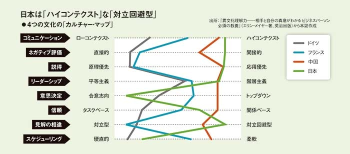

昨年8月にパリでソフトウェアエンジニアとしての新たな生活を始めてから、約1年が経ちました。当時書いた[就活体験記](https://hippocampus-garden.com/job_hunt_in_france/)は大きな反響をいただき、その後の生活について質問を頂戴することもありました。この1年という節目を迎えたことを機に、フランスでのエンジニア生活についての所感をまとめてみたいと思います。移住関係のこの記事では、エンジニアとしてパリでの仕事環境やテック業界に焦点を当ててお伝えします。海外でのキャリアに興味がある日本の技術者の皆さんに、パリでの具体的な体験や洞察を共有できればと思います。

## テック業界概観

フランス政府は2013年から「La French Tech」と称してスタートアップ支援に注力しており、各業界でイノベーションが進んでいます。特に、Yann LeCunを輩出したAI分野は歴史的に強みがあり、Meta AIやGoogle DeepMindの研究所設立、Hugging FaceやMistral AIなどの新興企業の誕生と、パリはここ10年ほどでロンドンと並んでヨーロッパの主要拠点となりました。AI以外の分野でも、Datadog、BlaBlaCar、Zenlyなどの有名企業が多数誕生しています。私が働いている保険・ヘルスケアテックのAlanもその一つです。

パリのテック業界は非常に活気があり、ミートアップに参加すれば業界のリーダーたちと直接会って話すことができます。また、スタートアップエコシステムは日本に比べて成熟しており、Big Techやスケールアップ（UberやAirbnbなど）から転職してくる人も多いです（それだけのアップサイドがあるということです）。人材・資金・ノウハウの3点においてグローバルな挑戦がしやすい環境が整っていると言えるでしょう。

## 日本との職場環境や文化の違い

日本とフランスの職場環境には相違点がいろいろあります。まず、よく知られていることですが、フランスではプライベートの時間が重視されます。標準的には週35時間労働、年間5週間の有給休暇と定められており、月に何十時間も残業するというような話はあまり聞きません。7-8月のバカンスシーズンにはパリ市内が閑散とし、諸々のサービスが滞るほどです。また、私の会社ではあまり見かけませんが、昼休みを2時間とって一時帰宅するという人もいるそうです。

それから、コミュニケーションのスタイルも異なります。Erin Mayer著の『[The Culture Map](https://erinmeyer.com/books/the-culture-map/)』で論じられている通り、日本ではハイコンテキストで対立回避型のコミュニケーションが好まれる一方で、フランスでは衝突を招くとしても率直なコミュニケーションが好まれます。これは「フランス人は文句が多い」というステレオタイプとも通底していると思います。Alanにおいてもこの点は顕著で、入社したばかりの平社員がCXOの意見にはっきりと反論するといったことも珍しくありません。私はどちらかというと鈍感なタイプなので、フランスのスタイルの方が肌に合っていると感じます。

<small>画像は「<a href="https://business.nikkei.com/atcl/seminar/20/00046/080300003/">文化的差異の8指標、世界のレンズで見た日本の姿とは：日経ビジネス電子版</a>」より引用。</small>

<!-- 補足しておくと、Alanは創業期から公用語を英語にしている珍しい会社ですが、パリの本社オフィスではフランス人やフランス語話者が大多数を占めています。外国人もヨーロッパ圏出身の人が多いです。 -->

ここまではフランス対日本という軸で話をしてきましたが、Alanには他のフランスのスタートアップとも違う特異な文化があります。例えば、管理職がいない、あらゆる社内情報（意思決定プロセスや人事評価なども含む）が社内の誰からでも参照できる、"keeper test"を実践している、口頭よりも書面でのコミュニケーションを好む、などです。これらが実際に絶妙な調和の上で機能しており、効率的に大きな成果を出しやすい環境ができています。これには企業文化の潜在的なパワーを実感したので、いつか日本に帰国する際にはこの文化を持ち帰れればと考えています。

## 具体的な仕事内容

現在、私は健康保険サービスのカスタマーサポートを自動化ないし補助するためのチャットボットの開発に取り組んでいます。フルスタックエンジニアとして、機械学習やLLM周辺だけでなくバックエンドやフロントエンドも担当しています。強力な基盤モデルが登場するようになって以来、純粋な機械学習だけで価値創出することがますます難しくなっていると感じていたので、システム全体の開発を通してより広いスコープの問題に取り組めるようになったのは自分のキャリアにとって大きな収穫であり、また同時にやりがいを感じているところでもあります。今後は、ここで得た経験をヘルスケアサービスにも活かしていきたいと考えています。

現時点で公開できる成果はまだ少ないですが、社内の機械学習勉強会で発表した内容を元にしたブログ記事が公開されているので、興味があれば『[Benchmarking Large Language Models](https://medium.com/alan/benchmarking-large-language-models-1e1ab5b809ac)』をご覧ください。

## 仕事で苦労した点

最後に、新天地で働く上で特に大変だった点について触れておきます。そもそも転職というものが大変であるところ、今回は職種・文化・言語という3つのギャップを同時に埋める必要がありました。

### 職種・技術スタックの違い

機械学習エンジニアからフルスタックのソフトウェアエンジニアへの転身ということで、バックエンドとフロントエンドの知識を「趣味で触った程度」から「本番で使える程度」にまで引き上げる必要がありました。しかし、Alanでは技術選択において広く普及しているもの（主にはFlaskとReact）を戦略的に採用しているため、PythonとJavaScriptの経験があった自分にとっては数ヶ月の努力で追いつくことができました。

### 文化のギャップ

日本の大企業からフランスの、それも特殊な文化を持った会社に転職したことで、上述のような文化の違いを経験しました。特に、入社直後から「もっと自分の意見をはっきり言え」と口を酸っぱくして言われたことは印象的でした。「まずは周りに従ってみよう」という日本の感覚が通用しない瞬間でした。しかし、会社の丁寧な育成制度や率直なフィードバックのおかげで、比較的スムーズに適応できたと思います。

### 言語のギャップ

入社直後は英語力の不足を痛感する場面が多々ありましたが（汗）、現在はindividual contributorとしての仕事には困らない程度に上達したと思います。しかし、これで十分というわけではなく、自分の仕事の成果を最大化する上でボトルネックになっているのはやはり英語力です。今でも、異なる職種の人と上段の抽象的な議論をする際には英語力の不足を感じますし、読み書きのスピードも同僚より遅いです。これは一朝一夕で身につくものではないので、実践を通して気長に訓練するしかありません。

## おまけ：生活面での雑感

パリは汚さと悪臭にうんざりすることもありますが、それでも人生のほとんどを東京で過ごした自分にとって新鮮で魅力的な街です。

平日は基本的に毎日出社していますが、パリのコンパクトさのおかげで、通勤は30分程度で済みます。メトロの混雑もさほど気にならないので読書が捗ります。

週末はよく公園、スーパーマーケット、美術館、カフェなどに出かけて新しい発見をしています。パリには素晴らしい公園が多数あります。よく手入れされた花壇、青々と茂った大木、大きな池、そこに集まる水鳥たち。中心部から20分程度の距離にこれほどの自然があるのは、元東京都民としては驚きです（東京にも皇居がありますが…）。また、こちらの食材でフランスやイタリアの料理を作るのも楽しいです。

まとまった休みが取れると、フランス国内やヨーロッパ各地に旅行に出かけることもあります。フランス国内はTGVやFlixBusなどの交通手段が充実しているので、パリから日帰りで行ける観光地が多いです。また、ヨーロッパ各地への航空便も多く、週末にはロンドンやベルリン、バルセロナなどに行くこともできます。

食べ物、家賃、物価、フランス語

## まとめ

いろいろな苦労もありますが、パリでの生活は総じて大いに充実していますし、仕事のやりがいや成長の実感という観点でも申し分ありません。移住のきっかけは家族事由だったわけですが、今では私の方がパリ生活を延長したがっています。エンジニアの海外移住というと北米やイギリスが人気ですが、ぜひフランス、特にパリも検討してみてはいかがでしょうか。この記事が具体的なイメージを持つ助けとなれば幸いです。

また、仕事とは関係のない生活や移住関連の情報についても別の記事で書こうと思っているので、こちらもお楽しみに。
