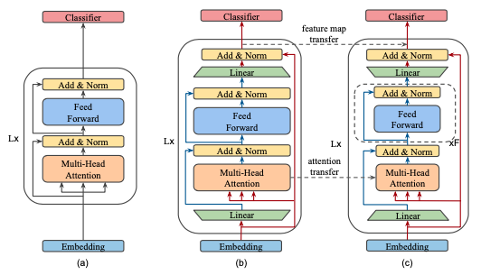
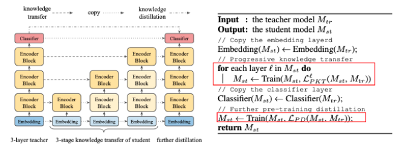
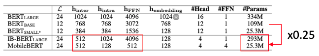
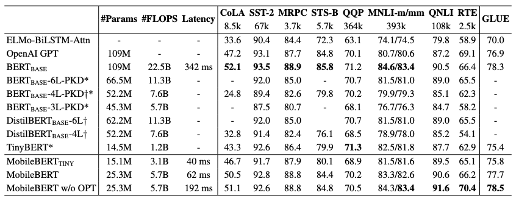

\* This post is based on my previous presentation at "BERT Applications Seminar." The slide is available [here](https://www.slideshare.net/ShionHonda/bertmobileberttensorflowjs) (in Japanese).

As mentioned in [an earlier post](https://hippocampus-garden.com/representation_learning/), **BERT** is well-known for its excellent performance on a variety of NLP tasks. When you try to use it on your device, however, you may find that it is too large to load on memory or it takes too long to infer as BERT-Base has as many as 100M parameters.

**MobileBERT** [1] is a more handy version of BERT with the reduced parameters and inference time and, of course, the same performance. It even allows us to use it on a web browser! In [a recent post](https://blog.tensorflow.org/2020/03/exploring-helpful-uses-for-bert-in-your-browser-tensorflow-js.html) by TensorFlow developers, they developed a prototype of the find-in-page search feature that takes questions as search queries [2]. Wouldn't it be nice?


<small>Figure taken from [2]</small>

In this demo, the MobileBERT model works purely on the browser (or client side) without any communication (e.g. with a cloud server). How is it possible? Let's find it out.

## MobileBERT Q&A Model
Specifically, the MobileBERT model in the demo above is MobileBERT fine-tuned on a reading comprehension dataset called [SQuAD 2.0](https://rajpurkar.github.io/SQuAD-explorer/). Each piece of data in SQuAD is a triplet of a passage, question, and answer. A question is posed on a passage from Wikipedia and the answer is a segment of text from the passage or \<no answer\>. Therefore, given a passage and a question, the model outputs some pairs of candidates and their score. For example, 

Passage: "Bert is Ernie's best friend and roommate on Sesame Street. The pair share the basement apartment at 123 Sesame Street."  
Question: "Where does Bert live?"  
Answers:

|      Candidate      | Score |
| :-----------------: | :---- |
|  123 sesame street  | 16.6  |
| 123 sesame street . | 12.8  |
|    sesame street    | 11.4  |

This demo is available [here](https://storage.googleapis.com/tfjs-models/demos/mobilebert-qna/index.html). Try it out!

## MobileBERT
The authors of MobileBERT aimed to make BERT storage efficient and computationally efficient so that it works on edge devices. They report that a straightforward distillation results in a significant accuracy drop and they propose a novel training strategy. 



<small>Figure taken from [1]</small>

It requires a teacher model called　(b) **inverted bottleneck BERT (IB-BERT)** and a student model called　(c) MobileBERT. IB-BERT is as large as (a) BERT-Large but has a special architecture. MobileBERT has the same number of blocks and the same I/O size ($\boldsymbol{h}_{inter}$) as IB-BERT, but the blocks are much smaller. 

### Training Strategy
While IB-BERT is trained just like BERT, MobileBERT is trained on a special strategy. First, the feature maps and attention are transferred from IB-BERT to MobileBERT by the **progressive knowledge transfer (PKT)**. It forces the blocks of MobileBERT to behave the same way as those of IB-BERT by *training block by block, from bottom to top*. When training one block, the others are frozen.

After training all the blocks by PKT, they are jointly trained by **pre-training distillation (PD)**. It distills the knowledge of IB-BERT to MobileBERT on the original **masked language modeling (MLM)**.



<small>Figure taken and modified from [1]</small>

These two training objectives together enable MobileBERT to copy IB-BERT as closely as possible.

### Model Architecture
PKT imposes a restriction on the two models: they must have the same number of blocks and the same block I/O size ($\boldsymbol{h}_{inter}$). On the other hand, MobileBERT is supposed to be small enough to work on edge devices and IB-BERT is supposed to be large enough to match the performance of the original BERT model. 

These two requirements are met by introducing the bottleneck architecture that separates the model width to inter-block width $\boldsymbol{h}_{inter}$ and intra-block width $\boldsymbol{h}_{intra}$. The table below compares the hyperparameters of the models. MobileBERT has the same size of $\boldsymbol{h}_{inter}$ as IB-BERT but has a smaller $\boldsymbol{h}_{inter}$, and its model size is 0.25 times smaller than that of IB-BERT.



<small>Figure taken and modified from [1]</small>

### Experimental Results
Empirical studies on GLUE benchmark and SQuAD dataset show that MobileBERT has *comparable performance to BERT-Base* and outperforms other compressed models, while *its model size and latency are remarkably reduced*.




\* Note that IB-BERT is distilled from BERT-Large, not BERT-Base. MobileBERT does not outperform BERT-Large.  
\* OPT refers to a MobileBERT variant without operational optimizations such as removing layer normalization. These optimizations hurt the model accuracy but accelerate inference.

### Differences from Previous Works
You may recall that **ALBERT** [3] is also a successful compressed model of BERT. What is the difference between MobileBERT and ALBERT? This is not discussed in the MobileBERT paper [1], but the following figure gracefully answers the question:


<small>Figure taken and modified from [4]</small>

*ALBERT is smaller but far slower than MobileBERT!*

The authors also emphasize the differences of MobileBERT from previous works are: (1) MobileBERT solely relies on knowledge transfer and does not require any fine-tuned teacher model and (2) MobileBERT reduces the width of BERT rather than the depth, which was shown to be more effective.

## TensorFlow.js
[**TensorFlow.js**](https://www.tensorflow.org/js) is a JavaScript library for using a machine learning model on browsers. 

> Develop ML models in JavaScript, and use ML directly in the browser or in Node.js.

TensorFlow.js:
- can use GPU easily via WebGL
- can import trained models from TensorFlow and Keras
- supports React Native

The demo shown at the top uses the [MobileBERT Q&A model](https://github.com/tensorflow/tfjs-models/tree/master/qna) implemented in TensorFlow.js. Actually, it is very easy to use. The model is loaded and called in the few lines of code:

```html
<script>
  // Load the model.
  qna.load().then(model => {
    // Find the answers
    model.findAnswers(question, passage).then(answers => {
      console.log('Answers: ', answers);
    });
  });
</script>
```
<br>

BERT is now more friendly to real-world applications. Let's develop your app with BERT!

## References
[1] Zhiqing Sun, Hongkun Yu, Xiaodan Song, Renjie Liu, Yiming Yang, and Denny Zhou. “[MobileBERT: a Compact Task-Agnostic BERT for Resource-Limited Devices](http://arxiv.org/abs/2004.02984).” ACL. 2020.  
[2] [Exploring helpful uses for BERT in your browser with Tensorflow.js — The TensorFlow Blog](https://blog.tensorflow.org/2020/03/exploring-helpful-uses-for-bert-in-your-browser-tensorflow-js.html)  
[3] Zhenzhong Lan, Mingda Chen, Sebastian Goodman, Kevin Gimpel, Piyush Sharma, and Radu Soricut. "[ALBERT: A Lite BERT for Self-supervised Learning of Language Representations](https://arxiv.org/abs/1909.11942)." ICLR. 2020.  
[4] [How TensorFlow Lite helps you from prototype to product — The TensorFlow Blog](https://blog.tensorflow.org/2020/04/how-tensorflow-lite-helps-you-from-prototype-to-product.html)