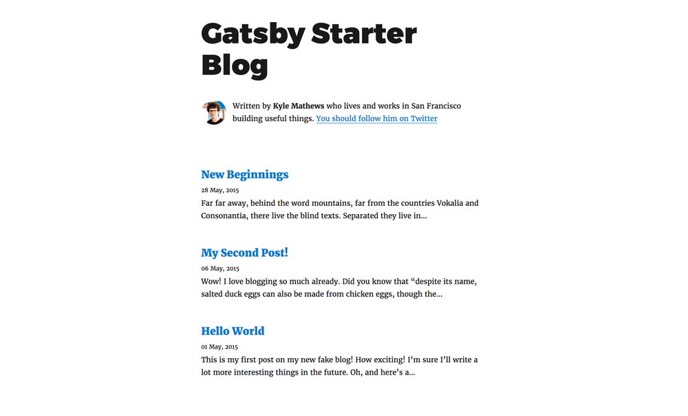

My first post on my new blog :confetti_ball::congratulations:  

This blog is initialized with [gatsby-starter-blog](https://www.gatsbyjs.org/starters/gatsbyjs/gatsby-starter-blog/).  
Do you like the navigation bar at the top of this page?  
In this post, I introduce how to make a title bar with a background image and navigation menu.

The default blog should look like [this](https://templates.netlify.com/template/gatsby-starter-blog/).



Too simple? Let's beautify it :fire::fire:  

## Install gatsby-background-image
\* Skip if you don't use a background image  

First, install [gatsby-background-image](https://www.gatsbyjs.org/packages/gatsby-background-image/) and declare it in `gatsby-config.js` as described in the document.

```bash
npm install --save gatsby-background-image
```

```javascript:title=gatsby-config.js
module.exports = {
  plugins: [
    ...
    {
      resolve: 'gatsby-background-image',
      options: {
        // add your own characters to escape, replacing the default ':/'
        specialChars: '/:',
      },
    },
    ...
   ],
};
```
  

## Navigation Menu
In my case, the navigation menu has four items:
1. Home (linked to '/')
2. About (linked to '/about/')
3. Blog (linked to '/blog/')
4. Misc. (linked to '/misc/)

These are implemented as the unordered list.

```javascript:title=src/components/navbar.js
import React from 'react';
import { Link } from 'gatsby';
import './navbar.css'

const Navbar = (props) => {
    const navMenuItem = ["Home", "About", "Blog", "Misc."];

    const navMenuLiTag = navMenuItem.map((item) => {
        let pageLink = "";
        if (item === "Home") {
            pageLink = "/";
        }
        else if (item === "Misc.") {
            pageLink = "/misc/";
        }
        else pageLink = "/" + item.toLowerCase() + "/";

        return (
            <li key={pageLink}>
                <Link to={pageLink}
                    className="page-link"
                    style={{
                        boxShadow: `none`,
                        textDecoration: `none`,
                        color: `inherit`,
                    }}
                >
                    {item}
                </Link>
            </li>
        )
    });

    return (
        <nav className="navbar">
            <div className="navbar-item"
            style={{align: `center`}}>
                <ul>
                    {navMenuLiTag}
                </ul>
            </div>
        </nav>
    );
}

export default Navbar;
```

This JS file imports a style file to align the list items horizontally.

```css:title=src/components/navbar.css
.navbar {
    height: 50px;
    display: flex;
    justify-content: flex-end;
    flex-flow: row;
}

.navbar > .navbar-item {
    height: 50px;
    margin-left: auto;
    margin-right: auto;
}

.navbar-item ul {
    display: flex;
    flex-flow: row;
    justify-content: space-between;
    margin-top: 9px;
    margin-bottom: 0;
    margin-left: auto;
    margin-right: auto;
}

.navbar-item ul li {
    list-style: none;
    width: 75px;
}

.navbar-item ul li a {
    font-size: 20px;
    font-weight: bold;
    text-decoration: none;
    line-height: 2.0;
    text-align: center;
    display: block;
    padding: auto;
    border-radius: 3px;
}
```

## Header
Now we have all the necessary components, let's put them together!  

```javascript:title=src/components/header.js
import React from 'react'
import { graphql, StaticQuery, Link } from 'gatsby'
import styled from 'styled-components'

import BackgroundImage from 'gatsby-background-image'
import Navbar from './navbar'

const Header = ({ className }) => (
    <StaticQuery
      query={graphql`
        query {
          desktop: file(relativePath: { eq: "background.jpg" }) {
            childImageSharp {
              fluid(quality: 30, maxWidth: 920) {
                ...GatsbyImageSharpFluid_withWebp
              }
            }
          }
        }
      `}
      render={data => {
        // Set ImageData.
        const imageData = data.desktop.childImageSharp.fluid
        return (
          <BackgroundImage
            Tag="section"
            className={className}
            fluid={imageData}
          >
            <div
                style={{
                textAlign: `center`,
                color: `#FFFFFF`,
                }}
            >
                <h1
                    style={{
                    paddingTop: `3rem`,
                    paddingBottom: `1rem`,
                    marginBottom: 0,
                    marginTop: 0,
                    fontStyle: `bold`,
                    fontSize: `42px`
                    }}
                >
                    <Link
                    style={{
                        boxShadow: `none`,
                        textDecoration: `none`,
                        color: `inherit`,
                    }}
                    to={`/`}
                    >
                    {`Hippocampus's Garden`}
                    </Link>
                </h1>
                <p
                style={{
                    margin: 0,
                    fontStyle: `italic`,
                }}>
                    {`Under the sea, in the hippocampus's garden...`}
                    </p>
                <Navbar></Navbar>
            </div>
          </BackgroundImage>
        )
      }}
    />
  )
  
  const StyledHeader = styled(Header)`
    width: 100%;
    background-position: center center;
    background-repeat: repeat-y;
    background-size: cover;
  `
  
  export default StyledHeader
```

I put the background image in `content/assets/`.

That's it! The full code is [here](https://github.com/shionhonda/hippocampus-garden)

