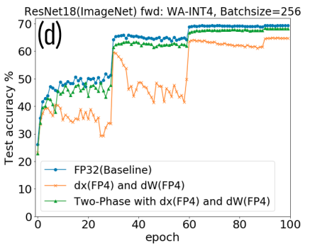
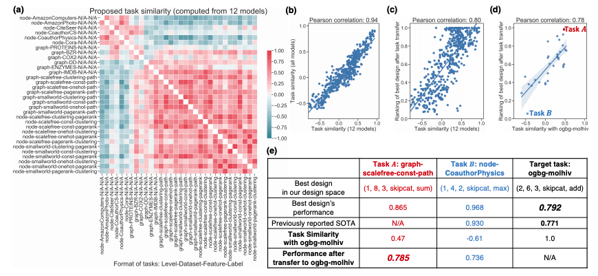
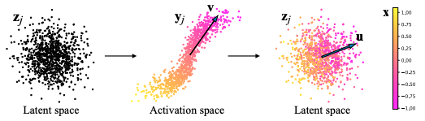
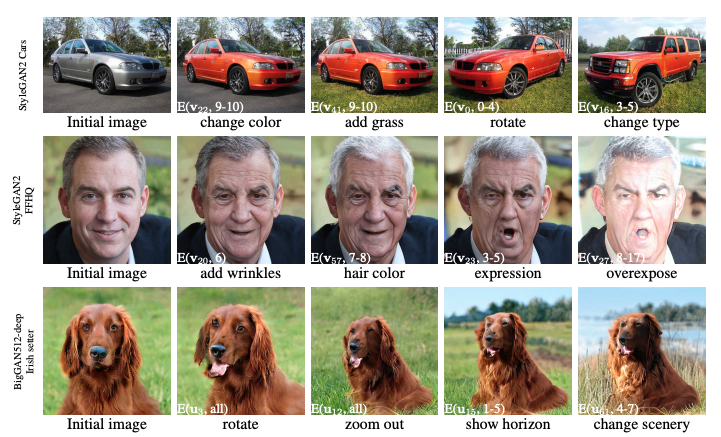
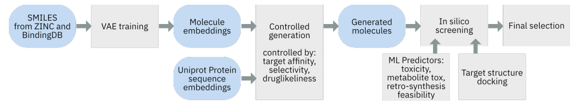
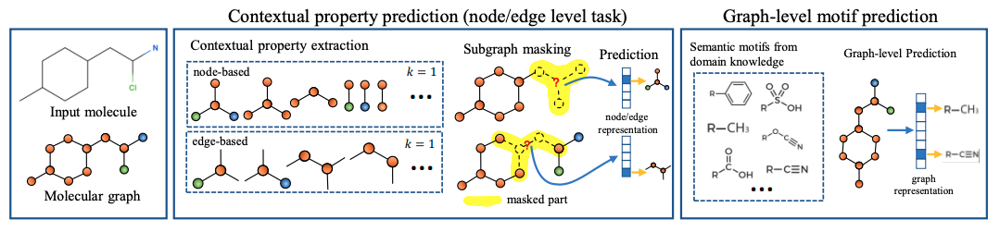

Last month, I attended the [NeurIPS](https://neurips.cc/) virtual conference. In 2020, approximately 1,900 papers were accepted. Of course I couldn't cover them all but saw many interesting presentations at the conference, so here I'd like to list some notable ones with brief introductions.

DISCLAIMER: The figures in this post are borrowed from the corresponding papers. Links to the papers are presented at the bottom of each subsection.

## Orals
I like the following three orals so much that I've already written about them in this blog. If you are interested, please refer to [the last post](https://hippocampus-garden.com/best_papers_2020/).

- [Language Models are Few-Shot Learners](https://proceedings.neurips.cc//paper_files/paper/2020/hash/1457c0d6bfcb4967418bfb8ac142f64a-Abstract.html) (one of [Best Papers](https://neuripsconf.medium.com/announcing-the-neurips-2020-award-recipients-73e4d3101537))
- [Implicit Neural Representations with Periodic Activation Functions](https://proceedings.neurips.cc//paper_files/paper/2020/hash/53c04118df112c13a8c34b38343b9c10-Abstract.html)
- [Bootstrap Your Own Latent - A New Approach to Self-Supervised Learning](https://proceedings.neurips.cc//paper_files/paper/2020/hash/f3ada80d5c4ee70142b17b8192b2958e-Abstract.html)

### AI Feynman 2.0: Pareto-optimal symbolic regression exploiting graph modularity
**AI Feynman 2.0** solves **symbolic regression**: a challenge to find a symbolic expression that fits the given data. The model recursively updates its computational graph to achieve Pareto-optimality over accuracy and complexity.

AI Feynman can be installed simply by `pip install aifeynman`. It would be fun to play with your own data such as daily temperature and stock prices.

Read [the paper](https://proceedings.neurips.cc//paper_files/paper/2020/hash/33a854e247155d590883b93bca53848a-Abstract.html) for more details.

### Improved guarantees and a multiple-descent curve for Column Subset Selection and the Nystrom method
This award-winning paper considers the **Column Subset Selection Problem** (**CSSP**), a well-studied combinatorial optimization task that aims to approximate the original data matrix with a low-rank matrix. CSSP can be seen in many machine learning applications such as feature selection. This paper provides a new upper and lower bound for the **approximation factor** (a kind of relative approximation error) and also reveals a spectral behavior that they call a **multiple-descent curve**.

Read [the paper](https://proceedings.neurips.cc//paper_files/paper/2020/hash/342c472b95d00421be10e9512b532866-Abstract.html) for more details.

### Ultra-Low Precision 4-bit Training of Deep Neural Networks
The title by itself explains what has benn achieved. Yes, the team from IBM trained neural networks with 4-bit floating-point computations. To enable 4-bit training, they combined some key techniques:
- A new radix-4 FP4 format.
- A new per-layer trainable gradient scaling technique (GradScale).
- A Two-Phase quantization technique for minimizing the quantization error.

Read [the paper](https://proceedings.neurips.cc//paper_files/paper/2020/hash/13b919438259814cd5be8cb45877d577-Abstract.html) for more details.

## Spotlights
### Investigating Gender Bias in Language Models Using Causal Mediation Analysis
**Causal mediation analysis** is a method to gauge how a treatment effect is mediated by a mediator (intermediated variables). This paper proposes to use causal mediation analysis to investigate which part of the model is responsible for the output. This paper uses gender bias as an example.
- **Direct effect**: Change a word in the input sentence while keeping some component unchanged, and then see how the output changes
- **Indirect effect**: Change some component while keeping the input the same, and then see how the output changes

The analysis reveals that gender biases are concentrated in particular components (head, layer) of the model.

Read [the paper](https://proceedings.neurips.cc//paper_files/paper/2020/hash/92650b2e92217715fe312e6fa7b90d82-Abstract.html) for more details.

### Design Space for Graph Neural Networks
GNNs have many configurations such as aggregation function, activation function, batch normalization. The best configuration depends on the task. To find general rules on which configuration is good for a given task, this paper systematically examines *315,000 different designs over 32 different predictive tasks*. 

As well as this study tells us the general guidelines for designing well-performing GNNs, it provides a quantitative measure of task similarity, which is defined as a rank correlation of the scores of each GNN. Transfer learning only works between similar tasks.

Read [the paper](https://proceedings.neurips.cc//paper_files/paper/2020/hash/c5c3d4fe6b2cc463c7d7ecba17cc9de7-Abstract.html) for more details.

### On the linearity of large non-linear models: when and why the tangent kernel is constant
Recent studies on **neural tangent kernels** (**NTK**) have discovered that certain neural networks, as their width approach infinity, converge to linear models. This paper reveals the relationship between NTK and the Hessian matrix of the network and demonstrates that wide neural networks transition to linearity *when the last layer is linear and there is no bottleneck layer*. 

Read [the paper](https://proceedings.neurips.cc//paper_files/paper/2020/hash/b7ae8fecf15b8b6c3c69eceae636d203-Abstract.html) for more details.

### NVAE: A Deep Hierarchical Variational Autoencoder
As opposed to the majority of VAE studies focusing on its statistical aspects, this paper designs an improved hierarchical architecture for VAES, dubbed **Nouveau VAE** (**NVAE**).

NVAE reduces the gap between VAEs and autoregressive models in terms of the visual quality of generated images.

Read [the paper](https://proceedings.neurips.cc//paper_files/paper/2020/hash/e3b21256183cf7c2c7a66be163579d37-Abstract.html) for more details.

### Open Graph Benchmark: Datasets for Machine Learning on Graphs
**Open Graph Benchmark** (**OGB**) is a benchmark for graph machine learning research to facilitate development and reproducibility. This benchmark is carefully designed to:
- cover a diverse range of domains including social networks, molecular graphs, knowledge graphs, and so on.
- have at least 100K nodes, 1M edges, or 10K graphs.
- cover all the task categories: node-wise, link-wise, and graph-wise.

Read [the paper](https://proceedings.neurips.cc//paper_files/paper/2020/hash/fb60d411a5c5b72b2e7d3527cfc84fd0-Abstract.html) for more details.

### AdaBelief Optimizer: Adapting Stepsizes by the Belief in Observed Gradients
**AdaBelief** is an Adam-like optimizer that adapts the stepsize according to the "belief", or the curvature, in the current gradient direction. For example, when the current set of parameters is $\theta_4$ in the figure below, Adam uses a small stepsize because the gradient is steep. On the other hand, AdaBelief takes a large step because the curvature is small. This difference allows AdaBelief to converge faster, generalize better, and stabilize better.

Read [the paper](https://proceedings.neurips.cc//paper_files/paper/2020/hash/d9d4f495e875a2e075a1a4a6e1b9770f-Abstract.html) for more details.

## Posters
### GANSpace: Discovering Interpretable GAN Controls
Surprisingly, **principal component analysis** (**PCA**) of the activation space allows us to obtain interpretable control over the GAN model. The corresponding latent directions to the principal components represent zoom, angle, color, etc. 

This paper demonstrates that BigGAN can be controlled with layer-wise inputs in a StyleGAN-like way.

Read [the paper](https://proceedings.neurips.cc/paper/2020/hash/6fe43269967adbb64ec6149852b5cc3e-Abstract.html) for more details.

### CogMol: Target-Specific and Selective Drug Design for COVID-19 Using Deep Generative Models
**Controlled Generation of Molecules** (**CogMol**) is an end-to-end framework for *de novo* drug design targeting novel viral proteins such as SARS-CoV-2. CogMol combines multiple components such as a pre-trained SMILES VAE, protein embeddings, a toxicity predictor, a synthesizability predictor, and docking simulations.

Read [the paper](https://proceedings.neurips.cc//paper_files/paper/2020/hash/2d16ad1968844a4300e9a490588ff9f8-Abstract.html) for more details.

### Guiding Deep Molecular Optimization with Genetic Exploration
This paper proposes an algorithm, which is called **genetic expert-guided learning** (**GEGL**), to optimize molecules in the chemical space by applying genetic operations to an LSTM-based generator.

Read [the paper](https://proceedings.neurips.cc//paper_files/paper/2020/hash/8ba6c657b03fc7c8dd4dff8e45defcd2-Abstract.html) for more details.

### Self-Supervised Graph Transformer on Large-Scale Molecular Data
The **GROVER** model proposed in this paper achieves new state-of-the-art on the MoleculeNet benchmark. To exploit the enormous unlabelled molecular data, the Transformer-like model tailored for molecular graphs is pre-trained in a self-supervised fashion.

Read [the paper](https://proceedings.neurips.cc//paper_files/paper/2020/hash/94aef38441efa3380a3bed3faf1f9d5d-Abstract.html) for more details.

### Differentiable Augmentation for Data-Efficient GAN Training
Data augmentation for GAN training is not as straightforward as it seems. To make GAN training data-efficient, this paper proposes to apply **differentiable augmentation** (**DiffAugment**) to both real and fake images for both generator and discriminator training.

Read [the paper](https://proceedings.neurips.cc//paper_files/paper/2020/hash/55479c55ebd1efd3ff125f1337100388-Abstract.html) for more details.

### SnapBoost: A Heterogeneous Boosting Machine
Modern gradient boosting frameworks, such as XGBoost and LightGBM, use fixed base learners, typically decision trees up to the given depth, throughout boosting iterations. This paper proposes a **Heterogeneous Newton Boosting Machine** (**HNBM**), in which the base learners may be different across boosting iterations, and provides a particular realization called **SnapBoost**. It reportedly has better generalization performance than other gradient boosting algorithms.

Read [the paper](https://proceedings.neurips.cc//paper_files/paper/2020/hash/7fd3b80fb1884e2927df46a7139bb8bf-Abstract.html) for more details.

### A graph similarity for deep learning
Many popular GNNs takes the form of aggregate-transform: they aggregate the features of neighbor nodes and then transform the results with a learnable function. However, this can be problematic when the node features are continuous. To address the issue, this paper instead proposes an algorithm adopting transform-sum-concat to compute the similarity between two graphs. This algorithm is extended to a novel graph kernel and GNN that achieve higher accuracy.

Read [the paper](https://proceedings.neurips.cc//paper_files/paper/2020/hash/0004d0b59e19461ff126e3a08a814c33-Abstract.html) for more details.

### Neural Networks Fail to Learn Periodic Functions and How to Fix It
This paper demonstrates that the popular activation functions such as ReLU, tanh, sigmoid, and other variants are not good at learning periodic functions. As an alternative, it proposes to use the Snake function ($x + \sin^2x$) as an activation. 

I'm interested in its relationship with [**SIREN**](https://proceedings.neurips.cc//paper_files/paper/2020/hash/53c04118df112c13a8c34b38343b9c10-Abstract.html) (a neural network that uses $\sin x$ as an activation function, which is also presented at NeurIPS 2020; previously mentioned in [this post](https://hippocampus-garden.com/best_papers_2020/#implicit-neural-representations-with-periodic-activation-functions)).

Read [the paper](https://proceedings.neurips.cc//paper_files/paper/2020/hash/1160453108d3e537255e9f7b931f4e90-Abstract.html) for more details.

