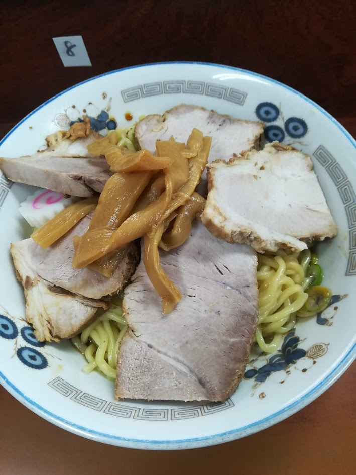
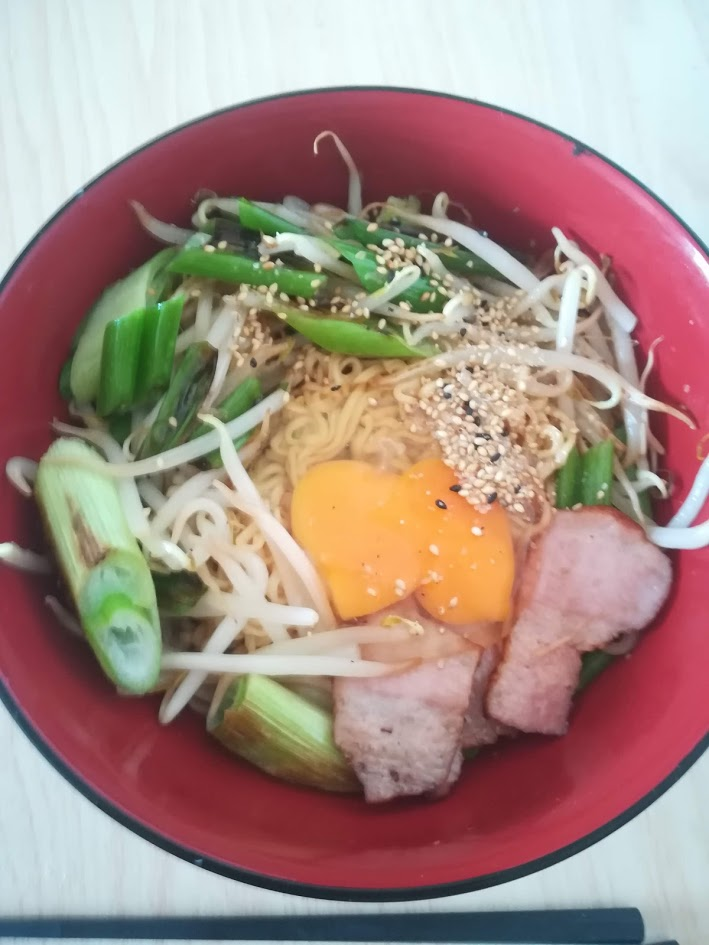
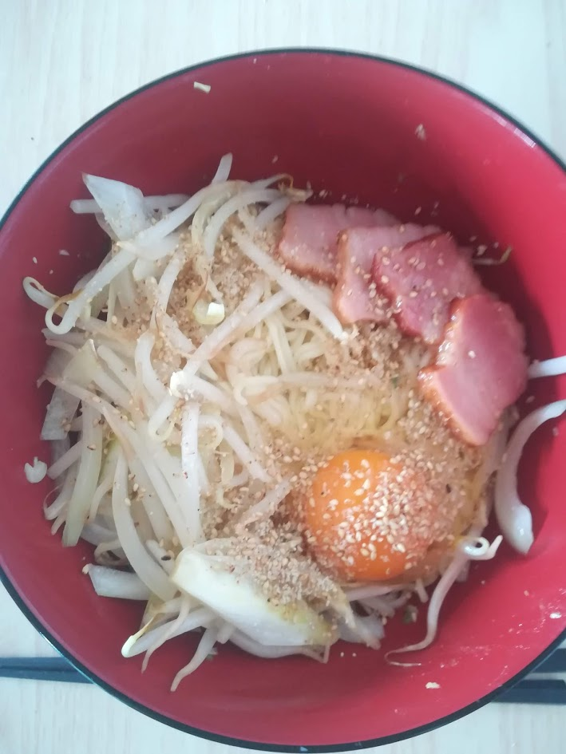
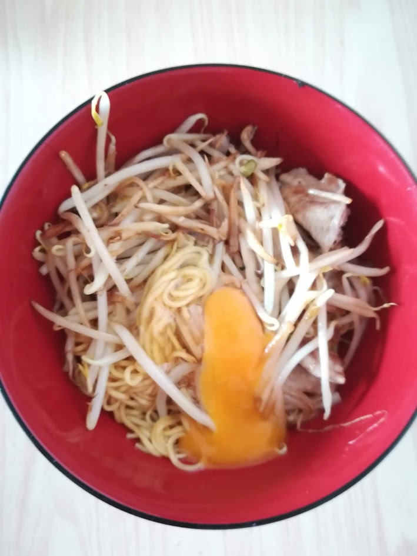
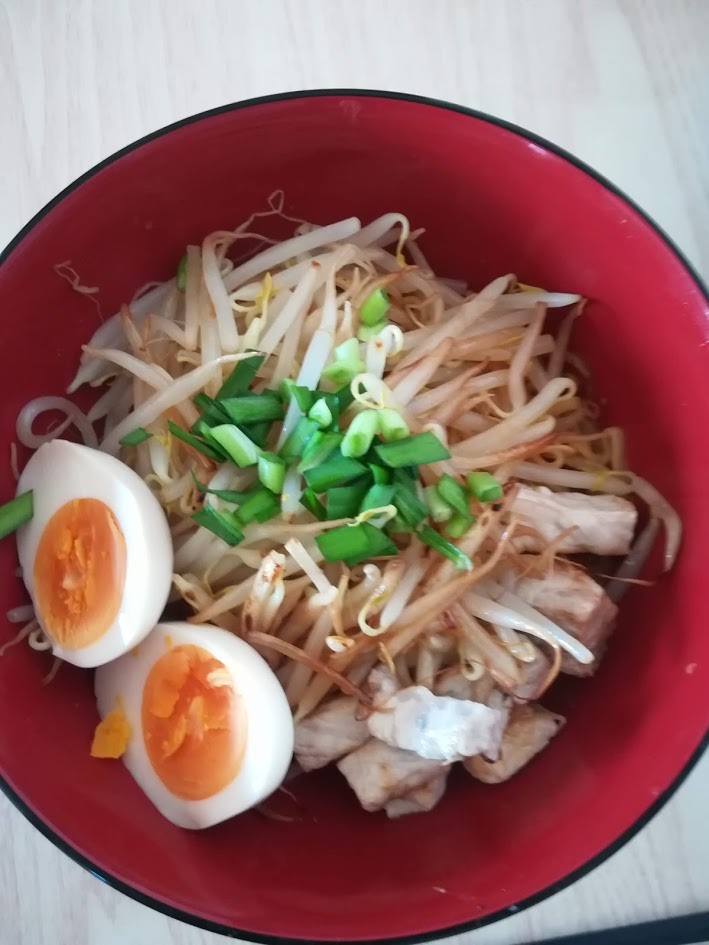
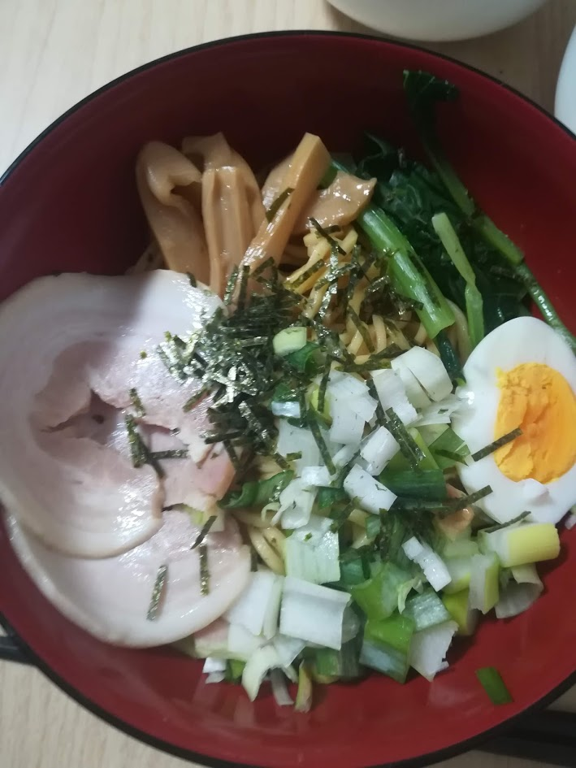
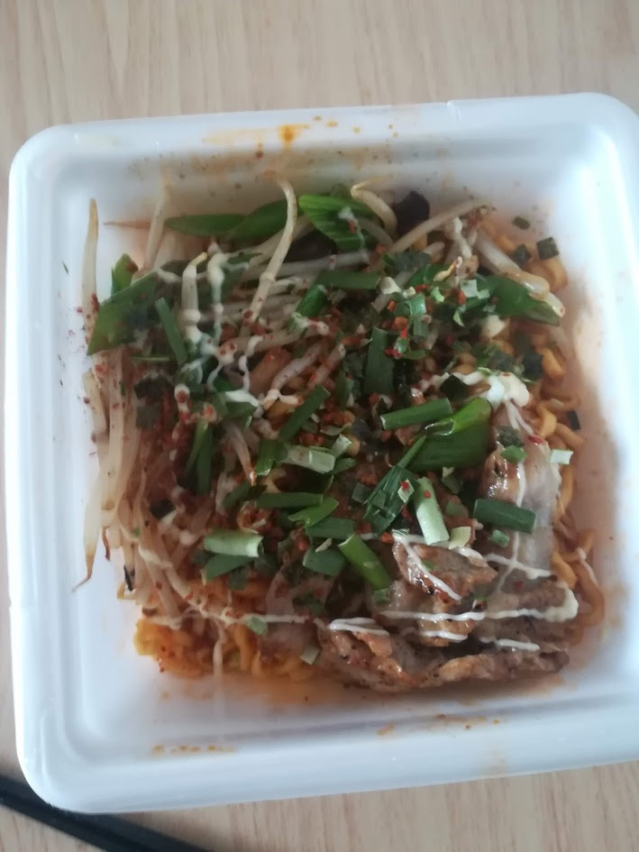

在宅勤務になってから昼食を毎日作っているのですが、献立を考える手間や調理・片付けの手間をなるべく減らしたいという考えから、いつからかほぼ毎日袋麺を食べるようになりました。しばらくはそれで良かったのですが、夏の間はラーメンよりも油そばを食べたくなることが増えました。しかし、インスタントの油そばはカップ焼きそばタイプのものしかないので、袋麺を自分でアレンジして作ってみることにしました。やっているうちに夏休みの自由研究的な楽しさが芽生えてしまい、数ヶ月に渡る実験の末、この[Super Size Me](https://amzn.to/2I49FVP)のごときレポートを生み出してしまいました。

画像を逐一貼っていたら無駄に長くなってしまったので、結論を最初に書いておきます。
>生麺があるなら、[このレシピ](https://www.hotpepper.jp/mesitsu/entry/maiko-kudou/16-00310)に従ってタレを自分で作るのが手っ取り早いと思います。袋麺から作るなら、ラ王の醤油味が最も良かったです。変わり種を狙うならラ王の柚子塩味がおすすめです。

## 追記（2021年5月15日）
最近、スーパーで[「明星 チャルメラ」のまぜそば](https://www.myojofoods.co.jp/news/9450)を見かけるようになりました。さっそく買って作ってみましたが、胡椒とにんにくが効いていて美味しかったです。まだ流通量が少なそうなので、夏に向けて増やしてほしいところです。

さらに、サンヨー食品の公式サイトで[「サッポロ一番」の汁なしアレンジレシピ](https://www.sanyofoods.co.jp/special/5432/)が紹介されていたりと、袋麺で油そばを作りやすい世の中になってきたようです。この試行錯誤の記録も、もはや不要になったようですね。

## 実験
近所のスーパーなどで入手できた各種袋麺を油そばに仕立てました。多くの商品は5袋入りのセットで販売されており、1種類試すのに1週間かかるため、ひと通り実験をするのに数ヶ月かかってしまいました。あまり意味があるとは思いませんが、毎回写真を撮って記録していました。

ちなみに、具材はそのとき冷蔵庫にあったものを適当に使っているので、商品自体とは関係ありません。また、Amazonへのリンクを貼っていますが、基本的に5食×6パックのセットで売られているようです😇 

以下、時系列順に紹介します。

### 珍々亭（コントロール）
まずは基本を抑えるために、油そば元祖といわれる武蔵境・珍々亭に行ったときの写真を載せておきます。

### 日清食品 ラ王　豚骨醤油（旧版）
「やはり豚骨は油そばには合わないな」と思いながら食べていました。

### サンヨー食品 サッポロ一番　ごま味ラーメン
サッポロ一番はバラ売りされているため、食べ比べをするのに非常に助かりました。一方、サッポロ一番は粉末スープなので、ごま油で延ばしたりしないと油そばっぽくならないと思います。また、麺が細めなのも向かない点です。

### サンヨー食品 サッポロ一番　塩らーめん
予想していましたが、塩味も違いました。

### サンヨー食品 サッポロ一番　みそラーメン
味噌味の粉末スープは油そばには全く向きませんでした。

### サンヨー食品 サッポロ一番　しょうゆ味
試したサッポロ一番の中では醤油味が最もそれっぽくなりました。

ここで、遅きに失しながらも先行研究を調べたところ、[こんなレシピ](https://www.hotpepper.jp/mesitsu/entry/maiko-kudou/16-00310)を見つけました。「イージー」によると、**粉末スープは半量をごま油・砂糖・酢と混ぜて使うのが良い**らしいです。

### 日清食品 ラ王　醤油
ラ王は液体スープで、この醤油味は甘みがあるので、そのままでも油そばらしい味に作ることができました。暫定で最適な袋麺だと言えます（最終的にも最適でした）。

### 東洋水産 マルちゃん正麺 和風醤油
マルちゃん正麺も液体スープで、醤油味なのでそれらしい味になりました。

### 明星 チャルメラ 宮崎辛麺
辛い麺も試してみました。しかし、こちらは多めのお湯で溶かす用にできているので、汁なしで食べるには味が濃すぎました。粉末の量を調節すれば何とかなるかもしれません。

### 日清食品 ラ王　味噌
液体スープでも味噌は合いませんでした。

### オリジナル（コントロール）
ここで比較のために、[上で紹介したレシピ](https://www.hotpepper.jp/mesitsu/entry/maiko-kudou/16-00310)の「ベーシック」に従って自作してみました。太い中華麺やチャーシューを買ってきて、できる限り忠実な再現を試みました。

結果、お店に近い味を比較的簡単に再現できました。生麺を常備できるなら、袋麺を使わず**タレを自作するのが最も確実な方法**だと思いました。

### 東洋水産 マルちゃん正麺 醤油味
こちらのマルちゃん正麺も良かったです。

### 明星 ぶぶか 台湾油そば（コントロール）
比較のために、インスタントの油そばも試してみました。コンビニでよく見かける[吉祥寺・ぶぶか](http://www.bubuka.top/)のカップ油そばです。

### 日清食品 ラ王　豚骨醤油
夏が終わった頃にラ王の豚骨醤油がリニューアルされていたので再度試してみたのですが、油そばに豚骨味は合わないという感想は変わりませんでした。

### 日清食品 ラ王　柚子しお
最後に変わった味の袋麺を試してみました。これはかなりよかったです。巷の油そばと比べるとあっさりめなので、適宜味を足すと良さそうです。

## 結論
生麺があるなら、[このレシピ](https://www.hotpepper.jp/mesitsu/entry/maiko-kudou/16-00310)に従ってタレを自分で作るのが手っ取り早いと思います。袋麺から作るなら、ラ王の醤油味が最も良かったです。変わり種を狙うならラ王の柚子塩味がおすすめです。
