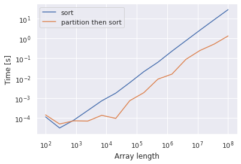

Retrieving ordered top-k elements from a certain array is a common problem. However, NumPy does not support this operation natively. A naive solution is to carry out full sort and then take the top-k elements like this:

```python
import numpy as np

def topk_by_sort(input, k, axis=None, ascending=True):
    if not ascending:
        input *= -1
    ind = np.argsort(input, axis=axis)
    ind = np.take(ind, np.arange(k), axis=axis)
    if not ascending:
        input *= -1
    val = np.take_along_axis(input, ind, axis=axis) 
    return ind, val
```
Note that this functions is generalized so that it can handle multi-dimensional arrays and descending order requests. 

When the array length is $n$, it takes $O(n\log n)$ time. This isn't an optimal solution. You can reduce it to $O(n)$ time (assuming $n \gg k$) by retrieving the $k$ largest elements (non-sorted) before sorting. This is implemented by `np.argpartition()` and `np.argsort()` like this:

```python
def topk_by_partition(input, k, axis=None, ascending=True):
    if not ascending:
        input *= -1
    ind = np.argpartition(input, k, axis=axis)
    ind = np.take(ind, np.arange(k), axis=axis) # k non-sorted indices
    input = np.take_along_axis(input, ind, axis=axis) # k non-sorted values

    # sort within k elements
    ind_part = np.argsort(input, axis=axis)
    ind = np.take_along_axis(ind, ind_part, axis=axis)
    if not ascending:
        input *= -1
    val = np.take_along_axis(input, ind_part, axis=axis) 
    return ind, val
```

I measured the time complexity of the two functions with $k=10$ and different $n$. As shown in the figures below, the argpartition approach is significantly faster when $n \gt 10^4$.




## References
[1] [numpy.argpartition — NumPy v1.22 Manual](https://numpy.org/doc/stable/reference/generated/numpy.argpartition.html)  
[2] [numpy.take_along_axis — NumPy v1.22 Manual](https://numpy.org/doc/stable/reference/generated/numpy.take_along_axis.html)