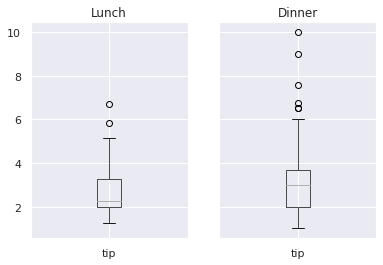
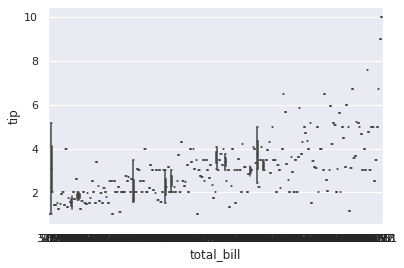

🐼Welcome to the "Meet Pandas" series (a.k.a. my memorandum of understanding Pandas)!🐼

[Last time](https://hippocampus-garden.com/pandas_loc/), I discussed differences between Pandas `loc`, `iloc`, `at`, and `iat` methods. 

Today, I summarize how to group data by some variable and draw boxplots on it using Pandas and Seaborn. Let's begin!

## Load Example Data
In this post, I use the "tips" dataset provided by seaborn. This is a data of food servers’ tips in restaurants with six factors that might influence tips.

The snippets in this post are supposed to be executed on Jupyter Notebook, Colaboratory, and stuff.

```python
import pandas as pd
import seaborn as sns
sns.set()

df = sns.load_dataset('tips')
df
```

The dataframe should look something like this:


## Group by Categorical or Discrete Variable
First, let's group by the categorical variable `time` and create a boxplot for `tip`. This is done just by two pandas methods: `groupby` and `boxplot`.

```python
df.groupby("time").boxplot(column="tip");
```



\* You can also group by discrete variables in the same way.

It's not bad, but maybe too simple. If you want to make it prettier, use seaborn's `boxplot()`.

```python
sns.boxplot(x="time", y="tip", data=df);
```


Or, `catplot()` should produce the same output.

```python
sns.catplot(x="time", y="tip", kind="box", data=df);
```


I'm not sure why it produced a figure of a little different size...

## Other Distribution Plots
For larger datasets, `boxenplot()` gives more information about the shape of the distribution.

```python
sns.boxenplot(x="time", y="tip", data=df);
```


`violinplot()` combines a boxplot with the **kernel density estimation**.

```python
sns.violinplot(x="time", y="tip", data=df);
```


## Group by Continuous Variable
Next, let's group by the continuous numerical variable `total_bill` and create boxplot for `tip`. What happens if I use seaborn's `boxplot()` function in the same way as above?

```python
sns.boxplot(x="total_bill", y="tip", data=df);
```



It divides the data into too many groups! This doesn't really make sense. Well, I should have first bin the data by pandas `cut()` function.

```python
df["bin"] = pd.cut(df["total_bill"], 3)
sns.boxplot(x="bin", y="tip", data=df);
```


Or, use `qcut()` (quantile-based cut) if you want equal-sized bins.

```
df["qbin"] = pd.qcut(df["total_bill"], 3)
sns.boxplot(x="qbin", y="tip", data=df);
```


## References
[1] [pandas.core.groupby.DataFrameGroupBy.boxplot — pandas 1.0.4 documentation](https://pandas.pydata.org/pandas-docs/stable/reference/api/pandas.core.groupby.DataFrameGroupBy.boxplot.html)  
[2] [seaborn.boxplot — seaborn 0.10.1 documentation](https://seaborn.pydata.org/generated/seaborn.boxplot.html)  
[3] [Plotting with categorical data — seaborn 0.10.1 documentation](https://seaborn.pydata.org/tutorial/categorical.html)
