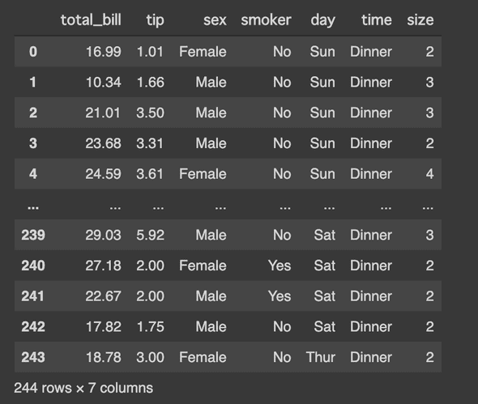

🐼Welcome back to the "Meet Pandas" series (a.k.a. my memorandum for learning Pandas)!🐼

[Last time](https://hippocampus-garden.com/pandas_boxplot/), I discussed grouping and several types of boxplot functions. 

Today, I'm going to briefly summarize how to extract a piece of data from a dataframe by specifying some conditions.

## Load Example Data
As [before](https://hippocampus-garden.com/pandas_boxplot/), I use the "tips" dataset provided by seaborn. This is a data of food servers’ tips in restaurants with six factors that might influence tips.

```python
import pandas as pd
import seaborn as sns
sns.set()

df = sns.load_dataset('tips')
df
```

The dataframe should look something like this:



Let's say we want a subset of records where $2 \leq \mathrm{tip} < 3$ and $\mathrm{day} \in \{\mathrm{Sat},\mathrm{Sun}\}$.

## Boolean Indexing
You might solve this problem by **Boolean indexing** (if you get 28 records, your query is probably correct).

```python
df[ (df['tip']>2) & (df['tip']<3)  & (df['day'].isin(['Sat', 'Sun'])) ]
```

But, have you felt that this is a little cumbersome and easy to cause mistakes? I have. The common mistakes include:

```python
df[ (2<df['tip']<3)  & (df['day'].isin(['Sat', 'Sun'])) ]
# >> ValueError: The truth value of a Series is ambiguous. Use a.empty, a.bool(), a.item(), a.any() or a.all().

df[ (df['tip']>2) and (df['tip']<3)  and (df['day'].isin(['Sat', 'Sun'])) ]
# >> ValueError: The truth value of a Series is ambiguous. Use a.empty, a.bool(), a.item(), a.any() or a.all().

df[ (df['tip']>2) & (df['tip']<3)  & (df['day'] in ['Sat', 'Sun']) ]
# >> ValueError: The truth value of a Series is ambiguous. Use a.empty, a.bool(), a.item(), a.any() or a.all().
```
<br/>

## Method `query`
Pandas has a method `query`, which is easier to read and write than Boolean indexing. This method allows you to specify querying conditions in an SQL-like manner.

```python
df.query('2 < tip < 3 and day in ["Sat", "Sun"]')
```

I usually prefer `query` to Boolean indexing because its SQL-like syntax enhances readability and reduces potential errors. But `query` is not always the better choice. Please note the following:

- If the column name includes spaces or periods, you can't use `query`
- `pandas.Series` objects do not have a method `query`
- Boolean indexing is a bit faster than `query`

## References
[1] [pandas.DataFrame.query — pandas 1.1.1 documentation](https://pandas.pydata.org/pandas-docs/stable/reference/api/pandas.DataFrame.query.html)  
[2] [pandas.DataFrameの行を条件で抽出するquery | note.nkmk.me](https://note.nkmk.me/python-pandas-query/)  
[3] [pandasで複数条件のAND, OR, NOTから行を抽出（選択） | note.nkmk.me](https://note.nkmk.me/python-pandas-multiple-conditions/)
