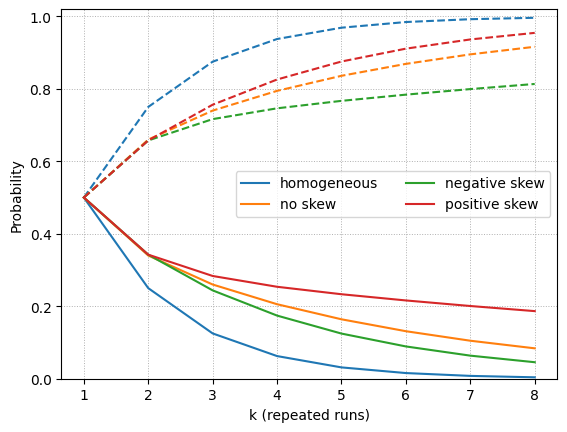

[Tau-Bench](https://openreview.net/forum?id=roNSXZpUDN) at ICLR 2025 evaluates AI agents in realistic environments with APIs, domain rules, and interactive user sessions. The unsettling result is that agents that look good on average can become wildly unstable when we run them repeatedly.

To capture this instability, the authors introduced the metric **pass^k**. It measures the probability that an agent finishes $k$ consecutive runs without a single failure. That value speaks directly to reliability rather than mean performance.

This article explains what pass^k really measures, why it differs from **pass@k** and the mean success rate, and how a simple change in the distribution of per task success rates reshapes both metrics.

## Reliability Beyond the Mean

Imagine a game where you earn $100 if you flip a coin and see ten heads in a row.

You may choose one of two coin options:

1. A fair coin with head probability 0.5 on every toss.
2. A bag with two coins. One coin lands on heads every time, the other lands on tails every time. You draw one coin at random and use it for all ten flips.

Each option has the same mean success probability per toss, yet the chance of ten heads in a row is very different.

1. Fair coin: $(1/2)^{10} = 1/1024$.
2. Mixed bag: $1/2 \times 1^{10} + 1/2 \times 0^{10} = 1/2$.

In other words, the same average success rate (0.5) yields “continuous success” that differs by 500 times. That’s exactly what pass^k captures — the difference between occasional luck and consistent reliability.

## Definition

Consider a task $i$ with single run success probability $p_i \in [0, 1]$. Across tasks the probabilities follow some distribution $P(p)$. Repeated trials on the same task are independent draws with the same $p_i$ throughout.

| Metric | Definition | Intuition |
| --- | --- | --- |
| Average success rate | $\mathrm{pass}^1 = \mathbb{E}[p]$ | Probability of a single success |
| Continuous success (pass^k) | $\mathrm{pass}^k = \mathbb{E}[p^k]$ | Probability of $k$ straight successful runs |
| Coverage (pass@k) | $\mathrm{pass}@k = \mathbb{E}[1 - (1-p)^k]$ | Probability of at least one success in $k$ tries |

## A Toy Experiment: Same Mean, Different Shapes

Hold the average success rate $\mu$ at 0.5 but change the shape of the per task distribution.

| Scenario | Probabilities $p_i$ | Average | Standard deviation | Description |
| --- | --- | --- | --- | --- |
| homogeneous | 0.50 (100%) | 0.5 | 0.0 | Uniform skill on every task |
| no skew | 0.20 (50%), 0.80 (50%) | 0.5 | ~0.30 | Half the tasks are easy wins, half resist |
| negative skew | 0.07 (~33%), 0.715 (~67%) | 0.5 | ~0.30 | Most tasks are easy yet a few almost always fail |
| positive skew | 0.93 (~33%), 0.285 (~67%) | 0.5 | ~0.30 | Most tasks are hard yet a few are guaranteed wins |

## k-sweep: Comparing pass@k and pass^k



<div style="text-align: center;"><small>Pass@k (dashed) and pass^k (solid).</small></div>


The figure sweeps $k$ from one to eight and plots pass@k with dashed lines and pass^k with solid lines. Several patterns stand out:

- The homogeneous agent reaches pass@k close to one by $k = 5$ while pass^k falls rapidly toward zero because even steady agents eventually miss.
- Introducing variance in $p$ slows the change in both metrics. Heterogeneity keeps pass^k higher for small $k$ because some tasks are near certain wins.
- Skew matters. Positive skew (some perfect tasks) lifts both pass@k and pass^k. Negative skew drags both curves down even though the mean and variance match the other cases.

At $k = 3$ the homogeneous agent records pass@k about $0.88$ but pass^k about $0.13$. The positively skewed agent keeps pass^k near $0.28$ by relying on the guaranteed tasks.

## $\Delta_k$: Quantifying the Shape Effect

We saw that heterogeneity in $P(p)$ can reshape pass^k at constant mean. Define the reliability gain

$$
\Delta_k = \mathrm{pass}^k - (\mathrm{pass}^1)^k
$$


<div style="text-align: center;"><small>Heterogeneity bonus peaks at modest k before reliability decays.</small></div>

This measures how much heterogeneity boosts pass^k beyond what the mean alone predicts. Three observations:

- Homogeneous agents yield $\Delta_k = 0$ for all $k$.
- Any distribution with mass near $p = 1$ produces $\Delta_k > 0$.
- When a distribution lacks perfect tasks, $\Delta_k$ peaks at moderate $k$ and then fades because $\mathbb{E}[p^k]$ still goes to zero.

The positively skewed agent keeps increasing through roughly $k = 5$ with $\Delta_k \approx 0.20$ before tapering. The negatively skewed agent peaks closer to $0.12$. A small set of nearly certain wins provides real insurance against short streaks of failures.

## Why This Happens: Jensen’s Inequality

For $k \ge 2$, the function $p^k$ is convex on $[0, 1]$ and always satisfies $p^k \le p$. By **Jensen’s inequality**,

$$
(\mathbb{E}[p])^k = \mu^k \le \mathbb{E}[p^k] \le \mathbb{E}[p] = \mu.
$$

Therefore,

$$
\Delta_k = \mathbb{E}[p^k] - \mu^k \ge 0,
$$

so heterogeneity, especially mass near $p = 1$, always boosts pass^k.

If we fix $\mu$ but allow different shapes, the upper bound is

$$
\max \Delta_k = \mu - \mu^k,
$$

which a two point distribution attains:

$$
P(p = 1) = \mu,\quad P(p = 0) = 1 - \mu.
$$

Intuitively, a few always correct tasks push reliability far more than they shift the mean.

Pass@k behaves the other way because $1 - (1 - p)^k$ is concave. Jensen’s inequality reverses:

$$
\mu \le \mathrm{pass}@k \le 1 - (1 - \mu)^k.
$$

A system with uniform skill benefits the most from retries. A system that is brilliant on some tasks and helpless on others gains less, since retries do not rescue the hopeless cases.

Together these inequalities explain why reliability metrics reward a handful of sure bets while coverage metrics celebrate agents without glaring blind spots.

## Key Takeaways

1. Pass@k measures coverage; pass^k measures reliability across repeated uses.
2. Pass@k is ideal when you can check outputs before deployment, such as coding benchmarks with unit tests (e.g., SWE-bench).
3. Pass^k is ideal when a single failure is costly, such as customer support simulations where the agent cannot self check (e.g., Tau-bench).
4. Even with equal means and variances, the shape of $P(p)$ can shift pass^k dramatically, so reporting mean success alone can be misleading.

## Appendix: Code to Generate the Figures

```python
import numpy as np
import matplotlib.pyplot as plt

pss = np.array([
    [0.5, 0.5, 0.5, 0.5, 0.5, 0.5],                # homogeneous
    [0.2, 0.8, 0.2, 0.8, 0.2, 0.8],                # no skew
    [0.07, 0.715, 0.715, 0.07, 0.715, 0.715],      # negative skew
    [0.93, 0.285, 0.285, 0.93, 0.285, 0.285]       # positive skew
])
labels = ["homogeneous", "no skew", "negative skew", "positive skew"]
colors = ["C0", "C1", "C2", "C3"]
ks = np.arange(1, 9)

def pass_at_k(ps, k):
    return np.mean(1 - (1 - ps) ** k)

def pass_hat_k(ps, k):
    return np.mean(ps ** k)

at_curves = [[pass_at_k(ps, k) for k in ks] for ps in pss]
hat_curves = [[pass_hat_k(ps, k) for k in ks] for ps in pss]
delta_curves = [[h - (ps.mean() ** k) for h, k in zip(hc, ks)]
                for ps, hc in zip(pss, hat_curves)]

# Figure 1: k-sweep
for i, (a, h) in enumerate(zip(at_curves, hat_curves)):
    plt.plot(ks, a, linestyle="--", c=colors[i])
    plt.plot(ks, h, label=labels[i])
plt.xlabel("k (repeated runs)")
plt.ylabel("Probability")
plt.ylim(0, 1.02)
plt.legend(ncol=2)
plt.grid(True, linestyle=":", linewidth=0.7)
plt.show()

# Figure 2: Δ_k
for i in range(1, len(labels)):   # skip homogeneous (always 0)
    plt.plot(ks, delta_curves[i], label=labels[i], c=colors[i])
plt.xlabel("k (repeated runs)")
plt.ylabel("Δ_k")
plt.legend()
plt.grid(True, linestyle=":", linewidth=0.7)
plt.show()
```
