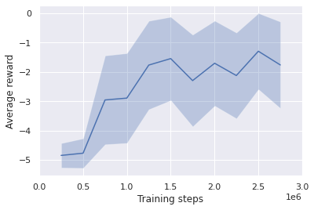
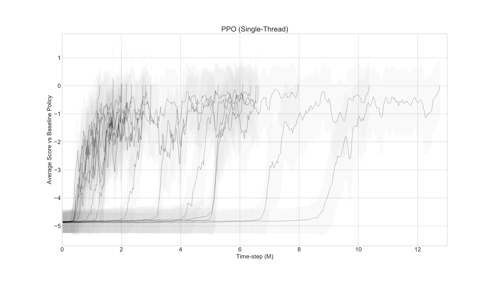

Last month, Preferred Networks, Inc. (PFN) released a new PyTorch-based library for **deep reinforcement learning (DRL)**, which is called [**PFRL**](https://github.com/pfnet/pfrl). PFRL, which inherits [ChainerRL](https://github.com/chainer/chainerrl), implements a comprehensive set of DRL algorithms from DQN to Soft Actor-Critic. [Here](https://github.com/pfnet/pfrl/blob/master/examples/quickstart/quickstart.ipynb) is an official quickstart guide.

In this post, I apply one of the PFRL's algorithms to the Slime Volleyball game with the GPU instance of Colaboratory. My agent (the yellow slime) worked hard to play at first and kind of learned to play volleyball. It's so adorable!

<iframe width="560" height="315" src="https://www.youtube.com/embed/GAcC5ni6zQw" frameborder="0" allow="accelerometer; autoplay; encrypted-media; gyroscope; picture-in-picture" allowfullscreen></iframe>
<br/>

## Slime Volleyball
Slime Volleyball is a simple volleyball-like game between two slimes (agents). Each agent initially has five lives, and lose one life if it fails to push the ball back to the opponent's side. An agent receives +1 reward if its opponent loses and -1 if the agent loses a life.

[A Slime Volleyball environment](https://github.com/hardmaru/slimevolleygym) with a Gym interface is provided by [@hardmaru](https://github.com/hardmaru). There are several types of environments, but here I will use the simplest one with 12-dimensional observational space and 3-dimensional action space. 

## Reinforcement Learning
PFRL already has an official example of learning to play Slime Volleyball with a value-based algorithm called Rainbow [3]. So I tried a different one, a policy-based algorithm called **proximal policy optimization (PPO)**.

I did the entire experiment on Colaboratory as found [here](https://colab.research.google.com/drive/1P6otMjOBz_LBt_vurUMBgSz88PSffIZI?usp=sharing). Some additional packages are required to render videos on Colab notebooks:

```python
! apt-get -y install libcusparse8.0 libnvrtc8.0 libnvtoolsext1 > /dev/null
! ln -snf /usr/lib/x86_64-linux-gnu/libnvrtc-builtins.so.8.0 /usr/lib/x86_64-linux-gnu/libnvrtc-builtins.so
! apt-get -y install xvfb freeglut3-dev ffmpeg> /dev/null

! pip install gym
! pip install pyglet
! pip install pyopengl
! pip install pyvirtualdisplay
! pip install pfrl
! pip install slimevolleygym==0.1.0
```
<br/>

Next, define the environment and the PPO agent. The agent is modeled by a simple 3-layer neural network. For more details, see [the official example](https://github.com/pfnet/pfrl/blob/master/examples/slimevolley/train_rainbow.py) and [the official document](https://pfrl.readthedocs.io/en/latest/agents.html).

```python
import argparse

import gym
import gym.spaces
import torch
from torch import nn
import numpy as np
import matplotlib.pyplot as plt
import pandas as pd
import pfrl
from pfrl import agents
from pfrl import experiments
from pfrl import utils
from pfrl.policies import SoftmaxCategoricalHead
import slimevolleygym

class MultiBinaryAsDiscreteAction(gym.ActionWrapper):
    """Transforms MultiBinary action space to Discrete.
    If the action space of a given env is `gym.spaces.MultiBinary(n)`, then
    the action space of the wrapped env will be `gym.spaces.Discrete(2**n)`,
    which covers all the combinations of the original action space.
    Args:
        env (gym.Env): Gym env whose action space is `gym.spaces.MultiBinary`.
    """

    def __init__(self, env):
        super().__init__(env)
        assert isinstance(env.action_space, gym.spaces.MultiBinary)
        self.orig_action_space = env.action_space
        self.action_space = gym.spaces.Discrete(2 ** env.action_space.n)

    def action(self, action):
        return [(action >> i) % 2 for i in range(self.orig_action_space.n)]

def main():
    parser = argparse.ArgumentParser()
    parser.add_argument(
        "--outdir",
        type=str,
        default="results",
        help=(
            "Directory path to save output files."
            " If it does not exist, it will be created."
        ),
    )
    parser.add_argument("--seed", type=int, default=8, help="Random seed [0, 2 ** 32)")
    parser.add_argument("--steps", type=int, default=3e6)
    parser.add_argument("--eval-n-episodes", type=int, default=1000)
    parser.add_argument("--eval-interval", type=int, default=250000)
    parser.add_argument(
        "--log-level",
        type=int,
        default=20,
        help="Logging level. 10:DEBUG, 20:INFO etc.",
    )
    args = parser.parse_args(args=[])

    import logging

    logging.basicConfig(level=args.log_level)

    # Set a random seed used in PFRL.
    utils.set_random_seed(args.seed)

    # Set different random seeds for train and test envs.
    train_seed = args.seed
    test_seed = 2 ** 31 - 1 - args.seed

    args.outdir = experiments.prepare_output_dir(args, args.outdir)
    print("Output files are saved in {}".format(args.outdir))

    def make_env(test):
        env = gym.make("SlimeVolley-v0")
        # Use different random seeds for train and test envs
        env_seed = test_seed if test else train_seed
        env.seed(int(env_seed))
        env = pfrl.wrappers.Monitor(
            env, args.outdir, mode="evaluation" if test else "training"
        )
        if isinstance(env.action_space, gym.spaces.MultiBinary):
            env = MultiBinaryAsDiscreteAction(env)
        return env

    env = make_env(test=False)
    eval_env = make_env(test=True)

    obs_size = env.observation_space.low.size
    n_actions = env.action_space.n

    def phi(x):
        # Feature extractor
        return np.asarray(x, dtype=np.float32)

    hidden_size = 64
    model = nn.Sequential(
        nn.Linear(obs_size, hidden_size),
        nn.ReLU(),
        nn.Linear(hidden_size, hidden_size),
        nn.ReLU(),
        pfrl.nn.Branched(
            nn.Sequential( # pi
                nn.Linear(hidden_size, n_actions),
                SoftmaxCategoricalHead(),
            ),
            nn.Linear(hidden_size, 1), # v
        ),
    )

    opt = torch.optim.Adam(model.parameters(), lr=3e-4, eps=1e-5)
    update_interval = 4096

    agent = agents.PPO(
        model,
        opt,
        gamma=0.99,
        gpu=0,
        phi=phi,
        update_interval=update_interval,
        minibatch_size=64,
        epochs=10,
        clip_eps=0.2,
        clip_eps_vf=None,
        standardize_advantages=True,
        entropy_coef=0,
        max_grad_norm=0.5,
    )


    experiments.train_agent_with_evaluation(
        agent=agent,
        env=env,
        steps=args.steps,
        eval_n_steps=None,
        eval_n_episodes=args.eval_n_episodes,
        eval_interval=args.eval_interval,
        outdir=args.outdir,
        save_best_so_far_agent=True,
        eval_env=eval_env,
    )

main()
```
<br/>

## Result
I trained my PPO agent for 2.75M steps and obtained the following learning curve.




My agent seems to have learned a good policy, but the average reward converged between -2 and -1. A careful look at the video above shows that after the 1.5M step, the agent repeatedly tries to lift the ball just to spend time. I think this happened because the agent didn't receive enough positive rewards. It couldn't even know that there was a positive reward, so it tried its best not to receive a negative reward. How to get out of this locally optimum policy? I leave it to a future post😉

Also, it is worth noting that the random seed for initializing the network does matter. The author of the Slime Volleyball environment trained the PPO agent 17 times with different random seeds and got significantly different learning curves! The best agent reached the average score of 0 at around 1.2M timesteps, and the worst one took more than 12M timesteps to reach the same level.



<div style="text-align: center;"><small>Image from [4]</small></div>

The author explains this phenomenon by the analogy of an infant learning to play volleyball against a professional player. If the initial randomized agent is bad, it simply receives the minimum reward and the agent takes longer to learn something from the environment. On the other hand, if the initial randomized agent is good, it can receive a reward higher than the minimum amount by a luck and it can learn which policy is good or bad. So, learners need teachers appropriate for their level. Reinforcement learning teaches us a lot about ourselves!

## References
[1] [Preferred Networks Releases PFRL Deep Reinforcement Learning Library for PyTorch Users | Preferred Networks, Inc.](https://preferred.jp/en/news/pr20200730/)  
[2] Matteo Hessel, Joseph Modayil, Hado van Hasselt, Tom Schaul, Georg Ostrovski, Will Dabney, Dan Horgan, Bilal Piot, Mohammad Azar, David Silver. [Rainbow: Combining Improvements in Deep Reinforcement Learning](https://arxiv.org/abs/1710.02298). AAAI. 2018.  
[3] John Schulman, Filip Wolski, Prafulla Dhariwal, Alec Radford, Oleg Klimov. [Proximal Policy Optimization Algorithms](https://arxiv.org/abs/1707.06347). 2017.  
[4] [slimevolleygym/TRAINING.md at master · hardmaru/slimevolleygym](https://github.com/hardmaru/slimevolleygym/blob/master/TRAINING.md)  
[5] [【強化学習】OpenAI Gym×Keras-rlで強化学習アルゴリズムを実装していくぞ（準備編） - Qiita](https://qiita.com/pocokhc/items/a8120b0abd5941dd7a9f#googlecolaboratory-%E3%81%A7%E5%AE%9F%E8%A1%8C%E3%81%97%E3%81%A6%E8%A1%A8%E7%A4%BA%E3%81%99%E3%82%8B)  
[6] [How to take screen number? · Issue #54 · ponty/PyVirtualDisplay](https://github.com/ponty/PyVirtualDisplay/issues/54)

