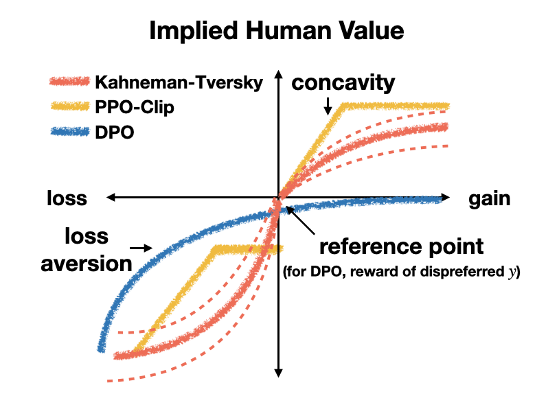

The rise of **large language models** (**LLMs**) has transformed natural language processing. However, ensuring these models align with human values—a process known as **preference optimization**—remains a significant challenge. This process is crucial for making sure LLMs generate content that is not only effective but also ethically sound and socially acceptable.

Traditionally, **reinforcement learning from human feedback** (**RLHF**) has been the go-to method for preference optimization. Yet, it faces limitations such as complexity and instability due to the necessity of training a separate reward model. To address these issues, new algorithms like [**direct preference optimization**](https://arxiv.org/abs/2305.18290) (**DPO**) and **Kahneman-Tversky optimization** (**KTO**) have been developed. This article will introduce these algorithms to provide insights into the evolving strategies for aligning LLMs with human preferences.

## Recap of Preference Optimization

First, let's recap some key concepts related to preference optimization:

- Preference data: This forms the foundation of preference optimization. It consists of prompts and human judgments on different model-generated responses to those prompts. This data can be in the form of:
  - Paired comparisons, where humans choose the preferred response from two options.
  - Binary labels, such as thumbs up or thumbs down, indicating whether a single response is desirable or not.
  - Rankings, where humans rank multiple responses from best to worst.
- Reward model: This function assigns a score to each response, reflecting how desirable it is according to human preferences. The reward model can be:
  - Explicitly trained, as in RLHF, where a separate neural network is trained to predict human preferences.
  - Implicit, as in DPO, where the reward function is embedded within the policy network itself.
- Policy model: This is the LLM being optimized. It takes a prompt as input and generates a response. The policy model is trained to maximize the expected reward, leading to the generation of more human-preferred responses.
- Reference model: This pre-trained LLM serves as a starting point for preference optimization. The reference model is often fine-tuned with supervised learning on high-quality data before preference optimization to improve its performance on the target task. We prevent the policy model from deviating too far from the reference model to maintain coherence and general knowledge, often by using KL divergence as a regularizer.
- Loss function: This quantifies the difference between the model's output and human preferences. It can be based on a certain mathematcical model for preference data, such as the **Bradley-Terry model** for paired comparisons [^1].

Preference optimization has several challenges, including:

- Data quality: Human preferences can be noisy, subjective, and context-dependent, making it challenging to train accurate reward models.
- Reward over-optimization: Policy models may learn to exploit flaws in the reward model or generate outputs that achieve high reward without truly aligning with human preferences.
- Generalization: It is crucial for the policy model to generalize well to new prompts and unseen data, which can be challenging with limited preference data.

To address these challenges, researchers have developed various preference optimization algorithms that we will discuss in the following sections.

## Direct Preference Optimization

DPO is a simpler and more stable alternative to RLHF, addressing the complexities associated with reinforcement learning [^2]. Today, DPO is a popular choice and has been adopted in various model families such as Llama and Mistral.

<small>Image taken from <a href="https://arxiv.org/abs/2305.18290">Direct Preference Optimization: Your Language Model is Secretly a Reward Model</a>.</small>

### How DPO Works

At the core of DPO is a reimagined approach to preference alignment. Unlike RLHF, DPO directly optimizes the policy by reparameterizing the reward model. This is achieved through a clever change of variables that allows the reward model's optimal policy to be expressed in a closed form.

The DPO algorithm essentially creates a bridge between reward functions and policy models, enabling them to be represented within a single network. This integration transforms the task of preference optimization into a straightforward classification problem, eliminating the need for an explicit reward model. By doing so, DPO simplifies the training process significantly.

DPO involves two main steps:

1. Data collection: Gather a dataset of prompts and paired human preferences for different model-generated responses
2. Optimization: Directly optimize the policy model using the DPO loss function

### DPO Benefits

Experiments have shown that DPO can achieve performance comparable to RLHF while enjoying several key advantages:

- Simplicity: DPO simplifies the preference learning pipeline by eliminating the need for explicit reward modeling and reinforcement learning.
- Stability: DPO training is generally more stable than RLHF due to the absence of the complex dynamics introduced by reinforcement learning.
- Computational efficiency: DPO reduces the computational cost of training as it doesn't require sampling from the language model during fine-tuning.

## Beyond DPO: Other Preference Optimization Algorithms

Besides DPO, there are other significant algorithms in the field of preference optimization.

[**Sequence likelihood calibration**](https://arxiv.org/abs/2210.00045) (**SLiC**) aims to improve the alignment with human preferences while maintaining the overall quality of generated texts by combining a max-margin loss for preferences with a standard language modeling loss. The max-margin loss encourages the model to assign higher probabilities to preferred outputs, and the language modeling loss helps maintain fluency.

[**Identity-preference optimization**](https://arxiv.org/abs/2310.12036) (**IPO**) was developed as a theoretical framework to address overfitting issues in DPO. It directly optimizes a regularized version of total preferences without relying on the Bradley-Terry model, which can be problematic with deterministic or near-deterministic preferences. IPO utilizes a bounded function for preference aggregation to ensure the KL regularization remains effective even with deterministic preferences. This approach mitigates overfitting to the preference dataset.

[**Kahneman-Tversky optimization**](https://arxiv.org/abs/2402.01306) (**KTO**) utilizes the principles of **prospect theory**, a behavioral economics theory that describes how people make decisions under risk, to align LLMs with human preferences [^3]. It maximizes the utility of model outputs instead of focusing on preference likelihood. Unlike other preference optimization algorithms that require paired preferences, KTO only needs binary labels (desirable/undesirable) to train the model. This simplifies data collection and makes KTO suitable for real-world applications where preference data is limited.

KTO leverages the concept of a reference point, representing the decision-maker's current state. The algorithm evaluates outputs based on their perceived gains or losses relative to this reference point. KTO incorporates loss aversion, a key principle of prospect theory, positing that the pain of a loss is greater than the pleasure of an equivalent gain. Experiments show that KTO achieves comparable or superior performance to preference-based methods like DPO, and it works without requiring prior **supervised finetuning** (**SFT**), a capability not observed in other tested methods.

<small>Image taken from <a href=https://arxiv.org/abs/2402.01306v3">KTO: Model Alignment as Prospect Theoretic Optimization</a>.</small>

So far, we have seen four different preference optimization algorithms. Let's take a step back here. [Tang et al.](https://arxiv.org/abs/2402.05749v2) introduced a unifying framework that encompasses existing algorithms such as DPO, IPO, and SLiC as special cases, while also introducing a new variant, **generalized preference optimization** (**GPO**). The proposed framework helps to better understand the trade-offs between different algorithmic variants, especially with regard to the strength of regularization.

<small>Image taken from <a href="https://arxiv.org/abs/2402.05749v2">Generalized Preference Optimization: A Unified Approach to Offline Alignment</a>. ρ denotes the difference of log ratio.</small>

Once the search space is defined, the next step is to automatically explore it to discover the optimal algorithm. [**Discovered preference optimization**](https://arxiv.org/abs/2406.08414) (**DiscoPOP**) emerged from an LLM-driven objective discovery process. DiscoPOP dynamically blends logistic and exponential losses. DiscoPOP is notable for its non-convex segment and negative gradients at the start of training, suggesting potential benefits for curriculum learning or introducing stochasticity. DiscoPOP generally performs well across multiple held-out evaluation tasks However, it can struggle to converge with very low or very high β values, potentially due to limitations in the discovery process where β was fixed at 0.05.

<small>Image taken from <a href="https://arxiv.org/abs/2406.08414v3">Discovering Preference Optimization Algorithms with and for Large Language Models</a>.</small>

## Conclusion

Preference optimization is crucial for aligning LLMs with human values. While DPO offers a simpler and more stable alternative to RLHF, the field is rapidly evolving, with new algorithms such as IPO, KTO, GPO, and DiscoPOP, just to name a few. The continued advancement of these algorithms is essential for building safe, helpful, and reliable LLMs for the future.

[^1]: This blog covered the Bradley-Terry model in [a previous post](https://hippocampus-garden.com/elo_vs_bt/).

[^2]: This blog covered DPO in [a previous post](https://hippocampus-garden.com/tiny_llama_dpo_lora/).

[^3]: This blog covered KTO in [a previous post](https://hippocampus-garden.com/tiny_llama_kto_lora/).
