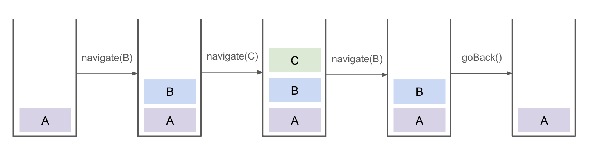

When I was developing a React Native app, I encountered a tricky behavior of [React Navigation's stack navigator](https://reactnavigation.org/docs/native-stack-navigator/). Although it might seem straightforward for those familiar, this behavior isn't very intuitive and can easily confuse beginners. I believe sharing this insight can help others navigate through similar challenges. In this article, I'll explain the trick and how to deal with it.

## A Tricky Behavior of `navigate` Function

Suppose we have a stack navigator with three screens, A, B, and C, and we navigate between them as follows. Which screen do you expect to see when we go back from the screen B at the step 5?

1. Start with the screen A
2. Navigate to the screen B with `navigation.navigate("B")`
3. Navigate to the screen C with `navigation.navigate("C")`
4. Navigate to the screen B with `navigation.navigate("B")`
5. Go back with `navigation.goBack()`

At first, I expected the app would go back to the screen C, which is normal for web browsers. But it actually goes back to *the screen A*.

## How `navigate` Works

What's happening here? To understand this, let's see how `navigate` works. The [official document](https://reactnavigation.org/docs/navigation-prop/#navigate) says:

> In a native stack navigator, calling navigate with a screen name will result in different behavior based on if the screen is already present or not. If the screen is already present in the stack's history, it'll go back to that screen and remove any screens after that. If the screen is not present, it'll push a new screen.

So, if the destination screen is already present in the stack, it *goes back* to that screen. This is the tricky part. Let's see what was happening in the previous example step by step.

1. Start with the screen A
2. Navigate to the screen B with `navigation.navigate("B")`. We push "B" to the stack
3. Navigate to the screen C with `navigation.navigate("C")`. At this point, the stack is ["C", "B", "A"]
4. Navigate to the screen B with `navigation.navigate("B")`. We already have "B" to the stack, so we keep popping from the stack until we find "B". In this case, we pop "C" from the stack
5. Go back with `navigation.goBack()`. We pop "B" from the stack and the screen A is shown

## How to Go Back to the Screen C

Is it possible to change this behavior to go back to the screen C? Yes, it is. To do that, we should use `navigation.push("B")` instead of `navigation.navigate("B")` at the step 4. The `push` function always pushes a new screen to the stack regardless of the stack history, so we can go back to the screen C as expected. Here is the step by step explanation.

1. (Same as the previous example)
2. (Same as the previous example)
3. (Same as the previous example)
4. Navigate to the screen B with `navigation.push("B")`. The stack is now ["B", "C", "B", "A"]
5. Go back with `navigation.goBack()`. We pop "B" from the stack and the screen C is shown