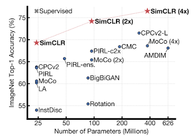
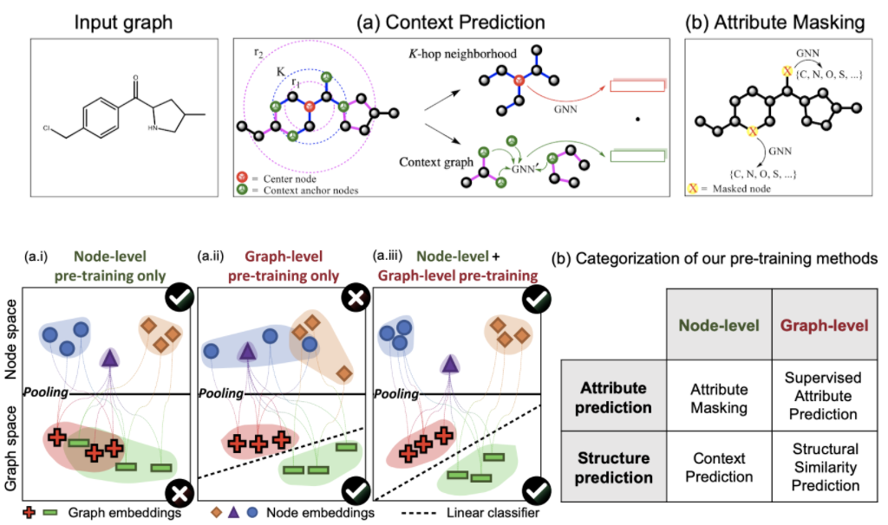
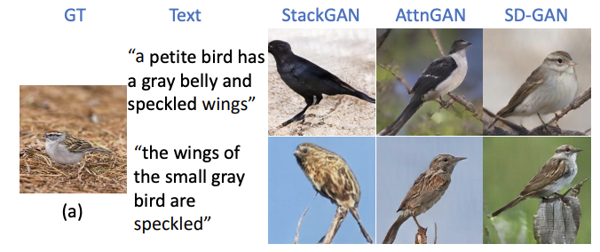

Recently, we've seen great advances in representation learning. For example, BERT [1] in natural language processing tasks and SimCLR in computer vision tasks.

## BERT Learns Good Representations of Texts
BERT is well described in the following figure from [this great blog post](http://jalammar.github.io/illustrated-bert/). BERT is a Transformer-based model that is trained in two steps:
1. Pre-training on a surrogate task (self-supervised training on large corpora)
2. Fine-tuning to a downstream task (supervised training on a specific task with a labeled dataset)

<small>Figure taken from [The Illustrated BERT, ELMo, and co. (How NLP Cracked Transfer Learning) – Jay Alammar – Visualizing machine learning one concept at a time](http://jalammar.github.io/illustrated-bert/).</small>

Just by the surrogate task (predicting the masked words), BERT acquires generalizable representations and shows great performance in downstream tasks from question answering to named entity recognition. For its generalizability and simplicity, BERT became popular at once.

## Larger Model, More Data, Longer Training
The impact that BERT made on the research area was so great that many works have followed it until today. Some explored different pre-training tasks, some reduced the model size while keeping its performance, and others further increased the model size to achieve state-of-the-art.

The figure below shows that the pre-trained models have been getting larger and larger since ELMo was born. Today, the largest model called **Turing-NLG** (born in Feburary 2020) has as many as 17 billion parameters! This is 50 times larger than BERT 😲

<small>Figure taken and modified from [Turing-NLG: A 17-billion-parameter language model by Microsoft - Microsoft Research](https://www.microsoft.com/en-us/research/blog/turing-nlg-a-17-billion-parameter-language-model-by-microsoft/).</small>

Of course Turing-NLG is not only extremely large. It outperforms the state of the art on many downstream NLP tasks. Moreover, the authors say:
> We have observed that the bigger the model and the more diverse and comprehensive the pretraining data, the better it performs at generalizing to multiple downstream tasks even with fewer training examples.

It seems that they empirically know that *a larger model, more data, and longer training lead to the better performance* and that they are moving forward to that direction.

## A Similar Approach to Images
A similar approach is taken to the self-supervised pre-training for image representations by **SimCLR** [2]. The pre-training scheme of SimCLR is shown below:

<small>Figure taken from [Google AI Blog: Advancing Self-Supervised and Semi-Supervised Learning with SimCLR](https://ai.googleblog.com/2020/04/advancing-self-supervised-and-semi.html)</small>

First, a batch of images (batch size $B$) are transformed in two ways, resulting in $2B$ images. Each transformation is a random combination of two simple augmentations (e.g., random cropping and color distortion). They are fed into a CNN to produce the representation of each image. Then it is non-linearly projected by a MLP. The model compares random pairs from the $2B$ outputs and it is trained so that *outputs from the same image are close and ones from the differnt images are distant*. In this sense, the pre-training scheme is referred to as **contrastive learning** (CL of SimCLR).

SimCLR outperforms all the previous self-supervised and semi-supervised learning on ImageNet classification in different model sizes. Surprisingly, it even matches the performance of supervised learning in a smaller model, ResNet-50. Here, again, the larger model leads to the higher accuracy.

<small>Figure from the original paper [2]</small>

## … and Graphs!
There are self-supervised representation learning for graphs as well! Hu et al. [3] successfully avoid *negative transfer* by combining different scales of tasks (node-level and graph-level) and different nature of tasks (attribute prediction and structure prediction).

<small>Figure from the original paper [3]</small>

Note that the attribute masking task is quite similar to the masked language model used in BERT.

When GNNs are applied to drug discovery (one of their major potential applications), this self-supervised representation learning is very important. This is because, in most cases, the number of labeled samples (e.g., which compounds are toxic and which are not) is limited while there are a lot more unlabeled samples (i.e., the structure of compounds).

## Image-to-Text & Text-to-Image
Furthermore, good representations can bridge different modalities of data. **Image captioning** (a.k.a. **image-to-text**) is a task to give an appropriate caption to the given image. If the model has good representations of objects and they are abstract enough, they can translate images to texts.

<small>[Image Captioning: Transforming Objects into Words](https://papers.nips.cc/paper/9293-image-captioning-transforming-objects-into-words)</small>

There is also a task to do the reverse: **text-to-image**. The objective of this task is to generate an appropriate image based on the given caption. Doesn't it look intelligent?

<small>[Semantics Disentangling for Text-to-Image Generation](https://arxiv.org/abs/1904.01480)</small>

## Summary
1. Good representations are learned through self-supervised pre-training tasks.
2. Larger model, more data, and longer training lead to better performance.
3. Good representations facilitate harder tasks such as text-to-image.

## References
[1] Devlin, Jacob, et al. "[BERT: Pre-training of deep bidirectional transformers for language understanding](https://arxiv.org/abs/1810.04805)." In *Proceedings of NACCL-HLT* (2019).  
[2] Chen, Ting, et al. "[A simple framework for contrastive learning of visual representations](https://arxiv.org/abs/2002.05709)." *arXiv preprint arXiv:2002.05709* (2020).  
[3] Hu, Weihua, et al. "[Strategies for Pre-training Graph Neural Networks](https://arxiv.org/abs/1905.12265)." In *Proceedings of ICLR* (2020).