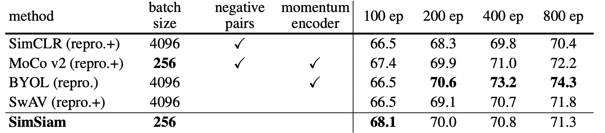
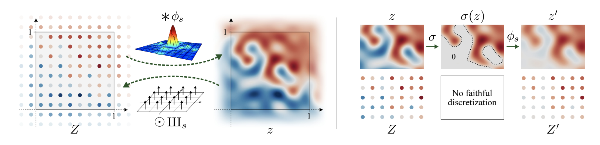
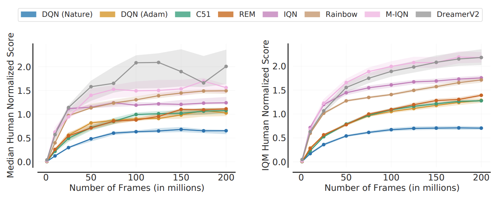
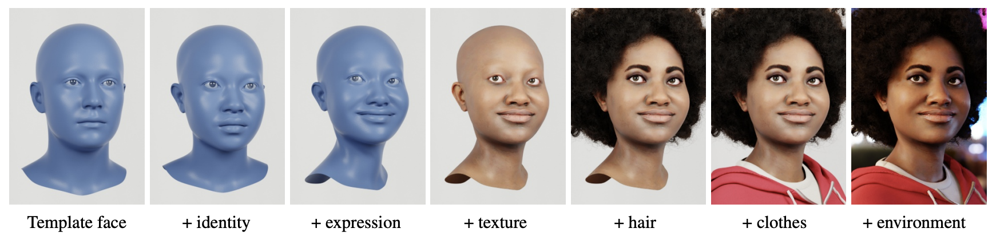
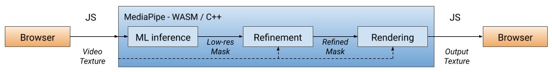

Happy New Year!🎉🐯

In 2020, the Machine Learning community has seen a lot of new achievements. I believe winter vacation is a good time to look back on the year, so this post will cover 10 representative papers that I found interesting and worth reading.

## Research Papers
Here are the 10 best ML papers of 2020 that I chose (in chronological order).

1. Exploring Simple Siamese Representation Learning
2. Extracting Training Data from Large Language Models
3. E(n) Equivariant Graph Neural Networks
4. Learning Transferable Visual Models From Natural Language Supervision
5. Unsupervised Speech Recognition
6. Alias-Free Generative Adversarial Networks
7. Deep Reinforcement Learning at the Edge of the Statistical Precipice
8. Fake It Till You Make It: Face analysis in the wild using synthetic data alone

### Exploring Simple Siamese Representation Learning
- Authors: Xinlei Chen, Kaiming He
- Link: https://arxiv.org/abs/2011.10566
- Released in: November 2020
- Accepted to: CVPR 2021

Quite a few papers on **self-supervised (unsupervised) representation learning** for images have appeared in the last few years. Examples include **SimCLR** [1], **BYOL** ([one of my favorite papers in 2020](https://hippocampus-garden.com/best_papers_2020/)) [2], and **SwAV** [3], just to name a few. These papers take different approaches but at the same time perform more or less the same in downstream tasks. Then, what are the crucial ingredients for the success of self-supervised representation learning?

This paper answers the above question by experimenting with a **simple Siamese network** (**SimSiam**). The network takes two images as input and outputs a similarity score between them. The two branches are weight-tied except that one branch has a predictor module and the other has **stop-gradient** operation. SimSiam can be interpreted as "SimCLR without negative pairs", "BYOL without momentum encoder", and "SwAV without online clustering". This comparison is well illustrated in the figure below.

On downstream tasks (linear evaluation), SimSiam performs comparably with other methods.

This result leads to an interesting insight: the key ingredient for self-supervised representation learning is not the large batch size, negative pairs, nor momemtum encoder. Instead, it is the stop-gradient operation and the predictor module.

The authors of this paper argue that SimSiam can be understood as an implementation of an **Expectation-Maximization** (**EM**) algorithm. For more detailed discussion, please check out [the original paper](https://arxiv.org/abs/2011.10566).

### Extracting Training Data from Large Language Models
- Authors: Nicholas Carlini, Florian Tramer, Eric Wallace, Matthew Jagielski, Ariel Herbert-Voss, Katherine Lee, Adam Roberts, Tom Brown, Dawn Song, Ulfar Erlingsson, Alina Oprea, Colin Raffel
- Link: https://arxiv.org/abs/2012.07805
- Released in: December 2020
- Accepted to: USENIX Security Symposium 2021

This paper reveals a scary vulnarability of large language models: *it is possible to extract training data*. By querying the **GPT-2**, a large public language model trained on the dataset sourced from the Web [4], for many times and filtering the generated texts with a certain algorithm, the authors were able to extract sensitive data such as names, phone numbers, email addresses, 128-bit UUIDs, and IRC conversations. They even recovered Donald Trump's tweets😱.

Larger models memorize more. Indeed, according to [the blog by the authors](https://bair.berkeley.edu/blog/2020/12/20/lmmem/), **GPT-3** [5] correctly reproduces about one full page of *Harry Potter and the Philosopher’s Stone*.

This privacy and copyright issue is even worse considering the current trend towards larger and larger language models. To mitigate this problem, the authors suggest some possible remedies such as using differenctial privacy and sanitizing the training data more carefully. But more concrete countermeasures are needed.

### E(n) Equivariant Graph Neural Networks
- Authors: Victor Garcia Satorras, Emiel Hoogeboom, Max Welling
- Link: https://arxiv.org/abs/2102.09844
- Released in: Feburary 2021
- Accepted to: ICML 2021

**Equivariance** is one of the hot topics in today's machine learning. Given a function $\phi: X \rightarrow Y$, transformation $T_g: X \rightarrow X$, and its corresponding transformation $S_g: Y \rightarrow Y$, $\phi$ is **equivariant** to the abstract transformation $g$ if the following equation holds:

$$
\phi(T_g(x)) = S_g(\phi(x)) .
$$

Let's remind that $\phi$ is **invariant** to $g$ if the following equation holds:

$$
\phi(T_g(x)) = \phi(x) .
$$

In this paper, the authors consider the **E(n) transformations** as $g$. E(n) transformations are, namely, translation, rotation, reflection, and permutation in n-dimensional Euclidian space. **Graph neural networks** (**GNNs**) are equivariant to permutation by design, but not to other transformations. The concepts such as equivariance and invariance are more important when considering 3D data than 2D data because there are more degrees of freedom.

So, the proposed **EGNN** (**E(n)-equivariant GNN**) is essentially a GNN that is equivariant to E(n) transformations. Unlike vanilla GNNs, each layer of EGNN takes as input the set of node embeddings, **coordinate embeddings**, and edge information and updates the two types of embeddings.

Thanks to its strong inductive bias, EGNN outperforms a vanilla GNN in modelling dynamical systems and predicting molecular properties in the QM9 dataset (with 3D coordinates of atoms), especially when the dataset is small. EGNN was later extended to a **normalizing flow** for molecules in [6]. 

### Learning Transferable Visual Models From Natural Language Supervision
- Authors: Alec Radford, Jong Wook Kim, Chris Hallacy, Aditya Ramesh, Gabriel Goh, Sandhini Agarwal, Girish Sastry, Amanda Askell, Pamela Mishkin, Jack Clark, Gretchen Krueger, Ilya Sutskever
- Link: https://arxiv.org/abs/2103.00020
- Released in: March 2021

### Unsupervised Speech Recognition
- Authors: Alexei Baevski, Wei-Ning Hsu, Alexis Conneau, Michael Auli
- Link: https://arxiv.org/abs/2105.11084
- Released in: May 2021
- Accepted to: NeurIPS 2021

### Alias-Free Generative Adversarial Networks
- Authors: Tero Karras, Miika Aittala, Samuli Laine, Erik Härkönen, Janne Hellsten, Jaakko Lehtinen, Timo Aila
- Link: https://arxiv.org/abs/2106.12423
- Released in: June 2021
- Accepted to: NeurIPS 2021

The evolution of **StyleGANs** [7,8] is not over. The Tero Karras team published **StyleGAN3** to address the undesirable **aliasing** effect that leads to some details glued to the absolute coordinates of the image. Take a look at [this official video](https://nvlabs-fi-cdn.nvidia.com/_web/stylegan3/videos/video_0_ffhq_cinemagraphs.mp4). In the StyleGAN2 panel, the hair and the beard are sticked to the screen despite the move of the head.

The authors inspected this issue and found that the root cause is that the generator abuses the positional information (that can be inferred from aliasing artifact) to generate the texture. To prevent aliasing, they made some architectual changes to treat all signals as continuous and make the entire generator translation-equivariant in the sub-pixel level.

Now StyleGAN3 can be trained on unaligned image datasets like FFHQ-U. The authors also found that the generator *invents* a coordinate system in the feature maps to synthesize textures on the surfaces. 

More videos are available at [the project page](https://nvlabs-fi-cdn.nvidia.com/_web/stylegan3/).

### Deep Reinforcement Learning at the Edge of the Statistical Precipice
- Rishabh Agarwal, Max Schwarzer, Pablo Samuel Castro, Aaron Courville, Marc G. Bellemare
- Link: https://arxiv.org/abs/2108.13264
- Released in: August 2021
- Accepted to: NeurIPS 2021

**Reinforcement learning** (**RL**) community evaluates algorithms by **point estimates** of aggregated score such as mean and median scores over a suite of tasks. But in fact, this ignores the statistical uncertainty and the reported scores are often unfairly "lucky" ones.

This issue is becoming more serious because recent RL tasks are too computationally demanding to repeat hundreds of times (e.g., **StarCraft** [9]). To tackle statistical uncertainty with only a hundful of runs, the authors made three recommmendations for reliable evaluation:

1. Do the **interval estimates** of the score via bootstrap and report the **confidence intervals**
2. Show performace profiles (score distributions) like the figure below rather than the table with mean scores
3. Use **interquartile mean** (**IQM**) for aggregating scores (IQM is robust to outliers and more statistically efficient than median!)

Following their recommendations, it becomes clearer which algorithms are superior to others. In the figure below, the left panel is the comparison using median and the right is using IQM. IQM tells us that DreamerV2 has high variance and not really better than M-IQN.

The authors compiled this evaluation protocol in a library called **rliable**. Check it out [here](https://github.com/google-research/rliable).

### Fake It Till You Make It: Face analysis in the wild using synthetic data alone
- Authors: Erroll Wood, Tadas Baltrušaitis, Charlie Hewitt, Sebastian Dziadzio, Matthew Johnson, Virginia Estellers, Thomas J. Cashman, Jamie Shotton
- Link: https://arxiv.org/abs/2109.15102
- Released in: September 2021
- Accepted to: ICCV 2021

Computer vision tasks related to human faces are popular. For example, they include detection, identification, 3D reconcstruction, generation, editing, and so on. However, collecting high-quality data from real world is a huge challenge, giving hope to the approach using synthetic data. Synthetic data has three upsides to the real data:

1. No privacy concerns
2. Perfect labels are automatically obtained (some of them are otherwise imposssible or very expensive to obtain)
3. Controlable diversity

Synthetic data of course has a downside, too: the domain gap problem. This paper solved this problem by creating a photo-realistic synthetic dataset **Face Synthetics** . By sequentially adding components to the 3D template face (see the figure below), the authors achieved the photo-realism and expressivity at the same time.

The Face Synthetics dataset is actually helpful for neural networks to learn to solve any face-related tasks such as landmark localization and face parsing. ResNets pretrained on this dataset and fine-tuned on the downstream tasks perform comparably with the state-of-the-art models.

The Face Synthetics dataset, a collection of 100,000 human face images at 512x512 resolution with landmark and semantic segmentation labels, is available [here](https://github.com/microsoft/FaceSynthetics) *for non-commercial research purpose*. Visit [the project page](https://microsoft.github.io/FaceSynthetics/) for more visualizations. 

## Application Projects

1. AlphaFold2
2. GitHub Copilot
3. Airfriend
4. (Background Effect of) Google Meet

### AlphaFold2
The function of a protein is dependent on its structure, so the protein structure is the one of keys to understand what is going on inside an organism. However, it takes huge time and cost to analyze the protein structure through experiments, and it was impossible to accurately predict from the protein's amino acid sequence (**protein folding problem**)—until the advent of **AlphaFold(2)** [11].

I'm not going to discuss the details of AlphaFold2 here because I'm not really familiar with structural biology, but the following figure from DeepMind's official blog "[AlphaFold: a solution to a 50-year-old grand challenge in biology](https://deepmind.com/blog/article/alphafold-a-solution-to-a-50-year-old-grand-challenge-in-biology)" convinces us that this is an actual breakthrough.

The full version of AlphaFold2 requires a huge computational resources with a 3 TB disk and an GPU (details [here](https://github.com/deepmind/alphafold#running-alphafold)). But fortunately, you can try the light version of it at [Google Colab](https://colab.research.google.com/github/sokrypton/ColabFold/blob/main/AlphaFold2.ipynb).

There is already a ["predicted" protein structure database](https://alphafold.ebi.ac.uk/). I can't wait for AlphaFold to accelerate life sciences and the process of drug discovery.

### GitHub Copilot
**[GitHub Copilot](https://copilot.github.com/)** is a super smart code autocompleter. Based on the context including comments, GitHub Copilot suggests the best code snippets to complete the current code. The core machine learning model is **OpenAI Codex**, a large language model trained on publicly available source code from GitHub [10].

As shown in the video below, if you want to write a function, all you have to do is write an appropriate comment and press the tab key. Copilot will complete the function for you.

<iframe width="560" height="315" src="https://www.youtube.com/embed/St2CMvK4hK0?start=69" title="YouTube video player" frameborder="0" allow="accelerometer; autoplay; clipboard-write; encrypted-media; gyroscope; picture-in-picture" allowfullscreen></iframe>

Since Copilot is not yet a perfect programmer, you always have to write a test code to verify that the autocompleted code is correct (Copilot can help it, too!). Either way, it generally speeds up your total coding time especially if you are not familiar with that language / framework.

It should be noted that Copilot is also provoking controversy. As the aforementioned paper "[Extracting Training Data from Large Language Models](https://arxiv.org/abs/2012.07805)" points out, Codex should memorize its training data. Therefore, it is possible to extract personal information (e.g., mistakenly uploaded API keys) or abuse codes from a repository that is protected by its license. Also, it might help spreading wrong, malicious, or inefficient code that exist somewhere in the public repositories. 

### Airfriend
**[Airfriend](https://airfriend.ai/)** is a chatbot that you can *nurture* to be what you like. You can finetune the chatbot with your ideal responses in an online fashion, and you can also share your chatbot with your (physical) friends.

Currently Airfriend only supports Japanese, but has already acquired a lot of users due to its naturalness conversation and customizability. 

<blockquote class="twitter-tweet">
AIで架空の友達を育てて共有したり、みんなが育てたAIと話せる無料アプリ「エアフレンド」を個人開発しました。推しが言いそうなセリフをAIに教えると、推しの人格を学習したAIと会話できます エアフレンド→ <a href="https://t.co/NhvnUd7CAo">https://t.co/NhvnUd7CAo</a> <a href="https://t.co/wcK6BzgbcN">pic.twitter.com/wcK6BzgbcN</a>
&mdash; Ryobot (エアフレンド開発者) (@_Ryobot) <a href="https://twitter.com/_Ryobot/status/1437714740529319939?ref_src=twsrc%5Etfw">September 14, 2021</a></blockquote> 

Another great thing about Airfriend is that it is developed by an individual developer ([@_Ryobot](https://twitter.com/_Ryobot)). [The chatbot model is a Transformer with one billion parameters](https://twitter.com/_Ryobot/status/1437762555578134530), so I imagine it is very hard to keep running the service for thousands of users. Other languages will be supported "in the near future".

### Background Effect of Google Meet
The background effeect of **[Google Meet](https://meet.google.com/)** is the most familiar example of machine learning on web browsers (**WebML**). As you may know, Google Meet can blur or replace the background. Other meeting apps such as Zoom and Microsoft Teams also support this feature, but one thing is different. Google Meet works *on the browser*.

This background effect needs deep learning based segmentation which, if naively implemented, is too heavy for real-time processing. The magic of Google Meet is disclosed in the [Google AI Blog](https://ai.googleblog.com/2020/10/background-features-in-google-meet.html). In short, it defines the entire pipeline from segmentation to rendering in **[MediaPipe](https://google.github.io/mediapipe/)**, a machine learning framework optimized for live and streaming data, and converts it to **WebAssembly** (**Wasm**). At runtime, the browser converts the Wasm code into native machine code so that it is executed faster than JavaScript code.

<small>Figure taken from <a href="https://ai.googleblog.com/2020/10/background-features-in-google-meet.html">Google AI Blog: Background Features in Google Meet, Powered by Web ML</a>.</small>

For the segmentation model, Google Meed adopts MobileNetV3-small [12] exported to [**TFLite**](https://www.tensorflow.org/lite) and accelerated by [**XNNPACK**](https://github.com/google/XNNPACK). The MobileNet outputs a low-resolution segmentation mask, which is refined in the subsequent module.

## Concluding Remarks
There are other interesting papers that I could not include here. If you have any recommendations, please feel free to comment.

Thanks for reading this long post. Hope you have a good one!

https://ja.stateofaiguides.com/20211230-ai-trends-2021/

## References
[1] Jonathan Frankle, Michael Carbin. "[A Simple Framework for Contrastive Learning of Visual Representations](https://arxiv.org/abs/2002.05709)". *ICML*. 2020.   
[2] Jean-Bastien Grill, Florian Strub, Florent Altché, Corentin Tallec, Pierre H. Richemond, Elena Buchatskaya, Carl Doersch, Bernardo Avila Pires, Zhaohan Daniel Guo, Mohammad Gheshlaghi Azar, Bilal Piot, Koray Kavukcuoglu, Rémi Munos, Michal Valko. "[Bootstrap your own latent: A new approach to self-supervised Learning](https://arxiv.org/abs/2006.07733)". *NeurIPS*. 2020.   
[3] Mathilde Caron, Ishan Misra, Julien Mairal, Priya Goyal, Piotr Bojanowski, Armand Joulin. "[Unsupervised Learning of Visual Features by Contrasting Cluster Assignments](https://arxiv.org/abs/2006.09882)". *NeurIPS*. 2020.  
[4] Alec Radford, Jeffrey Wu, Rewon Child, David Luan, Dario Amodei, Ilya Sutskever. "[Language Models are Unsupervised Multitask Learners](http://www.persagen.com/files/misc/radford2019language.pdf)". 2019.  
[5] Tom B. Brown, Benjamin Mann, Nick Ryder, Melanie Subbiah, Jared Kaplan, Prafulla Dhariwal, Arvind Neelakantan, Pranav Shyam, Girish Sastry, Amanda Askell, Sandhini Agarwal, Ariel Herbert-Voss, Gretchen Krueger, Tom Henighan, Rewon Child, Aditya Ramesh, Daniel M. Ziegler, Jeffrey Wu, Clemens Winter, Christopher Hesse, Mark Chen, Eric Sigler, Mateusz Litwin, Scott Gray, Benjamin Chess, Jack Clark, Christopher Berner, Sam McCandlish, Alec Radford, Ilya Sutskever, Dario Amodei. "[Language Models are Few-Shot Learners](https://arxiv.org/abs/2005.14165)". *NeurIPS*. 2020.  
[6] Victor Garcia Satorras, Emiel Hoogeboom, Fabian B. Fuchs, Ingmar Posner, Max Welling. "[E(n) Equivariant Normalizing Flows](https://arxiv.org/abs/2105.09016)". *NeurIPS*. 2021.  
[7] Tero Karras, Samuli Laine, Timo Aila. "[A Style-Based Generator Architecture for Generative Adversarial Networks](https://arxiv.org/abs/1812.04948)". *CVPR*. 2019.  
[8] Tero Karras, Samuli Laine, Miika Aittala, Janne Hellsten, Jaakko Lehtinen, Timo Aila. "[Analyzing and Improving the Image Quality of StyleGAN](https://arxiv.org/abs/1912.04958)". *CVPR*. 2020.   
[9] Oriol Vinyals, Igor Babuschkin, Wojciech M. Czarnecki, Michaël Mathieu, Andrew Dudzik, Junyoung Chung, David H. Choi, Richard Powell, Timo Ewalds, Petko Georgiev, Junhyuk Oh, Dan Horgan, Manuel Kroiss, Ivo Danihelka, Aja Huang, Laurent Sifre, Trevor Cai, John P. Agapiou, Max Jaderberg, Alexander S. Vezhnevets, Rémi Leblond, Tobias Pohlen, Valentin Dalibard, David Budden, Yury Sulsky, James Molloy, Tom L. Paine, Caglar Gulcehre, Ziyu Wang, Tobias Pfaff, Yuhuai Wu, Roman Ring, Dani Yogatama, Dario Wünsch, Katrina McKinney, Oliver Smith, Tom Schaul, Timothy Lillicrap, Koray Kavukcuoglu, Demis Hassabis, Chris Apps, David Silver. "[Grandmaster level in starcraft
ii using multi-agent reinforcement learning](https://www.nature.com/articles/s41586-019-1724-z)". *Nature*. 2019.  
[10] Mark Chen, Jerry Tworek, Heewoo Jun, Qiming Yuan, Henrique Ponde de Oliveira Pinto, Jared Kaplan, Harri Edwards, Yuri Burda, Nicholas Joseph, Greg Brockman, Alex Ray, Raul Puri, Gretchen Krueger, Michael Petrov, Heidy Khlaaf, Girish Sastry, Pamela Mishkin, Brooke Chan, Scott Gray, Nick Ryder, Mikhail Pavlov, Alethea Power, Lukasz Kaiser, Mohammad Bavarian, Clemens Winter, Philippe Tillet, Felipe Petroski Such, Dave Cummings, Matthias Plappert, Fotios Chantzis, Elizabeth Barnes, Ariel Herbert-Voss, William Hebgen Guss, Alex Nichol, Alex Paino, Nikolas Tezak, Jie Tang, Igor Babuschkin, Suchir Balaji, Shantanu Jain, William Saunders, Christopher Hesse, Andrew N. Carr, Jan Leike, Josh Achiam, Vedant Misra, Evan Morikawa, Alec Radford, Matthew Knight, Miles Brundage, Mira Murati, Katie Mayer, Peter Welinder, Bob McGrew, Dario Amodei, Sam McCandlish, Ilya Sutskever, Wojciech Zaremba. "[Evaluating Large Language Models Trained on Code](https://arxiv.org/abs/2107.03374)". 2021.  
[11] John Jumper, Richard Evans, Alexander Pritzel, Tim Green, Michael Figurnov, Olaf Ronneberger, Kathryn Tunyasuvunakool, Russ Bates, Augustin Žídek, Anna Potapenko, Alex Bridgland, Clemens Meyer, Simon A. A. Kohl, Andrew J. Ballard, Andrew Cowie, Bernardino Romera-Paredes, Stanislav Nikolov, Rishub Jain, Jonas Adler, Trevor Back, Stig Petersen, David Reiman, Ellen Clancy, Michal Zielinski, Martin Steinegger, Michalina Pacholska, Tamas Berghammer, Sebastian Bodenstein, David Silver, Oriol Vinyals, Andrew W. Senior, Koray Kavukcuoglu, Pushmeet Kohli, Demis Hassabis. "[Highly accurate protein structure prediction with AlphaFold](https://www.nature.com/articles/s41586-021-03819-2)". *Nature*. 2021.  
[12] Andrew Howard, Mark Sandler, Grace Chu, Liang-Chieh Chen, Bo Chen, Mingxing Tan, Weijun Wang, Yukun Zhu, Ruoming Pang, Vijay Vasudevan, Quoc V. Le, Hartwig Adam. "[Searching for MobileNetV3](https://arxiv.org/abs/1905.02244)". *ICCV*. 2019.