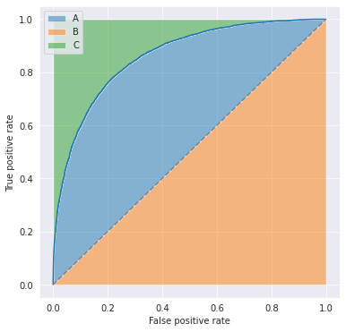
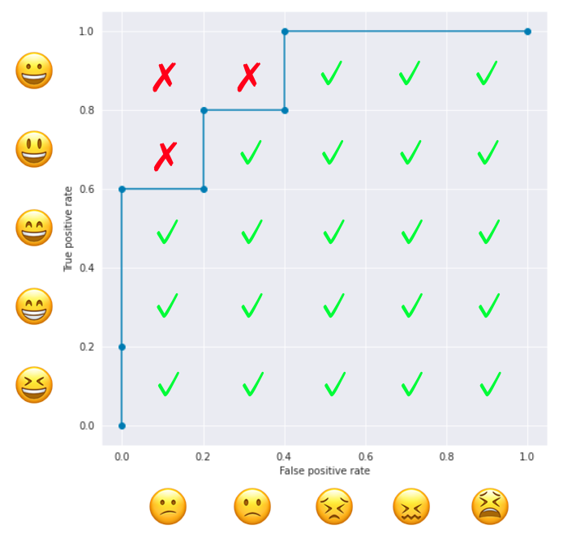

You've probably heard about the **ROC-AUC**, or simply **AUC**,  which is defined as the area under the **receiver operating characteristic (ROC)**  curve. This is indicated by the blue area in the figure below and is used to evaluate the performance of classification models.

The ROC curve is obtained by plotting the pairs of false positive and true positive rates as changing the threshold for binary classification, where

$$
\begin{aligned}
\mathrm{FPR} = \frac{\mathrm{FP}}{\mathrm{FP+TN}}\\
\mathrm{TPR} = \frac{\mathrm{TP}}{\mathrm{TP+FN}}.
\end{aligned}
$$

Therefore, this metric does not depend on the choice of the threshold and is useful when you want to consider the TPR-FPR trade-offs. It takes a value of 0.5 (= area under the dashed line) for a random binary classification model and 1.0 (= area under the line $\mathrm{TPR}=1$) for a perfectly correct model.

## Relationship with Gini Coefficient
ROC-AUC has a linear relationship with the **Gini coefficient**, which is defined as the ratio of areas $A/(A+C)$ in the figure below.

That is,

$$
\begin{aligned}
\textrm{Gini} &= \frac{A}{A+C}\\
&= 2A\\
&= 2(A+B) - 2B\\
&= 2\mathrm{AUC}-1.
\end{aligned}
$$

## Looking at AUC from a Different Perspective
Let's consider another way of looking at ROC-AUC with a fun example: an *emoji* classifier. This classifier can predict whether the given emoji is happy or not, but its prediction is not perfect. Its outputs look like below:

| Index | Face  | Label | Prediction |
| :---: | :---: | :---: | :--------: |
|   0   |   😆   |   1   |    0.9     |
|   1   |   😁   |   1   |    0.8     |
|   2   |   😄   |   1   |    0.7     |
|   3   |   😕   |   0   |    0.6     |
|   4   |   😃   |   1   |    0.5     |
|   5   |   🙁   |   0   |    0.4     |
|   6   |   😀   |   1   |    0.3     |
|   7   |   😣   |   0   |    0.2     |
|   8   |   😖   |   0   |    0.1     |
|   9   |   😫   |   0   |    0.0     |

Note that the classifier says the happy emoji "😀 " is 30% happy and the sad emoji "🙁" is 60% happy. Now, what is the ROC-AUC of this model?

Well, by increasing the threshold from 0.0 to 0.9, you'll get a ROC curve that looks like below. The threshold values are indicated along the line, so you'll see that as you increase the threshold, both FPR and TPR go down.

By counting the number of squares enclosed in the grid, we find that the ROC-AUC is 0.88 (one square is equivalent to 0.04).

The operation above is equivalent to, *for each positive sample, counting the number of negative samples with a smaller score*. A happy emoji "😆" is predicted to be happier than "😕 🙁 😣 😖 😫" so its count is 5. Another happy emoji "😀" is predicted happier than "😣 😖 😫 " so its count is 3. And so on.

| Index | Face  | Predicted Happier than... | Count |
| :---: | :---: | :-----------------------: | :---: |
|   0   |   😆   |         😕 🙁 😣 😖 😫         |   5   |
|   1   |   😁   |         😕 🙁 😣 😖 😫         |   5   |
|   2   |   😄   |         😕 🙁 😣 😖 😫         |   5   |
|   4   |   😃   |          🙁 😣 😖 😫          |   4   |
|   6   |   😀   |           😣 😖 😫           |   3   |

The total count is 22, meaning that ROC-AUC is $22 \times 0.04=0.88$. So, ROC-AUC can be computed by the following steps.
1. Create a matrix like the figure below, where positive samples are placed on the vertical axis and negative samples on the horizontal axis, both in the descending order of the predicted values from the origin
2. For each pair of positive and negative samples, check if the score of the positive sample is larger than the one of the negative sample.
3. ROC-AUC is the ratio of the checked pairs to the total pairs. 

Now we have the following formula:

$$
\mathrm{AUC} = \frac{|\{ (i,j)~|~ i\in P,j\in N, \hat{y}_i>\hat{y}_j \}|}{|\{ (i,j)~|~ i\in P,j\in N \}|},
$$

where $P$ is the set of positive samples and $N$ is the set of negative samples.

## Relationship with Mann–Whitney U Test 
This counting operation can also be seen in the **Mann-Whitney U test** (a.k.a. **Mann–Whitney–Wilcoxon (MWW) test** and **Wilcoxon rank-sum test**). MWW test is a nonparametric test of the null hypothesis that two populations are the same, particularly for the case one population tends to have larger values than the other. 

Given i.i.d samples $X_1,\ldots,X_m$ from $X$ and i.i.d samples $Y_1,\ldots,Y_n$ from $Y$, 
MWW test considers the following statistic called **Mann-Whitney U statistic**.

$$
\begin{aligned}
U = \sum_{i=1}^{m}\sum_{j=1}^{n}S(X_i,Y_j)\\
\mathrm{where}~ S(x,y)=
\begin{cases}
    1 ~(x>y) \\
    \frac{1}{2} ~(x=y)\\
    0 ~(x<y)
  \end{cases}
\end{aligned}
$$

$\sum_{j=1}^{n}S(X_i,Y_j)$ counts the number of $Y_j$ that is smaller than $X_i$, and the outer $\sum_{i=1}^{m}$ takes the sum over all the samples from $X$. If the U statistic is sufficiently large, the MWW test rejects the null hypothesis.

## References
[1] [Mann–Whitney U test - Wikipedia](https://en.wikipedia.org/wiki/Mann%E2%80%93Whitney_U_test)  
[2] [Mann-Whitney Hypothesis Test | Six Sigma Study Guide](https://sixsigmastudyguide.com/mann-whitney-non-parametric-hypothesis-test/)  
[3] 門脇大輔，阪田隆司，保坂桂佑，平松雄司. "[Kaggleで勝つデータ分析の技術](https://gihyo.jp/book/2019/978-4-297-10843-4)". 技術評論社. 2020. pp.75-77.