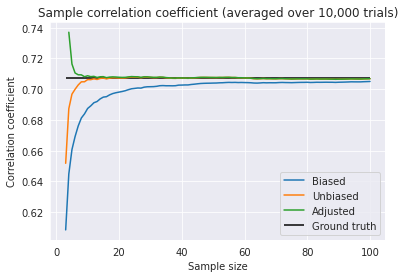

## Pearson's r Definition
For measuring the *linear correlation* between two sets of data, it is common to use **Pearson product-moment correlation coefficient**. **Pearson correlation coefficient** is the most well-known measure for correlation.  When the term "correlation coefficient" is used without further information, it usually refers to this type of definition. Given paired data $\{(x_i,y_i)\}_{i=1}^n$, **Pearson's r** is defined as:

$$
r = \frac{{\displaystyle \sum_{i = 1}^n (x_i - \overline{x})
(y_i - \overline{y})}}{\sqrt{{\displaystyle \sum_{i = 1}^n 
(x_i - \overline{x})^2}} \sqrt{{\displaystyle \sum_{i = 1}^n 
(y_i - \overline{y})^2}}} ,
$$

where $\bar{x}$ and $\bar{y}$ are the sample means. The numerator is the covariance between $x_i$ and $y_i$ and the denominator is the product of their standard deviations.

$$
\rho = \frac{Cov[X,Y]}{\sqrt{V[X]}\sqrt{V[Y]}}
$$

## Pearson's r is Biased!
$$
f(r) = \frac{(n-2)\Gamma(n-1)(1-\rho^2)^{\frac{n-1}{2}}(1-r^2)^{\frac{n-4}{2}}}{\sqrt{2\pi}\Gamma(n-\frac{1}{2})(1-\rho r)^{n-\frac{3}{2}}} \mathbf{_2F_1}\Bigl( \frac{1}{2},\frac{1}{2};\frac{2n-1}{2};\frac{\rho r+1}{2} \Bigr)
$$

## Experiment

Well, the "unbiased" estimator 

## References
[1] Ingram Olkin, John W. Pratt. "[Unbiased Estimation of Certain Correlation Coefficients](https://projecteuclid.org/journals/annals-of-mathematical-statistics/volume-29/issue-1/Unbiased-Estimation-of-Certain-Correlation-Coefficients/10.1214/aoms/1177706717.full)". *Ann. Math. Statist.* 1958.   
[2] [Pearson correlation coefficient - Wikipedia](https://en.wikipedia.org/wiki/Pearson_correlation_coefficient)