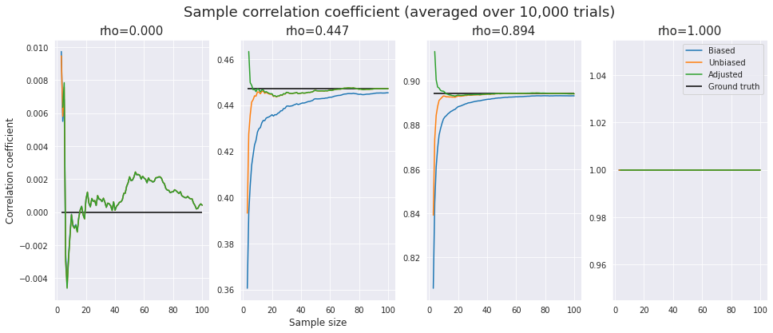
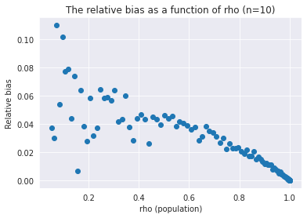

Have you ever wondered how much bias the sample correlation coefficient $r$ has with respect to the population correlation coefficient $\rho$? In fact, even if the sample size is about 20, there will be a bias of up to 5%, depending on the value of $\rho$. This post visualizes how large the bias is and shows how to fix it.

## Definition: Pearson's r
As already discussed in [the previous post](https://hippocampus-garden.com/stats_rank_correlation/#pearson-correlation-coefficient), **Pearson product-moment correlation coefficient**, or simply **Pearson's r** of the paired sequences $\{(x_i,y_i)\}_{i=1}^n$ is given as:

$$
r = \frac{{\displaystyle \sum_{i = 1}^n (x_i - \overline{x})
(y_i - \overline{y})}}{\sqrt{{\displaystyle \sum_{i = 1}^n 
(x_i - \overline{x})^2}} \sqrt{{\displaystyle \sum_{i = 1}^n 
(y_i - \overline{y})^2}}} ,
$$

where $\bar{x}$ and $\bar{y}$ are the sample means. This is the **sample correlation coefficient**. For a population, the **population correlation coefficient** of the paired random variables $X$ and $Y$ is defined as:

$$
\rho = \frac{Cov[X,Y]}{\sqrt{V[X]}\sqrt{V[Y]}}.
$$

## Pearson's r For a Sample is Biased!
So, is the sample correlation coefficient $r$ an unbiased estimator of the population correlation coefficient $\rho$? Unfortunately, the answer is no. $r$ is only asymptotically unbiased, so when the sample size is small, you need to care about its bias.

In this post, I assume *the data $X$ and $Y$ follow a bivariate normal distribution* and experiment with unbiased estimators of the correlation coefficient. Then, the exact density function is given as:

$$
f(r) = \frac{(n-2)\Gamma(n-1)(1-\rho^2)^{\frac{n-1}{2}}(1-r^2)^{\frac{n-4}{2}}}{\sqrt{2\pi}\Gamma(n-\frac{1}{2})(1-\rho r)^{n-\frac{3}{2}}}~ \mathbf{_2F_1}\Bigl( \frac{1}{2},\frac{1}{2};\frac{2n-1}{2};\frac{\rho r+1}{2} \Bigr),
$$

where $\Gamma(\cdot)$ is the **gamma function** and $\mathbf{_2F_1}(\cdot,\cdot;\cdot;\cdot)$ is the **Gaussian hypergeometric function**.

From the above scary-looking equation, Olkin et al. [1] derived the unique **minimum variance unbiased estimator** (**MVUE**):

$$
r_{mvu} = r~  \mathbf{_2F_1}\Bigl( \frac{1}{2},\frac{1}{2};\frac{n-1}{2};1-r^2 \Bigr).
$$

This formula is too complicated, so there is an approximated version:

$$
r_{adj} = r\Bigl( 1+\frac{1-r^2}{2(n-3)} \Bigr).
$$

How large is the bias of the sample correlation coefficient? How good is the approximation? To answer these questions, I conducted some experiments in the next section.

## Experiment
The code I used for the experiments below is available at [Colaboratory](https://colab.research.google.com/drive/1CLhEuKI2Hsx62x7LdDEDqThVthRMo2sm?usp=sharing). 

I obtained correlated sequences and their correlation coefficients in the following way:

1. Draw $n$ samples $x_1,\ldots,x_n$ from $\mathcal{N}(0,1)$ 
2. Draw $n$ samples $e_1,\ldots,e_n$ from $\mathcal{N}(0,1)$ 
3. Given $p$ ($0\leq p\leq1$), obtain $n$ samples by $y_i=px_i+(1-p)e_i$
4. Compute the biased, the unbiased, and the adjusted correlation coefficients

Here, $p$ determines the correlation between $X$ and $Y$. That is, $X$ and $Y$ have a perfect correlation when $p=1$, and they have a zero correlation when $p=0$. Formally, we have

$$
\begin{gathered}
V[X]=1\\
V[Y] = V[pX+(1-p)E] = p^2 + (1-p)^2 = 2p^2-2p+1\\
Cov[X,Y] = Cov[X,pX+(1-p)E] = p.
\end{gathered}
$$

Therefore, the population correlation coefficient $\rho$ is expressed as a function of $p$:

$$
\rho = \frac{p}{\sqrt{2p^2-2p+1}}.
$$

First, for different values of $\rho$ and $n$ (sample size), I plotted the biased, the unbiased, and the adjusted correlation coefficients to see their bias from the population statistic and their asymptotic behavior. To alleviate the effects of stochastic noise, I took an average over 10,000 trials. For calculating $\mathbf{_2F_1}(\cdot,\cdot;\cdot;\cdot)$, scipy provides `hyp2f1` function.

```python
import numpy as np
import matplotlib.pyplot as plt
import seaborn as sns
import scipy.special as sc
from tqdm.notebook import tqdm

sns.set_style("darkgrid")

def gen_data(p=0.5, n=100, k=10000):
    x = np.random.randn(n, k)
    e = np.random.randn(n, k)
    y = p * x + (1-p) * e

    biased = []
    unbiased = []
    adjusted = []
    for i in tqdm(range(3, n+1)):
        r_biased = []
        r_unbiased = []
        r_adjusted = []
        for j in range(k):
            r = np.corrcoef(x[:i, j], y[:i, j])[0, 1]
            r_biased.append(r)
            r_unbiased.append(r * sc.hyp2f1(0.5, 0.5, (i-1)/2, 1-r**2))
            r = r * (1 + (1 - r**2) / (2 * (i-3)))
            r_adjusted.append(r)
        biased.append(np.mean(r_biased))
        unbiased.append(np.mean(r_unbiased))
        adjusted.append(np.mean(r_adjusted))

    return biased, unbiased, adjusted

def population_r(p):
    return p / (2*p**2 - 2*p + 1)**0.5

ps = [0, 1/3, 2/3, 1]
fig = plt.figure(figsize=(16,6))
for i,p in enumerate(ps):
    ax = fig.add_subplot(1, 4, i+1)
    biased, unbiased, adjusted = gen_data(p, n=n, k=10000)
    rho = population_r(p)
    x = np.arange(3, n+1)
    ax.plot(x, biased, label="Biased")
    ax.plot(x, unbiased, label="Unbiased")
    ax.plot(x, adjusted, label="Adjusted")
    ax.hlines(rho, x[0], x[-1], label="Ground truth")
    if i==1:
        ax.set_xlabel("Sample size", fontsize=12)
    if i==0:
        ax.set_ylabel("Correlation coefficient", fontsize=12)
    if i==3:
        ax.legend()
    ax.set_title(f"rho={rho:.3f}", fontsize=15)
fig.suptitle("Sample correlation coefficient (averaged over 10,000 trials)", fontsize=18)
plt.show()
```



One can observe the following:

- The "biased estimator" is indeed asymptotically unbiased, but the bias remains non-subtle even when $n\sim 50$.
- It looks like neither the "unbiased" estimator nor the "adjusted" estimator is completely unbiased. Still, they are significantly more accurate than the biased estimator.
- The bias depends on $\rho$ as well as $n$. It seems that the smaller $|\rho|$ is, the larger the relative  bias is. 
- When $\rho=1$ (perfect correlation), $r=r_{mvu}=r_{adj}=\rho=1$.
- When $\rho=0$ (zero correlation), $r\simeq r_{mvu} \simeq r_{adj}$.

To better picture how the bias changes according to $\rho$, let's think about absolute bias $\rho - r$ for the case where $n=10$. This is untractable due to the hypergeometric term, so I consider the approximated version:

$$
r_{adj} - r = \frac{1}{2(n-3)}r(1-r^2)
$$

The absolute bias reaches its maximum when $r=1/\sqrt{3}$ (i.e. $\rho \simeq 0.6$) because:

$$
\begin{aligned}
\frac{\partial }{\partial r}(r_{adj} - r) &= 0 \\
\frac{1-3r^2}{2(n-3)} &= 0\\
r &= \pm \frac{1}{\sqrt{3}}.
\end{aligned}
$$

The numerical experiment produced the expected result.


In a similar way, the approximated relative bias $(r_{adj} - r)/r_{adj}$ takes its maximum value when $r=0$.



## Conclusion
- The sample correlation coefficient $r$ is *not* an unbiased estimator of the population correlation coefficient $\rho$. The bias remains untrivial when $n\sim 50$
- For the data that follow a bivariate normal distribution, the exact form of minimum variance unbiased estimator $r_{mvu}$ is known
- The approximated version $r_{adj}$ is accurate enough and far handier
- The smaller $|\rho|$ is, the larger the relative bias of $r$ is

## References
[1] Ingram Olkin, John W. Pratt. "[Unbiased Estimation of Certain Correlation Coefficients](https://projecteuclid.org/journals/annals-of-mathematical-statistics/volume-29/issue-1/Unbiased-Estimation-of-Certain-Correlation-Coefficients/10.1214/aoms/1177706717.full)". *Ann. Math. Statist.* 1958.   
[2] [Pearson correlation coefficient - Wikipedia](https://en.wikipedia.org/wiki/Pearson_correlation_coefficient)