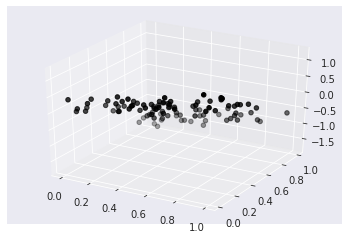

[The last post](https://hippocampus-garden.com/stats_linreg/) discussed simple linear regression, which explains the objective variable $y$ by a *single* explanatory variable $x$. This post introduces regression with multiple explanatory variables $X$: **multiple linear regression**.


$$
y = \beta_0+\beta_1x_1+\ldots+\beta_mx_m = \boldsymbol{\beta}^\mathrm{T}\boldsymbol{x}
$$

## Least Square Estimates, Revisited!
Just like simple linear regression, multiple linear regression also finds their parameters $\boldsymbol{\beta}$ by the **method of least squares**. 
Given the paired data $\{(x_i,y_i)\}_{i=1}^n$, the sum of the squared error between the predicted $\hat{y}_i =  \boldsymbol{\beta}^\mathrm{T}\boldsymbol{x}$ and the actual $y_i$ is written in a matrix form:

$$
\mathcal{L}(\boldsymbol{\beta}) \coloneqq  ( \boldsymbol{y} - X\boldsymbol{\beta} )^2.
$$

Therefore, the **least squares estimates** are:

$$
\hat{\boldsymbol{\beta}} = (X^{\mathrm{T}}X)^{-1}X^{\mathrm{T}}\boldsymbol{y}
$$

### Proof
$$
\mathcal{L}(\boldsymbol{b}) = ( \boldsymbol{y} - X\boldsymbol{b} )^2
$$


$$
\begin{aligned}
\frac{\partial\mathcal{L}(\boldsymbol{b})}{\partial\boldsymbol{b}} &= 0\\
-2X^{\mathrm{T}}(\boldsymbol{y} - X\boldsymbol{b}) &=0\\
X^{\mathrm{T}}X\boldsymbol{b} &= X^{\mathrm{T}}\boldsymbol{y}\\
\hat{\boldsymbol{b}} = (X^{\mathrm{T}}X)^{-1}X^{\mathrm{T}}\boldsymbol{y}
\end{aligned}
$$

## Coefficient of Determination
**Coefficient of determination** $R^2$ is defined in exactly the same way as for simple linear regression.

$$
R^2 \coloneqq \frac{ESS}{TSS} = \frac{ \sum_{i=1}^n (\hat{y_i}-\bar{y})^2}{\sum_{i=1}^n (y_i-\bar{y})^2}.
$$

In multiple linear regression, the **correlation coefficient** is defined as the square root of the coefficient of determination, that is, $r \coloneqq R$.

As extra explanatory variables are added, $R^2$ spuriously increases. For **feature selection**, you might want to use **adjusted coefficient of determination** $\bar{R}^2$ to complement this effect.

$$
\bar{R}^2 \coloneqq 1- \frac{n-1}{n-m-1}(1-R^2)
$$

Here, $n-1$ is the degree of freedom of the totals $y_i-\bar{y}$ and $n-m-1$ is the degree of freedom of the residuals $y-\hat{y_i}$.

## Experiment
It's easy to use multple linear regression because scikit-learn's `LinearRegression` supports it by default. You can use it exactly the same way as the [last post](https://hippocampus-garden.com/stats_linreg/).

First, let's prepare the dataset.

```python
import numpy as np
import matplotlib.pyplot as plt
import seaborn as sns

sns.set_style("darkgrid")

n = 100
m = 2
X = np.random.rand(n,2)
y = X[:,0] - 2*X[:,1] + 0.5*np.random.rand(n)

fig = plt.figure()
ax = fig.add_subplot(111, projection='3d')
ax.scatter(X[:,0], X[:,1], y, color='k')
plt.show()
```



Next, call `LinearRegression`, fit the model, and plot the regression plane in 3D space.

```python
from sklearn.linear_model import LinearRegression
from sklearn.metrics import r2_score

model = LinearRegression()
model.fit(X, y.reshape(-1, 1))

xx, yy = np.meshgrid(np.linspace(0, 1, 20), np.linspace(0, 1, 20))
model_viz = np.array([xx.flatten(), yy.flatten()]).T
predicted = model.predict(model_viz)

fig = plt.figure()
ax = fig.add_subplot(111, projection='3d')
ax.scatter(xx.flatten(), yy.flatten(), predicted, facecolor=(0,0,0,0), s=20, edgecolor='#70b3f0')
ax.scatter(X[:,0], X[:,1], y, color='k')
plt.show()
```


$R^2$ is also calculated in the same way.

```python
r2_score(y, model.predict(X))
# >> 0.9640837457111405
```

<br/>

## References
[1] 倉田 博史, 星野 崇宏. "[入門統計解析](https://www.saiensu.co.jp/search/?isbn=978-4-88384-140-0&y=2009)"（第9章）. 新世社. 2009.  
[2] [Multiple Linear Regression and Visualization in Python | Pythonic Excursions](https://aegis4048.github.io/mutiple_linear_regression_and_visualization_in_python)