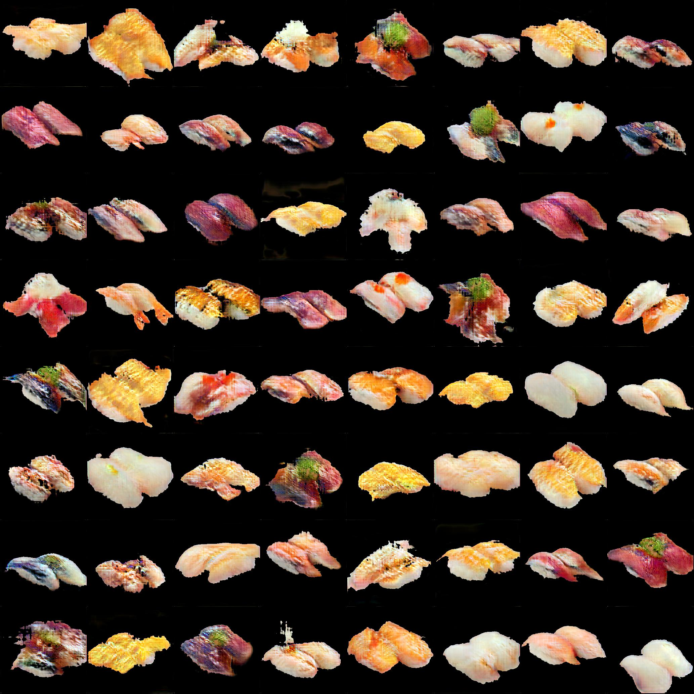

You may already know https://thispersondoesnotexist.com/, where you can get an infinite number of portrait photos generated by **StyleGAN2** [1]. There are variants such as:

- [This Artwork Does Not Exist](https://thisartworkdoesnotexist.com/)
- [This Cat Does Not Exist](https://thiscatdoesnotexist.com/)
- [This Chemical Does Not Exist](https://thischemicaldoesnotexist.com/)

I've been a big fan of this series, and today, I finally got to release [🍣This Sushi Does Not Exist🍣](https://thissushidoesnotexist.com/), a variant that generates sushi images. Unlike other similar works, I here present how I built it so you can easily build your own "This Stuff Does Not Exist"!

## Lightweight GAN
Recent GANs are able to generate super realistic images, while they often require a vast number of training images and prohibitively expensive computation. But recently, a paper by anonymous authors (currently under blind review of ICLR 2021), known as "**Lightweight GAN**", proposed a solution to this issue in an elegant way. They made it possible to generate *1024x1024-sized images with a few hours of training on a single GPU with 100 training samples*, using two simple techniques: a skip-layer excitation module and an autoencoder-like discriminator. As well as common FFHQ face images, Lightweight GAN can even generate pokemon images, which are not so bad.


<div style="text-align: center;"><small>Image taken from [2].</small></div>

Fortunately, [Phil Wang](https://github.com/lucidrains) released [a beautiful and easy-to-use implementation of Lightweight GAN](https://github.com/lucidrains/lightweight-gan) at GitHub. With this, you can train your own Lightweight GAN on Colaboratory (or any single GPU) with just two commands!

```sh
$ pip install lightweight-gan
$ lightweight_gan \
    --data ./path/to/images \
    --name {name of run} \
    --batch-size 16 \
    --gradient-accumulate-every 4 \
    --num-train-steps 200000
```

Check out the repository for detailed instructions.

Here are some notes about what I did particularly for generating sushi images.
- I collected 250 sushi images with [sushiscraper](https://github.com/harupy/sushicraper/pull/1).
- I resized all images to 256x256 and painted the background black.
- I found the cutout augmentation leads to undesirable artifacts (see below), so I set `--aug-types [translation]` when training.


After 8 hours of training, the model generated impressive sushi images!



<iframe width="560" height="315" src="https://www.youtube.com/embed/3QKFBuwQvC8" frameborder="0" allow="accelerometer; autoplay; encrypted-media; gyroscope; picture-in-picture" allowfullscreen></iframe>
<br/>

## Google App Engine
To present the generated images on the internet like "This Stuff Does Not Exist", I built https://thissushidoesnotexist.com/ with **Google App Engine (GAE)** and Flask. It could cost much if generating images in an online fashion, so I saved the pre-generated images in **Google Cloud Storage (GCS)** and made the app randomly get an image to present each time. For communicating between GAE and GCS, [this official tutorial](https://cloud.google.com/appengine/docs/flexible/python/using-cloud-storage) would be a good starter. My app is also based on this tutorial.

If you change `main.py` and `templates/index.html` to the following and deploy the project, you'll see the  images are presented on the website!

```python:title=main.py
import base64
import logging
import io
import os
import random

from flask import Flask, render_template
from google.cloud import storage

app = Flask(__name__)
CLOUD_STORAGE_BUCKET = os.environ['CLOUD_STORAGE_BUCKET']

gcs = storage.Client(project='PROJECT_NAME')
app.bucket = gcs.get_bucket(CLOUD_STORAGE_BUCKET)

@app.route('/')
def main():
    n = random.choice(range(384))
    blob = app.bucket.get_blob(f"{n:04}.jpg")
    buf = io.BytesIO()
    blob.download_to_file(buf)
    buf.seek(0)
    b64str = base64.b64encode(buf.getvalue()).decode("utf-8")

    return render_template("index.html", b64str=b64str)

if __name__ == '__main__':
    # This is used when running locally. Gunicorn is used to run the
    # application on Google App Engine. See entrypoint in app.yaml.
    app.run(host='127.0.0.1', port=8080, debug=True)
```

</br>

```html:title=templates/index.html
<html lang="en" >
    <head>
        <meta charset="utf-8">
        <title>This Stuff Does Not Exist</title>
        <meta name="viewport" content="width=device-width,initial-scale=1">
        <meta name="description" content="This Sushi Does Not Exist">
    </head>
    <body>
        <div style="background: #000000; display: table; height: 100%; text-align: center; width: 100%;">
            <div style="display: table-cell; vertical-align: middle;">
                <div style="display: inline-block;">
                    
                    <div id="description" style="color: #FFFFFF;">
                        Find more details at... 
                    </div>
                </div>
            </div>
        </div>
    </body>
</html>
```

</br>

## Concluding Remarks
In this post, I present [🍣This Sushi Does Not Exist🍣](https://thissushidoesnotexist.com/) and how I built it with GAE. Lightweight GAN has brought GANs back to citizens. Now, let's create your GAN applications!

## References
[1] Tero Karras, Samuli Laine, Miika Aittala, Janne Hellsten, Jaakko Lehtinen, Timo Aila. "[Analyzing and Improving the Image Quality of StyleGAN](https://arxiv.org/abs/1912.04958)." CVPR. 2020.  
[2] Anonymous Authors. "[Towards Faster and Stabilized GAN Training for High-fidelity Few-shot Image Synthesis](https://openreview.net/forum?id=1Fqg133qRaI)." 2020.  
[3] [Using Cloud Storage  |  App Engine flexible environment for Python docs](https://cloud.google.com/appengine/docs/flexible/python/using-cloud-storage)